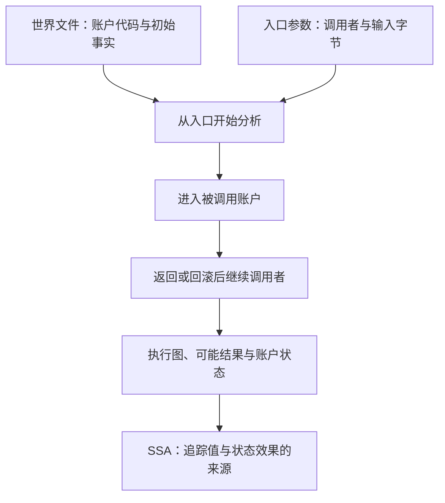

# evm-abstract-lab

这个实验室用 Rust 实现一个 EVM 分析器，帮助你理解：**合约指令怎样计算，执行可能走哪些分支，一个值来自哪里，以及调用另一个合约后状态怎样变化。** EVM 是以太坊执行合约字节码的虚拟机。

分析器根据给定的代码和初始事实，计算可能发生的执行。例如，不知道调用输入时，一条分支可能产生 1，另一条产生 2；分析结果用集合 `{1,2}` 同时记录两种可能。教程用中文讲解，从手算指令和读输出开始，再介绍抽象解释、控制流图和 SSA。

## 先运行一个例子

需要安装 Nix 并启用 `nix-command` 和 `flakes`。以下命令在仓库根目录执行；首次构建可能下载依赖，例子本身不需要 RPC、钱包或资金。

```bash
nix run . -- explain --file examples/straight-line.hex
```

它分析一个计算 `2 + 3`、把结果写入内存并返回的短程序，依次显示三种输出：

| 输出 | 回答的问题 | 先找什么 |
| --- | --- | --- |
| 反汇编 | 每段字节是什么指令？ | `0004: ADD`：加法指令位于字节偏移 4 |
| CFG（控制流图） | 执行顺序和分支是什么？ | `S0 B0`、`in []`、`out []`：一个块，入口和出口栈都为空 |
| SSA（静态单赋值） | 一个值在哪里产生、被谁使用？ | `%2 = ADD %1 %0`：给加法结果起名，并记录两个来源 |

不知道 `S0`、`%2` 或空栈是什么意思，直接读 [00：第一遍运行与输出解读](docs/00-start.md)。它包含完整的逐指令栈表和环境报错处理。

再看有分支的程序：

```bash
nix run . -- cfg --file examples/diamond.hex
```

在 `pc=0x000e` 的状态找到 `in [{0x1, 0x2}]`。外层是栈，内层是**一个栈槽的可能值集合**；不是栈上同时有两个值。这一步连接具体执行与抽象分析。

## 推荐阅读顺序

先完成 00–06 的基础阅读，再按需要进入跨合约实验。每课给出运行步骤、要检查的输出和对应源码；不要求先读论文。

| 顺序 | 学完能回答什么 | 主要例子 |
| --- | --- | --- |
| [00：运行与输出](docs/00-start.md) | pc、栈、反汇编、CFG、SSA 分别表示什么？ | `straight-line.hex` |
| [01：字节码与基本块](docs/01-bytecode.md) | 哪些字节是指令？为什么 PUSH 内部的 `5b` 不能跳转到？ | 短 hex、`diamond.hex` |
| [02：抽象执行与域](docs/02-domain.md) | 如何用集合计算？合并与 `⊤` 分别保留什么信息？ | `diamond.hex` |
| [03：CFG 与固定点](docs/03-cfg.md) | 怎样恢复动态跳转？循环里的信息如何反复传播？ | `loop.hex`、`dynamic-jump.hex` |
| [04：栈 SSA](docs/04-ssa.md) | 值名与栈位置有什么区别？汇合点的 φ 怎样选择来源？ | 分支、循环、DUP/SWAP |
| [05：敏感性与精度](docs/05-sensitivity.md) | 哪些执行被合并？改变参数怎样保留更多区别？ | `internal-calls.hex`、`stack-heights.hex` |
| [06：模型边界与证据](docs/06-boundaries.md) | 收敛能说明什么？对照测试与链上事实分别能证明什么？ | 预算、诊断、revm 对照 |
| [09：跨合约执行](docs/09-cross-contract.md) | 返回值、代理、回滚和重入怎样影响账户状态？ | `examples/worlds/` |
| [10：快照、调用摘要与代码生命周期](docs/10-snapshots-summaries-creation.md) | 何时能复用分析？部署和销毁如何改变代码？ | 摘要、CREATE/CREATE2、预编译 |

两课可穿插使用：[07：练习与提示](docs/07-exercises.md) 用来动手检查理解；[08：协议版本](docs/08-forks.md) 用来确认 fork 与指令规则。编号保留原有文件名，阅读路径由上表给出。[例子索引](examples/README.md) 按难度列出所有实验；[参考资料](docs/references.md) 按问题指向规范、论文和教学材料。

## 从单段代码到多个合约

单段 `.hex` 适合学习局部计算。完整的 `analyze` 入口使用**世界文件**（world JSON）：把多个账户的代码、初始存储和其他已知事实放在一起，指定入口账户后分析整段嵌套调用。

```bash
nix run . -- analyze \
  --world examples/worlds/call-return-branch.json \
  --entry 0x0000000000000000000000000000000000000101
```

这个离线实验里，A 调用 B，B 返回 32 字节的数值 1，A 据此选择分支并写自己的存储。输出的 `Call` / `Return` 是调用和返回边，`outcome` 是入口执行结束时的可能结果。模型也保留 gas 不足等失败可能，成功轨迹不等于全部抽象结果。逐步解读见[第 09 课](docs/09-cross-contract.md)。



世界文件中的 `fork` 选择同一套协议规则。本项目默认 Osaka，支持 Cancun / Prague / Osaka；选择它不会自动验证链上区块属于哪个升级阶段。[第 08 课](docs/08-forks.md) 演示同一字节码在两个 fork 下怎样得到不同结果。

## 命令与输出格式

| 命令 | 输入 | 用途与格式 |
| --- | --- | --- |
| `disasm` | `--hex` 或 `--file` | 只解码指令；text / JSON |
| `cfg` | `--hex` 或 `--file` | 局部抽象栈与控制流；text / JSON / DOT |
| `ssa` | `--hex` 或 `--file` | 完整局部图上的栈 SSA；text / JSON |
| `explain` | `--hex` 或 `--file` | 合并展示反汇编、CFG、SSA；text |
| `analyze` | `--world` 或显式 `--rpc`，以及 `--entry` | 跨合约图、返回结果、账户状态；text / JSON / DOT；`--ssa` 增加并验证 SSA |

用 `nix run . -- analyze --help` 查看全部参数。`--caller`、`--calldata`、`--value`、`--static` 设置入口环境；精度与预算参数见[第 05 课](docs/05-sensitivity.md)和[第 06 课](docs/06-boundaries.md)。

CLI 的数量参数 `--chain-id`、`--value` 和 `--slot ADDRESS:SLOT` 中的 SLOT 接受无前缀十进制或带 `0x` / `0X` 前缀的十六进制，范围为 `0` 到 `2^256−1`。十进制只用数字 `0`–`9`，允许零和前导零；例如 `001` 仍表示 1。可以写 `--chain-id 1`、`--value 1000`（单位 wei）、`--slot 0x0000000000000000000000000000000000000200:0`。地址、block hash 和 calldata 仍按各自的十六进制字节格式输入；world JSON 的 `chain_id`、余额、nonce、storage 键和值仍使用原有的 `0x` 十六进制格式。

需要可视化实际分析结果时，先导出 DOT（Graphviz 的图描述格式），再转成 SVG：

```bash
nix run . -- cfg --file examples/diamond.hex --format dot > /tmp/diamond.dot
nix develop -c dot -Tsvg /tmp/diamond.dot -o /tmp/diamond.svg
```

用浏览器打开 `/tmp/diamond.svg`。跨合约命令同样支持 `--format dot`。查看 JSON 与 SSA：

```bash
nix run . -- analyze \
  --world examples/worlds/proxy-storage.json \
  --entry 0x0000000000000000000000000000000000000101 \
  --format json --ssa > /tmp/proxy.json
nix develop -c jq '.analysis.status, (.ssa | type)' /tmp/proxy.json
```

这里应得到 `"Converged"` 和 `"object"`。不加 `--ssa` 时，分析对象直接位于 JSON 根节点；加上后根节点包含 `analysis` 和 `ssa`。更详细的字段解读见各实验。

## 怎样判断结果是否完整

| 结果 | 含义 | CLI 退出码 |
| --- | --- | --- |
| `Converged` | 本模型的工作表完成，没有尚待分析的前沿 | `0` |
| `Incomplete` | 缺少事实、遇到模型无法处理的输入或耗尽预算；输出保留原因与停止位置 | `2` |
| 输入错误 | JSON、参数或显式 RPC 采集失败，未得到有效分析结果 | `1`；参数语法错误由 clap 报告并退出 `2` |

`⊤`（Top）表示一个值可能是任意 256 bit 数，属于精度下降；它与 `Incomplete` 的“还有工作未完成”不同。SSA 构建要求完整图。`Converged` 也只描述这个抽象模型，不构成合约安全证明。

当前能力覆盖多账户调用、代理执行、返回数据、persistent/transient storage、嵌套回滚与重入；还包括有明确输入的 CREATE/CREATE2、EIP-6780 生命周期和原生预编译。调用摘要缓存可以复用已完成的调用分析，同时保留可检查的图与状态效果。[第 09 课](docs/09-cross-contract.md)和[第 10 课](docs/10-snapshots-summaries-creation.md)解释各项条件。

模型处理普通 EVM 字节码，即按操作码及其立即数解码的指令流；不支持 EOF 容器格式。字节码格式与硬分叉版本是两个不同概念，普通 EVM 字节码也能使用所选版本启用的较新指令，见[第一课](docs/01-bytecode.md)。

gas 不精确计量，一般 hash 和未知环境采用保守近似，也没有完整路径约束或跨交易不变量证明。RPC 仅在显式选择时采集固定区块 hash 的事实；执行器不会补查缺失代码。采集过程信任选定的提供者、检查身份与观察一致性，不验证 Merkle proof。读结果前请确认[详细边界](docs/06-boundaries.md)。

## 开发环境与实现入口

```bash
nix develop
cargo run --locked -p evm-abstract-cli -- explain --file examples/straight-line.hex
```

`nix develop` 提供 Rust、Cargo、Clippy、rustfmt、rust-analyzer、Graphviz、jq、cargo-nextest 和 lychee。三份锁定文件负责不同层次：

| 文件 | 固定什么 |
| --- | --- |
| [`rust-toolchain.toml`](rust-toolchain.toml) | Rust 工具链及组件；当前配置为 1.99.0，Nix 和 rustup 共用 |
| [`Cargo.lock`](Cargo.lock) | Rust 依赖的版本与校验和 |
| [`flake.lock`](flake.lock) | Nix 环境、构建工具及输入提交 |

版本升级需要显式修改并重新验证，不会跟随浮动的 `stable` 自动变化。

| 读什么实现 | 源码入口 |
| --- | --- |
| 指令解码与基本块 | [`bytecode.rs`](crates/evm-abstract/src/bytecode.rs) |
| 集合值、合并与算术 | [`domain.rs`](crates/evm-abstract/src/domain.rs) |
| 调用帧、局部与跨合约工作表 | [`analysis/`](crates/evm-abstract/src/analysis) |
| 账户事实与账户状态 | [`world/`](crates/evm-abstract/src/world) |
| 值的命名与结构验证 | [`ssa/`](crates/evm-abstract/src/ssa) |
| 命令参数、世界文件解析 | [`evm-abstract-cli`](crates/evm-abstract-cli) |

本仓库实现抽象 transfer（指令怎样更新抽象状态）、工作表与栈到 SSA 的转换；通用部分复用 `revm-bytecode` 的指令元数据、`alloy-primitives` 的 U256、`petgraph` 的图算法、`revm-precompile` 的原生计算及 `reqwest` 的 RPC 传输。测试使用 revm 具体执行和 proptest 性质检查；依赖资料见[参考页](docs/references.md)。

## 验证与源码导航

每次 PR 合并前，必须在本地对最终提交执行完整门禁。准备提交、运行检查与记录结果的步骤见[本地检查流程](docs/local-ci.md)。

```bash
nix flake check --print-build-logs --no-update-lock-file --option max-jobs 1 --option cores 8
```

它检查构建、工作区测试与 doctest、Clippy、Rust 格式、Rustdoc、Nix 格式、离线文档链接，以及打包后二进制的例子与图输出。开发时可按修改范围单独运行：

```bash
cargo test --workspace --locked
cargo clippy --workspace --all-targets --locked -- -D warnings
cargo fmt --all -- --check
cargo doc --workspace --no-deps --locked
```

文档链接规则由 [`lychee.toml`](lychee.toml) 固定。离线检查覆盖本地文件、引用式链接与锚点，包含隐藏目录文档，排除 `target`、`result*`、`.git`、`.direnv` 的生成文件：

```bash
nix develop --command lychee --offline --root-dir "$PWD" -- README.md '**/*.md'
```

需要检查 HTTP(S) 外链状态时，显式开启网络：

```bash
nix develop --command lychee --offline=false --scheme http --scheme https --include-fragments=none -- README.md '**/*.md'
```

联网命令不检查远端锚点；外站超时或限流会导致失败，所以它不属于可复现的离线门禁。

MIT license。
