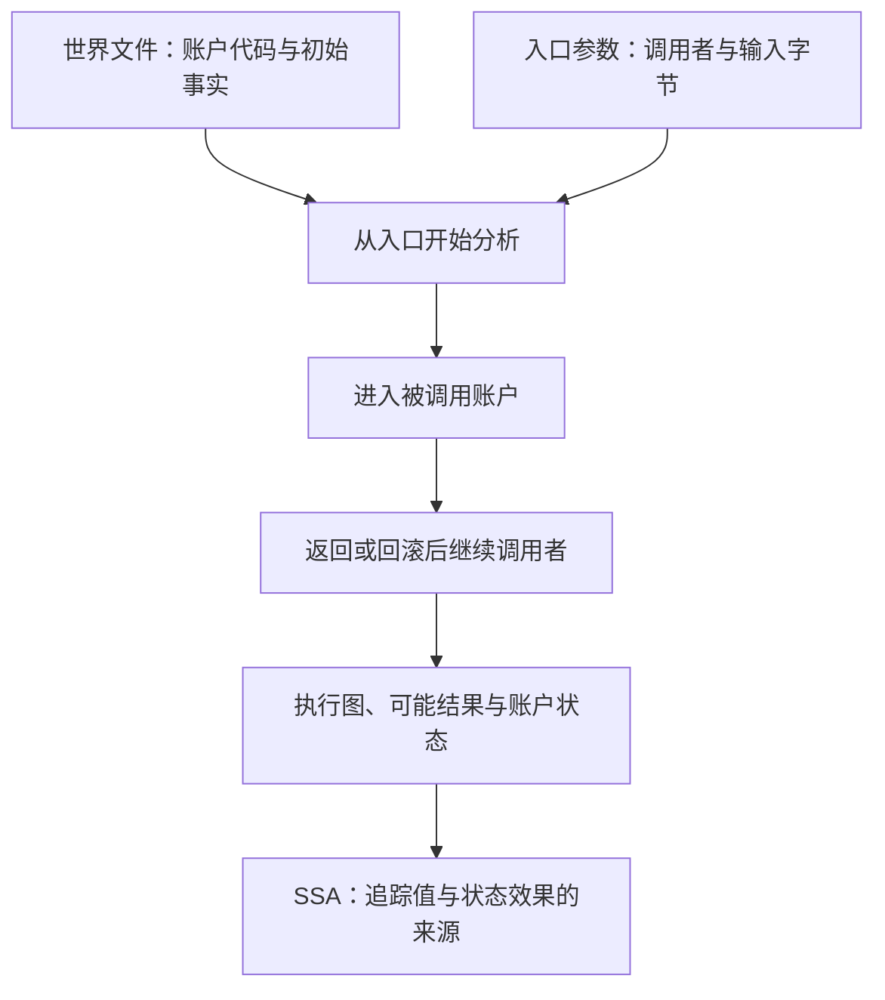

# evm-abstract-lab

这个实验室用 Rust 实现一个 EVM 分析器，帮助你理解：**合约指令怎样计算，执行可能走哪些分支，一个值来自哪里，以及调用另一个合约后状态怎样变化。** EVM 是以太坊执行合约字节码的虚拟机。

分析器根据给定的代码和初始事实，计算可能发生的执行。例如，不知道调用输入时，一条分支可能产生 1，另一条产生 2；分析结果用集合 `{1,2}` 同时记录两种可能。教程用中文讲解，提供[理论与实现两条路线](docs/learning-routes.md)，结合手算指令、实际输出和源码理解同一组问题。

## 先运行一个例子

需要安装 Nix 并启用 `nix-command` 和 `flakes`。以下命令在仓库根目录执行；首次构建可能下载依赖，例子本身不需要 RPC、钱包或资金。

```bash
nix run . -- explain --file examples/straight-line.hex
```

它分析一个计算 `2 + 3`、把结果写入内存并返回的短程序，依次显示三种输出：

| 输出 | 回答的问题 | 先找什么 |
| --- | --- | --- |
| 反汇编 | 每段字节是什么指令？ | `0004: ADD`：加法指令位于字节偏移 4 |
| CFG（控制流图） | 执行顺序和分支是什么？ | `S0 \| B0`、`stack in []`、`stack out []`：一个块，入口和出口栈都为空 |
| SSA（静态单赋值） | 一个值在哪里产生、被谁使用？ | `%2 = ADD %1 %0`：给加法结果起名，并记录两个来源 |

不知道 `S0`、`%2` 或空栈是什么意思，直接读 [00：第一遍运行与输出解读](docs/00-start.md)。它包含完整的逐指令栈表和环境报错处理。

再看有分支的程序：

```bash
nix run . -- cfg --file examples/diamond.hex --context-depth 0
```

这里显式设置 `--context-depth 0`，让两条路径在相同栈高的汇合块合并。默认值是 8，会按最近跳转来源区分状态；参数的含义见[第 05 课](docs/05-sensitivity.md)。

在 `pc=0x000e` 的状态找到 `stack in [{0x1, 0x2}]`。外层是栈，内层是**一个栈槽的可能值集合**；不是栈上同时有两个值。这一步连接具体执行与抽象分析。

小集合只是描述可能值的一种方式。候选太多时，默认分析还会保留固定的位、数值范围和同余性质；例如，即使不能逐个列出所有偶数，也能知道最低位为零。[第 02 课](docs/02-domain.md)从集合手算过渡到这些性质，并用 `--domain constants-only` 比较仅保存有限集合的结果。

位约束用完整的 64 个十六进制位置表示：一个位置全部已知时显示 `0`–`f`，全部未知时显示 `*`，部分已知时用四个二进制位显示，如 `[01**]`。其中 `[01**]` 只占一个十六进制位置，表示从高到低的两位确定为 0、1，另外两位未知；位模式中的所有未知位置都保留，不使用省略号。整个值没有数值约束时显示 `⊤`（Top）；有限候选仍显示为 `{0x1, 0x2}`。有其他数值约束时，`bits=` 后的全未知位模式仍保留 64 个 `*`。[第 12 课的位模式](docs/12-product-domains-facts.md#怎样读十六进制位模式)给出逐位读法。

## 推荐阅读顺序

先完成 [00：运行与输出](docs/00-start.md) 的第一个实验，然后选择一条主线。两条路线覆盖同一组主题，使用同一份章节和例子；区别是从问题进入理论，还是从数据与函数进入实现。章节编号用于查找，不要求从 00 一直顺读到 16。

| 路线 | 适合带着什么问题阅读 | 推进方式 |
| --- | --- | --- |
| [理论路线：从语义与近似走到实现](docs/routes/theory.md) | 摘要、合并、固定点和 SSA 为什么这样定义？这些定义能保证什么？ | 先建立概念与具体例子，再检查仓库怎样实现、在哪里近似或停止 |
| [实现路线：跟着输入、状态与结果读代码](docs/routes/implementation.md) | 一条命令经过哪些模块，哪个类型保存状态，输出从哪里产生？ | 沿 CLI、机器状态、转换函数、调用与 SSA 追踪，再解释对应理论与不变量 |

[路线总览](docs/learning-routes.md)按共同主题并排列出两个入口，可以在数值域、CFG、SSA、内存/storage、关系约束、调用/回滚、RPC/摘要或验证主题中切换视角。每课顶部都有返回相应路线的链接；[例子索引](examples/README.md)用于选实验，[第 07 课](docs/07-exercises.md)用于核对理解，[参考资料](docs/references.md)用于继续读规范和论文。

如果你正在读 `recorded prefix stack`、`partial phi` 或 `OperandsConsumed`，直接进入 [04：部分 SSA 的逐步实验](docs/04-ssa.md#7-未完成时按需查看部分-ssa)，观察同一程序在内存上限不足与足够时的栈、指令结果和覆盖差异，再回到所选路线。

## 从单段代码到多个合约

单段 `.hex` 适合学习局部计算。跨合约的 `explain` 和 `analyze` 入口使用**世界文件**（world JSON）：把多个账户的代码、初始存储和其他已知事实放在一起，通过 `--evm.to` 指定 root frame 的目标。下面显式固定 caller、value 和 calldata 来重放教学场景；省略它们时使用符号输入。

```bash
nix run . -- explain \
  --world examples/worlds/call-return-branch.json \
  --evm.to 0x0000000000000000000000000000000000000101 \
  --evm.caller 0x0000000000000000000000000000000000001000 \
  --evm.value 0 --evm.calldata 0x
```

`explain` 默认串联实际捕获代码的反汇编、简明 CFG 与独立结果概要、赋值式跨合约 SSA。需要完整帧记录和效果链时加 `--verbose`；完整报告仍由 `analyze` 提供，结构化数据使用 `analyze --format json`。

反汇编与 SSA 的基本块指令列表共用顶格的 `B0 @ 0x0000:` 标题，指令 pc 写作 `0000:`，数字列与标题中 `0x` 后的数字对齐。SSA 的 S 状态元数据和入口 φ 在 B 标题前独立显示；S 与 B 不是同一种编号。单字节码与世界教学 SSA 共用赋值式指令正文，世界视图另保留代码、帧、状态账户及转移身份；完整视图继续保留所有帧与原始效果证据。示例与读法见[第 04 课](docs/04-ssa.md)。

这个离线实验里，A 调用 B，B 返回 32 字节的数值 1，A 据此选择分支并写自己的存储。输出的 `Call` / `Return` 是调用和返回边，`outcome` 是入口执行结束时的可能结果。模型也保留 gas 不足等失败可能，成功轨迹不等于全部抽象结果。逐步解读见[第 09 课](docs/09-cross-contract.md)。

`analyze` 默认文本及 `explain --verbose` 的完整报告按完成状态、快照、身份引用、执行状态、转移、入口结果、调用摘要、诊断和未完成前沿分区。先看 `Analysis`，再沿 `Transitions` 的 `S` 编号追踪调用；`Outcomes` 的每个 `O` 分别携带自己的返回字节和最终账户状态。`References` 列出地址 `A0`、hash `H0` 等短引用对应的完整值，JSON 和 DOT 仍保留完整身份。[文本阅读路线](docs/09-cross-contract.md#默认文本怎样读) 解释各分区及字节表示。

**调用摘要**保存已完成子调用在特定输入下的结果和执行子图，供之后前提相同的调用复用。`Call summaries` 中的保存数量 `published` 与复用次数 `hits` 是两件事；只调用一次时可以保存结果而没有命中。[第 10 课](docs/10-snapshots-summaries-creation.md) 从两次调用的例子开始解释。



世界文件中的 `fork` 选择同一套协议规则。本项目默认 Osaka，支持 Cancun / Prague / Osaka；选择它不会自动验证链上区块属于哪个升级阶段。[第 08 课](docs/08-forks.md) 演示同一字节码在两个 fork 下怎样得到不同结果。

## 命令与输出格式

| 命令 | 输入 | 用途与格式 |
| --- | --- | --- |
| `disasm` | `--hex` 或 `--file` | 只解码指令；text / JSON |
| `cfg` | `--hex` 或 `--file` | 局部抽象栈与控制流；text / JSON / DOT |
| `ssa` | `--hex` 或 `--file` | 默认构建完整局部图上的栈 SSA；text / JSON；`--allow-partial-ssa` 可查看未完成分析的指令证据 |
| `explain` | `--hex` / `--file`，或 `--world` / 显式 `--rpc` + `--evm.to` | 反汇编、教学 CFG、赋值式 SSA；world/RPC 可加 `--verbose` 展开完整证据 |
| `analyze` | `--world` 或显式 `--rpc`，以及 `--evm.to` | 跨合约图、返回结果、账户状态；text / JSON / DOT；`--ssa` 增加并验证 SSA |

`ssa`、`explain` 可以显式加 `--allow-partial-ssa`；`analyze` 需同时加 `--ssa`，并选择 text 或 JSON。分析为 `Incomplete` 时，这个开关显示带覆盖说明的**部分 SSA**，仍保留全部前沿并退出 2；分析已 `Converged` 时继续输出原来的完整 SSA。部分 SSA 的默认文本突出指令与值流，保留未完成步骤、故障、陈旧或未执行状态、未覆盖边与全部前沿；常见的 Completed/Dispatched 注释与效果链放在 world/RPC `explain --verbose` 或 JSON 中查看。部分 SSA 的指令阶段、未覆盖入边与单程序状态编号映射见[第 04 课](docs/04-ssa.md#7-未完成时按需查看部分-ssa)。

用 `nix run . -- analyze --help` 查看全部参数。调用环境统一使用 `--evm.*`：`--evm.to` 确定执行 root frame 的合约，省略 caller、value、calldata 时分别覆盖未知调用者、任意 U256 金额、未知长度与内容的输入；origin 默认与 caller 是同一个输入。显式 `--evm.calldata 0x --evm.value 0` 才表示空数据、零金额。交易与区块环境、索引 hash 和 gas 上界的全部参数见[第 13 课](docs/13-evm-environment.md)；精度与预算参数见[第 05 课](docs/05-sensitivity.md)和[第 06 课](docs/06-boundaries.md)。

`NumericValue` 默认使用 `--domain product`，组合常量集合、KnownBits（固定位）、Interval（区间）、Congruence（同余）和非零保证。`AbstractValue` 在数值摘要之外保存来源、角色、独立值身份和符号表达式。`--max-constants` 默认 8，接受运行平台能表示的任意正 `usize`，配置容量不会直接预分配集合。`--reduction-rounds` 默认 4，`--max-facts` 默认 256，两者限制临时数值事实交换。

机器状态另外保存关系约束。JUMPI 的后继应用分支条件，通过进程内 SMT 求解器排除已证明矛盾的路径，并将已证明的数值结论投影回执行值。两种数值 profile 默认都启用这层能力；`--no-relations` 用于关闭它的对照。`--smt.provider` 可选 `z3`（默认）、`bitwuzla` 或 `cvc5`。`--smt.rlimit` 默认 100000，为每次求解检查分配额度，没有墙钟 timeout；不同求解器的资源单位不能直接比较，Bitwuzla 按协作式停止检查的次数计数。表达式节点、深度和关系数量也有独立上限。查询不能完成时保留路径与类型化前沿。`analyze` 的 `--max-work` 默认 2000 万，覆盖执行、数值、符号及查询预留工作。详见[第 12 课](docs/12-product-domains-facts.md)和[第 15 课](docs/15-symbolic-relations.md)。

CLI 的数量参数 `--evm.value` 和 `--slot ADDRESS:SLOT` 中的 SLOT 接受无前缀十进制或带 `0x` / `0X` 前缀的十六进制，范围为 `0` 到 `2^256−1`；`--block-number` 接受相同进制写法，范围为 `0` 到 `2^64−1`。十进制只用数字 `0`–`9`，允许零和前导零；例如 `001` 仍表示 1。可以写 `--evm.value 1000`（单位 wei）、`--block-number 26000000`、`--slot 0x0000000000000000000000000000000000000200:0`。地址、block hash 和 calldata 仍按各自的十六进制字节格式输入；world JSON 的 `chain_id`、余额、nonce、storage 键和值仍使用原有的 `0x` 十六进制格式。

显式选择 `--rpc` 后，只指定 `--evm.to` 即可分析符号调用输入。chain ID 从 RPC 自动读取；省略区块参数时，只在启动时读取一次 `latest`，随后固定返回的区块 hash。也可指定互斥的 `--block-hash` 或 `--block-number`；区块号同样先解析为 hash，再采集状态。分析器发现具体调用目标缺少代码，或 SLOAD 的完整有限槽集合缺少初始值时，会在同一 chain ID、block hash 下补查账户或槽；更深的调用也按需发现。下面的环境变量须已设置为实际提供者、fork 和目标地址。结果可为 `Incomplete`，例如未知输入使调用目标无法确定；这时阅读前沿而不是假定所有调用已覆盖：

```bash
nix run . -- analyze \
  --rpc "$LAB_RPC_URL" --fork "$LAB_FORK" \
  --evm.to "$LAB_ENTRY" --format json
```

`--account` 仍可预先选择账户，`--slot ADDRESS:SLOT` 预先采集初始存储槽。默认发现也会为 SLOAD 补查可完整枚举的有限槽键，按状态所属账户读取；DELEGATECALL 读取代理的槽。同一地址和槽只采集一次，零值同样缓存；无限或无法完整枚举的槽键保持保守未知。RPC 使用 `{blockHash,requireCanonical:true}` 采集 code、balance、nonce 和所需 slot，完全信任选定提供者，不请求 `eth_getProof`。代码为空且其余已查询字段全零时，存在性仍为未知；非空代码或任一非零数值则表明账户存在。重组或查询错误不会使分析改用新的区块。

加 `--no-rpc-discovery` 可只使用预先选择的账户和槽：缺代码留下 `MissingCode`，未观察的槽保留未知值。默认最多采集 256 个账户、尝试 16384 次请求，分别由 `--max-rpc-accounts`、`--max-rpc-requests` 设置。补查成功后会从入口重新分析，各轮共用 work、transfer 和状态分配预算；JSON 的 `rpc_acquisition` 记录累计账户、槽和失败证据。完整实验与错误解读见[第 10 课](docs/10-snapshots-summaries-creation.md#可选实验从固定区块采集)。

需要可视化实际分析结果时，先导出 DOT（Graphviz 的图描述格式），再转成 SVG：

```bash
nix run . -- cfg --file examples/diamond.hex --context-depth 0 --format dot > /tmp/diamond.dot
nix develop -c dot -Tsvg /tmp/diamond.dot -o /tmp/diamond.svg
```

用浏览器打开 `/tmp/diamond.svg`。跨合约命令同样支持 `--format dot`。查看 JSON 与 SSA：

```bash
nix run . -- analyze \
  --world examples/worlds/proxy-storage.json \
  --evm.to 0x0000000000000000000000000000000000000101 \
  --evm.caller 0x0000000000000000000000000000000000001000 \
  --evm.value 0 --evm.calldata 0x \
  --format json --ssa > /tmp/proxy.json
nix develop -c jq '.analysis.status, (.ssa | type)' /tmp/proxy.json
```

这里应得到 `"Converged"` 和 `"object"`。不加 `--ssa` 时，分析对象直接位于 JSON 根节点；加上后根节点包含 `analysis` 和 `ssa`。更详细的字段解读见[跨合约报告](docs/09-cross-contract.md#默认文本怎样读)和[输入与帧的 JSON 查询](docs/10-snapshots-summaries-creation.md#当前-json-怎样记录输入与帧)。

## 怎样判断结果是否完整

| 结果 | 含义 | CLI 退出码 |
| --- | --- | --- |
| `Converged` | 本模型的工作表完成，没有尚待分析的前沿 | `0` |
| `Incomplete` | 缺少事实、遇到模型无法处理的输入或耗尽预算；输出保留原因与停止位置 | `2` |
| 输入错误 | JSON、参数或初始 RPC 采集失败，未得到有效分析结果 | `1`；参数语法错误由 clap 报告并退出 `2` |

`⊤`（Top）表示单值数值摘要没有排除任何 256 bit 数；状态级关系仍可能限制它。Top 属于精度下降；它与 `Incomplete` 的“还有工作未完成”不同。完整 SSA 构建要求完整图；显式选择部分 SSA 只展示有执行证据支持的前缀与覆盖缺口。`Converged` 只描述声明输入范围内的抽象传播完成，不表示某地址的所有调用都已精确恢复，也不构成合约安全证明。先读输出的 `EVM inputs` 或 JSON 中的环境：raw CFG 的路径是 `.environment`，世界分析的路径是 `.entry.environment`。分析 JSON 的 `schema_version` 是 3，`domain_spec.schema_version` 是 2。raw CFG 的 `.states[].entry_relations` 和世界状态的 `.states[].entry.relations` 保存关系信息。

RPC 分析已开始后，仍被需要的补查失败或采集额度耗尽会留下 `RpcAcquisition` 前沿，结果为 `Incomplete`、退出 `2`。采集失败的类型与来源另外保存在累计记录中，后续预算中断也不会丢失。输出中的已完成分支不能替代尚未展开的调用。

当前能力覆盖多账户调用、代理执行、返回数据、persistent/transient storage、嵌套回滚与重入；还包括有明确输入的 CREATE/CREATE2、[EIP-6780](https://eips.ethereum.org/EIPS/eip-6780) 生命周期和原生预编译。调用摘要缓存可以复用已完成的调用分析，同时保留可检查的图与状态效果。[第 09 课](docs/09-cross-contract.md)和[第 10 课](docs/10-snapshots-summaries-creation.md)解释各项条件。

模型处理普通 EVM 字节码，即按操作码及其立即数解码的指令流；不支持 EOF 容器格式。字节码格式与硬分叉版本是两个不同概念，普通 EVM 字节码也能使用所选版本启用的较新指令，见[第一课](docs/01-bytecode.md)。

gas 不精确计量，一般 hash 和未知环境采用保守近似，有界关系域也不提供完整路径可行性或跨交易不变量证明。RPC 仅在显式选择时采集固定区块 hash 的事实，默认按需补查具体被调用账户和 SLOAD 的有限槽键；未知调用目标、无法完整枚举的槽键与未观察的其他槽仍保持边界。采集过程完全信任选定的提供者；区块身份与初始事实指纹用于固定输入，不构成状态真实性的密码学证明。读结果前请确认[详细边界](docs/06-boundaries.md)。

## 开发环境与实现入口

应用 workspace 的 Rust 使用静态派发；[动态派发检查](docs/no-dynamic-dispatch.md)说明 Dylint 命令、检查范围和具体错误类型约定。

```bash
nix develop
cargo run --locked -p evm-abstract-cli -- explain --file examples/straight-line.hex
```

`nix develop` 显式提供编译工具、原生 SMT 库、语言服务器、格式器和检查工具。VS Code 和插件由用户安装，仓库提供推荐与设置；接入方式、依赖版本来源和 Nix 模块职责见[开发环境说明](docs/development.md)。核心锁定文件负责不同层次：

| 文件 | 固定什么 |
| --- | --- |
| [`rust-toolchain.toml`](rust-toolchain.toml) | Rust 工具链及组件；当前配置为 1.99.0，Nix 和 rustup 共用 |
| [`Cargo.lock`](Cargo.lock) | Rust 依赖的版本与校验和 |
| [`flake.lock`](flake.lock) | Nix 环境、构建工具及输入提交 |

版本升级需要显式修改并重新验证，不会跟随浮动的 `stable` 自动变化。

| 读什么实现 | 源码入口 |
| --- | --- |
| 指令解码与基本块 | [`bytecode.rs`](crates/evm-abstract/src/bytecode.rs) |
| 常量集合的 Top、非空集合与有界运算 | [`finite_constant_set.rs`](crates/evm-abstract/src/domain/finite_constant_set.rs) |
| 数值组件、合并与算术 | [`numeric.rs`](crates/evm-abstract/src/domain/numeric.rs)、[`domain.rs`](crates/evm-abstract/src/domain.rs) |
| 机器值、来源与独立身份 | [`value.rs`](crates/evm-abstract/src/domain/value.rs)、[`provenance.rs`](crates/evm-abstract/src/domain/provenance.rs)、[`identity.rs`](crates/evm-abstract/src/domain/identity.rs) |
| 持久表达式、关系环境与查询 | [`symbolic.rs`](crates/evm-abstract/src/domain/symbolic.rs)、[`relational.rs`](crates/evm-abstract/src/domain/relational.rs)、[`relational/solver.rs`](crates/evm-abstract/src/domain/relational/solver.rs) |
| 固定位、区间、同余、来源与事实交换 | [`domain/`](crates/evm-abstract/src/domain) |
| 调用帧、局部与跨合约工作表 | [`analysis/`](crates/evm-abstract/src/analysis) |
| 账户事实与账户状态 | [`world/`](crates/evm-abstract/src/world) |
| 内存、calldata 与 returndata 的抽象字节数组 | [`world/bytes.rs`](crates/evm-abstract/src/world/bytes.rs) |
| 值的命名与结构验证 | [`ssa/`](crates/evm-abstract/src/ssa) |
| 命令参数、世界文件解析 | [`evm-abstract-cli`](crates/evm-abstract-cli) |

本仓库实现抽象 transfer（指令怎样更新抽象状态）、工作表与栈到 SSA 的转换；通用部分复用 `revm-bytecode` 的指令元数据、`alloy-primitives` 的 U256、`petgraph` 的图算法、`revm-precompile` 的原生计算、`reqwest` 的 RPC 传输及 Z3、Bitwuzla、cvc5 的位向量查询。这三个求解器都是原生链接依赖，Nix 开发环境和完整门禁提供其库；运行时通过进程内接口调用，不启动外部求解进程。测试使用 revm 具体执行和 proptest 性质检查；依赖资料见[参考页](docs/references.md)。

## 验证与源码导航

每次 PR 合并前，必须在本地对最终提交执行完整门禁。准备提交、运行检查与记录结果的步骤见[本地检查流程](docs/local-ci.md)。

```bash
nix flake check --print-build-logs --no-update-lock-file --option max-jobs 1 --option cores 8
```

它检查构建、工作区测试与 doctest、Clippy、Rust 格式、Rustdoc、Nix 格式、TOML 语法与格式、离线文档链接，以及打包后二进制的例子与图输出。开发时可按修改范围单独运行：

```bash
cargo test --workspace --locked
cargo clippy --workspace --all-targets --locked -- -D warnings
cargo fmt --all -- --check
cargo doc --workspace --no-deps --locked
```

TOML 检查使用 Nix 中固定版本的 Taplo，规则见 [`taplo.toml`](taplo.toml)。它递归检查仓库的 TOML 文件，包括 [`.cargo/config.toml`](.cargo/config.toml)，排除构建产物和 Git 元数据；语法检查禁用联网 schema 验证。开发时检查或统一格式：

```bash
nix develop --command taplo lint --no-schema
nix develop --command taplo fmt --check
nix develop --command taplo fmt
```

VS Code 请以仓库根目录打开工作区，按[插件推荐](.vscode/extensions.json)自行安装 rust-analyzer 和 Even Better TOML，再执行 `Developer: Reload Window`。Remote SSH 在远端工作区配置插件和 Nix。仓库通过[工作区设置](.vscode/settings.json)连接语言服务器，通过[Nix 任务](.vscode/tasks.json)执行构建、测试和 Clippy；详细步骤见[开发环境说明](docs/development.md)。

TOML 编辑器设置与命令行共同读取 [`taplo.toml`](taplo.toml) 的 `[formatting]`：4 空格缩进、对齐键值、最多一个连续空行。工作区指定 [Even Better TOML](https://marketplace.visualstudio.com/items?itemName=tamasfe.even-better-toml) 为格式器并启用保存时格式化。插件默认使用自带 Taplo，CLI 的 Taplo 由 Nix 固定，两者版本可能不同。

修改格式规则时以 [`taplo.toml`](taplo.toml) 为准。完整门禁通过 Nix Taplo 的真实 LSP 请求比较格式化结果与同版本 CLI，验证项目配置；它不验证用户安装的任意插件版本。

文档链接规则由 [`lychee.toml`](lychee.toml) 固定。离线检查覆盖本地文件、引用式链接与锚点，包含隐藏目录文档，排除 `target`、`result*`、`.git`、`.direnv` 的生成文件：

```bash
nix develop --command lychee --offline --root-dir "$PWD" -- README.md '**/*.md'
```

需要检查 HTTP(S) 外链状态时，显式开启网络：

```bash
nix develop --command lychee --offline=false --scheme http --scheme https --include-fragments=none -- README.md '**/*.md'
```

联网命令不检查远端锚点；外站超时或限流会导致失败，所以它不属于可复现的离线门禁。

[MIT license](LICENSE)。
