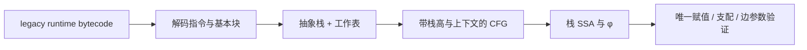

# evm-abstract-lab

一个用 **Rust + Nix** 学习 EVM 静态分析的实验室：从 runtime bytecode 出发，通过抽象栈执行恢复控制流图（CFG），再构建并验证带 φ 节点的栈 SSA。代码注释和教程以中文为主，按“观察结果 → 跟踪实现 → 理解理论 → 动手改变精度”的顺序展开。

这里的“执行”是在可能值的摘要上计算。例如，两条路径带来的 `1` 和 `2` 合成 `{1,2}`；无法继续精确表示时升到 `⊤`，表示任意 256 bit 值。循环用工作表计算固定点，动态跳转目标未知时覆盖所有真正的 `JUMPDEST`。



## 开始运行

需要启用 flakes 的 Nix。所有命令在仓库根目录执行。

```bash
nix develop
cargo run --locked -p evm-abstract-cli -- explain --file examples/diamond.hex
cargo run --locked -p evm-abstract-cli -- cfg --file examples/loop.hex
cargo run --locked -p evm-abstract-cli -- ssa --file examples/internal-calls.hex --context-depth 1
```

也可以直接使用 Nix 打包的二进制：

```bash
nix run . -- explain --file examples/diamond.hex
nix run . -- cfg --hex 600035565b602a60005500 --format json
nix run . -- cfg --file examples/diamond.hex --format dot > /tmp/diamond.dot
nix develop -c dot -Tsvg /tmp/diamond.dot -o /tmp/diamond.svg
```

`disasm`、`cfg`、`ssa` 和 `explain` 都接受 `--hex` 或 `--file`。`cfg` 支持 text/JSON/DOT，`ssa` 支持 text/JSON。文本栈按 **底到顶** 显示。资源预算触发时退出码是 `2`，CFG 标记 `Incomplete` 并保留前沿；SSA 拒绝缺边的分析结果。

默认使用 **Osaka（Fusaka 的执行层）**，这是 2026-10-02 核验的最新已激活主网规则。所有命令都支持 `--fork cancun|prague|osaka`；选择结果记录在文本、JSON 和 DOT 中。最新主网升级与尚在开发的 fork 要分开看，见[协议版本一课](docs/08-forks.md)。

```bash
nix run . -- explain --file examples/osaka-clz.hex
nix run . -- explain --file examples/osaka-clz.hex --fork cancun
```

## 从哪一课开始

| 阅读顺序 | 你要回答的问题 | 实验与代码 |
| --- | --- | --- |
| [00：环境与第一眼](docs/00-start.md) | 输入是什么？每一种输出说明什么？ | `straight-line.hex`、CLI |
| [01：字节码与基本块](docs/01-bytecode.md) | 为什么 PUSH 内部的 `5b` 不是跳转目标？ | `bytecode.rs` |
| [02：抽象执行与域](docs/02-domain.md) | 一个集合怎么替代许多具体执行？为什么合并用并集？ | `domain.rs`、`diamond.hex` |
| [03：CFG 与固定点](docs/03-cfg.md) | 跳转边未知时怎么继续？循环为什么会停？ | `analysis/`、`loop.hex`、`dynamic-jump.hex` |
| [04：栈 SSA](docs/04-ssa.md) | φ 选择什么？DUP/SWAP 怎么保留值身份？ | `ssa/`、分支与循环 |
| [05：敏感性与精度](docs/05-sensitivity.md) | 流、路径、上下文、栈高敏感分别保留什么？ | `--context-depth`、`internal-calls.hex` |
| [06：模型边界与证据](docs/06-boundaries.md) | 收敛能证明什么？链上状态能增加哪些信息？ | revm oracle、诊断和预算 |
| [07：练习与提示](docs/07-exercises.md) | 如何亲手扩展这个分析器？ | 由易到难的练习和验收方法 |
| [08：协议版本与升级](docs/08-forks.md) | 为什么同一字节码在不同 fork 下会产生不同 CFG？ | `fork.rs`、`osaka-clz.hex`、EIP-7702 |

每课都有真实字节偏移、栈变化或图，以及对应源码位置。无需先掌握 Datalog、SMT 或编译器理论。

## 已实现的学习材料与能力

- Cancun/Prague/Osaka legacy 解码、按 fork 检查指令启用、PUSH0/PUSH1..32、截断 PUSH 右侧补零、真实 JUMPDEST 索引和基本块划分。
- 256 bit 有限常量集合域、保守 Top、纯算术/位运算、逐槽 join、循环工作表。
- 常量与计算得到的跳转目标、条件分支剪枝、未知跳转的保守展开。
- 相同块按栈高区分；可选 `k=0..3` 的有限跳转来源历史，观察内部调用的合并与分离。
- CFG 上的栈 SSA、循环 φ、DUP/SWAP 别名、保留 SSTORE 等副作用指令，以及结构验证器。
- Osaka `CLZ` 的常量集合传播与 SSA；识别 EIP-7702 委托标记并报告目标，避免生成虚假的终止 CFG。
- 七个可运行例子、三个 fork 的 revm 具体执行对照、性质测试、真实 CLI 测试和 Nix/CI 检查。

模型针对 **单合约的 legacy runtime bytecode**。内存、storage、gas、调用结果和环境值保守抽象；没有 memory/storage SSA、外部合约分析或完整路径约束。`Converged` 表示本抽象模型的工作表完成，不能据此判断合约安全。[详细边界](docs/06-boundaries.md) 列出了每种信息如何处理。

## 工具链与依赖

创建时核验并固定 Rust **1.99.0**（2026-10-01 稳定发布）。[`rust-toolchain.toml`](rust-toolchain.toml) 是 Nix 和 rustup 共用的版本来源，锁定 cargo、rustfmt、clippy、rust-src 和 rust-analyzer。它不会跟随浮动的 `stable` 自动变化。

[`flake.lock`](flake.lock) 固定 nixpkgs、rust-overlay、crane 的提交和内容哈希；Nix 2.34.8、Graphviz、cargo-nextest、nixfmt 随 nixpkgs 固定，CI 也明确使用 Nix 2.34.8。直接依赖用精确版本，[`Cargo.lock`](Cargo.lock) 固定全部传递依赖和校验和。升级必须显式修改并重新验证。环境、测试与打包始终使用同一个 Rust 工具链。

| crate | 负责什么 | 为什么复用 |
| --- | --- | --- |
| `revm-bytecode` | opcode 名称、立即数和栈 I/O 元数据 | 避免重复维护 opcode 表 |
| `alloy-primitives` / `ruint` | U256、模运算、快速幂 | 避免自己写大整数 |
| `petgraph` | 图、DOT 导出、dominators | 避免重复写图格式和支配算法 |
| `serde` / `serde_json` | 可检查的结构化输出 | 不手写 JSON |
| `clap` / `thiserror` | 参数与有类型的错误 | 语义代码保持聚焦 |
| `revm` / `proptest`（测试） | 具体执行 oracle、代数性质与随机案例 | 给自研抽象语义独立的核对依据 |

抽象 transfer、工作表的状态划分和栈到 SSA 的转换是本仓库的学习主题，保留为有注释的 Rust 实现。通用基础设施使用现有 crate。

## 验证与源码导航

```bash
nix flake check --print-build-logs --option max-jobs 1 --option cores 8
```

这个门禁运行构建、工作区测试与 doctest、Clippy、Rust 格式、Rustdoc 和打包后二进制的例子/图检查。在开发环境中也可单独运行：

```bash
cargo test --workspace --locked
cargo clippy --workspace --all-targets --locked -- -D warnings
cargo fmt --all -- --check
cargo doc --workspace --no-deps --locked
```

库位于 [`crates/evm-abstract/src`](crates/evm-abstract/src)，CLI 位于 [`crates/evm-abstract-cli`](crates/evm-abstract-cli)。源码模块顶部解释职责与不变量，算法关键处解释“为什么”。[参考资料](docs/references.md) 指向 EVM 规范、抽象解释原始论文、SSA 教学材料和依赖文档。

MIT license。
