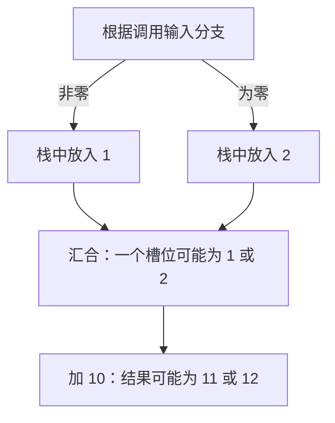

# 00：运行第一个例子，读懂三种输出

本课从一个只做 `2 + 3` 的程序开始。完成后，你应能把原始字节、执行顺序和数值的来源对应起来。无需先懂编译器、Datalog 或 SMT。

## 第一步：准备运行环境

需要安装 Nix，并启用 `nix-command` 和 `flakes`。以下命令都在仓库根目录执行，也就是包含 `flake.nix` 和 `Cargo.toml` 的目录。例子是本地文件，运行分析不需要 RPC、钱包或资金；首次 Nix 构建可能需要下载工具链和依赖。

```bash
nix run . -- explain --file examples/straight-line.hex
```

`nix run .` 构建并运行本项目的命令行程序；`--` 后面是程序的参数。`explain` 会依次显示反汇编、控制流图和 SSA。后文拆开解释这三部分。

多合约示例也使用同一教学命令，例如：

```bash
nix run . -- explain \
  --world examples/worlds/call-return-branch.json \
  --entry 0x0000000000000000000000000000000000000101
```

世界入口默认显示实际捕获代码、简明状态与结果概要，以及完成图的赋值式 SSA；加 `--verbose` 可展开完整捕获记录与效果链。先完成本课的单程序阅读，再按[第 09 课](09-cross-contract.md)理解调用、返回和回滚。

遇到环境问题时，按报错处理：

| 现象 | 处理方法 |
| --- | --- |
| `nix: command not found` | 先安装 Nix，再回到仓库根目录 |
| 提示 `nix-command` 或 `flakes` 未启用 | 用下面带显式开关的命令运行 |
| 找不到 `flake.nix` 或示例文件 | 检查当前目录；这里的路径相对于仓库根目录 |

```bash
nix --extra-experimental-features 'nix-command flakes' run . -- explain --file examples/straight-line.hex
```

想修改 Rust 代码时再进入开发环境：

```bash
nix develop
cargo run --locked -p evm-abstract-cli -- explain --file examples/straight-line.hex
```

这两种运行方式使用同一份源码和依赖锁。初学时选一种即可。

## 第二步：先手算这个程序

**EVM**（Ethereum Virtual Machine，以太坊虚拟机）执行合约的字节码。**字节码**是一串机器指令和指令携带的数据；`.hex` 文件把它们写成十六进制文本，每两个十六进制字符表示一个字节。

EVM 用**栈**暂存计算值。可以把栈想成一摞数卡：`PUSH` 把卡放到顶部，算术指令取走顶部的卡，再放回结果。每个值是 256 bit，也就是 32 字节。本仓库的栈统一按**底 → 顶**显示，最右边是栈顶。

```text
指令          栈（底 → 顶）
开始          []
PUSH1 2       [2]
PUSH1 3       [2, 3]       ← 栈顶是 3
ADD           [5]          ← 先弹出 3，再弹出 2，放回 5
```

`PUSH1` 的 `1` 表示后面带一个字节的立即数；**立即数**就是写在指令后面的常量。它不表示“把数字 1 压栈”。

完整输入是：

```text
60 02 60 03 01 60 00 52 60 20 60 00 f3
```

执行过程如下。`pc` 是 program counter（程序计数器），在这里表示当前指令的**字节偏移**。表中的 pc 使用十六进制，栈里的数字使用十进制。

| pc | 指令 | 执行后的栈（底 → 顶） | 发生了什么 |
| --- | --- | --- | --- |
| `0x00` | `PUSH1 2` | `[2]` | 压入 2 |
| `0x02` | `PUSH1 3` | `[2,3]` | 压入 3 |
| `0x04` | `ADD` | `[5]` | 计算 3 + 2 |
| `0x05` | `PUSH1 0` | `[5,0]` | 压入内存偏移 0 |
| `0x07` | `MSTORE` | `[]` | 先弹出偏移 0，再弹出值 5，写入内存的 32 字节 |
| `0x08` | `PUSH1 32` | `[32]` | 压入返回长度；字节中的 `20` 是十六进制 32 |
| `0x0a` | `PUSH1 0` | `[32,0]` | 压入返回区的起点 |
| `0x0c` | `RETURN` | `[]` | 弹出起点和长度，返回内存 `[0,32)` 的字节 |

**内存**（memory）是本次调用的临时字节区。`MSTORE` 把 5 写成大端的 32 字节整数，前 31 字节为零，最后一个字节为 `05`；`RETURN` 返回这些字节。它返回的是字节序列，而非带有 Solidity 类型的数字。

这里按 EVM 规则手算返回值。`explain` 展示局部指令、抽象栈和值的来源，不直接打印这 32 字节的具体执行结果。

## 第三步：把输出和手算结果对上

### 反汇编：每个字节是什么意思

**反汇编**把机器字节翻译成指令名。输出片段：

```text
fork=osaka
B0 @ 0x0000:
       0000: PUSH1          0x2
       0002: PUSH1          0x3
       0004: ADD
```

`0x` 表示十六进制。`fork=osaka` 表示按 Osaka 这套协议规则解释指令，不表示程序查询了某条链。`B0` 是编号为 0 的**基本块**：一段可以从开头依次执行的指令。这个例子没有分支，所以全部指令在一个块里。

块标题从行首开始；指令行的 pc 省略 `0x`，仍是十六进制，其数字与标题中 `0x` 后的数字对齐。缩进随块编号宽度变化：`B0`、`B9` 用 7 个空格，`B10` 用 8 个，`B100` 用 9 个。单程序和世界入口的反汇编、SSA 指令列表都使用这套布局。

注意 pc 从 `0000` 到 `0002`：第一条 `PUSH1` 连同立即数占两个字节。pc 不是指令序号。

### CFG：执行能走到哪里

**CFG**（Control Flow Graph，控制流图）用节点表示执行位置，用边表示下一步可以到哪里。输出片段：

```text
status=Converged fork=osaka states=1 edges=0 transfers=1 context_depth=8
domain=Product | schema=1 | reduction rounds=4 | fact atoms=256
S0 | B0 @ 0x0000 | stack height=0 | context=[]
  stack in  []
  stack out []
```

| 字段 | 本例中怎样读 |
| --- | --- |
| `S0 \| B0` | 分析状态 S0 位于原始基本块 B0；S 与 B 的编号属于两套体系 |
| `stack height=0` / `stack in []` | 进入这个块时栈为空 |
| `stack out []` | 块执行结束时栈为空；中间的 5 已被 MSTORE 消耗 |
| `states=1 edges=0` | 一个可达状态，没有块间边；不表示没有执行指令 |
| `transfers=1` | 分析器处理这个块一次 |
| `context=[]` | 尚未经过 JUMP/JUMPI，所以历史为空；默认最多保留 8 个最近来源，[第 05 课](05-sensitivity.md) 再比较 |
| `Converged` | 本抽象模型的待处理工作已经完成；不是合约安全结论 |
| `domain=Product` | 默认用多种性质共同描述一个值；本例的常量仍显示为 `{0x...}` |

`stack in` / `stack out` 在这里表示**栈状态**，不是调用的输入字节和返回字节。

`reduction rounds` 和 `fact atoms` 限制这些性质之间的一次信息交换，先保持默认值即可。[第 05 课](05-sensitivity.md)再区分精度参数与执行预算。

### SSA：每个值从哪里来

**SSA**（Static Single Assignment，静态单赋值）给每次产生的值起一个唯一名字，便于追踪使用关系。输出片段：

```text
S0 | context=[]:
B0 @ 0x0000:
       0000: %0 = PUSH1 0x2
       0002: %1 = PUSH1 0x3
       0004: %2 = ADD %1 %0
       0005: %3 = PUSH1 0x0
       0007: MSTORE %3 %2
```

`S0 | context=[]:` 单独描述分析状态；`B0 @ 0x0000:` 连接到同一个字节码块。SSA 的指令 pc 与反汇编对齐，`stack out` 也从 pc 数字列开始。若入口需要 φ（phi）连接多个来源，它会显示在 S 元数据下、B 标题前，并保留前驱状态编号；φ 没有字节码 pc。S 与 B 的编号属于两套体系，不能凭数字相同认定两者是同一身份。

读法是：`%0` 指代 2，`%1` 指代 3，`%2` 指代它们相加产生的值，随后 MSTORE 使用 `%3` 作为偏移、`%2` 作为写入值。`%2` 是**名字**，不是“第 2 个栈槽”。ADD 之后栈只有一个值，它的名字仍是 `%2`。

操作数按**弹栈顺序**排列，因此 ADD 写成 `%1 %0`。世界入口的教学 SSA 使用同样的赋值式指令正文，另保留帧与跨合约转移身份。加法交换参数不影响答案，SUB 等指令会受影响。[第 02 课](02-domain.md) 用减法核对顺序，[第 04 课](04-ssa.md) 讲分支汇合时如何起名。

## 第四步：换一个有分支的例子

```bash
nix run . -- cfg --file examples/diamond.hex --context-depth 0
```

这里显式设置 `--context-depth 0`，不按跳转历史分组，让两条路径进入同一个汇合状态。这个程序根据调用输入选择“压入 1”或“压入 2”，然后汇合并加 10。单段字节码分析没有指定调用输入，所以同时考虑两条路径。



找到起点为 `0x000e` 的状态：

```text
S3 | B3 @ 0x000e | stack height=1 | context=[]
  stack in  [{0x1, 0x2}]
  stack out [{0xb, 0xc}]
```

外层 `[]` 是栈，里面只有一个槽；内层 `{0x1, 0x2}` 是这个槽的**可能值集合**。它表示一个值可能是 1，也可能是 2，不表示栈里同时放了两个值。`0xb` 和 `0xc` 分别是十进制 11 和 12。

这就是本项目的**抽象分析**：用一份状态概括多种具体执行，再沿图传播。小集合最容易手算；候选太多时，默认分析还可以记录“某些位固定”“数值处于一个范围”等性质。[第 02 课](02-domain.md)从集合开始解释怎样合并与计算，再观察这些性质怎样保留精度。

## 第五步：知道后续怎样进入跨合约分析

前面的 `.hex` 是单个账户的 **runtime bytecode**，即部署后供调用执行的代码。部署时执行的 **initcode** 负责构造并返回 runtime，两者用途不同。

跨合约分析还需要知道被调用账户的代码和初始状态。这些信息写在**世界文件**（world JSON）里；`--entry` 指定从哪个账户开始。

```bash
nix run . -- analyze \
  --world examples/worlds/call-return-branch.json \
  --entry 0x0000000000000000000000000000000000000101
```

本例中 A（地址末尾 `0101`）调用 B（末尾 `0200`），B 返回数值 1 的 32 字节表示，A 据此写入自己的 storage。**storage** 是按账户保存的持久存储；**slot** 是其中一个存储位置，用 256 bit 索引标识。成功轨迹里，A 的 slot 0 变为 1。

默认文本把信息分成几部分。先看 `Analysis` 的完成状态，再沿 `Transitions` 中的 `Call` / `Return` 找到调用过程，最后看 `Outcomes` 中每个结果自己的 storage。**outcome** 是一次入口执行结束时的可能结果，含返回方式、返回数据和最终账户状态。抽象输出也保留模型允许的失败分支，所以并非所有 outcome 都写入 1。

文本中的 `S0` 是执行状态，`O0` 是入口结果；结果会标明它来自哪个 `S`。地址和代码 hash 用 `A0`、`H0` 这样的短引用表示，完整值列在 `References` 中。它们只用于这份文本，不能直接作为命令参数；JSON 和 DOT 保留完整身份。

输出还会出现 `Call summaries`。先把**调用摘要（call summary）**理解为“保存一次已经分析完整的子调用”：保存它在特定输入下可能怎样结束、返回什么字节、怎样改变账户状态，以及对应的执行子图。以后遇到前提完全相同的调用，分析器才能复用这份结果。`published` 统计保存了几份，`hits` 统计复用了几次；只调用一次也能保存摘要，而没有复用命中。这些统计描述分析器怎样工作，不是合约调用成功次数。

[第 09 课](09-cross-contract.md) 给出文本阅读路线，[第 10 课](10-snapshots-summaries-creation.md) 用重复调用实验解释摘要及其复用条件。

## 本课完成标志

不看正文，试着解释三件事：为什么第二条指令的 pc 是 2；为什么 `stack in [{0x1,0x2}]` 只有一个栈槽；为什么 `%2` 不随栈位置变化而改名。若仍不确定，回到相应输出片段核对。

下一课：[01：字节码与基本块](01-bytecode.md)。命令与示例索引见 [README](../README.md) 和[例子目录](../examples/README.md)。
