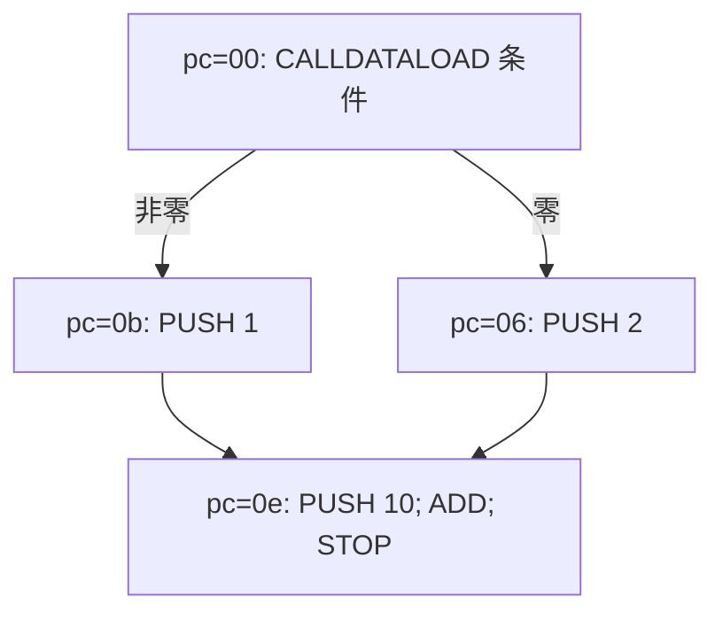

# 03：CFG 是抽象执行长出来的图

本课目标：能够手动进行一轮工作表传播，解释未知跳转和循环为何不会被静默丢弃。

## 先看菱形

`examples/diamond.hex` 形成以下结构，地址以十六进制写：



不需要知道任意一次交易的 calldata，也能知道两条分支可能汇合。`CALLDATALOAD` 产生 Top，所以 JUMPI 的条件可能零、也可能非零。最终汇合槽位是 `{1,2}`。

## 工作表里装的不是字节码块，而是抽象状态

状态键是：

```text
(基本块编号, 入栈高度, 最近 k 个跳转来源 pc)
```

同一个块可以对应多个节点。例如同一入口收到 `[]` 和 `[7]`，不能用 zip 把它们合成同一个栈。`stack-heights.hex` 专门展示这种情况。上下文差异则在第五课展开。

每个状态有入栈与出栈。队列装“入栈变了，需要重新执行”的状态编号。已有节点输入只能通过 join 扩大，键不能改变。

## 一轮传播发生什么

配置先经过 [`config.rs`](../crates/evm-abstract/src/analysis/config.rs) 的准入检查：原始 `Config` 可以填写任意 usize，但只有验证成功才能得到私有字段的 `ValidatedConfig`。这里也构建非零容量的域，执行引擎不用再把数字转换为 NonZero 或使用 `expect` 保证条件成立。

运行时分成两个职责：[`transfer.rs`](../crates/evm-abstract/src/analysis/transfer.rs) 执行一个块；[`engine.rs`](../crates/evm-abstract/src/analysis/engine.rs) 管队列、join、状态编号和边。

```text
1. 弹出待处理状态 S。
2. 用 S 的最新入栈执行整个基本块。
3. 根据 JUMP/JUMPI 或相邻块产生正常后继。
4. 按后继块、出栈高、上下文查找状态键。
5. 新状态：保存输入并入队。
   旧状态：逐槽 join；只有输入真的变大才入队。
6. 保存 CFG 边，重复直到队列空。
```

同一状态在队列中最多一份，但处理后收到新输入可以再次入队。用一个 `queued` 集合避免重复排队；这不是“块只能执行一次”。

如果汇合块在另一条路径到达前已经执行过，后到达的 `{2}` 会把 `{1}` 合成 `{1,2}`，触发重新执行，并把新的出栈传播下去。答案不能依赖哪条分支先被处理。

## 固定点是什么

固定点不是“发现循环然后跳过”，而是“再传播一轮也没有新增信息”。

`loop.hex` 从 i=0 开始，循环令 i=i+1，并在 i<10 时跳回 pc=2。在默认容量 8 的非关系集合域里，头部输入逐渐扩大：

```text
{0}
{0,1}
{0,1,2}
...
⊤
⊤ ⊔ 新输入 = ⊤，不再重新入队
```

不对 true 分支保存 i<10 的约束，所以摘要允许超出实际迭代范围。它仍覆盖具体轨迹。扩大 `--max-constants` 不等于自动获得关系约束，可能只是花更多时间后才变成 Top。

## 未知跳转为什么必须继续

`dynamic-jump.hex` 在 pc=3 根据 calldata 的值 JUMP。后面的 pc=4 有 JUMPDEST，pc=9 有 SSTORE。

```text
600035565b602a60005500
```

calldata 最后一个字节为 4 时，具体执行会到达 pc=4，并把 storage slot 0 写为 42。工具不知道 calldata，target 为 Top，因此把 pc=3 连接到全部合法 JUMPDEST；在本例中只有 pc=4。SSA 必须保留 SSTORE。

若因“无法确定目标”而直接停止展开，图里会没有 storage 写入，但那不是安全证明，而是遗漏执行。这个回归在 [`pipeline.rs`](../crates/evm-abstract/tests/pipeline.rs) 和 [`concrete.rs`](../crates/evm-abstract/tests/concrete.rs) 中同时核对。

Top 还包含非法跳转地址，可能异常终止。`UnknownJump` 诊断同时表达目标不精确与潜在异常；输出图的边表示正常块间转移，异常终止不画成可继续执行的边。

## 程序异常与分析预算不同

| 情况 | 如何处理 | 工作表能否完成 |
| --- | --- | --- |
| 常量 target 非法 | 该值对应的路径异常终止；其他合法值继续 | 可以收敛 |
| 栈下溢/1024 槽上溢 | 本路径在故障指令停止 | 可以收敛 |
| 内存/环境读取 | 返回保守摘要，如 Top | 可以收敛，但精度下降 |
| `max_states` 或 `max_transfers` 用尽 | 记录未完成前沿，不再声称传播闭包 | `Incomplete` |

```bash
cargo run --locked -p evm-abstract-cli -- cfg --file examples/diamond.hex --max-states 1 --format json
```

命令退出码 2，JSON 有 `frontiers`。这不表示 diamond 不会执行另一个块，而是分析器没完成那个块。SSA 会拒绝该结果，因为缺失前驱会让 φ 与 dominance 失真。

## 读代码时验证的不变量

输入只 join 上升，边只增加；不同栈高不合并；状态键不改变；重访消耗 transfer 预算；每个拒绝展开的区域保留前沿。读完工作表后，用这些规则逐条解释代码，比只记忆“使用 BFS”更有价值。
