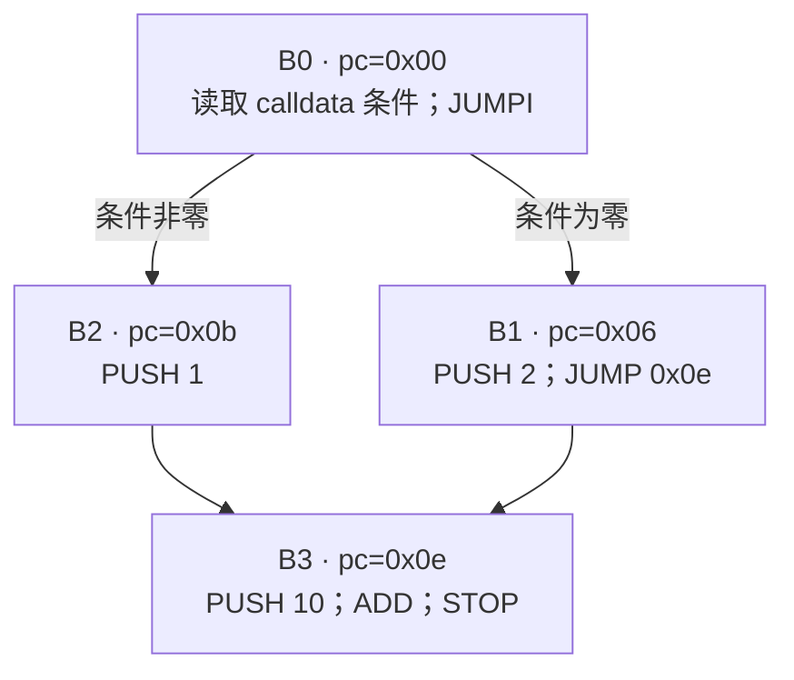
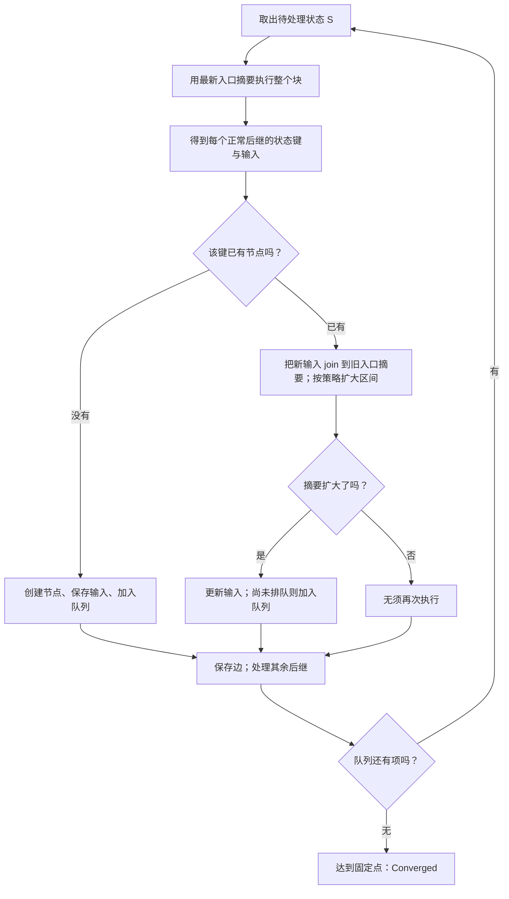

# 03：CFG 是抽象执行长出来的图

学习入口：[模块：CFG、固定点与敏感性](modules/control-flow.md) · [理论：传播与固定点](routes/theory.md#control-flow) · [实现：调度、状态键与合并](routes/implementation.md#control-flow) · [选择路线](learning-routes.md)。

[数值摘要一课](02-domain.md)解释了一个块内的值如何汇合。这一课跟踪这些摘要怎样流到其他块、怎样重访循环，以及分析没有完成时留下什么证据。

这里使用单字节码的 `cfg` 视图，先学习局部控制流。[diamond](../examples/diamond.hex) 和 [loop](../examples/loop.hex) 用 `constants-only --no-relations` 延续[数值摘要一课](02-domain.md)的纯数值手算，再用默认组合域观察数值精度怎样改变分支。它们与跨合约分析共用抽象核心；本课样例没有外部调用，不需要先掌握调用帧。所有命令在仓库根目录运行，地址以十六进制写，栈按**栈底 → 栈顶**排列。

## 1. 先看一张能手算的图

运行[数值摘要一课](02-domain.md)的菱形分支：

```bash
nix run . -- cfg --domain constants-only --file examples/diamond.hex --no-relations --context-depth 0
```

按基本块画出的流程是：



`CALLDATALOAD` 的输入字节未知，读取结果是 Top，既可能为零也可能非零。`JUMPI` 因而产生两个后继，汇合块的输入为 `[{1,2}]`。

边上的名字说明下一步的控制原因：

| 输出中的边类型 | 含义 |
| --- | --- |
| `BranchTrue` | JUMPI 的条件可能非零，走跳转目标 |
| `BranchFalse` | JUMPI 的条件可能为零，走下一块 |
| `Jump` | JUMP 走合法目标 |
| `Fallthrough` | 顺序执行流入相邻块 |

“True”在这里指非零，不只指数字 1。这张图包含分析允许的正常转移；它不保证每条拼接路径都有具体输入能实现。

## 2. 分清代码块 B 与分析状态 S

`B3` 是 `Program.blocks()` 中索引为 3 的固定基本块。`S3` 是分析中创建的一个状态节点，保存“以什么摘要进入这个块”。两种编号服务于不同目的：

```text
S3 | B3 @ 0x000e | stack height=1 | context=[]
  relations in=0 out=0
  stack in  [{0x1, 0x2}]
  stack out [{0xb, 0xc}]
```

| 字段 | 怎样读 |
| --- | --- |
| `S3` | 状态编号，按分析发现节点的顺序创建 |
| `B3 @ 0x000e` | 对应基本块及其起始字节偏移 |
| `stack height=1` | 进入该块时有 1 个栈槽位 |
| `context=[]` | 本例显式设置 k=0，不区分跳转历史 |
| `relations in/out` | 入口/最近一次出口保存的关系数；本课纯数值实验为零 |
| `stack in` | 已汇合的入口栈摘要 |
| `stack out` | 最近一次块执行留下的栈摘要；异常或预算中断时可能只执行了块内前缀 |

`B3` 的 3 是基本块索引，`0x000e` 是入口字节偏移：它们分别回答“块数组中的哪一项”和“字节码中的哪个位置”。JSON 状态键将前者明确命名为 `basic_block_index`；不要把它读成 pc 或链上区块号。

所以 S 编号不一定按 pc 排序，也不要求与 B 编号一致。例如本例中的 `S1` 对应 `B2`，因为非零分支先被加入队列。

对本课的局部视图，状态键为：

```text
(基本块编号, 入口栈高, 最近 k 个跳转来源块的起始 pc)
```

同一个键的输入允许 join；不同键保存为不同节点。节点创建后键保持不变，更新的是它的入口摘要。本课 [diamond](../examples/diamond.hex) 与 [loop](../examples/loop.hex) 显式设置 `k=0`，历史为空；未指定参数时默认为 `k=128`。历史由 JUMP/JUMPI 所在块的起始 pc 构成，不是跳转指令自身的 pc，也不是外部 CALL 的调用栈。

为什么栈高也要进键？运行：

```bash
nix run . -- cfg --file examples/stack-heights.hex --no-relations --context-depth 0
```

在 pc=`0x000c`，你会看到两个状态：`S3 | B3 | stack height=1` 的输入是 `[{0x7}]`，`S4 | B3 | stack height=0` 的输入是 `[]`。空栈与一槽栈不能逐槽合并，否则会丢掉一种栈形状。这个例子直观说明：一个代码块可以有多个分析节点。

世界分析的实际状态还包含活动/暂停的调用帧、每帧内存和账户 Store，键也保留相应结构身份。本课的三项键是局部输出投影；不要把它当作完整机器的全部状态，详见[第九课](09-cross-contract.md)。

## 3. 手动走完一次工作表传播

**工作表算法（worklist）**使用一个待处理队列。队列项是“入口摘要有新信息，需要执行”的状态编号；保存状态摘要的是状态表，二者不是同一张表。

先看预算足够、没有模型边界时的传播流程；遇到未完成边界时如何停止，见[第 7 节](#7-看清诊断与未完成前沿)：



跟着 [diamond](../examples/diamond.hex) 的实际发现顺序走一遍。表中值用十进制，队列左侧先处理：

| 此轮执行 | 输入 → 输出 | 新传播的信息 | 本轮后的队列 |
| --- | --- | --- | --- |
| 初始 | S0 入口为空栈 | S0 等待执行 | `[S0]` |
| S0 / B0 | `[] → []` | 创建 S1/B2 与 S2/B1 | `[S1,S2]` |
| S1 / B2 | `[] → [{1}]` | 创建 S3/B3，入口 `[{1}]` | `[S2,S3]` |
| S2 / B1 | `[] → [{2}]` | S3 入口 join 成 `[{1,2}]` | `[S3]` |
| S3 / B3 | `[{1,2}] → [{11,12}]` | STOP，没有后继 | `[]` |

S3 收到第二条路径时已经排队，所以不重复加入；等它真正被取出时，会使用最新的 `{1,2}`。若一个汇合状态先执行、后来才收到新值，则必须再次入队并传播。这是为什么“一个节点在队列中最多一份”不等于“一个块只能执行一次”。

join 只扩大入口摘要，已有边只增加。默认组合域还会在同一已知状态多次更新后应用区间 widening，保持覆盖已有输入和新输入；本课 constants-only 没有区间需要扩大。已经处理过某状态，并不能成为忽略新输入的理由。

## 4. 循环的固定点长什么样

**固定点（fixed point）**是再次执行和传播也不会新增摘要或边的状态。分析器需要稳定摘要，而不是把循环展开固定次数后假定结束。

```bash
nix run . -- cfg --domain constants-only --file examples/loop.hex --no-relations --context-depth 0
```

这个程序先设 `i=0`，然后重复 `i=i+1`，在 `i<10` 时跳回 pc=`0x02`。具体执行的 i 依次为 0、1、2……，最后到 10 时退出。

抽象分析会在循环入口汇合初始值和回边的值：

```text
入口 {0}        执行后得到 {1}       join → {0,1}
入口 {0,1}      执行后得到 {1,2}     join → {0,1,2}
…
入口 {0,…,7}    新值超过默认容量 8    join → ⊤
入口 ⊤          后续摘要仍被 ⊤ 覆盖   不再新增信息
```

关键输出片段为（`domain` 行确认本次使用 ConstantsOnly）：

```text
status=Converged fork=osaka states=3 edges=3 transfers=11 context_depth=0
domain=ConstantsOnly | domain schema=2 | reduction rounds=4 | fact atoms=256
relations=false | SMT=in-process z3 | rlimit=100000 | resource unit=z3 resource units | expression nodes=1024 | depth=64 | constraints=128
S1 | B1 @ 0x0002 | stack height=1 | context=[]
  relations in=0 out=0
  stack in  [⊤]
  stack out [⊤]
  -> S1 BranchTrue
  -> S2 BranchFalse
```

只有 3 个状态，却执行了 11 次块转换：循环节点确实被重访。`S1 → S1` 是回边；`S1 → S2` 是可能退出的边。出口的 `⊤` 表示整值为 Top，即本次数值摘要没有保留任何固定位或其他数值约束。

本实验显式关闭关系传播，没有在非零分支上给 i 附加 `i<10` 的约束，因此摘要会包含实际循环中不会出现的值。`Converged` 表示已完成当前抽象模型的传播，不表示每个数值都已精确，也不表示合约安全。增大 `--max-constants` 只改变保存常量的容量，不会自动加入分支约束。

去掉 `--domain constants-only` 可观察默认 product。它仍得到 3 个状态、3 条边，最终循环槽位仍没有数值限制；组件交换和区间 widening 改变了中间摘要与工作量，不能期待仍是 11 次 transfer。增加数值组件会改善某些程序，不能保证每个循环的最终答案更精确。

## 5. 数值精度怎样改变候选边

把未知 calldata word 记为 x，考虑条件 `(x AND 15) OR 1`。即使列不完 x 的值，也能手算出条件最低位一定为 1，因此必定非零。运行：

```bash
nix run . -- cfg --file examples/known-bits-branch.hex --no-relations --context-depth 0
nix run . -- cfg --file examples/known-bits-branch.hex --no-relations --context-depth 0 --domain constants-only
```

默认 product 使用位等约束，只有 `BranchTrue`。constants-only 在未知 x 上丢失 AND/OR 的位信息，所以保留 `BranchTrue` 与 `BranchFalse`。精度影响的是哪些候选能被排除；没有证明条件为零或非零时，两边都要保留。

再区分固定输入身份与基本块内的复制身份：

```bash
nix run . -- cfg --file examples/copy-identity.hex --no-relations --context-depth 0
nix run . -- cfg --file examples/copy-identity.hex --no-relations --context-depth 0 --domain constants-only
```

这段代码读取一次根 calldata word，再执行 `DUP1; XOR`。读取保留同一固定输入的符号身份，因此 product 和 constants-only 现在都证明 `x XOR x = 0`，只保留 `BranchFalse`。要单独观察共用的块内复制身份，可先计算派生值 `x+1`，再复制并 XOR：

```bash
nix run . -- cfg --hex 5f356001018018600b57005b00 --no-relations --context-depth 0
nix run . -- cfg --hex 5f356001018018600b57005b00 --no-relations --context-depth 0 --domain constants-only
```

派生运算不保留原 calldata 输入身份，但 DUP 仍复制同一个当前定义。临时复制身份属于共用的 AbstractValue，两种数值 profile 即使在 `--no-relations` 下也只保留 false 边；不能把复制语义当作 product 独有的数值性质。

这两种精度都发生在分支**之前**：先计算条件，再查询“零是否仍可能、非零是否仍可能”。本节关闭关系层，因此 JUMPI 不保留原值的分支假设。默认开启的关系模式则会在 true/false 后继各自记录条件，按进程内位向量查询的证明收窄后续值或排除矛盾分支；未知结果保留对应前沿，见[第 15 课](15-symbolic-relations.md)。临时复制关系会在块边界失效；同一环境中身份一致的固定输入符号可跨块保留。更多组件的含义见[第 12 课](12-product-domains-facts.md)，跨路径如何少合并见[第 05 课](05-sensitivity.md)。

## 6. 跳转目标未知时，仍须保留后续行为

运行：

```bash
nix run . -- explain --file examples/dynamic-jump.hex
```

该例的字节码是 `600035565b602a60005500`，关键指令如下：

```text
pc=0x00: PUSH1 0       指定输入偏移
pc=0x02: CALLDATALOAD  从输入开头读取一个 256 位目标
pc=0x03: JUMP
pc=0x04: JUMPDEST
pc=0x05: PUSH1 42
pc=0x07: PUSH1 0
pc=0x09: SSTORE        把 42 写入 storage slot 0
pc=0x0a: STOP
```

例如，输入的前 32 字节是 31 个 `00` 后接 `04`，读取的目标就是 4，具体执行能到达 pc=`0x04` 并执行写入。只说“最后一个字节是 4”还不够：前面的字节也必须为零，才能保证整个 256 位目标等于 4。

本命令省略 `--evm.calldata`，读取的目标没有数值限制，为 Top。为了覆盖每一种合法跳转，分析器会连接到程序中**全部真正的 JUMPDEST**。本例只有一个，于是输出同时包含：

```text
S0 → S1 Jump
diagnostic S0 @ 0x0003: UnknownJump
```

在 `explain` 的 SSA 部分还应看到 `0009: SSTORE`。即使目标不精确，这条可能发生的写入也保留下来了。

Top 也包括非法目标。`UnknownJump` 因此还表示存在异常终止的可能；正常 CFG 中无需把异常结束画成可继续执行的块间边。**未知目标会增加候选边和诊断，不能成为删除合法后继的理由。** 候选展开若被预算中断，则需额外记录未完成前沿，不能只留这个诊断。

默认组合域也可能列不出完整目标集合，却仍保存位、区间或同余约束。此时遍历合法 JUMPDEST，并用目标值的 `contains(pc)` 查询排除违背约束的候选；无需一律连接全部目标。查询保留某个候选，只说明尚不能排除它，仍不是具体路径的可达见证。没有完整候选集合时，当前实现也保留 `UnknownJump` 与异常可能性。

## 7. 看清诊断与未完成前沿

诊断说明某处发生了程序异常，或数值只能粗略表示。**前沿（frontier）**则记录分析未能继续完成的边界，例如“从 S0 出发，本应创建这个后继键，但状态预算已用尽”。两者回答不同问题。

| 情况 | 后续处理 | 可以是 `Converged` 吗？ |
| --- | --- | --- |
| 有限集合中的某个跳转目标非法 | 该候选异常结束，合法候选继续 | 可以 |
| 栈下溢、超过 1024 槽、无效操作码 | 故障路径异常结束 | 可以 |
| 未知输入得到 Top，未知跳转覆盖全部合法目标 | 用保守摘要继续传播 | 可以，但可能较粗 |
| 纯栈指令的有界 facts 交换达到轮数或容量上限 | 保留已完成的安全精化，记录 `FactExchangeLimited` | 可以，但可能较粗 |
| 状态、块转换或其他工作预算耗尽 | 保存未完成前沿 | 不可以，结果为 `Incomplete` |
| 模型缺少继续执行所需的账户事实等 | 保存未完成前沿 | 不可以，结果为 `Incomplete` |

故意缩小预算：

```bash
nix run . -- cfg --domain constants-only --file examples/diamond.hex --no-relations --context-depth 0 --max-states 1 --format json
```

此命令预期**退出码为 2**，JSON 仍会输出。看三个字段：

- `status` 是 `"Incomplete"`。
- `states` 只有入口状态，`edges` 是空数组。
- `frontiers` 有两个目标，分别为 `basic_block_index: 2` 和 `basic_block_index: 1`，`limit` 是 `"States"`。

`basic_block_index` 是 `Program.blocks()` 中的基本块索引；该块的入口字节偏移保存在 `start_pc`，二者不是同一个编号。它也不是链上区块号。

两条分支的目标块存在，也可能执行；这里只是没有预算创建它们的状态。空边集不能证明入口没有后继。

未完成的图还不能用于本仓库的**完整 SSA** 构建：遗漏前驱会破坏 φ 输入和支配关系的判断。若运行同样预算下的默认 `ssa` 命令，它会报告 `SSA unavailable: analysis frontiers remain`，并以退出码 2 结束。加 `--allow-partial-ssa` 可以另行查看带覆盖说明的部分 SSA，仍保留未完成前沿与退出码 2；其中 φ 只接入有当前执行证据的边，不声称覆盖所有可能前驱。读法见[第 04 课](04-ssa.md#7-未完成时按需查看部分-ssa)。

## 读源码时对应到哪里

建议沿着一次传播读，而不是先读完整模块：

1. [`config.rs`](../crates/evm-abstract/src/analysis/config.rs)：原始 `Config` 中的数字先经过验证，成功后得到字段私有的 `ValidatedConfig`，并把容量转为 `NonZeroUsize`。配置与域在这里一起构造。
2. [`engine.rs`](../crates/evm-abstract/src/analysis/engine.rs) 的 `run_world` 初始化入口节点，再看 `Engine::run` 怎样取队列项、检查预算和调用 `transfer::execute`。
3. [`transfer.rs`](../crates/evm-abstract/src/analysis/transfer.rs) 的 `execute` 及 JUMP/JUMPI 分支：弹出目标与条件，枚举合法后继；开启关系模式时，[`transfer/relations.rs`](../crates/evm-abstract/src/analysis/transfer/relations.rs) 为后继应用条件、查询矛盾并精化数值。
4. 回到 [`Engine::execution`](../crates/evm-abstract/src/analysis/engine.rs) 收集块转换的证据，再读 [`Engine::successor`](../crates/evm-abstract/src/analysis/engine.rs)：按键查找节点，join 输入，决定是否入队并保存边。随后回到 [`run`](../crates/evm-abstract/src/analysis/engine.rs) 看下一次调度。
5. [`single.rs`](../crates/evm-abstract/src/analysis/single.rs)：把同一世界分析核心投影为本课看到的局部 S/B 视图。

阅读时核对五条规则：不同栈高不合并；同一键的输入通过 join 与固定的区间 widening 策略扩大；扩大后需要重访；旧边不删除；任何未完成展开都保留前沿。相关样例由 [`pipeline.rs`](../crates/evm-abstract/tests/pipeline.rs) 与 [`concrete.rs`](../crates/evm-abstract/tests/concrete.rs) 核对。

`Engine` 的私有字段分担不同职责，不能把“状态表”与“待处理队列”混为一谈：

| 字段 | 保存什么，为什么需要它 |
|---|---|
| `result.states` / `ids` | 前者保存入口、最近一次转换证据和节点编号；后者把结构键映射到编号，决定新输入进入哪个节点 |
| `queue` / `queued` | 前者保存 FIFO 调度记录；后者表示哪些节点仍需处理。摘要回放可满足已排队的节点，留下的旧队列项会被跳过 |
| `domain` / `budget` | 前者规定抽象运算与 join 的精度；后者累计普通执行和摘要操作的工作量，缓存命中也要付出工作量 |
| `cache` / `completed_calls` | 前者保存摘要候选与完整证书；后者按节点编号保存 caller join 前的子调用终结证据，避免从汇合结果反推调用效果 |

先掌握普通传播，再沿 [`try_summary`](../crates/evm-abstract/src/analysis/engine.rs) 阅读摘要分支：未命中时仍正常执行，[`Cache::publish_closed`](../crates/evm-abstract/src/analysis/summary.rs) 用 [`capture`](../crates/evm-abstract/src/analysis/summary.rs) 检查子图是否闭合；命中时 [`Engine::replay`](../crates/evm-abstract/src/analysis/engine.rs) 导入证书，并用 [`transfer::resume_summary`](../crates/evm-abstract/src/analysis/transfer.rs) 在当前 caller 下重新生成返回转移。具体前提见[第 10 课](10-snapshots-summaries-creation.md)。

私有可见性限制外部调用，不说明实现意图。读方法时仍需核对：它更新哪份数据、凭什么跳过执行，以及预算中断后保留什么未完成证据；源码注释对应这些职责和不变量。

相关主题：[用 SSA 给栈值命名](04-ssa.md)。有了完整的前驱关系，才能准确解释一个值在汇合处来自哪里。
