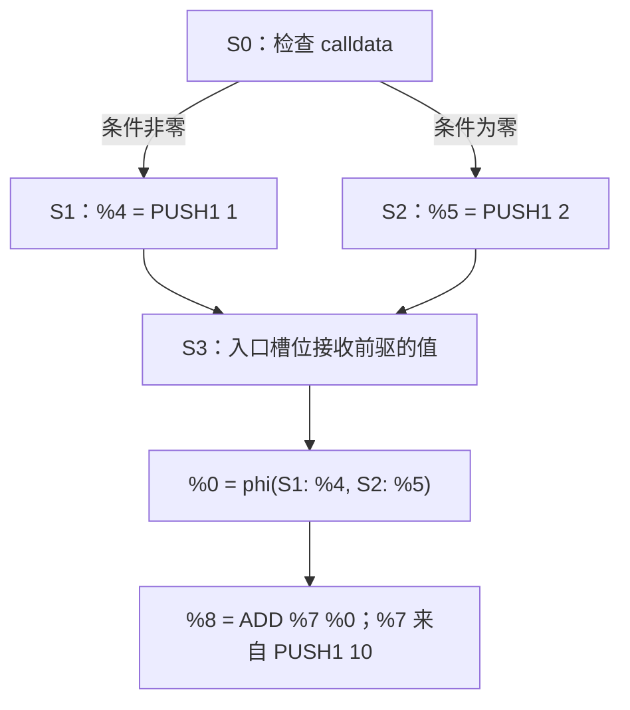

# 04：SSA——给流动的栈值起名字

学习入口：[模块：SSA 与部分执行](modules/ssa.md) · [理论：SSA 与覆盖证明](routes/theory.md#ssa) · [实现：SSA 构建与渲染](routes/implementation.md#ssa) · [选择路线](learning-routes.md)。

[控制流一课](03-cfg.md)的 CFG 告诉我们“执行可能去哪里”。这一课再回答：“这条 ADD 使用的两个值，各自从哪里来？”

**SSA** 是 Static Single Assignment，即静态单赋值表示。它为分析图中每个产生值的定义位置分配唯一名字，让后续指令直接引用这个名字。本课先读实际输出，再解释分支和循环中的值如何连接，以及这些名字与抽象执行中的固定输入、临时复制身份有何区别。

以下命令都在仓库根目录执行，所有栈都按**栈底 → 栈顶**排列。

## 1. 先分清值、名字和栈位置

运行一个只有 PUSH、DUP 和 SWAP 的程序：

```bash
nix run . -- ssa --hex 60018060029000
```

标题为 `stack SSA: fork=osaka values=2 status=Converged`。其后先显示[第 00 课](00-start.md)介绍的 `EVM inputs`，再显示以下状态与指令部分：

```text
S0 | context=[]:
B0 @ 0x0000:
       0000: %0 = PUSH1 0x1
       0002: DUP1 %0
       0003: %1 = PUSH1 0x2
       0005: SWAP1 %1 %0
       0006: STOP
       stack out [%0, %1, %0]
```

`S0 | context=[]:` 是分析状态的元数据，下一行 `B0 @ 0x0000:` 才是字节码基本块标题。SSA 与反汇编共用这套指令列表布局：块标题顶格，指令 pc 不带 `0x`，其数字列与标题中 `0x` 后的数字对齐。`B0`–`B9` 的指令行缩进 7 格，`B10`–`B99` 为 8 格，`B100`–`B999` 为 9 格；`stack out` 从同一列开始。pc 始终是十六进制字节偏移。

逐条把 SSA 名字放到栈中：

| 执行完的指令 | 栈中的名字 | 对应的数值 | 发生了什么 |
| --- | --- | --- | --- |
| PUSH1 1 | `[%0]` | `[1]` | 产生一个值，命名为 `%0` |
| DUP1 | `[%0, %0]` | `[1,1]` | 两个槽位引用同一个值 |
| PUSH1 2 | `[%0, %0, %1]` | `[1,1,2]` | 产生另一个值，命名为 `%1` |
| SWAP1 | `[%0, %1, %0]` | `[1,2,1]` | 交换两个栈位置，名字仍指向原定义 |

所以，`values=2` 数的是两个**值定义**，不是最终三个栈槽位。

| 记号 | 回答的问题 | 容易误读的地方 |
| --- | --- | --- |
| `%0`、`%1` | 值由哪个定义产生？ | `%0` 不代表数值 0，也不代表栈底槽位 |
| `slot 0` | 当前状态入口栈的哪个位置？ | 槽位从栈底开始编号；位置会随栈操作改变 |
| `B3` | 哪个字节码基本块？ | 3 是基本块数组的索引；入口 pc 是另一项信息 |
| `S3` | 哪个已发现的分析状态？ | S 是块在某个栈高、上下文下的实例；一个 B 可以对应多个 S；已发现不等于有具体可达见证 |

同样的数值也可以有不同名字。例如两个不同位置的 `PUSH1 1` 分别定义两个值。SSA 保留的是**来源身份**，不把“数值相等”自动视为“同一个定义”。

## 2. 分支汇合时，怎样给入口值命名

运行 [diamond](../examples/diamond.hex) 示例：

```bash
nix run . -- cfg --file examples/diamond.hex --context-depth 0
nix run . -- ssa --file examples/diamond.hex --context-depth 0
```

本例显式设置 `--context-depth 0`，让两条路径进入同一个分析状态；[后面的循环例子](#4-循环为什么不需要无限多个名字)也使用这个设置。默认深度 8 会保留更多跳转历史，见[第 05 课](05-sensitivity.md)。关注汇合处 `pc=0x0e`。两条前驱分别把 1 和 2 留在栈上：



对应的真实输出片段是：

```text
S3 | context=[]:
  %0 = phi(S1: %4, S2: %5) ; slot 0, abstract {0x1, 0x2}
B3 @ 0x000e:
       000e: JUMPDEST
       000f: %7 = PUSH1 0xa
       0011: %8 = ADD %7 %0
       0012: STOP
       stack out [%8]
```

φ 显示在状态元数据之下、块标题之前，没有指令 pc。它是该分析状态的入口定义，不是原始字节码中的一条指令。这里 S3 位于 B3 只是编号恰好相同；两条前驱 S1、S2 对应的字节码块分别是 B2、B1，φ 必须保留前驱 **S**，不能用 B 替换。

**φ（phi）** 为汇合块的入口值命名。它的输入带有前驱标签，含义是：

1. 如果这次执行从 S1 进入 S3，`%0` 接收 `%4` 的值，也就是 1。
2. 如果从 S2 进入，`%0` 接收 `%5` 的值，也就是 2。
3. ADD 使用这个选定的值和 10，这次具体执行得到 11 或 12。

φ 不把两个输入相加，也不在一次具体执行中同时取两个输入。多个入口 φ 在进入块时按同一条前驱边接收值，可视为并行赋值。

这里 `ADD %7 %0` 仍按 EVM 的弹栈顺序列参数：先弹出栈顶的 `%7`，再弹出 `%0`。对 ADD 顺序不影响结果，对 SUB、DIV 等就必须认真区分。

## 3. φ、抽象值和复制身份各负责什么

上面的同一行同时出现了 `phi(...)` 和 `{0x1,0x2}`，但它们记录不同信息：

| 表示 | 内容 | 用途 |
| --- | --- | --- |
| `phi(S1: %4, S2: %5)` | 值来自哪条前驱边、哪个定义 | 连接数据依赖 |
| `abstract {0x1,0x2}` | 分析保存的入口槽位数值摘要；默认还含位、区间等组件 | 计算后续的抽象结果 |

集合组件的 **join（合并）** 把两条路径上的 `{1}` 和 `{2}` 合成 `{1,2}`。φ 则保留前驱与定义之间的对应关系。用这个例子比较：

```bash
nix run . -- ssa --file examples/diamond.hex --context-depth 0 --max-constants 1 --domain constants-only
nix run . -- ssa --file examples/diamond.hex --context-depth 0 --max-constants 1
```

constants-only 的入口数值变成 Top；默认 product 只是不能完整列出候选，仍保留范围等性质。本例的两条 CFG 分支都保留，所以两种输出的 φ 都有 S1 与 S2 两条来源。一般情况下，数值精度能排除某些分支，CFG 和后续 SSA 结构也会随之改变，不能假定改变域只会改变 `abstract` 注释。

SSA 名字本身也不是路径约束。看到 `%0` 被比较为 5，并不意味着当前分析已经在某条边上证明 `%0=5`；这取决于分析是否保存了比较与原值之间的关系。

回到[控制流一课的 `DUP1; XOR` 实验](03-cfg.md#5-数值精度怎样改变候选边)：

```bash
nix run . -- ssa --file examples/copy-identity.hex --context-depth 0
```

SSA 的 XOR 行会把同一个名字列为两个操作数，因为 DUP 复制引用。该例的根 calldata 读取保留固定输入符号，product 和 constants-only 在构建 CFG 时都能证明 `x XOR x = 0`，因此只保留 false 分支；SSA 则继续保留 XOR 指令及其结果定义，并没有把代码改写成 PUSH 0。

这些信息的边界是：

| 信息 | 怎样产生 | 保留到哪里 |
| --- | --- | --- |
| 完整 SSA 名字与 φ | 在已完成的 CFG 上构建定义、引用和前驱输入 | 保留整个 SSA 图的数据依赖，包括块间关系 |
| 局部复制身份 | 抽象执行给本次块执行的定义签发身份，DUP 复制，SWAP 调整位置 | 只用于块内受支持的相等运算；块边界、join 与调用边界会忘记身份 |
| 固定输入符号 | 同一环境为根帧 calldata、caller/origin 等固定输入保留身份 | 身份一致时可跨块保留；不同环境、不同偏移或不相关子帧输入不能混同 |
| Provenance 来源标签 | 读取建立观察位置的类别，纯运算合并输入来源 | 描述可能来源；两个值同属 Calldata 或 Storage 不证明相等 |

临时复制身份不等于 `%n`，不会序列化进 JSON；固定输入符号的名称会序列化，但其内部环境命名空间不会公开。临时身份也不使两个相同抽象摘要自动成为同一个运行时值。当前完整 SSA 在 CFG 完成后生成，不能再将 φ 的来源关系反馈给前面的工作表，替它恢复任意槽位配对、分支约束或内存别名。组件交换的完整边界见[第 12 课](12-product-domains-facts.md)。

## 4. 循环为什么不需要无限多个名字

运行：

```bash
nix run . -- ssa --file examples/loop.hex --context-depth 0
```

循环的核心关系可以简写为：

```text
entry: %zero = PUSH 0
head:  %i = phi(entry: %zero, head: %next)
       %one = PUSH 1
       %next = ADD %one %i
       ... 决定是否跳回 head
```

第一次进入 head，`%i` 来自入口的 `%zero`；沿回边再次进入，`%i` 来自上一轮的 `%next`。代码中仍只有一个 `%i` 定义位置、一个 `%next` 定义位置，它们在运行时可以反复执行。

因此，“单赋值”说的是**静态表示里每个名字只有一个定义位置**，不是循环只计算一次，也不是同一名字在所有迭代中都对应同一个数值。

## 5. 本仓库如何构建和检查 SSA

[`ssa/build.rs`](../crates/evm-abstract/src/ssa/build.rs) 按三个步骤工作：


先分配名字，再连接输入，使回边能引用已有名字，不必展开循环。它也解释了 [diamond](../examples/diamond.hex) 中为什么 `%0` 在最后显示的汇合块定义，而第一条 PUSH 是 `%1`：**编号保证唯一，不保证按 pc 排序**。

这个教学实现为所有入口槽位建立 φ，只有一个前驱的块也会显示 φ。这样每个块都能从自己的入口名字开始构建；表示合法，但没有做最小化。删除多余 φ 需要同步改写所有引用和出栈，不能只删掉输出中的一行。

[`ssa/verify.rs`](../crates/evm-abstract/src/ssa/verify.rs) 检查两个方面：

- **结构一致**：SSA 与分析的 S 身份、已访问 pc、入口和出口栈高一致；每个 φ 覆盖全部不同前驱，并接收该前驱真实出栈的对应槽位。
- **定义先于使用**：值 ID 连续、每个值只定义一次。普通指令使用的定义必须支配它；同块中还必须先定义后使用。

“A **支配** B”是说：从入口到 B 的每条路径都经过 A。φ 的输入使用发生在前驱边上，因此输入定义必须支配**对应前驱的出口**，不要求它支配整个汇合块。这正是两条分支各自定义的值能进入同一个 φ 的原因。

同一对状态有时同时存在 true、false 两条边。当前两条边携带同一份出栈，所以 φ 按前驱 S 去重。若未来每条边能携带不同的收窄信息，就需要把 φ 输入进一步关联到具体边。

## 6. 这份 SSA 的证据范围

本课的 `ssa` 命令展示单账户的**栈 SSA**：MSTORE、SSTORE、LOG、CALL 等有副作用的操作仍保留顺序和参数，即使没有返回值也不能随意删除。

世界入口 `explain --world ...` 的教学 SSA 与单程序 SSA 共用赋值式指令正文：先列结果名字，再列操作码、立即数和按弹栈顺序排列的操作数；DUP/SWAP 使用已有名字，故障注释也保留。两者都把状态元数据、入口 φ 与顶格的 B 标题分开，但世界状态另带代码目录 C、活动帧 F、state owner 和 context。世界 φ 的来源是转移 **T**，同时保留它属于哪个 **F** 的哪个 slot；各帧的 `stack out` 也分别显示。共用布局与指令正文不会把单程序的前驱 S 改成 T，或把跨合约状态压成一个栈。

`analyze --world ... --ssa` 和 `explain --world ... --verbose` 还保留完整帧元数据、原始 `opcode` / `immediate` / `operands` / `results` / `fault` 字段，以及逐指令的 `!` 效果链。完整 SSA 的字节码行和效果行同样使用 B 标题及不带 `0x` 的 pc 列；空代码、原生预编译、无效委托和代码末尾的合成继续位置只显示原因，不伪造字节码 pc。各视图保留的证据见[第 09 课](09-cross-contract.md)。

完整跨合约 SSA 需要完整的跨合约图；把几个独立栈 SSA 拼在一起，无法得到正确的调用与回滚语义。下面的部分 SSA 使用另一种证据契约，保留尚未覆盖的路径。

SSA 验证通过，说明定义、使用和控制边满足这些结构规则。它没有证明 CFG 中每条路径都真实可执行，也没有给出整个 EVM 语义的形式证明。[敏感性一课](05-sensitivity.md)会用同一个 helper 的两次调用，观察分析怎样通过“暂时不合并”改善精度。

## 7. 未完成时按需查看部分 SSA

不知道 CALL 的目标，或在预算前沿停下时，分析已经完成的一些指令仍有可读的值流。加 `--allow-partial-ssa` 可以给这些抽象执行证据起名字，同时列出未覆盖部分；它不会把分析改为 `Converged`。

### 从块中途停下的实际输出开始

先用一个没有调用、没有跳转的小程序，观察“执行了块的一部分”具体是什么样子。[`partial-ssa-memory.json`](../examples/partial-ssa-memory.json) 只包含一个账户，代码为 `60015f510100`：

```text
B0 @ 0x0000:
       0000: PUSH1 0x1
       0002: PUSH0 0x0
       0003: MLOAD
       0004: ADD
       0005: STOP
```

五条指令都属于静态基本块 B0。正常执行时，它把 1 压栈，读取偏移 0 处的 32 字节 memory，再相加。新调用帧的 memory 初始为零。先把分析器允许的 memory 范围限制为 1 字节；账户余额和 nonce 在文件中明确为零，调用 value 与 calldata 也在命令里明确给出：

```bash
PARTIAL_MEMORY_STATUS=0
nix run . -- explain --world examples/partial-ssa-memory.json \
  --evm.to 0x0000000000000000000000000000000000000101 \
  --evm.value 0 --evm.calldata 0x \
  --max-memory-bytes 1 --allow-partial-ssa \
  || PARTIAL_MEMORY_STATUS=$?
printf 'exit=%s\n' "$PARTIAL_MEMORY_STATUS"
```

退出码为 `2`，表示分析 `Incomplete`。反汇编仍显示五条指令；CFG 的 `pcs` 只有 `[0x0000, 0x0002, 0x0003]`；部分 SSA 的指令正文是：

```text
B0 @ 0x0000:
       0000: %0 = PUSH1 0x1
       0002: %1 = PUSH0 0x0
       0003: MLOAD %1 ; progress=OperandsConsumed; pending operation, no normal result; state may be partially updated ; frontier U0: Memory
    recorded prefix stack: F0: [%0]
```

逐步对齐程序、记录阶段和栈，就能解释最后一行：

| 已观察到的步骤 | SSA 栈，栈底 → 栈顶 | 对应数值 | 证据含义 |
| --- | --- | --- | --- |
| 进入 B0 | `[]` | `[]` | 根帧没有入口栈参数 |
| PUSH1 完成 | `[%0]` | `[1]` | `%0` 是这个 PUSH 的结果名字 |
| PUSH0 完成 | `[%0, %1]` | `[1, 0]` | `%1` 是 MLOAD 将使用的偏移 |
| MLOAD 已消费参数 | `[%0]` | `[1]` | `%1` 已弹出；32 字节访问超过分析上限，尚未压入读取结果 |
| ADD、STOP | 没有执行证据 | 没有执行证据 | 它们在捕获代码中存在，但本次块转换没有走到这里 |

**recorded prefix stack 是“按已记录阶段走到这里时的栈”**。这里的 prefix 是这个状态最近一次抽象块转换的指令前缀，最后一条还可能只执行到一半；它不是某笔具体交易的调试轨迹。`MLOAD %1` 记录了已经消费的偏移，左边没有 `%2 =`，因为本次尝试没有正常结果可命名。若按操作码的通常栈效果硬补一个 MLOAD 结果，就会伪造证据。

`F0` 是当前机器状态调用栈里的第 0 帧，按最早调用者在前编号；嵌套调用可能还有 F1、F2，它们各有自己的操作数栈。`[%0]` 是 F0 当前留下的一个 SSA 引用，并不表示栈上数值是 0。JSON 对应 `exit_frames: [[0]]`：外层按帧编号，内层按栈底到栈顶排列；数字 0 是 `%0` 的值 ID。虽然字段叫 `exit_frames`，在部分 SSA 中它保存的是当前前缀留下的栈，不能一概读成“整个基本块完成后的 stack out”。Stale/Unexecuted 时还有进一步限制，见[下文 coverage](#每个状态的证据是否仍适用)。

再把同一命令的 `--max-memory-bytes 1` 改为 `--max-memory-bytes 32`：

```bash
nix run . -- explain --world examples/partial-ssa-memory.json \
  --evm.to 0x0000000000000000000000000000000000000101 \
  --evm.value 0 --evm.calldata 0x \
  --max-memory-bytes 32 --allow-partial-ssa
```

这次退出 `0`，状态为 `Converged`，开关自动保留完整 SSA 输出：

```text
B0 @ 0x0000:
       0000: %0 = PUSH1 0x1
       0002: %1 = PUSH0 0x0
       0003: %2 = MLOAD %1
       0004: %3 = ADD %2 %0
       0005: STOP
       stack out (before dispatch) F0: [%3]
```

现在 MLOAD 的读取结果 0 有了名字 `%2`，ADD 的结果 1 有了名字 `%3`。前后 CFG 的数值栈都可能显示 `[{0x1}]`，但前一次是尚未参与 ADD 的 `%0`，后一次是 ADD 产生的 `%3`；只看最后的数值看不出执行到了哪里。这个上限是**分析资源限制**，不能把 `Memory` 前沿解释成具体 EVM 必然发生内存异常。`Converged` 也只说明这次分析按当前模型完成；报告仍可能含 `Failure` outcome，退出 `0` 不是“某笔具体交易一定成功”的断言。

### 为什么基本块可以只执行一个前缀

基本块是根据字节码的控制流边界划分的；抽象分析还要遵守预算、状态事实和模型能力。这是两件不同的事。上例的 MLOAD 不会切开静态基本块，但 [`transfer.rs`](../crates/evm-abstract/src/analysis/transfer.rs) 可以在它的处理中提前返回：

1. 到达指令，把 pc 记入 `executed_pcs`，阶段先记为 `Started`。
2. 检查栈并弹出参数，把阶段改为 `OperandsConsumed`。
3. MLOAD 调用 `touch_memory` 准备 32 字节访问；超过上限时记录 `Memory` 前沿并返回。
4. 只有走完普通结果计算、压栈和相关效果，才记录 `Completed`。本例没有走到这一步，更没有继续到 ADD。

工作预算也可能在进入下一条指令前、或消费参数后的处理中用尽。RPC 发现模式的 SLOAD 可能在消费槽键后发现 `MissingStorage`；[`analysis/rpc.rs`](../crates/evm-abstract/src/analysis/rpc.rs) 可以在固定快照补齐事实，再从入口重跑，所以某一轮的前沿不一定出现在最终报告中。

反过来，**看到 frontier 不等于所有执行都立刻停止**。`boundary` 负责记录前沿，是否返回由调用处决定；某些关系分析限制会留下前沿并继续做保守计算，未知调用目标也可以同时保留有证据支持的失败或继续边。因此，应同时读当前指令的 `progress`、已经记录的后继边和整张图的 `status`。局部块完成、某条已知路径完成、整个图覆盖闭合，分别是不同的判断。

CALL 则已被 [`Instruction::ends_block`](../crates/evm-abstract/src/bytecode.rs) 定义为静态块边界：调用者后面的 ADD 等指令属于继续块，需要继续边才能进入。下面用 CALL 说明图的覆盖仍开放；用上面的 MLOAD 才能直接看到**同一个静态块的中途停止**。

### 先运行一个未知调用目标

这个离线程序把 `(CALLER AND 15) OR 240` 当作 CALL 目标。真实目标只能是 `0xf0`～`0xff`，共有 16 个；默认常量容量 8 无法完整列出它们，单段代码也没有这些账户的代码事实。caller 仍是符号输入，运行：

```bash
PARTIAL_SSA_STATUS=0
nix run . -- explain \
  --hex 5f5f5f5f5f33600f1660f0175af1 \
  --allow-partial-ssa || PARTIAL_SSA_STATUS=$?
printf 'exit=%s\n' "$PARTIAL_SSA_STATUS"
```

仍应看到 `Incomplete`、`UnknownTarget` 前沿与 `exit=2`；新增部分的标题是 `Partial SSA (machine state IDs)`。默认文本先看已经产生的 PUSH、CALLER、AND、OR、GAS 名字，再看 CALL 的参数、已知继续边和保留下来的前沿。到达 CALL 不等于已知道它会调用哪个合约、返回什么；不能根据操作码通常会压入一个成功位，就给未完成调用编造一个结果。

该开关用于 `ssa` 和 `explain`；世界/RPC 的 `analyze` 需同时加 `--ssa`。部分 SSA 支持文本和 JSON；`analyze --ssa --allow-partial-ssa --format dot` 会被拒绝。若分析已收敛，加开关仍输出原来的完整 SSA。

部分 SSA 的默认文本突出指令与值流，不逐条展开常见的 `Completed`、`Dispatched` 进度注释或 `!effect` 效果链。`Started`、`OperandsConsumed`、`Faulted` 仍明确标注；Stale/Unexecuted、延后的边、开放入边与全部前沿也继续可见。需要全部阶段与效果链时，world/RPC 的 `explain` 加 `--verbose`；单程序 `ssa` 和世界/RPC 的 `analyze` 则用 `--format json` 查看完整字段。显示简化不改变结构验证、调用输入或退出码。

### 每个状态的证据是否仍适用

部分 SSA 的 `Current`、`Stale`、`Unexecuted` 描述该状态的执行证据，分别读作：

| coverage | 表示什么 | 能怎样读正文 |
| --- | --- | --- |
| Current | 最近一次转换对应当前已合并的入口 | 可以读取其指令阶段；它也可能在块中途停止 |
| Stale | 最近一次转换之后，入口经 join 扩大了，尚未重新执行 | 旧指令正文不用于解释新入口 |
| Unexecuted | 该状态尚无一次转换的执行证据 | 没有指令正文；不代表这个块不可达 |

例如 S2 曾在入口只有 1 时执行，后来另一条边带来 2，入口变成 `{1,2}`。如果在重访 S2 前预算耗尽，就不能把旧出口当成已经处理了 `{1,2}` 的结果。旧的累计边也不自动成为当前执行的继续边；缺少当前证据时，它们在 `Deferred edges` 中保留原因，如 `SourceStale` 或 `NotInExecutionEvidence`，不被改写成无副作用的边。

### 一条指令已经走到哪一步

`progress` 表示抽象执行最近观察到的阶段，与整个图是否完成分别判断。JSON 始终保留全部阶段；详细文本展开这些阶段，默认文本只标出需要注意的未完成步骤和故障：

| progress | 已有证据 | 默认文本 | 尚不能据此推出什么 |
| --- | --- | --- | --- |
| Started | 已到达这个 pc，尚未消费栈参数 | 明确标注，尚无普通结果 | 指令已产生普通结果 |
| OperandsConsumed | 栈参数已消费，普通结果尚未产生；准备步骤可能已改变 memory 等状态 | 明确标注，步骤尚未完成 | 整条指令已完成；详细视图的 `observed partial effect` 只命名已观察到的部分效果 |
| Completed | 这条普通指令的局部栈计算和效果已完成 | 保留指令与值流，省略正常进度注释 | 整个图、后续调用或所有路径都已完成 |
| Dispatched | 已进入跳转、终止、调用或失败分发 | 保留指令、已知继续边与前沿，省略常见进度注释 | 所有可能目标都已分析；`UnknownTarget` 可以被忽略 |
| Faulted | 记录了无效操作码或栈故障，没有普通栈结果 | 明确标注故障 | 故障执行可以按普通指令生成值 |

静态帧中禁止的状态修改、确定越界的 RETURNDATACOPY 也会记录为 Dispatched；默认文本仍明确标注这些异常终止，不把它们当作正常分派省略。

CALL/CREATE 的结果在已记录的 Return、Revert 或 Failure 继续转移上定义，不属于悬挂调用者的 CALL 指令正文。继续转移可能来自子调用结束，也可能来自调用被直接拒绝的失败。已知候选的调用、返回或失败边可以继续保留；未知候选仍留下前沿。RETURN/REVERT 也会进入分发：根帧结束时，返回字节与状态效果在入口 outcome 中阅读；子帧结束时，沿 Return/Revert 转移恢复调用者。因此不能把所有 Dispatched 都解释成“结果只来自转移”。这里的 `%value` 是栈值名字；详细文本和 JSON 中的 `!effect` / 效果 ID 命名 memory、账户状态和回滚点等整机效果，不能把一个效果名字当作每条路径的具体状态。

### 进度和效果链怎样一起读

在[内存上限实验](#从块中途停下的实际输出开始)的第一条命令中，为 `explain` 加上 `--verbose` 参数，可以看到：

```text
S0 | coverage=Current | incoming complete=false | open incoming=[]
    !0 = partial effect phi()
B0 @ 0x0000:
       0000: %0 = PUSH1 0x1 ; progress=Completed
         effect !0 -> !1
       0002: %1 = PUSH0 0x0 ; progress=Completed
         effect !1 -> !2
       0003: MLOAD %1 ; progress=OperandsConsumed; pending operation, no normal result; state may be partially updated ; frontier U0: Memory
         observed partial effect !2 -> !3
    recorded prefix stack: F0: [%0]
    recorded prefix effect: !3
```

这里省略了 active 帧的元数据行。`%0`、`%1` 连接**栈值的定义与使用**；`!0`～`!3` 连接**整机效果的先后依赖**；`progress` 则解释这个步骤究竟完成到了哪里。三种信息不能互相代替。

当前效果 SSA 使用一个粗粒度 bundle，覆盖 memory、calldata/returndata、storage、余额、日志和回滚检查点等依赖，见 [`ssa/world.rs`](../crates/evm-abstract/src/ssa/world.rs)。它没有把每个内存地址或 storage 槽拆成独立的效果链。PUSH 这样的普通操作也会分配后续效果名字，所以 `!0 -> !1` **不证明**这条 PUSH 修改了 storage 或 memory，也不是状态差异清单。

`observed partial effect !2 -> !3` 表示 MLOAD 本次尝试已经观察到的阶段之后的效果名字。它保留参数消费后可能发生的准备工作，不证明 MLOAD 的正常语义已经完成，也不证明所有状态都还等于尝试之前。`Started` 连这样的后续效果名字也没有，详细文本会写 `effect !n remains open`。这些规则由 [`ssa/partial/build.rs`](../crates/evm-abstract/src/ssa/partial/build.rs) 按执行阶段构建，渲染器 [`render/world/partial.rs`](../crates/evm-abstract/src/render/world/partial.rs) 只决定默认省略哪些细节。

### 部分 φ 的输入覆盖哪些边

`partial phi(T0: %1, T3: %4)` 只把这两条有当前证据支持的入边接到入口名字。它保存“**哪条转移 → 哪个值定义**”的映射，并没有在这里计算 `%1 + %4`。T 是原生机器图的转移编号，不是字节码块 B，也不是单程序投影中的前驱 S。

把前面的未知目标例子后面再接上 `PUSH1 1; ADD; STOP`，即可看到 φ 的输入如何被后续代码使用：

```bash
PARTIAL_PHI_STATUS=0
nix run . -- explain \
  --hex 5f5f5f5f5f33600f1660f0175af160010100 \
  --allow-partial-ssa || PARTIAL_PHI_STATUS=$?
printf 'exit=%s\n' "$PARTIAL_PHI_STATUS"
```

仍退出 `2`，仍保留 S0 的 `UnknownTarget`；同时已有一条失败继续边 T0，以及它到达的继续状态 S1。输出片段为：

```text
S1
    %11 = partial phi(T0: %14) ; F0 slot 0
B1 @ 0x000e:
       000e: %12 = PUSH1 0x1
       0010: %13 = ADD %12 %11
       0011: STOP
    recorded prefix stack: F0: [%13]

Known transitions
  T0 | S0 -> S1 | kind=Failure
    deferred result: %14
    F0: [%14]
```

这里也省略了 active 帧元数据行。沿着这条有证据的路径，值的连接依次是：

| 位置 | 栈或映射 | 含义 |
| --- | --- | --- |
| S0 的 CALL 参数消费后 | F0 `[]` | CALL 本文没有提前定义普通结果 |
| 失败继续转移 T0 | F0 `[%14]` | 继续转移定义 CALL 的失败结果；本例是失败位 0 |
| S1 入口 | `T0: %14 → %11` | 用本状态的入口名字 `%11` 接收该转移带来的值 |
| PUSH1 之后 | F0 `[%11, %12]` | 原来的调用结果位于底部 `slot 0`，新常量 1 在栈顶 |
| ADD 之后 | F0 `[%13]` | 先弹 `%12`，再弹 `%11`；这条已知失败路径计算 `1 + 0` |

`deferred result` 的“延后”是指结果定义放在调用继续转移上；T0 已在 `Known transitions` 中，不是 `Deferred edges` 里的无支持边。值 ID 的编号也不是运行顺序：先分配块中的名字，再分配转移结果，因此 `%14` 可以作为 `%11` 的输入。

**为什么只有一个输入也有 φ？** 当前构建器给每个状态、每一帧的每个入口栈槽都分配名字，把它们当作块入口参数。`%11 = partial phi(T0: %14)` 是一个只有一项的参数映射；不要求先凑齐两个前驱才允许起名。完整 SSA 也采用[同样的入口命名策略](#5-本仓库如何构建和检查-ssa)。本例 S1 的指令已经走到 STOP，但 S0 的未知目标尚未覆盖，所以不能用 S1 的局部完成来宣称全图完成。

**为什么未完成图里的 φ 都标为 partial？** [`ssa/partial/build.rs`](../crates/evm-abstract/src/ssa/partial/build.rs) 把每个块的 `incoming_complete` 初始值设为 `analysis.status() == Converged`。只要全图是 `Incomplete`，这些字段就全部是 `false`；这是当前实现统一保守的覆盖契约，**不表示已经证明每个块各缺一条局部入边**。渲染器对这个部分 IR 的入口定义统一使用 `partial phi`。

还要区分下面两项：

| 字段 | 具体含义 |
| --- | --- |
| `open_incoming` | 已经记录到机器图里、但缺少当前证据而不能接入这个 SSA 块的入边编号 |
| `incoming_complete` | 整图分析与本块入边覆盖是否都已闭合 |

因此 `open incoming=[]` 只说“当前已记录入边中没有这类待接入边”，不能排除继续分析后发现新前驱。`incoming complete=false` 也不提供缺边的数目和位置。默认文本只显示非空的 `open incoming`，详细文本和 JSON 保留完整覆盖字段。

部分验证器核对指令阶段、定义与使用、已支持和延后的边，以及全部原始前沿；它不提供完整图的支配与覆盖证明。原来的完整 `Ssa` / `WorldSsa` 构建和验证仍拒绝 `Incomplete`。库接口与字段可从 [`ssa/partial.rs`](../crates/evm-abstract/src/ssa/partial.rs) 阅读。

### 保存 JSON 并连接状态编号

要在机器可读结果里核对刚才的 MLOAD，世界入口使用 `analyze --ssa`：

```bash
PARTIAL_MEMORY_STATUS=0
nix run . -- analyze --world examples/partial-ssa-memory.json \
  --evm.to 0x0000000000000000000000000000000000000101 \
  --evm.value 0 --evm.calldata 0x --max-memory-bytes 1 \
  --ssa --allow-partial-ssa --format json > /tmp/partial-memory.json \
  || PARTIAL_MEMORY_STATUS=$?
printf 'exit=%s\n' "$PARTIAL_MEMORY_STATUS"
nix develop -c jq \
  '.partial_ssa.blocks[0] | {coverage, incoming_complete, open_incoming, exit_frames, last_instruction: .instructions[-1]}' \
  /tmp/partial-memory.json
```

退出 `2`，读取到 `coverage="Current"`、`incoming_complete=false`、`open_incoming=[]`、`exit_frames=[[0]]`。最后一条指令的 `pc=3`、`operands=[1]`、`results=[]`、`progress="OperandsConsumed"`，效果字段为 `effect_input=2`、`effect_result=3`。这正对应文本中的 `MLOAD %1`、没有普通结果和 `observed partial effect !2 -> !3`；JSON 的 pc 为十进制数。

单程序入口则用 `ssa --format json`。下面保留最初的未知目标例子，观察它另外提供的局部状态映射：

```bash
PARTIAL_SSA_STATUS=0
nix run . -- ssa \
  --hex 5f5f5f5f5f33600f1660f0175af1 \
  --allow-partial-ssa --format json > /tmp/partial-ssa.json \
  || PARTIAL_SSA_STATUS=$?
printf 'exit=%s\n' "$PARTIAL_SSA_STATUS"
nix develop -c jq \
  '.analysis.status, .machine_analysis.status, .partial_ssa.status, [.partial_ssa.frontiers[].reason], .state_mapping' \
  /tmp/partial-ssa.json
```

单程序未完成 JSON 的根对象包含 `analysis`、`machine_analysis`、`partial_ssa` 与 `state_mapping`。`analysis` 保持局部 CFG 报告；`machine_analysis` 完整保留已发现的原生机器状态、帧、边与前沿，包括局部投影中没有的子调用。这三份 status 都保留 `Incomplete`；已收敛结果仍使用原来的 `analysis` 与 `ssa`。

`state_mapping` 中的 `local_state` 是局部 `analysis.states` 的 S 编号，`machine_state` 是 `machine_analysis.states` 的原生机器 S 编号；部分 SSA 的 `blocks[].state` 也使用后者。两个编号不能直接互换；文本中的 `Single-program state mapping` 给出同一对应关系。部分 SSA 的 T 编号是 `machine_analysis.edges` 中的原始边编号，可能不连续：T3 可以在 `machine_analysis.edges[3]` 查原边，却不能直接索引部分 SSA 的 `transitions[3]`。

世界/RPC 的部分 SSA 与 `analysis.states` 共用原生机器状态编号，不需要这组局部映射。[第 09 课](09-cross-contract.md)解释帧与继续边；[第 10 课的 RPC 阅读](10-snapshots-summaries-creation.md#按原符号输入查看-weth-的部分-ssa)给出保持符号输入的链上例子。

相关主题：[第 05 课：敏感性](05-sensitivity.md)解释入口如何分开或合并；继续学习时可使用页首的理论与实现路线。
