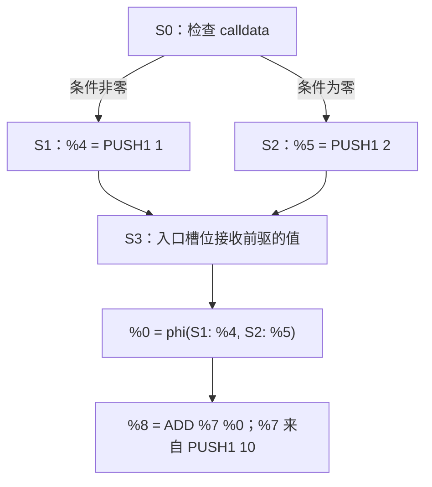

# 04：SSA——给流动的栈值起名字

前一课的 CFG 告诉我们“执行可能去哪里”。这一课再回答：“这条 ADD 使用的两个值，各自从哪里来？”

**SSA** 是 Static Single Assignment，即静态单赋值表示。它为每个产生值的定义位置分配唯一名字，让后续指令直接引用这个名字。本课先读实际输出，再解释分支和循环中的值如何连接。

以下命令都在仓库根目录执行，所有栈都按**栈底 → 栈顶**排列。

## 1. 先分清值、名字和栈位置

运行一个只有 PUSH、DUP 和 SWAP 的程序：

```bash
nix run . -- ssa --hex 60018060029000
```

输出是：

```text
stack SSA: fork=osaka values=2 status=Converged
S0 @ 0x0000 context=[]:
  0000: %0 = PUSH1 0x1
  0002: DUP1 %0
  0003: %1 = PUSH1 0x2
  0005: SWAP1 %1 %0
  0006: STOP
  stack out [%0, %1, %0]
```

逐条把 SSA 名字放到栈中：

| 执行完的指令 | 栈中的名字 | 对应的数值 | 发生了什么 |
| --- | --- | --- | --- |
| PUSH1 1 | `[%0]` | `[1]` | 产生一个值，命名为 `%0` |
| DUP1 | `[%0, %0]` | `[1,1]` | 两个槽位引用同一个值 |
| PUSH1 2 | `[%0, %0, %1]` | `[1,1,2]` | 产生另一个值，命名为 `%1` |
| SWAP1 | `[%0, %1, %0]` | `[1,2,1]` | 交换两个栈位置，名字仍指向原定义 |

所以，`values=2` 数的是两个**值定义**，不是最终三个栈槽位。

| 记号 | 回答的问题 | 容易误读的地方 |
| --- | --- | --- |
| `%0`、`%1` | 值由哪个定义产生？ | `%0` 不代表数值 0，也不代表栈底槽位 |
| `slot 0` | 当前状态入口栈的哪个位置？ | 槽位从栈底开始编号；位置会随栈操作改变 |
| `B3` | 哪个字节码基本块？ | B 是解码得到的静态块 |
| `S3` | 哪个可达分析状态？ | S 是块在某个栈高、上下文下的实例；一个 B 可以对应多个 S |

同样的数值也可以有不同名字。例如两个不同位置的 `PUSH1 1` 分别定义两个值。SSA 保留的是**来源身份**，不把“数值相等”自动视为“同一个定义”。

## 2. 分支汇合时，怎样给入口值命名

运行 diamond 示例：

```bash
nix run . -- cfg --file examples/diamond.hex
nix run . -- ssa --file examples/diamond.hex
```

关注汇合处 `pc=0x0e`。两条前驱分别把 1 和 2 留在栈上：



对应的真实输出片段是：

```text
S3 @ 0x000e context=[]:
  %0 = phi(S1: %4, S2: %5) ; slot 0, abstract {0x1, 0x2}
  000e: JUMPDEST
  000f: %7 = PUSH1 0xa
  0011: %8 = ADD %7 %0
  0012: STOP
  stack out [%8]
```

**φ（phi）** 为汇合块的入口值命名。它的输入带有前驱标签，含义是：

1. 如果这次执行从 S1 进入 S3，`%0` 接收 `%4` 的值，也就是 1。
2. 如果从 S2 进入，`%0` 接收 `%5` 的值，也就是 2。
3. ADD 使用这个选定的值和 10，这次具体执行得到 11 或 12。

φ 不把两个输入相加，也不在一次具体执行中同时取两个输入。多个入口 φ 在进入块时按同一条前驱边接收值，可视为并行赋值。

这里 `ADD %7 %0` 仍按 EVM 的弹栈顺序列参数：先弹出栈顶的 `%7`，再弹出 `%0`。对 ADD 顺序不影响结果，对 SUB、DIV 等就必须认真区分。

## 3. φ 和抽象集合各负责什么

上面的同一行同时出现了 `phi(...)` 和 `{0x1,0x2}`，但它们记录不同信息：

| 表示 | 内容 | 用途 |
| --- | --- | --- |
| `phi(S1: %4, S2: %5)` | 值来自哪条前驱边、哪个定义 | 连接数据依赖 |
| `abstract {0x1,0x2}` | 分析认为这个入口槽位可能取哪些数值 | 计算后续的抽象结果 |

集合的 **join（合并）** 把两条路径上的 `{1}` 和 `{2}` 合成 `{1,2}`。φ 则保留前驱与定义之间的对应关系。把 `--max-constants` 降到 1 后，入口集合会变成 Top，但 φ 的两条来源仍可保留；精度下降不会把数据流结构自动变成另一个结构。

SSA 名字本身也不是路径约束。看到 `%0` 被比较为 5，并不意味着当前分析已经在某条边上证明 `%0=5`；这取决于分析是否保存了比较与原值之间的关系。

## 4. 循环为什么不需要无限多个名字

运行：

```bash
nix run . -- ssa --file examples/loop.hex
```

循环的核心关系可以简写为：

```text
entry: %zero = PUSH 0
head:  %i = phi(entry: %zero, head: %next)
       %one = PUSH 1
       %next = ADD %one %i
       ... 决定是否跳回 head
```

第一次进入 head，`%i` 来自入口的 `%zero`；沿回边再次进入，`%i` 来自上一轮的 `%next`。代码中仍只有一个 `%i` 定义位置、一个 `%next` 定义位置，它们在运行时可以反复执行。

因此，“单赋值”说的是**静态表示里每个名字只有一个定义位置**，不是循环只计算一次，也不是同一名字在所有迭代中都对应同一个数值。

## 5. 本仓库如何构建和检查 SSA

[`ssa/build.rs`](../crates/evm-abstract/src/ssa/build.rs) 按三个步骤工作：


先分配名字，再连接输入，使回边能引用已有名字，不必展开循环。它也解释了 diamond 中为什么 `%0` 在最后显示的汇合块定义，而第一条 PUSH 是 `%1`：**编号保证唯一，不保证按 pc 排序**。

这个教学实现为所有入口槽位建立 φ，只有一个前驱的块也会显示 φ。这样每个块都能从自己的入口名字开始构建；表示合法，但没有做最小化。删除多余 φ 需要同步改写所有引用和出栈，不能只删掉输出中的一行。

[`ssa/verify.rs`](../crates/evm-abstract/src/ssa/verify.rs) 检查两个方面：

- **结构一致**：SSA 与分析的 S 身份、已访问 pc、入口和出口栈高一致；每个 φ 覆盖全部不同前驱，并接收该前驱真实出栈的对应槽位。
- **定义先于使用**：值 ID 连续、每个值只定义一次。普通指令使用的定义必须支配它；同块中还必须先定义后使用。

“A **支配** B”是说：从入口到 B 的每条路径都经过 A。φ 的输入使用发生在前驱边上，因此输入定义必须支配**对应前驱的出口**，不要求它支配整个汇合块。这正是两条分支各自定义的值能进入同一个 φ 的原因。

同一对状态有时同时存在 true、false 两条边。当前两条边携带同一份出栈，所以 φ 按前驱 S 去重。若未来每条边能携带不同的收窄信息，就需要把 φ 输入进一步关联到具体边。

## 6. 这份 SSA 的证据范围

本课的 `ssa` 命令展示单账户的**栈 SSA**：MSTORE、SSTORE、LOG、CALL 等有副作用的操作仍保留顺序和参数，即使没有返回值也不能随意删除。

世界入口 `analyze --world ... --ssa` 还构建包含状态效果、调用与返回转移的跨合约 SSA，见[第 09 课](09-cross-contract.md)。它需要完整的跨合约图；把几个独立栈 SSA 拼在一起，无法得到正确的调用与回滚语义。

SSA 验证通过，说明定义、使用和控制边满足这些结构规则。它没有证明 CFG 中每条路径都真实可执行，也没有给出整个 EVM 语义的形式证明。下一课会用同一个 helper 的两次调用，观察分析怎样通过“暂时不合并”改善精度。

继续：[第 05 课：敏感性](05-sensitivity.md)。
