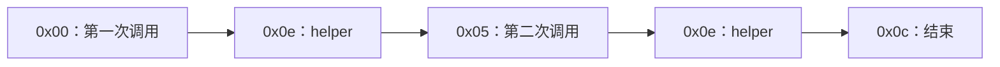

# 05：敏感性——哪些执行暂时不合并

前面已经看到：两条路径进入同一个状态时，分析会合并它们的可能值。合并能限制工作量，但也可能把原本互不相关的情况混到一起。

本课用同一段 helper 被调用两次的例子，观察“放在一起分析”和“分开分析”的实际差别。所有命令在仓库根目录执行，栈按**栈底 → 栈顶**排列。

前面的有限集合解释了一个槽位怎样合并数值；本课观察的是哪些输入会先被分到同一个状态。默认组合域可以保留位、范围和同余性质，但也需要决定状态如何分组。这是两个可以分别调整的精度维度。

## 1. 同一个块，为什么可能需要多个状态

在这个单账户视图中，分析状态的键是：

```text
StateKey = (基本块 B，入口栈高，最近 k 个跳转来源块的起始 pc)
```

键相同的输入可以合并；键不同就保存为不同的 S 状态。**敏感性**描述分析保留哪些区别、据此把执行分成哪些组。

例如，同一个 B3 的两次输入都是一个栈槽位，但分别来自不同调用点。如果 `k=0`，历史为空，它们可能合并；如果 `k=1`，最后一个跳转来源不同，就能暂时分开。

这里的“上下文”是分析用于分组的控制历史。它不是 Solidity 源码中的函数名，也不是完整的 EVM 调用栈。

## 2. 先手算两次内部调用

运行：

```bash
nix run . -- disasm --file examples/internal-calls.hex
```

示例使用一种简单的**内部调用约定**：把返回地址压栈，然后 JUMP 到共享代码。它没有执行 CALL opcode，没有进入另一个合约。

| 位置 | 做什么 |
| --- | --- |
| `0x00` | 压入返回地址 `0x05`，JUMP 到 helper `0x0e` |
| `0x05` | 丢弃第一次的结果；压入返回地址 `0x0c`，再次 JUMP 到 helper |
| `0x0c` | STOP |
| `0x0e` | helper：产生 42，把返回地址换到栈顶，JUMP 返回 |

helper 的栈变化是：

```text
入口                 [返回地址]
PUSH1 42             [返回地址, 42]
SWAP1                [42, 返回地址]
JUMP                 [42]             → 返回地址所指的块
```

真实执行的顺序只有：



第一次必须回到 `0x05`，第二次必须回到 `0x0c`。Solidity 的内部子程序也可能使用跳转约定，但这个小例子只用于展示问题；任意 bytecode 中的函数边界仍需额外恢复。

## 3. k=0：两次输入合并，出现额外路径

```bash
nix run . -- cfg --file examples/internal-calls.hex --context-depth 0
```

关注 helper 的状态：

```text
S1 | B3 @ 0x000e | stack height=1 | context=[]
  stack in  [{0x5, 0xc}]
  stack out [{0x2a}]
  -> S2 Jump
  -> S3 Jump
```

按以下顺序理解：

1. 第一次到 helper 时，入口是返回地址 `{0x5}`。
2. 第二次到达同一个键时，`{0xc}` 与旧输入合并，变成 `{0x5,0xc}`。
3. helper 的返回 JUMP 就保留到两个返回点的边。
4. 图因此允许“第二次调用也回到第一次的返回点”，形成实际执行没有的额外循环。

这种额外路径称为**伪路径**：抽象图允许这个组合，但它不对应本例的具体执行。此处真实路径仍被保留，代价是精度下降。

## 4. k=1：保留最后一个来源，把两次调用分开

```bash
nix run . -- cfg --file examples/internal-calls.hex --context-depth 1
nix run . -- ssa --file examples/internal-calls.hex --context-depth 1
```

helper 现在有两个状态：

```text
S1 | B3 @ 0x000e | stack height=1 | context=[0]
  stack in  [{0x5}]
  stack out [{0x2a}]
  -> S2 Jump

S3 | B3 @ 0x000e | stack height=1 | context=[5]
  stack in  [{0xc}]
  stack out [{0x2a}]
  -> S4 Jump
```

| 分析设置 | helper 状态 | 入口返回地址 | 返回去向 |
| --- | --- | --- | --- |
| k=0 | 一个 S，历史 `[]` | `{0x5,0xc}` | 两个返回点 |
| k=1 | 一个 S，历史 `[0]` | `{0x5}` | `0x05` |
| k=1 | 另一个 S，历史 `[5]` | `{0xc}` | `0x0c` |

**B3 没有变成两份字节码。**分析只是为同一个 B3 保存了两个 S；SSA 也会为两个 S 各自建立入口 φ 和定义。

`context` 中的数字用十进制显示，而 `@ 0x...` 用十六进制。比如返回点的 `context=[14]` 表示来源块从 `0x0e` 开始。历史记录的是 **JUMP/JUMPI 所在基本块的起始 pc**，不是跳转指令自身的 pc，也不是目的地址。

## 5. 历史如何更新，又如何失忆

遇到 JUMP 或 JUMPI 时，把来源块起始 pc 加到历史末尾，只保留最后 k 项。JUMPI 的 true、false 后继都携带更新后的历史；普通的相邻块流入 `Fallthrough` 不追加历史。

```text
已有历史 [0, 14] + 新来源块 21
       ↓
k=1：只留 [21]
k=2：只留 [14, 21]
```

因此 `--context-depth` 是**有界跳转历史**参数。它不识别哪条 JUMP 是调用、哪条是返回；普通分支也会占用历史容量。在本例中，它恰好能近似区分两个调用点，但不能据此宣称已经恢复完整的内部函数调用串。

如果 helper 内部经过更多分支，k=1 可能在返回前忘掉调用来源。提高 k 有机会保留得更久，但不能保证消除所有伪路径。状态数也可能增长很快。

保留全部历史会怎样？循环每经过一次跳转，就可能产生更长的新历史。于是即使每个槽位的数值域有限，状态键也可能无限增长。截断历史限制了这种增长；状态和工作预算则进一步限制一次实验的成本。

## 6. 四种“敏感性”不是同一个能力

| 维度 | 通俗问题 | 本仓库保留什么 |
| --- | --- | --- |
| 流敏感 | 先写入、后读取，与反过来是否不同？ | 指令按顺序执行，不同程序点保存各自输入 |
| 路径敏感 | 同一位置的不同分支，是否保留各自约束？ | 已知零/非零条件可剪枝；历史可分组，但没有完整路径约束域 |
| 上下文敏感 | 同一段代码从不同控制来源到达，是否分开？ | 单帧内保留最近 k 个跳转来源；世界入口另保存真实调用帧 |
| 栈高敏感 | 同一位置到达时栈长度不同，是否分开？ | 始终分开，不能把长度不同的向量逐槽合并 |

最后一项可以直接观察：

```bash
nix run . -- cfg --file examples/stack-heights.hex --context-depth 0
```

在 `pc=0x0c`，一个状态 `stack in [{0x7}]`、`stack height=1`；另一个状态 `stack in []`、`stack height=0`。两个都属于 B3，却不能强行合为一个栈。这种区分不仅影响精度，也保证栈槽位和 SSA 入口的含义成立。

有限集合把不同数值放在一个槽位摘要里，并不保存完整路径或多个槽位之间的配对关系。默认组合域增加了一些局部能力：例如位信息可以证明条件非零，同一基本块内 `DUP1` 复制的受信任身份可以证明 `x XOR x = 0`。它没有因此获得完整路径约束或跨块关系环境。

假设分支比较 `x==5`，当前分析可以依据比较结果决定是否保留边，但不会自动沿 true 边把原变量 x 收窄为 5。为此还需要保存“比较结果对应哪个原值”的关系，以及沿边应用假设的能力。复制身份也会在基本块、汇合、调用或摘要边界失效；两个值都有 Calldata 来源，不代表它们相等。可运行的对照见[第 12 课](12-product-domains-facts.md)。

## 7. 实验时分别调整精度与预算

| 参数 | 当前默认值和可用范围 | 改变什么 |
| --- | --- | --- |
| `--domain` | 默认 `product`；也可选 `constants-only` | 组合域，或只保留有限常量集合的对照 |
| `--max-constants` | 默认 8，范围 1..=64 | 每个值的常量集合组件能保留多少个候选；超过容量后不能完整枚举 |
| `--context-depth` | 默认 8，非负整数，无额外上限（须能表示为 `usize`） | 保留多少个最近跳转来源，用于状态分组 |
| `--reduction-rounds` | 默认 4，正整数 | 一次临时事实交换最多完成多少轮 |
| `--max-facts` | 默认 256，正整数 | 一次临时交换能容纳多少个语义事实原子 |
| `--max-states` | 默认 4096，正整数 | 最多建立多少个分析状态 |
| `--max-transfers` | 默认 100000，正整数 | 最多执行多少次基本块传播，重新执行也计数 |

`--context-depth 0` 关闭跳转历史分组。默认保留 8 项，也可以显式指定更大深度，例如：

```bash
nix run . -- cfg --file examples/internal-calls.hex
nix run . -- cfg --file examples/internal-calls.hex --context-depth 10
```

增大 k 可能区分更多状态，也可能增加内存与分析工作；它不是“分析必然更精确或更快”的保证。历史按实际经过的跳转增长，不按 k 预先分配；实际保留的历史项也参与累计工作计费，包括机器状态的复制、比较和摘要输入认证。

这里要区分三类设置。域、常量容量和历史深度决定能表示哪些区别；交换轮数和事实容量限制局部精化，达到上限时保留已证明的安全摘要，可以仍为 `Converged`；状态数、transfer 次数和累计工作量限制分析能执行多少工作，耗尽后留下 `Incomplete` 前沿。常量集合不能枚举时，`product` 还可能保留其他数值约束，不能一律把整个值当作 Top。

单账户学习入口也使用默认 2000 万的累计工作预算。`analyze` 可用 `--max-work` 显式调整它，并另设外部调用深度和内存预算，见下一课。交换参数不会按配置上限预分配事实表，但提高上限仍可能增加实际工作。精度与费用如何分别记录，见[第 12 课](12-product-domains-facts.md)。

外部 CALL 的处理也不能用 k 代替。世界入口保存整条真实调用帧栈，包括每帧的代码账户、状态账户、caller、value、static 标志和继续位置。k 只控制各帧**内部**的跳转历史；`--max-call-depth` 控制外部帧深度，达到分析边界时留下 `Incomplete`。两者的详细关系见[第 09 课](09-cross-contract.md)。

比较两次实验时，先定位同一个 pc，再看入口集合、history 和实际后继；仅比较总状态数，无法判断精度是否改善。

继续：[第 06 课：结果的边界](06-boundaries.md)。
