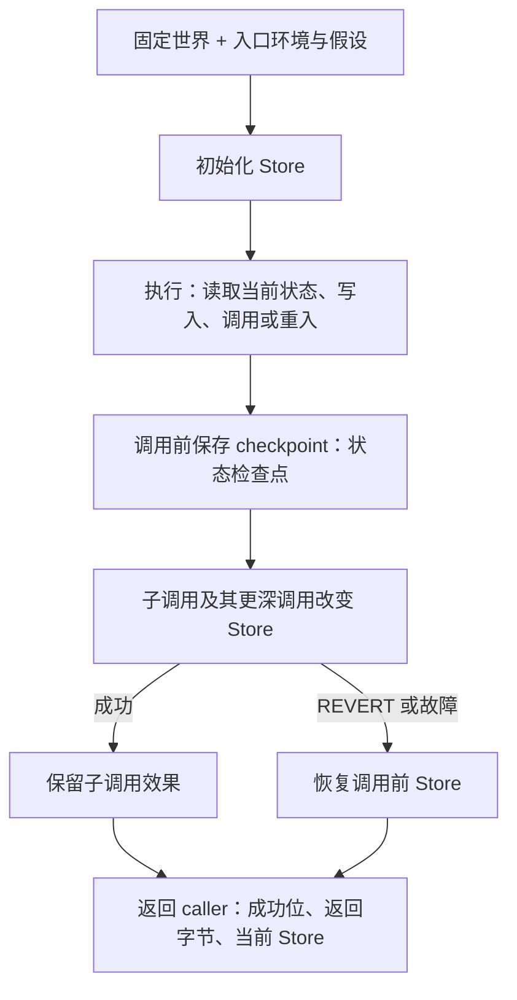

# 06：结果能说明什么，不能说明什么

学会读 CFG 和 SSA 后，还要确认一件事：这份结果已经分析到哪里、用了哪些假设？图中出现一条边，与实际交易能走通这条路径，是两个不同判断。

本课先区分三个常见信号，再解释固定世界、执行状态和测试证据的范围。命令都在仓库根目录执行。

## 1. 先读完成状态，再读图

| 信号 | 它说了什么 | 读结果时该怎样处理 |
| --- | --- | --- |
| `Converged` | 当前抽象模型中的传播已经完成，没有未展开前沿 | 可以检查这份模型的完整结果；仍须阅读假设和精度诊断 |
| 数值 Top / `⊤` | 某个值在数值上用“所有 U256 值都有可能”表示 | 该值不够精确；分析仍可能完成；来源说明可以另有信息 |
| `Incomplete` | 有区域因资源、缺少事实或模型边界而未展开 | 已有图只是部分结果，不能从缺少节点推出不可达 |

这三个信号不互相替代。默认 `product` 还需区分**常量集合组件为 Top**与**整个数值为 Top**：候选太多不能列完时，位、范围或同余组件可能仍有约束。下面先用 `constants-only` 重现有限集合实验，再观察组合域的局部精度上限。

### 实验 A：精度下降，但分析完成

```bash
nix run . -- cfg --file examples/diamond.hex --domain constants-only --context-depth 0 --max-constants 1
```

输出是 `status=Converged`。汇合点 `pc=0x0e` 的栈为：

```text
  stack in  [⊤]
  stack out [⊤]
```

原因是容量 1 放不下 `{1,2}`。分析扩大了可能值范围，并把扩大后的信息继续传播到结束。这里整个值都没有数值约束；组合域中仅 `bits=` 显示全 `*` 时，还必须检查区间和同余，不能据此认定整个值为 Top。

### 实验 B：预算用尽，传播尚未完成

```bash
nix run . -- cfg --file examples/loop.hex --context-depth 0 --max-transfers 1
```

输出包含：

```text
status=Incomplete ... transfers=1 ...
frontier Transfers: from=None target=StateKey { basic_block_index: 1, stack_height: 1, context: [] }
```

**frontier（前沿）**记录分析停在什么位置、为什么不能继续。这里入口块执行了一次，循环头仍有待处理输入。其暂时显示的 `stack out []` 不是“循环头必然清空栈”的结论；它尚未执行完传播。

CLI 对 `Incomplete` 返回退出码 2，构建 SSA 会拒绝未完成图。这个退出码表示分析未完成，与 EVM 中 REVERT 或异常终止的含义不同。

### 实验 C：局部交换停下，整体传播仍然完成

下面的代码计算未知 calldata word 与零的乘积。分别缩小事实容量和交换轮数：

```bash
nix run . -- cfg --hex 5f355f0200 --max-facts 1
nix run . -- cfg --hex 5f355f0200 --reduction-rounds 1
```

两次都为 `Converged`，乘积为零；纯栈运算的诊断分别包含 `FactExchangeLimited(FactLimit)` 和 `FactExchangeLimited(RoundLimit)`。这是单次事实交换没有声称完成全部规约，已有安全结果仍被继续传播。它没有留下未分析区域，也不是 EVM 执行失败。

再限制世界分析的根工作预算：

```bash
nix run . -- analyze --world examples/worlds/call-return-branch.json --entry 0x0000000000000000000000000000000000000101 --max-work 1
```

这次为 `Incomplete`，退出码 2，留下 `Work` 前沿。工作计费包含域运算、事实交换、状态复制以及子调用和摘要处理，所有帧共享同一账本。提高 `--max-facts` 不能补回已耗尽的工作预算。这个离线输入缺少的事实仍由 world 提供；显式 RPC 输入可按需补查具体 callee，但也受采集与累计执行预算限制。

## 2. 诊断、程序失败和分析前沿分别看

| 输出内容 | 例子 | 意义 |
| --- | --- | --- |
| 精度诊断 | `UnknownJump`、`OpaqueResult`、`FactExchangeLimited` | 跳转、数据或局部事实交换精度受限；不一定导致未完成 |
| 程序异常诊断 | `InvalidJump`、`InvalidOpcode`、栈下溢/溢出 | 某条模型内执行路径异常终止；不是分析器没算完 |
| 分析前沿 | `MissingCode`、`RpcAcquisition`、`UnknownTarget`、`Work`、`CallDepth`、`Memory`、`Creation` 等 | 尚有区域无法展开；整体结果为 `Incomplete` |

例如，Top 跳转可以枚举所有真正的 JUMPDEST，同时保留可能异常终止的情况，因此有 `UnknownJump` 的图仍可 `Converged`。但是不知道外部 CALL 要去哪些账户，无法枚举整个世界，就会留下 `UnknownTarget` 前沿。

再运行缺少 callee 代码的世界：

```bash
nix run . -- analyze --world examples/worlds/missing-code.json --entry 0x0000000000000000000000000000000000000101
```

结果为 `Incomplete`，前沿说明 `pc=13` 的调用缺少账户 `0x...0200` 的代码事实。输出可能同时保留已知的调用失败分支和部分完成的 outcome（最外层可能结果）；它们不能替代缺失的调用分支。

`--world` 始终按离线事实分析。显式 `--rpc` 则默认补查这种已确定地址的 callee，再从入口重新分析。目标本身无法确定时仍保留 `UnknownTarget`；代码查询失败时保留带错误来源的 `RpcAcquisition`。这三种前沿分别表示离线事实缺失、目标无法穷举、已知账户的采集未完成，不能统称为调用失败。RPC 的初始采集错误退出 `1`；分析已开始后的补查错误保留 `Incomplete` 结果并退出 `2`。

**已知空代码**可以作为无代码执行完成；**没有提供代码事实**则需要留下前沿。把缺少事实猜成空代码，会错误删掉可能的副作用。

## 3. 三种结论需要三种证据

| 想说的结论 | 需要什么证据 | 本仓库提供到哪一步 |
| --- | --- | --- |
| “本次分析完成了” | 所有工作表输入已传播，无未展开前沿 | `Converged`，限定在当前模型和输入假设内 |
| “这个具体执行样本被覆盖” | 独立执行实际走过的指令、边和效果都能对应到抽象结果 | revm 轨迹对照测试 |
| “真实合约不会出现某种行为” | 明确性质、实际状态范围及完整规则上的证明 | 本仓库没有给出这种普遍性证明 |

**oracle（对照执行器）**在这里指独立的具体 EVM 实现 revm。它按固定输入运行一条具体轨迹；抽象实现则计算可能情况的集合。测试要求具体轨迹落在抽象结果所覆盖的范围内。

这能发现“真实执行被漏掉”的反例，但通过有限样本不能证明所有 calldata、所有 256 bit 参数或全部合约都正确。反过来，抽象图中的一条路径也可能来自信息合并，没有任何实际输入能完整走通它。

尤其要保留 **gas 边界**：本模型不精确计算 gas、EIP-150 转发额度、out-of-gas 或经济成本。一个抽象成功调用不证明某笔实际交易有足够 gas；图中也可能保留具体成功样本没有走过的调用失败分支。累计工作使用逻辑 credit 计费，它既不是 EVM gas，也不是 CPU 耗时测量。

## 4. 固定世界是起点，执行状态还会变化

**世界快照**是本次分析的初始事实，例如某账户的代码、初始 storage、余额和 nonce。RPC 模式从提供者读取 chain ID，把所选区块号或启动时的一次 `latest` 解析为固定 block hash，也可直接指定 hash；后续账户观察均使用这个身份。观察完全信任提供者，未请求的 slot 保持未知；空代码、零余额和零 nonce 不证明账户不存在。每轮分析使用一组固定事实。**Store** 是执行期间会变化的事务状态，保存后续的 storage、transient storage、余额、nonce、代码与账户生命周期。



固定世界本身不会被执行改写。结果保留它的 fork、身份、事实 fingerprint（指纹）与 provenance（来源说明），并另外保存执行后的 Store。检查点恢复的是整份事务状态，所以子调用的更深调用效果也一起回滚；caller 在这个调用之前的效果仍保留。

RPC 补查成功后，分析器用扩充后的初始事实从入口重建 Store、调用检查点、图和摘要。这样 A 在 CALL 前写入的值会由指令重新产生，子调用和重入仍读取当轮 Store。已获取的区块事实保存在采集缓存中，祖先 REVERT 只撤销事务效果；后续调用同一账户可以继续使用这些事实。CREATE 已安装的 runtime 则属于当前代码覆盖层，后续 CALL 直接执行它。

用 slot 0 的读取理解这一区分：

```text
快照：slot 0 = 4
SLOAD 0           → 4
SSTORE 0, 7       → 当前 Store 的 slot 0 = 7
再次 SLOAD 0      → 7
```

每次读取都替换成快照里的 4，会漏掉后续写入，也会错误处理 DELEGATECALL 或重入看到的当前状态。

- **强更新**：确定只写一个具体 slot 时，用新值覆盖该 slot 的旧摘要。
- **弱更新**：写入可能命中多个 slot，或目标未知时，保留旧值与新值的可能性，避免删掉未被写中的情况。

世界 JSON 的 `storage_unknown` 默认是 true：未列出的初始 slot 保持未知。只有显式设为 false，才把未列出的 slot 视为零。完整的合成示例与只采集少量 slot 的真实快照有不同假设，不能混用。

入口 `value` 指定这一帧的 CALLVALUE。输入余额和 nonce 已是帧开始时的状态；模型不会另外执行外层交易转账、手续费、发送方交易 nonce 增加或授权列表。CREATE 引起的合约 nonce 变化则属于本次执行的 Store。

## 5. 当前模型的能力与边界

这一节是查阅表。初学时先记住上面的完成状态、前沿和可变 Store；涉及具体功能时再定位对应行。跨合约操作过程见[第 09 课](09-cross-contract.md)，快照、摘要和创建过程见[第 10 课](10-snapshots-summaries-creation.md)，数值组件与事实交换见[第 12 课](12-product-domains-facts.md)。

### 输入与单帧数据

| 部分 | 已建模的内容 | 阅读结果时保留的限制 |
| --- | --- | --- |
| 输入事实 | 多账户 JSON，或自动读取 chain ID 并固定区块 hash 的 RPC 采集；默认按需增加具体 callee 事实并从入口重跑，保存身份、来源与指纹 | 离线输入不联网；未知目标、未选 slot 和无法判定的账户存在性保持未知；完全信任 RPC 提供者，不请求证明；固定后不回退到移动标签；不支持 EOF 代码格式 |
| 栈和纯运算 | 栈高上限 1024，U256 算术、补码、布尔与位运算；默认组合有限常量、KnownBits、Interval、Congruence 和 Provenance；按 fork 启用 CLZ | 常量集合仍有容量；事实交换有局部上限；没有完整变量关系和路径约束 |
| 局部关系 | 同一基本块内受信任的复制身份支持 `x XOR x=0` 等规则；数值约束参与零/非零判断 | 来源标签或摘要相同不证明相等；身份不会跨块、汇合、调用或摘要边界保存；不会自动沿 `x==5` 的 true 边收窄 x |
| 内存与数据 | 每帧独立抽象字节数组，load/store/copy、calldata、returndata、返回区传播 | 未知偏移或字节会降低精度；无法追踪的范围留下内存前沿 |
| JUMP/JUMPI | 有限目标逐个验证；Top 覆盖真实 JUMPDEST；依据条件可能零/非零保留边 | 可能有伪边；有界跳转历史不等于内部函数恢复 |
| 环境、hash、gas | 传播已知帧环境和代码信息；其余保守抽象 | gas、EIP-150、out-of-gas 与成本不精确；`Converged` 仍受此限制 |

### 跨账户执行与状态效果

| 部分 | 已建模的内容 | 阅读结果时保留的限制 |
| --- | --- | --- |
| 调用身份 | 每帧分别保存代码账户、状态账户、caller、value、static 和继续位置 | 共享代码不意味着共享 storage；CALLCODE/DELEGATECALL 各有环境规则 |
| CALL 系列 | 读取当前代码状态，暂停 caller，传递 calldata，再返回成功位和数据；RPC 可补查具体目标的初始代码事实 | 非有限目标、离线未知代码或补查失败留下各自前沿；不猜测 callee 没有副作用 |
| storage/transient | 按状态账户保存，写入使用强/弱更新；后续读取考虑写入和重入 | transient storage 只属于本次事务分析；未知余额不能当作零 |
| 余额 | 初始抽象余额、CALL 值转移及不足余额时的失败分支 | 不扣除交易 gas 费用 |
| REVERT/故障 | 恢复调用前 Store；REVERT 保留返回数据，故障返回空数据 | 失败分支不能当成成功但无副作用的调用 |
| static | 子调用继承限制；禁止状态写入、日志及有值 CALL 等行为 | 违规路径异常终止，返回流程须按失败处理 |
| LOG | 保存可能日志的账户、topics 和数据，并随 Store 回滚 | 不精确恢复顺序与次数；未知效果由 `logs_unknown` 标记 |
| EIP-7702 | 解析已观察的委托标记，RPC 可补查对应代码账户，同时保持委托账户的状态身份 | 不执行授权交易列表、授权签名或其 nonce 规则；解析只跟随一层；预编译目标按协议规则处理 |

### 创建、原生执行与资源

| 部分 | 已建模的内容 | 阅读结果时保留的限制 |
| --- | --- | --- |
| CREATE/CREATE2 | 有限 nonce、endowment、salt，可表示 initcode 与明确碰撞事实；执行 initcode 后验证、安装 runtime | 不知道 nonce、碰撞状态、代码或 salt 时保留有类型的 `Creation` 前沿；失败及祖先 REVERT 恢复检查点 |
| SELFDESTRUCT | 支持的 fork 均使用 EIP-6780：转移余额，同事务创建账户在最外层成功完成时删除 | 事务执行期间代码仍可读/调用；原有账户保留代码/storage；未知受益人保留边界 |
| 预编译 | 按 fork 选择固定的 `revm-precompile` 原生实现；传播有限具体输入的返回/失败；预留工作量 | 输入或长度不能表示时为 `PrecompileInput`，资源不足为 `Work`；不声称精确 gas |
| 完整调用摘要 | 只复用前置条件完全匹配、已完成的 callee 图与全部输出关系 | 固定世界、代码 hash、完整帧/Store、ORIGIN、完整域策略（DomainSpec）和深度策略等都需一致；状态、代码、生命周期或 profile、交换上限变化都会影响匹配；未完成关系不发布 |
| 工作与资源预算 | 所有账户及 RPC 重跑轮次共用状态分配数、transfer 次数与累计工作量；另有限采集账户/请求数、帧深度和内存预算 | 重跑保留已耗费用，最终图状态数可小于累计分配数；超限留下有类型前沿，`Incomplete`、退出 2；跨合约 SSA 拒绝未完成图；与局部交换精度上限分别判断 |

组合域改善了某些值的表示，不会单独解决内存或 storage 的未知别名。强/弱更新仍要根据是否能确定写入目标来选择；“两个值来源于 Storage”也不能作为它们读写同一 slot 的证明。循环中的区间还会使用 widening（扩大不断移动的界限）来控制传播成本，所以完成固定点也不表示区间达到最精确结果。

## 6. 测试分别核对了什么

测试证据从小到大分为以下几层：

| 层次 | 检查内容 | 可查源码 |
| --- | --- | --- |
| 数值域与事实策略 | join 的交换、结合、幂等和覆盖；纯运算的边界与随机 U256 输入对照；组合规则、交换上限、复制身份与策略序列化 | [`domain.rs`](../crates/evm-abstract/tests/domain.rs)、[`concrete.rs`](../crates/evm-abstract/tests/concrete.rs)、[`product_domains.rs`](../crates/evm-abstract/tests/product_domains.rs)、[`domain_policy.rs`](../crates/evm-abstract/tests/domain_policy.rs) |
| 单账户图和栈 SSA | 解码、跳转、栈故障、φ、支配和使用；实际轨迹的块入口、边、出栈与 SSA 值 | [`pipeline.rs`](../crates/evm-abstract/tests/pipeline.rs)、[`concrete.rs`](../crates/evm-abstract/tests/concrete.rs) |
| 跨合约轨迹与效果 | 三个 fork 的调用返回、共享实现、CALLCODE、copy、回滚、static、日志、重入；实际访问入口与子帧 | [`cross_concrete.rs`](../crates/evm-abstract/tests/cross_concrete.rs) |
| 摘要与创建 | 摘要开/关的联合结果、图与 SSA；initcode/runtime、nonce、碰撞、回滚、代码限制、EIP-6780 | [`summaries.rs`](../crates/evm-abstract/tests/summaries.rs)、[`creation.rs`](../crates/evm-abstract/tests/creation.rs) |
| 原生调用与事实采集 | 各 fork 预编译返回/失败、输入/工作前沿；localhost HTTP 的首次区块解析、固定 selector、缺失结果、超时与无 moving-tag 回退 | [`precompiles.rs`](../crates/evm-abstract/tests/precompiles.rs)、[`rpc/tests.rs`](../crates/evm-abstract/src/world/rpc/tests.rs) |
| IR 和实际 CLI | 跨合约 SSA 与完整机器图一致，损坏的转移/效果流被拒绝；JSON/文本/DOT、错误/退出码、安装二进制样例 | [`world/verify.rs`](../crates/evm-abstract/src/ssa/world/verify.rs)、[`cli.rs`](../crates/evm-abstract-cli/tests/cli.rs)、[`flake.nix`](../flake.nix) |

跨合约对照不只是“某个 slot 的结果集合含有答案”：它要求**同一个抽象 outcome**同时覆盖该具体执行的返回数据、storage、合约余额与日志。这能防止把来自互不相容路径的独立片段拼成一个假结果。

后续扩大关系环境、路径约束、内部函数恢复、精确 gas、经过密码学验证的状态或跨交易性质时，也应明确新增假设、具体改善的例子，以及独立轨迹是否仍被覆盖。

基础阅读到这里结束。接着可以做[第 07 课的实验](07-exercises.md)，用[第 08 课](08-forks.md)检查协议选择。继续研究数值精度可进入[第 12 课](12-product-domains-facts.md)；世界执行则从第 09、10 课开始。
