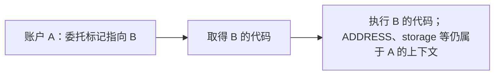

# 08：fork——选择执行规则，再分析字节码

**fork** 在本课中指一套协议版本的执行规则。字节码只是字节序列；还要选定规则，才能判断某个字节是不是有效指令、怎样执行，以及使用哪些预编译。

本仓库支持 `cancun`、`prague`、`osaka`，项目默认配置是 `osaka`。这个默认值写在代码中，不会自动追随网络升级。分析真实历史状态时，应选择该链、该区块实际使用的规则；“使用默认值”不等于已核对快照对应的版本。

## 1. 协议规则与分析精度是两种输入

| 改变的参数 | 改变什么 | 例子 |
| --- | --- | --- |
| `--fork` | 被分析程序的执行语义 | 同一个 `0x1e` 在 Osaka 是 CLZ，在两个旧 fork 中无效 |
| `--max-constants` | 分析保留多少个可能数值 | `{1,2}` 能保留，还是扩大为 Top |
| `--context-depth` | 哪些执行暂时分开分析 | 同一 helper 的两个调用来源是否合并 |

改变精度参数时，我们仍在近似同一套规则。改变 fork 时，实际合法行为可能就不同了。

Ethereum 网络升级可能同时修改执行层和共识层。升级总规范中的名称对应如下；本文使用执行层名字标记 EVM 分析规则：

| 网络升级总规范 | 执行层 | 共识层 |
| --- | --- | --- |
| [Dencun](https://eips.ethereum.org/EIPS/eip-7569) | Cancun | Deneb |
| [Pectra](https://eips.ethereum.org/EIPS/eip-7600) | Prague | Electra |
| [Fusaka](https://eips.ethereum.org/EIPS/eip-7607) | Osaka | Fulu |

## 2. 手算 CLZ 怎样算出跳转地址

**CLZ** 是 count leading zeros，计算一个 256 bit 值从最高位起有多少个连续零位。[EIP-7939](https://eips.ethereum.org/EIPS/eip-7939) 规定 opcode 为 `0x1e`，弹出一个值、压入一个结果。

| 输入 | 二进制特征 | CLZ 结果 |
| --- | --- | --- |
| `1` | 只有最低位置位，前面有 255 个零 | 255 |
| `2^255` | 最高位已经置位 | 0 |
| `0` | 全部 256 位都是零 | 256 |

示例 [`osaka-clz.hex`](../examples/osaka-clz.hex) 使用 CLZ 算出一个合法 JUMPDEST：

```text
60011e60f79003565b602a00
```

按栈底 → 栈顶手算：

| pc | 指令 | 执行后栈 | 原因 |
| --- | --- | --- | --- |
| `0x00` | PUSH1 1 | `[1]` | 压入输入 |
| `0x02` | CLZ | `[255]` | CLZ(1)=255 |
| `0x03` | PUSH1 247 | `[255,247]` | 准备减数 |
| `0x05` | SWAP1 | `[247,255]` | 把 255 放在栈顶 |
| `0x06` | SUB | `[8]` | 先弹出 255，再弹出 247，计算 255−247 |
| `0x07` | JUMP | `[]` | 弹出目标 8，跳到 `0x08` |
| `0x08` | JUMPDEST | `[]` | 合法目标 |
| `0x09` | PUSH1 42 | `[42]` | 产生结果 |
| `0x0b` | STOP | `[42]` | 结束 |

在仓库根目录运行：

```bash
nix run . -- explain --file examples/osaka-clz.hex --fork osaka
nix run . -- explain --file examples/osaka-clz.hex --fork cancun
nix run . -- explain --file examples/osaka-clz.hex --fork prague
```

核对以下差别：

| 规则 | `pc=0x02` 的行为 | 图中的结果 |
| --- | --- | --- |
| Osaka | 正常执行 CLZ | 一条 Jump 边到 `0x08`，目标块出栈 `{0x2a}` |
| Cancun / Prague | `InvalidOpcode`，该路径异常终止 | 没有后续边，SSA 标记 `exceptional halt` |

旧 fork 的结果也可以 `Converged`：分析已经把无效指令导致的终止算完。这再次说明“分析完成”不等于“程序成功执行”。

## 3. 输入未知时，CLZ 仍要保守表示

输入是有限集合时，分析逐个计算，再合并。例如 `{0,1}` 的结果是 `{256,255}`。

输入是 Top 时，CLZ 的数学结果范围是 `0..=256`，共 257 个值。当前 CLI 的集合容量最多 64，所以这个范围无法完整放入有限集合，结果仍表示为 Top。不能只保留前 64 个结果，把其他合法结果删掉。

实现复用 U256 的 `leading_zeros()`。启用规则见 [`fork.rs`](../crates/evm-abstract/src/fork.rs)，解码见 [`bytecode.rs`](../crates/evm-abstract/src/bytecode.rs)，抽象数值计算见 [`domain.rs`](../crates/evm-abstract/src/domain.rs)。SSA 使用指令的输入/输出元数据连接定义，不需要另写一份 CLZ 数值语义。

## 4. EIP-7702：账户的 code 可能是委托标记

EOA 是由外部密钥控制的账户。Prague 的 [EIP-7702](https://eips.ethereum.org/EIPS/eip-7702) 允许其账户代码保存一个 23 字节的**委托标记**：

```text
ef 01 00 || 20 字节目标地址
```

这里 `||` 表示字节拼接。这段数据表示“从目标账户取得代码，在委托账户的执行上下文中运行”，不是把 `ef`、`01`、`00` 当作三条普通指令执行。



本仓库的两个入口据此采取不同处理：

| 输入方式 | 行为 |
| --- | --- |
| 单段字节码命令，如 `cfg --hex ...` | 识别标记，返回带目标地址的 `DelegatedCode` 错误；单段字节无法提供目标世界事实 |
| 多账户世界 `analyze --world ...` | 保存为 `Code::Delegation`，从同一固定世界取目标代码，分别保留代码身份和状态身份 |

可以观察单段入口的拒绝：

```bash
nix run . -- cfg --hex ef01001111111111111111111111111111111111111111 --fork osaka
```

这会报告目标地址 `0x1111...1111`，不是生成一个误导性的普通 CFG。畸形长度或版本会保留具体解析错误；Cancun 尚未启用这种委托格式，会把开头的 `0xef` 作为无效指令处理。

委托解析只跟随一层。如果 B 的代码又是委托标记，不会继续递归解析链或循环；若目标是预编译地址，委托执行视为取得空代码。离线分析或关闭 RPC 发现时，目标代码缺失会留下 `MissingCode`；显式 `--rpc` 默认可以在固定区块补查这一层的实现账户，但不会因此多跟随一层委托。采集步骤与边界见[第 10 课](10-snapshots-summaries-creation.md#可选实验从固定区块采集)。

这一能力从已有快照解析代码，并不执行设置委托的授权交易列表、签名检查或授权 nonce 规则；这些交易级操作仍属于模型边界。

## 5. 怎样确认选择贯穿了整个分析

单段 CLI 把 `--fork` 传给 Program 的解析，Program 与 Instruction 保存同一不可修改的选择。解码、切块、抽象执行和 SSA 共用它。世界 JSON 则在 `fork` 字段固定规则，并拒绝与之冲突的账户 runtime。

结果也保留选择：单段 JSON 是 `program.fork`，世界 JSON 是 `world.fork`；文本和 DOT 显示 `fork=`。先核对这些字段，再看版本差异导致的实际指令与边，不能只凭图形相似判断配置是否生效。

[`osaka.rs`](../crates/evm-abstract/tests/osaka.rs) 检查 CLZ 的启用/禁用、CFG 与 SSA、委托格式以及尚未支持规则的拒绝；[`concrete.rs`](../crates/evm-abstract/tests/concrete.rs) 使用相同 fork 的 revm 对照，另核对 CLZ 的零和全部 256 个单置位输入。

“支持 Osaka”表示已实现模型按 Osaka 选择字节码与预编译规则，并不表示实现了完整协议的每个细节。内存、storage、调用、有限创建和 EIP-6780 已进入模型；精确 gas、无法表示的原生输入、完整授权交易处理等限制仍见[第 06 课](06-boundaries.md)。规则选择与模型能力必须同时阅读。

进阶继续：[第 09 课：跨合约调用](09-cross-contract.md)，再读[第 10 课：快照、摘要和创建](10-snapshots-summaries-creation.md)。
