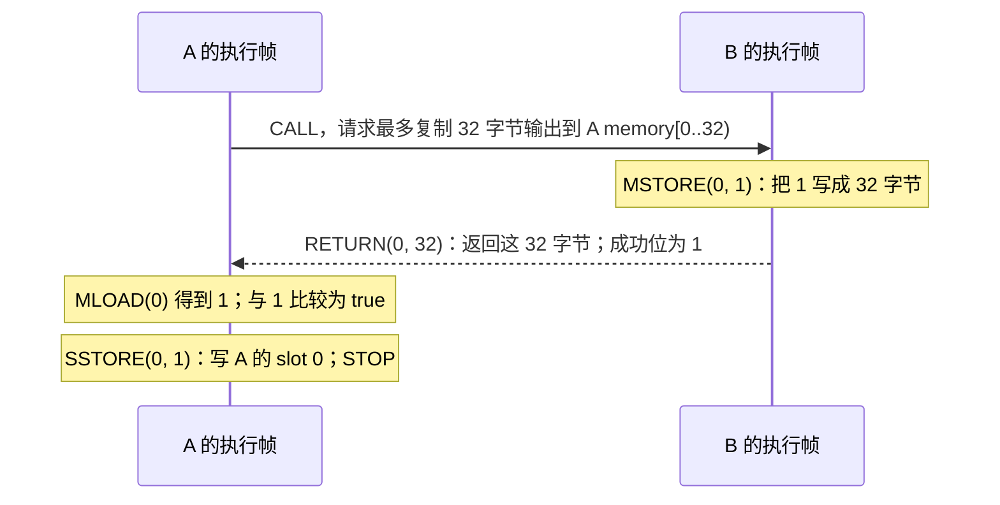

# 09：跟着一次调用，跨过合约边界

前几课分析一段字节码。本课把问题扩大一点：A 调用 B，B 返回的数值会不会改变 A 的分支？这要求分析器同时保存两个合约的执行位置、返回字节和 storage。

先手算一条成功路径，再读包含其他可能性的抽象结果。本课命令将入口 caller 固定为 `0x...1000`、value 固定为零、calldata 固定为空；origin 省略，因此与入口 caller 相同。未指定的交易和区块字段仍为符号输入。省略 caller、value、calldata 时，分析覆盖更广的输入范围，规则见[第 13 课](13-evm-environment.md)。所有命令都在仓库根目录执行；示例是离线合成状态，不需要节点或资金。阅读前应了解 [栈](01-bytecode.md)、[值集合](02-domain.md) 和 [CFG](03-cfg.md)。

## 1. 第一个实验：B 返回 1，A 写入 1

[`call-return-branch.json`](../examples/worlds/call-return-branch.json) 提供两个账户。下文用短名字，命令和 JSON 保留完整地址：

| 名字 | 地址末尾 | 代码做什么 |
| --- | --- | --- |
| A | `0101` | 调用 B；读输出；相等时写 slot 0=1，否则写 2 |
| B | `0200` | 把数值 1 编码为 32 字节并返回 |

**第一步，生成结果。** `explain --world` 接收一组账户事实，`--evm.to` 选择从哪个账户开始。默认教学视图依次显示捕获代码的反汇编、简明 CFG 与栈、分开的入口结果，以及完成图的 TAC/SSA：

```bash
nix run . -- explain \
  --world examples/worlds/call-return-branch.json \
  --evm.to 0x0000000000000000000000000000000000000101 \
  --evm.caller 0x0000000000000000000000000000000000001000 \
  --evm.value 0 --evm.calldata 0x
```

需要用 `jq` 查询字段时，另用 `analyze --format json` 导出同一分析：

```bash
nix run . -- analyze \
  --world examples/worlds/call-return-branch.json \
  --evm.to 0x0000000000000000000000000000000000000101 \
  --evm.caller 0x0000000000000000000000000000000000001000 \
  --evm.value 0 --evm.calldata 0x \
  --format json > /tmp/call-return.json
```

**第二步，先手算一次成功调用。** `memory` 是每次执行独有的临时字节区；`storage` 是按账户、slot 保存的状态。一个 slot 保存一个 256 位字。A、B 的 memory 相互独立，不能直接互读。



`[0..32)` 表示偏移 0 到 31，共 32 字节。数值 1 的编码是前 31 字节为零、最后一字节为 `01`。`RETURN` 从 B 的 memory 取字节，CALL 再把它们复制到 A 请求的输出区。字节次序、MSTORE/MLOAD 与内存扩容的逐步手算见[第 14 课](14-memory-model.md)。

CALL 同时给 A 两种结果：压栈的**成功位**，以及复制到 memory 的**返回字节**。它们不是同一个数。这个例子用 `POP` 丢弃成功位，再用 `MLOAD` 读返回的数值。如果想核对 CALL 的参数，其执行前的栈按**栈底 → 栈顶**排列为：

```text
[输出长度=32, 输出偏移=0, 输入长度=0, 输入偏移=0,
 value=0, 目标=B, gas=500000]
```

CALL 从栈顶开始取参数。这里输入为空，转账金额为零。

**第三步，把这条执行对应到图。**

```bash
jq '.status, .edges,
    [.states[] | {state: .id, depth: (.key.frames | length),
                  code_address: .key.frames[-1].code_address}],
    [.outcomes[] | {kind, slots: .store.persistent.slots}]' \
  /tmp/call-return.json
```

先在 `states` 中找到 code=A、深度 1 的入口，以及 code=B、深度 2 的子调用。成功路径按下面三个转移阅读：

| 边 | 输出中的 `kind` | 含义 |
| --- | --- | --- |
| A 入口 → B 入口 | `"Call"` | 暂停 A，进入 B |
| B → A 的继续位置 | `"Return"` | B 成功返回，恢复 A |
| A 的条件块 → 真分支 | `{"Intraprocedural":"BranchTrue"}` | A 在自己的代码中走真分支 |

`S` 是整台机器的状态编号，不是合约编号。编号可能随实现变化；阅读时根据边的含义和帧身份定位。

### 默认文本怎样读

先运行同一例子的 `explain` 文本输出：

```bash
nix run . -- explain \
  --world examples/worlds/call-return-branch.json \
  --evm.to 0x0000000000000000000000000000000000000101 \
  --evm.caller 0x0000000000000000000000000000000000001000 \
  --evm.value 0 --evm.calldata 0x
```

先认识完整报告中的**调用摘要（call summary）**：分析器把一次已完成的子调用保存下来，记录特定输入下的可能返回方式、返回字节、账户状态效果和对应执行子图。后来遇到前提完全相同的调用时，才允许复用。这份缓存记录的是分析器的工作过程。

按下面的路线读，先确认结果是否完整，再追踪关心的调用：

| 输出位置 | 回答什么问题 | 怎样接着读 |
| --- | --- | --- |
| 开头 | 本次分析是否完成，使用什么 fork、数值策略和输入身份？ | 默认是 `Product`；`Incomplete` 时继续看 `Frontiers` |
| `EVM inputs` | 这次分析覆盖怎样的调用环境？ | 本课应为 `value={0x0}`、`calldata: length={0x0} \| content=0x`，origin 标明 `same as caller` |
| `Addresses` | `A0` 等引用代表哪个完整账户地址？ | 先查地址图例，再读代码与状态身份 |
| `Execution code` | 分析时捕获了哪些代码字节，各自属于什么代码版本？ | 结合 `C`、代码地址引用 `A`、`code_hash`、`mode` 读反汇编 |
| `CFG` | 哪些状态处在什么基本块，如何进入子调用、返回或继续分支？ | 根据 `S`、`B`、活动帧 `F` 和出边读 `stack in` / `stack out` |
| `Outcomes` | 入口可能怎样结束，返回什么，留下哪些 storage 事实？ | 每个 `O` 单独关联来源 `S`、返回方式、returndata 概要和 storage 概要 |
| `Diagnostics` | 哪个状态、哪条指令出现异常或精度下降？ | 回到对应 `S` 和 pc；所有诊断都保留 |
| `Frontiers` | 哪些路径尚未完成，原因是什么？ | 根据 `U` 编号读来源、停止位置和未展开的目标身份；所有前沿都保留 |
| `Verified cross-contract SSA:` | 中间值从哪里来，怎样穿过调用边界？ | `%` 是值，`T` 是转移；先看 TAC 定义和 phi，再看调用结果、提交或回滚 |

`Execution code` 中的反汇编展示捕获到的整段程序，包含未必可达的基本块。CFG 将代码身份连接到活动状态；`stack in` / `stack out` 是分析状态的入口、出口栈，pc 是字节偏移。这里没有逐条指令前后的完整机器状态，也不是一笔链上交易的具体轨迹。

反汇编与 SSA 的基本块列表都从顶格的 `B# @ 0xPC:` 开始，下面的指令 pc 不带 `0x`，数字列与标题中 `0x` 后的数字对齐。B0–B9 的指令行缩进 7 格，B10–B99 为 8 格，B100–B999 为 9 格。B 属于当前代码身份 C 内的程序；不同 C 的 B0 可以是不同字节码，同一 C 的一个 B 也可以对应多个 S。

教学 SSA 的状态元数据另起一行，例如 `S0 | C0 | F0 active | state owner=A0 | context=[]:`。其中 `context` 是活动帧的跳转历史。入口 φ 先显示在该状态之下，随后才是 B 标题和指令列表；`stack out (before dispatch)` 与 pc 数字列对齐，并保留各个 F 的栈。元数据不会占用 B 标题或混入指令行。

TAC（三地址代码）把栈操作改写为有名字的定义和使用。单程序 SSA 与世界教学 SSA 共用这部分指令正文，例如：

```text
B0 @ 0x0000:
       0000: %0 = PUSH1 0x9
       0002: %1 = PUSH1 0x2
       0004: %2 = SUB %1 %0
```

`%2` 使用 `%1`、`%0` 计算；指令参数按 EVM 从栈顶开始的弹出顺序列出，不能按数值出现顺序调换。`DUP` / `SWAP` 复用已有名字，改变的是栈中的引用。结果赋值、操作码、立即数、操作数和故障注释由两种教学入口共同显示。

世界状态的 φ 写作 `%x = phi(T0: %y, T1: %z) ; F1 slot 0`，按进入状态的转移选择输入，并保留值属于哪个帧、哪个栈槽；phi 的 T 与同一 SSA 的转移编号对应。单程序 φ 使用前驱 S，见[第 04 课](04-ssa.md)。共用指令正文与布局不会改变这两种来源身份，也不会省略暂停帧的栈。

调用指令的结果在返回转移上出现：成功 CALL 产生成功位 1，Failure / Revert 产生 0；CREATE / CREATE2 成功产生创建地址，失败或回滚产生零地址。进入子调用时保存回滚检查点；Return 提交子帧效果，Revert 恢复检查点并保留回退数据，Failure 恢复或拒绝调用并留下空 returndata。默认 SSA 用这些语义说明连接状态效果，省去每条指令的原始效果编号。

需要逐字段核对时，加 `--verbose` 取得原来的完整代码目录、分析报告和 SSA：

```bash
nix run . -- explain \
  --world examples/worlds/call-return-branch.json \
  --evm.to 0x0000000000000000000000000000000000000101 \
  --evm.caller 0x0000000000000000000000000000000000001000 \
  --evm.value 0 --evm.calldata 0x \
  --verbose
```

完整报告包含 `Analysis`、`EVM inputs`、`Snapshot`、`References`、`States`、`State details`、`Transitions`、`Outcomes`、`Call summaries`、`Diagnostics` 和 `Frontiers`；RPC 发现模式还保留 `RPC acquisition`。这里的 `EVM inputs` 展开所有环境字段，包括未指定的符号字段、calldata 字节事实和索引 hash 观察。`analyze` 默认显示完整报告，`analyze --ssa` 追加完整 SSA。JSON 使用 `schema_version=2`；初始调用环境在 `.entry.environment`，执行帧中的 caller 和逻辑 ADDRESS 使用有类型的地址字段，见下文代理实验。`--verbose` 仅适用于 `explain --world` / `--rpc`；单程序 `--hex` / `--file` 继续显示反汇编、CFG 与栈 SSA。

完整 SSA 继续逐帧列出 active/suspended、代码地址、storage owner、代码 hash、mode、caller、static、跳转历史和栈高，不会因为活动帧采用共用指令布局而省略暂停帧。`bytecode instructions` 与 `instruction effects` 共享当前 B 标题和不带 `0x` 的 pc 列，效果行不重复打印 B 标题；原始 `opcode`、`immediate`、`operands`、`results`、`fault` 正文和逐指令效果编号仍完整显示。教学视图便于读赋值式值流，完整视图便于核对字段和效果链，各自保留原有证据。

空代码、原生预编译、无效嵌套委托与代码末尾的合成继续位置没有对应的字节码块或指令 pc。输出保留这些原因，不为它们构造 `B# @ 0xPC:` 或虚假的指令行；有帧和转移不等于执行了普通字节码。

完整 SSA 中的 `!` 连接状态效果。一个效果包含 memory、calldata、returndata、持久/瞬态 storage、余额、nonce、代码与账户生命周期、日志、环境和回滚保存点组成的整机 bundle，当前不按内存地址或 storage slot 分割成精确 MemorySSA。`fault` 仅标记无效 opcode 或栈异常，static 写入等其他失败仍在转移、诊断和 outcome 中阅读。SSA 验证完成表示定义、使用和图连接通过了结构检查，不证明每条抽象边都可具体执行，也不补齐已丢失的数值相关性。

如果缺少代码或预算耗尽，默认 `explain` 保留代码观察、部分 CFG、各 outcome、全部诊断和前沿，显示 `Incomplete` / `Frontiers` 和 `SSA unavailable`，退出码为 `2`；不会输出 `Verified cross-contract SSA:`。`--verbose` 可查看同一部分分析的完整报告。初始工作预算太小、尚未捕获执行代码时，`Input code observations (not execution evidence)` 展示输入快照中的代码并明确其观察来源。输入或初始 RPC 获取失败退出 `1`，没有分析结果；开始分析后的 callee 补查失败或预算限制保留 `RpcAcquisition` 部分图，退出 `2` 并省略 SSA。参数语法错误也退出 `2`，但没有分析结果。

`A` 是具体地址引用，完整地址在 `Addresses` 中列出；未知地址直接显示为 `symbolic(Caller)` 等名字，不用具体地址占位。`C` 是代码目录编号，`B` 是某段代码内的基本块编号，`F` 是帧编号，`S` 是分析状态，`O` 是入口结果，`U` 是尚未展开的前沿。默认代码目录每个代码身份保留一次完整 hash；完整报告另用 `H0` 等引用 hash，并在图例中保留其完整值，原报告的前沿仍使用 `F` 编号。这些引用与符号名字用于连接同一份报告；跨报告出现同名符号不证明数值相等。编号不是链上身份；教程中的 A、B 是合约名字。

状态里的 `code` 表示指令来源，`state owner`（完整报告中的 `address`）表示当前执行和 storage 所属账户，`caller` 表示调用者；默认 CFG 仅在代码地址与状态账户不同时额外标出 owner。代理执行时这些身份可能不同。同一种 `Failure` 可以出现在多个结果中；各结果的账户状态必须与自己的返回方式和字节一起读，不能把不同 `O` 的 storage 拼成一次执行。默认 outcome 显示返回长度、可读字节或字值概要及有限条 storage / 余额变化，额外事实有完整视图提示；完整账户状态、日志和字节事实继续在 `--verbose` / JSON 中保留。

完整报告中的返回字节使用稀疏表示：`length` 给出可能长度，`default` 给出未单独列出位置的抽象字节，偏移行列出显式字节事实。例如 `length={0x20} (32 bytes)` 表示长度确定为 32；`0x001f` 是第 31 字节的偏移，和长度不是同一个字段。连续且精确的字节可以写成 hex；仍有多种可能的字节保留值集合或位、范围等约束。`kind` 区分普通字节序列与按 32 字节扩展的 memory。没有偏移行不表示空数组：还要看长度和默认字节；未知也不能读成零。[第 14 课](14-memory-model.md)将这些输出对应到 ByteArray 的表示与读取规则。

数值默认用[第 12 课的组合域](12-product-domains-facts.md)表示。文本里的 `{0x1}` 是候选集合的简写；无法列出完整候选但仍有数值约束时，`bits=` 后用 64 个十六进制位置展示固定位：数字表示该位置全部已知，`*` 表示四位全未知，`[01**]` 这样的四位二进制模式表示部分已知。模式按高位到低位排列，不省略任何 `*`。整个数值没有约束时显示 `⊤`；仅位组件没有约束时，`bits=` 后仍显示完整的 64 个 `*`，其他组件可能仍有约束。完整报告的表格保留全部字符；普通长字段会换行，每个完整 256 位模式及其紧邻的 `bits=` 标签保持在同一行。JSON 还携带位、区间、同余和来源；`known_bits.zero` 与 `known_bits.one` 仍是原来的两个掩码，文本格式变化不改变这些字段。查询确定候选时可取 `.Constants`，但没有这个键不等于数值完全未知。文本保留数值概要，JSON 用于检查各组件。

完整报告的摘要统计中 `published=1`、`hits=0` 可以同时成立：分析器保存了一份完整子调用结果，但没有后来的相同调用可复用。在下面的 `returndata-copy.json` 中，A 只 CALL B 一次，因此没有第二次命中的机会。摘要记录中的 `source` 指向首次分析的状态，`reused_at` 指向后来的复用位置；这些都是分析图编号，不是账户或链上交易编号。

## 2. 为什么结果里还有 2 和 Failure

上面的查询还会显示 A slot 0=2 的 `Return`，以及入口的 `Failure`。gas 是 EVM 衡量执行工作量的计费单位；本实验室没有精确跟踪剩余 gas，因此保留 gas 不足等失败可能。它没有断言“给出 500000 就一定成功”。

CALL 失败而 A 能继续时，成功位为 0，没有返回字节写入输出区。A 的初始 memory 为零，因此 `MLOAD(0)` 得到 0，走假分支，写 slot 0=2。图中先出现返回 A 的 `Failure` 边，再出现 A 内部的 `BranchFalse` 边。入口帧自身也可能失败，产生回滚后的最终 outcome。

这里需要分清三个层次：

| 看到的内容 | 能得出的结论 |
| --- | --- |
| 成功轨迹写入 1 | 这条具体执行中 A slot 0=1 |
| 抽象 `outcomes` 中同时出现 1 和 2 | 模型保留了不同执行可能 |
| `status="Converged"` | 本次分析在给定模型、输入和预算内完成；不保证调用成功或合约安全 |

`outcomes` 是**入口执行结束后的结果**。`Return` 边则是**某个子调用返回的转移**；两者描述的层次不同。一个子调用失败后，入口仍可以正常结束。

## 3. 一次调用需要保存哪些东西

一个**执行帧（frame）**保存一次正在执行或暂停的调用。B 执行时，A 的帧仍在机器里，等待 B 完成：

```text
调用前： [A 活动帧]
调用中： [A 暂停帧, B 活动帧]
返回后： [A 活动帧]
```

调用栈总有一个入口帧，以及零个或多个子帧。没有子帧时入口活动；有子帧时最后一个子帧活动，其余暂停。完整报告的 `Depth` 是帧数量；入口为 1。每个帧里的 `stack in` / `stack out` 是 EVM 操作数栈，按栈底 → 栈顶显示；它与这组执行帧组成的调用栈不同。

所有帧都保存回滚点，入口自身失败时也需要它。子帧还必须保存怎样返回父帧：继续位置和输出复制区。源码用 `RootFrame` / `ChildFrame` 区分这两种角色，调用栈只能移除子帧，始终保留入口。角色和活动状态是两项事实：入口帧也能暂停等待 B。

| 帧里的内容 | 为什么要保存 |
| --- | --- |
| `stack`、`memory` | A 暂停时不能被 B 的计算覆盖 |
| `calldata` | 入口取自 EVM 输入；子帧取自 caller memory 的指定切片 |
| `returndata` | 最近一次子调用完成后提供的完整返回字节 |
| `caller`、`call_value`、`is_static` | 分别决定 CALLER、CALLVALUE 和静态写入限制 |
| `key.address_value`、`key.address` | 前者决定逻辑 ADDRESS，后者定位共享 Store 中的账户状态 |
| 继续位置和输出区 | 决定回到 A 哪条指令、向 A memory 哪里复制数据 |
| 调用前的状态保存点 | 子调用回滚时恢复共享状态 |

CALL 自动复制的长度至多是请求输出长度与实际返回长度的较小值；实际返回之外的输出区保持原值。即使请求输出长度为零，完整返回字节仍进入 A 的 `returndata`。A 可用 `RETURNDATASIZE` 查询长度，再用 `RETURNDATACOPY` 复制。

可运行 [`returndata-copy.json`](../examples/worlds/returndata-copy.json) 观察这一点：CALL 的输出长度为零，A 随后手动复制，成功轨迹仍返回 32 字节数值 1。

```bash
nix run . -- explain \
  --world examples/worlds/returndata-copy.json \
  --evm.to 0x0000000000000000000000000000000000000101 \
  --evm.caller 0x0000000000000000000000000000000000001000 \
  --evm.value 0 --evm.calldata 0x
```

所有帧共享一份执行中的 **Store**：它记录各账户的 persistent storage、transient storage、余额，以及本次执行改变的 nonce（账户序号）、代码、创建/待删除标志和可能日志。persistent storage 可以跨交易保留；transient storage 是交易内的临时槽位。Store 不属于某一个帧，帧的 memory 则彼此独立。

## 4. 代理实验：读谁的代码，写谁的 storage

代理的常见做法是：把执行交给实现合约的代码，但继续使用代理自己的状态。这就是 `DELEGATECALL` 在本课中的重点。

[`proxy-storage.json`](../examples/worlds/proxy-storage.json) 的控制账户 A 依次 CALL 两个代理 P1、P2；两个代理都 DELEGATECALL 实现 I：

```text
A --CALL，value=7--> P1 --DELEGATECALL--> I 的代码，P1 的 storage
A --CALL，value=11-> P2 --DELEGATECALL--> I 的代码，P2 的 storage
```

```bash
nix run . -- analyze \
  --world examples/worlds/proxy-storage.json \
  --evm.to 0x0000000000000000000000000000000000000101 \
  --evm.caller 0x0000000000000000000000000000000000001000 \
  --evm.value 0 --evm.calldata 0x \
  --format json > /tmp/proxy.json

jq '[.states[] | .entry.call_stack
     | (.children[-1].state // .root.state)
     | select(.key.code_address == "0x0000000000000000000000000000000000000300")
     | {code_address: .key.code_address, address: .key.address,
        address_value: .key.address_value,
        caller: .key.caller, call_value}] | unique' /tmp/proxy.json
```

每个分析状态的执行帧在 `.states[].entry.call_stack.root.state` 和 `.states[].entry.call_stack.children[].state` 中；child 的 `continuation` 与 `state` 并列。上面的查询会显示同一个 I 代码地址、P1/P2 两个状态账户，以及 caller `{"Concrete":"0x...0101"}`。`address_value` 同样是 `{"Concrete":"0x...0201"}` 或 `{"Concrete":"0x...0202"}`。省略入口 caller 时，根帧 caller 使用 `{"Symbolic":"Caller"}`；本例的代理由 A 发起 CALL，因此实现帧继承的 caller 仍是具体 A。这些有类型的字段不再是裸地址字符串。`.key.frames` 按外层到内层保存帧的结构身份，用于工作表索引，并不是可增删的执行调用栈。帧类型见 [`frame.rs`](../crates/evm-abstract/src/analysis/machine/frame.rs)，调用栈见 [`stack.rs`](../crates/evm-abstract/src/analysis/machine/stack.rs)。

结构身份中的 `basic_block_index` 是当前程序的基本块索引；单程序 `cfg` / `ssa` 的状态键也使用这个名称。它不是字节偏移 PC，更不是链上区块号或 `block_hash`。真实基本块的入口 PC 可从程序的块表查到；程序末尾另有合成续接位置。

`explain` 的代码目录按捕获到的代码地址、代码 hash 和帧模式区分程序版本，并列出使用它的状态账户。代理 P1、P2 可以共用 I 的同一份代码字节，但两个状态账户仍分别保留；不能仅凭 `C` 或相同 hash 把它们合并。

这里分别读代码地址、状态账户和逻辑 ADDRESS：

| 字段 | 代表什么 | 执行 I 的代码时 |
| --- | --- | --- |
| `code_address`，文本简写为 `code` | 指令来自哪个账户 | I=`0x...0300` |
| `address` | SLOAD/SSTORE 在 Store 中定位的状态账户 | P1=`0x...0201` 或 P2=`0x...0202` |
| `address_value` | 有类型的逻辑 ADDRESS | 本例为具体 P1/P2；原始 bytecode 未指定 `--evm.to` 时为符号地址 |

I 的代码把 slot 0 加 1，再把 ADDRESS、CALLER、CALLVALUE 写到 slot 1、2、3。各次调用成功时：

| 账户 | 初始 slot 0 | 最终 slot 0 | slot 1：ADDRESS | slot 2：CALLER | slot 3：CALLVALUE |
| --- | --- | --- | --- | --- | --- |
| P1 | 5 | 6 | P1 | A | 7 |
| P2 | 9 | 10 | P2 | A | 11 |
| I | 99 | 99 | 0 | 0 | 0 |

查询 `outcomes[].store.persistent.slots` 可查看抽象最终值；由于第 2 节的失败可能，值集合还可能含初始值。表格描述的是具体成功轨迹。

DELEGATECALL 继承代理帧的 caller 和 call value，所以实现代码读到的是 A 与 7/11。[`callcode-context.json`](../examples/worlds/callcode-context.json) 把它换成 `CALLCODE`：仍读 I 的代码、写代理的 storage，但 CALLER 变为代理自身，CALLVALUE 来自 CALLCODE 显式参数 3。CALL/STATICCALL 的子帧 caller 来自父帧 ADDRESS；ORIGIN 始终取事务环境，本课为入口 caller `0x...1000`，不会随代理或重入变为 A、P1 或 P2。**代码地址、状态地址、caller、value** 要分别判断。

## 5. 回滚：撤销子调用，保留之前的修改

`REVERT` 终止当前帧，并撤销该帧及更深调用造成的状态效果，但可以返回字节解释失败。跟着 [`revert-rollback.json`](../examples/worlds/revert-rollback.json) 的一条执行看：

1. A 先写自己的 slot 0=3。
2. A CALL B，此时保存整个 Store；B 的 slot 0 初始为 4。
3. B 写自己的 slot 0=7，再 REVERT，返回 32 字节数值 42。
4. 恢复保存点：B slot 0 回到 4，A 在调用前写入的 3 仍在。
5. A 收到成功位 0；REVERT 字节仍复制到输出区，A 把 42 保存到 slot 1。

```bash
nix run . -- analyze \
  --world examples/worlds/revert-rollback.json \
  --evm.to 0x0000000000000000000000000000000000000101 \
  --evm.caller 0x0000000000000000000000000000000000001000 \
  --evm.value 0 --evm.calldata 0x \
  --format json > /tmp/rollback.json

jq '[.outcomes[] | select(.kind == "Return")
     | .store.persistent.slots] | unique' /tmp/rollback.json
```

你会看到 B slot 0 保留 `0x4`，A slot 0 为 `0x3`。A slot 1 的某个抽象值中，`Constants` 为 `["0x0","0x2a"]`，还带有其他数值组件与来源；其中 `0x2a` 是 42，零来自没有得到 REVERT 数据的失败可能。这个结果保留了 REVERT 数据，同时撤销了 B 的写入。它描述该样例的抽象可能性，不是任意调用都正确回滚的证明。

两个相关实验：

| 文件 | 操作 | 具体结果 |
| --- | --- | --- |
| [`static-write.json`](../examples/worlds/static-write.json) | A 用 STATICCALL 调用 B，B 尝试 SSTORE | B 在写入处故障，成功位 0，slot 0 保留 4；静态限制传给更深调用 |
| [`log-rollback.json`](../examples/worlds/log-rollback.json) | A 先发事件，B 发事件后 REVERT | 只保留 A 的事件；B 的事件随状态一起撤销 |

日志在输出中是 `possible_logs`：记录来源指令、topics 和数据的摘要。这一表示不约束日志顺序或出现次数，不能当成完整事件流水。

## 6. 重入：新帧读到当前状态

**重入**是外层 A 尚未执行完，B 又调用 A。两个 A 帧有各自的栈和 memory，但使用同一个账户状态。

[`reentry.json`](../examples/worlds/reentry.json) 的成功执行顺序是：

```text
外层 A：写 A slot 0=1；CALL B，暂停
  B：CALL A，暂停
    内层 A：读 A slot 0，得到当前值 1；返回 1
  B：把 1 返回外层 A
外层 A：把收到的 1 写到 slot 1；再把 slot 0 改为 2
```

```bash
nix run . -- analyze \
  --world examples/worlds/reentry.json \
  --evm.to 0x0000000000000000000000000000000000000101 \
  --evm.caller 0x0000000000000000000000000000000000001000 \
  --evm.value 0 --evm.calldata 0x \
  --format json > /tmp/reentry.json

jq '[.outcomes[] | select(.kind == "Return")
     | .store.persistent.slots] | unique' /tmp/reentry.json
```

抽象输出包含 slot 0=2、slot 1 的集合 `{0,1}`；1 对应上面的成功轨迹。初始快照中 slot 0=0，如果每次 CALL 都重读它，内层 A 就会读错。共享 Store 让它看到尚未结束的外层修改。

## 7. 输入缺失和预算停止也要读出来

到目前为止，例子都提供了必要代码。试试缺少 B 代码的世界，以及只允许同时保存两帧的重入分析：

```bash
nix run . -- analyze \
  --world examples/worlds/missing-code.json \
  --evm.to 0x0000000000000000000000000000000000000101 \
  --evm.caller 0x0000000000000000000000000000000000001000 \
  --evm.value 0 --evm.calldata 0x \
  --format json > /tmp/missing-code.json

jq '.status, [.frontiers[] | {from, pc, reason}]' /tmp/missing-code.json

nix run . -- analyze \
  --world examples/worlds/reentry.json \
  --evm.to 0x0000000000000000000000000000000000000101 \
  --evm.caller 0x0000000000000000000000000000000000001000 \
  --evm.value 0 --evm.calldata 0x \
  --max-call-depth 2
```

两条分析命令都退出 `2`，表示 `Incomplete`。第一条的 `MissingCode` 指向 B；第二条在需要 `[A, B, A]` 三帧时留下 `CallDepth`。**前沿（frontier）**就是尚未完成的区域，保存停止位置和原因。它不是一次正常返回，也不是“没有副作用”。

第一条使用离线 `--world`，所以补齐 B 的代码需要修改输入。切换到显式 `--rpc` 后，提供 `--evm.to` 即可开始分析，未指定的调用字段仍为符号输入：分析器遇到具体 B 地址但缺少代码时，会在同一固定区块补查 B，再从 A 的入口重新分析；B 调用 C 时也可继续发现 C。`--no-rpc-discovery` 可保留只用预选账户的对照实验。未知地址仍留下 `UnknownTarget`，未选择的 storage slot 仍未知。固定 hash、采集错误和实际命令见[第 10 课](10-snapshots-summaries-creation.md#可选实验从固定区块采集)。

`--max-work` 限制全执行累计工作，`--max-states` 与 `--max-transfers` 覆盖所有账户，`--max-memory-bytes` 限制每帧追踪的内存。未知目标、缺少创建事实、未知预编译输入也可能留下相应前沿；第 10 课会继续解释创建、预编译和摘要预算。

RPC 补查后的各轮也共用这些执行预算，已经分析过的工作仍计费。迟发查询失败或采集额度耗尽会留下 `RpcAcquisition`，结果为 `Incomplete`、退出 `2`；单个已知分支的成功 outcome 不能替代这个前沿。

## 8. 怎样准备自己的 world

world JSON 是分析的**初始事实**。下面这个最小账户会执行 `SSTORE(0,1)` 然后 STOP：

```json
{
  "fork": "osaka",
  "provenance": "offline:lesson:v1",
  "accounts": [{
    "address": "0x0000000000000000000000000000000000000101",
    "code": "0x60015f5500",
    "storage": {"0x0": "0x0"},
    "storage_unknown": false,
    "balance": "0x0"
  }]
}
```

将这段 JSON 保存为 `/tmp/lesson-world.json` 后，即可执行：

```bash
nix run . -- analyze \
  --world /tmp/lesson-world.json \
  --evm.to 0x0000000000000000000000000000000000000101 \
  --evm.caller 0x0000000000000000000000000000000000001000 \
  --evm.value 0 --evm.calldata 0x
```

| 输入写法 | 声明的事实 |
| --- | --- |
| `code:"0x"` | 代码确定为空 |
| 省略 `code` | 代码未知 |
| `storage_unknown:false` | 初始 storage 完整；所有未列出的 slot 为零 |
| 省略 `storage_unknown` | 未列出的 slot 未知 |
| 省略 `balance` / `nonce` / `existence` | 对应事实未知 |
| 整个账户未列出 | 账户事实未知，不能推断不存在 |

`provenance` 是作者填写的来源说明；它不能证明事实属于哪条链、哪个区块。固定快照的身份与 RPC 信任范围见[第 10 课](10-snapshots-summaries-creation.md)。

入口还可指定 `--evm.caller`、`--evm.calldata 0x...`、`--evm.value 1000`、`--evm.static`。`--evm.value` 的单位是 wei，接受十进制非负整数，也可写为 `0x3e8` 或 `0X3e8`；具体数量格式见 [CLI 参数说明](../README.md#命令与输出格式)。未指定时，caller 为未知 160 位地址，origin 默认与其共享身份，calldata 长度和字节未知，value 为未知 U256；本课为固定手算场景显式传入 caller、空 calldata 和零 value。子调用参数由实际指令产生。世界余额是**进入入口帧时**的余额，`--evm.value` 只提供 CALLVALUE，不会再处理外层交易转账或手续费。world JSON 的余额、nonce、storage 键和值继续用 `0x` 十六进制格式，地址和 calldata 仍是字节数据。

示例入口使用 `0x101`，因为 Osaka 的 [EIP-7951](https://eips.ethereum.org/EIPS/eip-7951) 在 `0x100` 定义 P256VERIFY 预编译。在预编译地址填入 fixture 字节码，不会让执行器把它当作普通代码执行。

## 9. 从这些观察回到实现

分析器的工作表保存整台机器。状态键区分全部帧的代码地址/hash/模式、状态账户、逻辑 ADDRESS、caller、static、基本块、栈高和帧内跳转历史，还区分 Store 中的代码与生命周期身份。只有键相同的状态值才能 join。这样同一实现的两个代理、同一合约的内外重入帧都能保持各自身份。

这也是引擎保持结构约束的原因：活跃帧始终存在，每个子帧有返回契约，不同栈高不能逐槽合并，正在执行的代码与基本块必须属于该帧。数值 join 只扩大这些相同结构位置上的可能值。未知 slot 的写入使用弱更新，不能把可能被覆盖的旧常量继续当成确定值；组合域也没有消除这种别名边界。

对应源码是 [`world.rs`](../crates/evm-abstract/src/world.rs) 的初始事实、[`store.rs`](../crates/evm-abstract/src/world/store.rs) 的共享状态、[`machine.rs`](../crates/evm-abstract/src/analysis/machine.rs) 的帧和图。加 `--ssa` 可构建跨合约 SSA：调用和返回显式传递帧与状态效果；验证器先要求分析完整，再核对状态、指令和边。JSON 此时变成 `{"analysis":...,"ssa":...}`，以上查询需要加 `.analysis` 前缀。

[`cross_concrete.rs`](../crates/evm-abstract/tests/cross_concrete.rs) 用独立 revm 执行器核对三个支持 fork 下的具体帧、指令、返回字节、storage、余额和日志，并验证完整图的 SSA。它要求 oracle 实际进入入口和子帧，避免在预编译地址上用空轨迹误通过。有限样例能发现反例，不能证明任意合约安全；这一边界仍适用[第 6 课](06-boundaries.md)。
