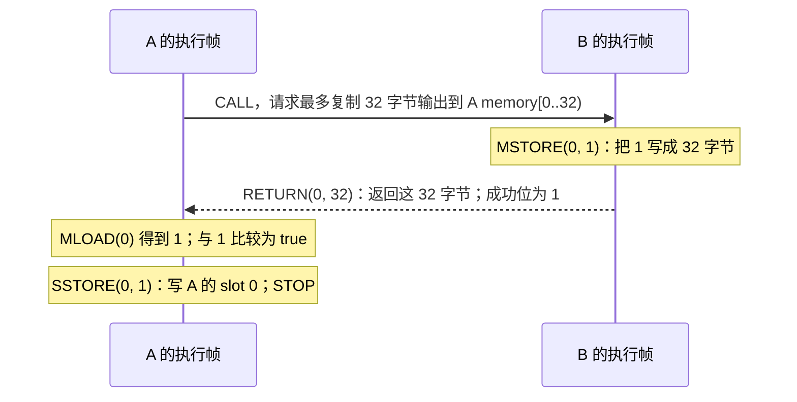

# 09：跟着一次调用，跨过合约边界

前几课分析一段字节码。本课把问题扩大一点：A 调用 B，B 返回的数值会不会改变 A 的分支？这要求分析器同时保存两个合约的执行位置、返回字节和 storage。

先看一条成功执行，再读包含其他可能性的抽象结果。所有命令都在仓库根目录执行；示例是离线合成状态，不需要节点或资金。阅读前应了解 [栈](01-bytecode.md)、[值集合](02-domain.md) 和 [CFG](03-cfg.md)。

## 1. 第一个实验：B 返回 1，A 写入 1

[`call-return-branch.json`](../examples/worlds/call-return-branch.json) 提供两个账户。下文用短名字，命令和 JSON 保留完整地址：

| 名字 | 地址末尾 | 代码做什么 |
| --- | --- | --- |
| A | `0101` | 调用 B；读输出；相等时写 slot 0=1，否则写 2 |
| B | `0200` | 把数值 1 编码为 32 字节并返回 |

**第一步，生成结果。** `analyze --world` 接收一组账户事实，`--entry` 选择从哪个账户开始：

```bash
nix run . -- analyze \
  --world examples/worlds/call-return-branch.json \
  --entry 0x0000000000000000000000000000000000000101 \
  --format json > /tmp/call-return.json
```

**第二步，先手算一次成功调用。** `memory` 是每次执行独有的临时字节区；`storage` 是按账户、slot 保存的状态。一个 slot 保存一个 256 位字。A、B 的 memory 相互独立，不能直接互读。



`[0..32)` 表示偏移 0 到 31，共 32 字节。数值 1 的编码是前 31 字节为零、最后一字节为 `01`。`RETURN` 从 B 的 memory 取字节，CALL 再把它们复制到 A 请求的输出区。

CALL 同时给 A 两种结果：压栈的**成功位**，以及复制到 memory 的**返回字节**。它们不是同一个数。这个例子用 `POP` 丢弃成功位，再用 `MLOAD` 读返回的数值。如果想核对 CALL 的参数，其执行前的栈按**栈底 → 栈顶**排列为：

```text
[输出长度=32, 输出偏移=0, 输入长度=0, 输入偏移=0,
 value=0, 目标=B, gas=500000]
```

CALL 从栈顶开始取参数。这里输入为空，转账金额为零。

**第三步，把这条执行对应到图。**

```bash
jq '.status, .edges,
    [.outcomes[] | {kind, slots: .store.persistent.slots}]' \
  /tmp/call-return.json
```

当前例子的成功路径是 `S0 → S2 → S4 → S5`：

| 边 | 输出中的 `kind` | 含义 |
| --- | --- | --- |
| `S0 → S2` | `"Call"` | 暂停 A，进入 B |
| `S2 → S4` | `"Return"` | B 成功返回，恢复 A |
| `S4 → S5` | `{"Intraprocedural":"BranchTrue"}` | A 在自己的代码中走真分支 |

`S` 是整台机器的状态编号，不是合约编号。编号可能随实现变化；阅读时根据边的含义和帧身份定位。

## 2. 为什么结果里还有 2 和 Failure

上面的查询还会显示 A slot 0=2 的 `Return`，以及入口的 `Failure`。gas 是 EVM 衡量执行工作量的计费单位；本实验室没有精确跟踪剩余 gas，因此保留 gas 不足等失败可能。它没有断言“给出 500000 就一定成功”。

CALL 失败而 A 能继续时，成功位为 0，没有返回字节写入输出区。A 的初始 memory 为零，因此 `MLOAD(0)` 得到 0，走假分支，写 slot 0=2。对应图中的 `S0 → S1` 是 `Failure`，`S1 → S3` 是 `BranchFalse`。入口帧自身也可能失败，产生回滚后的最终 outcome。

这里需要分清三个层次：

| 看到的内容 | 能得出的结论 |
| --- | --- |
| 成功轨迹写入 1 | 这条具体执行中 A slot 0=1 |
| 抽象 `outcomes` 中同时出现 1 和 2 | 模型保留了不同执行可能 |
| `status="Converged"` | 本次分析在给定模型、输入和预算内完成；不保证调用成功或合约安全 |

`outcomes` 是**入口执行结束后的结果**。`Return` 边则是**某个子调用返回的转移**；两者描述的层次不同。一个子调用失败后，入口仍可以正常结束。

## 3. 一次调用需要保存哪些东西

一个**执行帧（frame）**保存一次正在执行或暂停的调用。B 执行时，A 的帧仍在机器里，等待 B 完成：

```text
调用前： [A 活动帧]
调用中： [A 暂停帧, B 活动帧]
返回后： [A 活动帧]
```

调用栈由一个 `RootFrame` 和按调用顺序排列的 `ChildFrame` 组成，封装在 `CallStack` 中。没有子帧时 root 活动；有子帧时最后一个 child 活动，其余帧暂停。文本输出的 `depth` 是帧数量；入口为 1。文本中的 `stack in` / `stack out` 栈仍按栈底 → 栈顶显示。

两种帧共享 `FrameState`，每个执行帧都必须携带回滚保存点。只有 `ChildFrame` 携带返回父帧所需的 `Continuation`。`CallStack` 只允许压入和弹出子帧，root 始终保留，因此执行中的调用栈不会为空。这与 active/suspended 是两个不同维度：root 也能等待子调用返回。

| 帧里的内容 | 为什么要保存 |
| --- | --- |
| `stack`、`memory` | A 暂停时不能被 B 的计算覆盖 |
| `calldata` | 从 caller 的输入 memory 复制来的调用参数 |
| `returndata` | 最近一次子调用完成后提供的完整返回字节 |
| `caller`、`call_value`、`is_static` | 分别决定 CALLER、CALLVALUE 和静态写入限制 |
| 继续位置和输出区 | 决定回到 A 哪条指令、向 A memory 哪里复制数据 |
| 调用前的状态保存点 | 子调用回滚时恢复共享状态 |

CALL 自动复制的长度至多是请求输出长度与实际返回长度的较小值；实际返回之外的输出区保持原值。即使请求输出长度为零，完整返回字节仍进入 A 的 `returndata`。A 可用 `RETURNDATASIZE` 查询长度，再用 `RETURNDATACOPY` 复制。

可运行 [`returndata-copy.json`](../examples/worlds/returndata-copy.json) 观察这一点：CALL 的输出长度为零，A 随后手动复制，成功轨迹仍返回 32 字节数值 1。

```bash
nix run . -- analyze \
  --world examples/worlds/returndata-copy.json \
  --entry 0x0000000000000000000000000000000000000101
```

所有帧共享一份执行中的 **Store**：它记录各账户的 persistent storage、transient storage、余额，以及本次执行改变的 nonce（账户序号）、代码、创建/待删除标志和可能日志。persistent storage 可以跨交易保留；transient storage 是交易内的临时槽位。Store 不属于某一个帧，帧的 memory 则彼此独立。

## 4. 代理实验：读谁的代码，写谁的 storage

代理的常见做法是：把执行交给实现合约的代码，但继续使用代理自己的状态。这就是 `DELEGATECALL` 在本课中的重点。

[`proxy-storage.json`](../examples/worlds/proxy-storage.json) 的控制账户 A 依次 CALL 两个代理 P1、P2；两个代理都 DELEGATECALL 实现 I：

```text
A --CALL，value=7--> P1 --DELEGATECALL--> I 的代码，P1 的 storage
A --CALL，value=11-> P2 --DELEGATECALL--> I 的代码，P2 的 storage
```

```bash
nix run . -- analyze \
  --world examples/worlds/proxy-storage.json \
  --entry 0x0000000000000000000000000000000000000101 \
  --format json > /tmp/proxy.json

jq '[.states[] | .entry.call_stack
     | (.children[-1].state // .root.state)
     | select(.key.code_address == "0x0000000000000000000000000000000000000300")
     | {code_address: .key.code_address, address: .key.address,
        caller: .key.caller, call_value}] | unique' /tmp/proxy.json
```

JSON 的执行数据在 `entry.call_stack.root.state` 和 `entry.call_stack.children[].state` 中；child 的 `continuation` 与 `state` 并列。`key.frames` 仍按外层到内层保存帧的结构身份，用于工作表索引，并不是可增删的执行调用栈。帧类型见 [`frame.rs`](../crates/evm-abstract/src/analysis/machine/frame.rs)，调用栈见 [`stack.rs`](../crates/evm-abstract/src/analysis/machine/stack.rs)。

结构身份中的 `basic_block_index` 是该帧捕获程序的基本块索引，原名 `block`；单程序 `cfg` / `ssa` 的状态键也使用新名称。真实基本块的入口 PC 在 `Program.blocks()[basic_block_index].start_pc` 中；索引等于基本块数量时表示程序末尾的合成续接位置。这个字段与链上区块号、`block_hash` 无关。

这里必须分别读两个地址：

| 字段 | 代表什么 | 执行 I 的代码时 |
| --- | --- | --- |
| `code_address`，文本简写为 `code` | 指令来自哪个账户 | I=`0x...0300` |
| `address` | ADDRESS 的值，SLOAD/SSTORE 的状态账户 | P1=`0x...0201` 或 P2=`0x...0202` |

I 的代码把 slot 0 加 1，再把 ADDRESS、CALLER、CALLVALUE 写到 slot 1、2、3。各次调用成功时：

| 账户 | 初始 slot 0 | 最终 slot 0 | slot 1：ADDRESS | slot 2：CALLER | slot 3：CALLVALUE |
| --- | --- | --- | --- | --- | --- |
| P1 | 5 | 6 | P1 | A | 7 |
| P2 | 9 | 10 | P2 | A | 11 |
| I | 99 | 99 | 0 | 0 | 0 |

查询 `outcomes[].store.persistent.slots` 可查看抽象最终值；由于第 2 节的失败可能，值集合还可能含初始值。表格描述的是具体成功轨迹。

DELEGATECALL 继承代理帧的 caller 和 call value，所以实现代码读到的是 A 与 7/11。[`callcode-context.json`](../examples/worlds/callcode-context.json) 把它换成 `CALLCODE`：仍读 I 的代码、写代理的 storage，但 CALLER 变为代理自身，CALLVALUE 来自 CALLCODE 显式参数 3。**代码地址、状态地址、caller、value** 是四项独立事实。

## 5. 回滚：撤销子调用，保留之前的修改

`REVERT` 终止当前帧，并撤销该帧及更深调用造成的状态效果，但可以返回字节解释失败。跟着 [`revert-rollback.json`](../examples/worlds/revert-rollback.json) 的一条执行看：

1. A 先写自己的 slot 0=3。
2. A CALL B，此时保存整个 Store；B 的 slot 0 初始为 4。
3. B 写自己的 slot 0=7，再 REVERT，返回 32 字节数值 42。
4. 恢复保存点：B slot 0 回到 4，A 在调用前写入的 3 仍在。
5. A 收到成功位 0；REVERT 字节仍复制到输出区，A 把 42 保存到 slot 1。

```bash
nix run . -- analyze \
  --world examples/worlds/revert-rollback.json \
  --entry 0x0000000000000000000000000000000000000101 \
  --format json > /tmp/rollback.json

jq '[.outcomes[] | select(.kind == "Return")
     | .store.persistent.slots] | unique' /tmp/rollback.json
```

你会看到 B slot 0 保留 `0x4`，A slot 0 为 `0x3`。A slot 1 的某个抽象值是 `{"Constants":["0x0","0x2a"]}`，其中 `0x2a` 是 42，零来自没有得到 REVERT 数据的失败可能。只要 42 没被漏掉且 B 的 7 没泄漏，就能解释这条回滚轨迹。

两个相关实验：

| 文件 | 操作 | 具体结果 |
| --- | --- | --- |
| [`static-write.json`](../examples/worlds/static-write.json) | A 用 STATICCALL 调用 B，B 尝试 SSTORE | B 在写入处故障，成功位 0，slot 0 保留 4；静态限制传给更深调用 |
| [`log-rollback.json`](../examples/worlds/log-rollback.json) | A 先发事件，B 发事件后 REVERT | 只保留 A 的事件；B 的事件随状态一起撤销 |

日志在输出中是 `possible_logs`：记录来源指令、topics 和数据的摘要。这一表示不约束日志顺序或出现次数，不能当成完整事件流水。

## 6. 重入：新帧读到当前状态

**重入**是外层 A 尚未执行完，B 又调用 A。两个 A 帧有各自的栈和 memory，但使用同一个账户状态。

[`reentry.json`](../examples/worlds/reentry.json) 的成功执行顺序是：

```text
外层 A：写 A slot 0=1；CALL B，暂停
  B：CALL A，暂停
    内层 A：读 A slot 0，得到当前值 1；返回 1
  B：把 1 返回外层 A
外层 A：把收到的 1 写到 slot 1；再把 slot 0 改为 2
```

```bash
nix run . -- analyze \
  --world examples/worlds/reentry.json \
  --entry 0x0000000000000000000000000000000000000101 \
  --format json > /tmp/reentry.json

jq '[.outcomes[] | select(.kind == "Return")
     | .store.persistent.slots] | unique' /tmp/reentry.json
```

抽象输出包含 slot 0=2、slot 1 的集合 `{0,1}`；1 对应上面的成功轨迹。初始快照中 slot 0=0，如果每次 CALL 都重读它，内层 A 就会读错。共享 Store 让它看到尚未结束的外层修改。

## 7. 输入缺失和预算停止也要读出来

到目前为止，例子都提供了必要代码。试试缺少 B 代码的世界，以及只允许同时保存两帧的重入分析：

```bash
nix run . -- analyze \
  --world examples/worlds/missing-code.json \
  --entry 0x0000000000000000000000000000000000000101 \
  --format json > /tmp/missing-code.json

jq '.status, [.frontiers[] | {from, pc, reason}]' /tmp/missing-code.json

nix run . -- analyze \
  --world examples/worlds/reentry.json \
  --entry 0x0000000000000000000000000000000000000101 \
  --max-call-depth 2
```

两条分析命令都退出 `2`，表示 `Incomplete`。第一条的 `MissingCode` 指向 B；第二条在需要 `[A, B, A]` 三帧时留下 `CallDepth`。**前沿（frontier）**就是尚未完成的区域，保存停止位置和原因。它不是一次正常返回，也不是“没有副作用”。

`--max-work` 限制全执行累计工作，`--max-states` 与 `--max-transfers` 覆盖所有账户，`--max-memory-bytes` 限制每帧追踪的内存。未知目标、缺少创建事实、未知预编译输入也可能留下相应前沿；第 10 课会继续解释创建、预编译和摘要预算。

## 8. 怎样准备自己的 world

world JSON 是分析的**初始事实**。下面这个最小账户会执行 `SSTORE(0,1)` 然后 STOP：

```json
{
  "fork": "osaka",
  "provenance": "offline:lesson:v1",
  "accounts": [{
    "address": "0x0000000000000000000000000000000000000101",
    "code": "0x60015f5500",
    "storage": {"0x0": "0x0"},
    "storage_unknown": false,
    "balance": "0x0"
  }]
}
```

将这段 JSON 保存为 `/tmp/lesson-world.json` 后，即可执行：

```bash
nix run . -- analyze \
  --world /tmp/lesson-world.json \
  --entry 0x0000000000000000000000000000000000000101
```

| 输入写法 | 声明的事实 |
| --- | --- |
| `code:"0x"` | 代码确定为空 |
| 省略 `code` | 代码未知 |
| `storage_unknown:false` | 初始 storage 完整；所有未列出的 slot 为零 |
| 省略 `storage_unknown` | 未列出的 slot 未知 |
| 省略 `balance` / `nonce` / `existence` | 对应事实未知 |
| 整个账户未列出 | 账户事实未知，不能推断不存在 |

`provenance` 是作者填写的来源说明；它不能证明事实属于哪条链、哪个区块。固定快照的身份与校验见[第 10 课](10-snapshots-summaries-creation.md)。

入口还可指定 `--caller`、`--calldata 0x...`、`--value 1000`、`--static`。`--value` 的单位是 wei，接受十进制非负整数，也可写为 `0x3e8` 或 `0X3e8`；具体数量格式见 [CLI 参数说明](../README.md#命令与输出格式)。默认 caller=`0x...1000`、calldata 为空、value=0；子调用参数由实际指令产生。世界余额是**进入入口帧时**的余额，`--value` 只提供 CALLVALUE，不会再处理外层交易转账或手续费。world JSON 的余额、nonce、storage 键和值继续用 `0x` 十六进制格式，地址和 calldata 仍是字节数据。

示例入口使用 `0x101`，因为 Osaka 的 [EIP-7951](https://eips.ethereum.org/EIPS/eip-7951) 在 `0x100` 定义 P256VERIFY 预编译。在预编译地址填入 fixture 字节码，不会让执行器把它当作普通代码执行。

## 9. 从这些观察回到实现

分析器的工作表保存整台机器，而不是分别跑 A、B，再随意拼接结果。状态键区分全部帧的代码地址/hash/模式、状态地址、caller、static、基本块、栈高和帧内跳转历史，还区分 Store 中的代码与生命周期身份。只有键相同的状态值才能 join。这样同一实现的两个代理、同一合约的内外重入帧都能保持各自身份。未知 slot 的写入使用弱更新，不能把可能被覆盖的旧常量继续当成确定值。

对应源码是 [`world.rs`](../crates/evm-abstract/src/world.rs) 的初始事实、[`store.rs`](../crates/evm-abstract/src/world/store.rs) 的共享状态、[`machine.rs`](../crates/evm-abstract/src/analysis/machine.rs) 的帧和图。加 `--ssa` 可构建跨合约 SSA：调用和返回显式传递帧与状态效果；验证器先要求分析完整，再核对状态、指令和边。JSON 此时变成 `{"analysis":...,"ssa":...}`，以上查询需要加 `.analysis` 前缀。

[`cross_concrete.rs`](../crates/evm-abstract/tests/cross_concrete.rs) 用独立 revm 执行器核对三个支持 fork 下的具体帧、指令、返回字节、storage、余额和日志，并验证完整图的 SSA。它要求 oracle 实际进入入口和子帧，避免在预编译地址上用空轨迹误通过。有限样例能发现反例，不能证明任意合约安全；这一边界仍适用[第 6 课](06-boundaries.md)。
