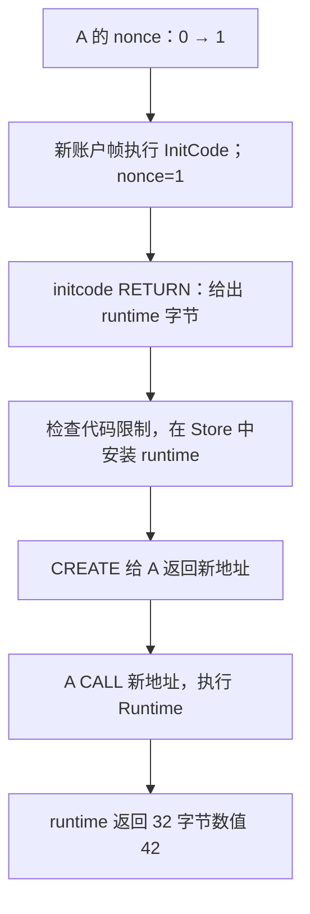

# 10：复用调用结果、部署代码与固定快照

读完[第 9 课](09-cross-contract.md)，你已经知道调用会产生返回字节和共享状态变化。本课逐个回答四个问题：相同调用能不能复用分析结果？新合约的代码从哪里来？SELFDESTRUCT 何时删除账户？没有普通字节码的预编译怎样执行？最后把这些实验连接到固定链上快照。

前四个实验均使用离线合成事实，入口为 A=`0x...0101`，默认预算可完成。所有命令在仓库根目录执行，需要 `jq`。返回结果仍包含保守 gas 模型允许的失败可能；下文会区分具体成功轨迹与抽象输出。

直接阅读时使用 `explain --world ... --entry ...`，默认得到捕获代码的反汇编、简明 CFG 与栈、分开的入口结果和已验证图的 TAC/SSA。需要完整快照、帧上下文、摘要证据和原始效果 SSA 时，追加 `--verbose`；`analyze` 的默认文本与 `analyze --ssa` 仍提供完整报告，以下 `analyze --format json` 命令用于查询原有字段。显示方式不改变分析语义；这些入口接受相同的调用环境、摘要开关、数值域和执行预算参数。`--verbose` 仅用于世界或 RPC 的 `explain`，单程序 `explain --hex` / `--file` 继续显示反汇编、CFG 与栈 SSA。

所有反汇编与 SSA 基本块指令列表共用顶格的 `B# @ 0xPC:` 标题，下面的 pc 不带 `0x`，数字列随 B 编号宽度与标题对齐。SSA 先显示独立的状态元数据与入口 φ，再显示 B 标题、指令和对齐的 `stack out`。单程序与世界教学 SSA 共用赋值式指令正文；世界视图保留 C、F、state owner、context，以及按 T 标记并带 F/slot 的 φ。完整视图另保留所有帧元数据、原始指令字段和效果链，字节码行与效果行也使用这套布局。编号与证据的读法见[第 04 课](04-ssa.md)和[第 09 课](09-cross-contract.md#默认文本怎样读)。

## 1. 调用摘要：复用完整结果关系

先设想 A 连续两次调用 B，B 的代码和输入没变，B 读到的账户状态也没变。第一次已完成给定抽象输入下 B 的可达执行与可能出口分析。**调用摘要（call summary）**把这份完成的分析保存下来，第二次先核对输入前提，再复用结果，减少重复计算。它保存在分析器中，是执行过程和结果的结构化记录。

[`summary-reuse.json`](../examples/worlds/summary-reuse.json) 把这个问题变成可运行实验：A 两次 CALL B。B 只读自己的 slot 0=7，将它编码为 32 字节返回。两次调用输入相同，但 A 第一次请求复制 0 字节输出，第二次请求复制 32 字节。

```text
第一次：A CALL B → 分析 B 的指令、返回和状态效果 → 保存完整关系
第二次：A CALL B → 核对前提相同 → 将已认证的 B 子图接到新 caller 上
```

一次具体成功执行中，B 返回前 31 字节为零、最后一字节为 `07` 的数据。分析器还保留模型允许的失败可能。因此缓存保存的是“在这组抽象输入下，B 的每种结束方式，分别对应什么返回字节和 Store 效果”，而不只是一个数值 7。若有 REVERT，也要把回滚后的状态与 REVERT 数据一起保存。各输出之间的关系不能拆开重组。

这里的“完整”指子图已经闭合，所有保留的抽象出口都已记录。一条抽象输出内部仍可能含 join 后的值集合，不能从中还原每条具体路径的数值相关性。例如返回值候选与某个 slot 的候选各有两个值，不证明四种配对都能具体执行，当前表示也未必知道它们怎样逐项对应。摘要复用保留已有精度；它不会把抽象结果变成具体执行证明。

摘要还携带对应的执行子图：哪些指令状态和边导出了这些结果。这样第二次命中时，图中仍能看见 B 的调用过程，SSA 也能检查值和状态效果的来源。后文把这份完整子图及输入、输出证据称为**证书**；这里不表示链上状态证明。

### 先分清“保存”和“复用”

`analyze` 文本或 `explain --verbose` 的 `Call summaries` 分区显示摘要统计和每份记录。`published=1` 表示保存了一个可复用的完整结果；`hits=1` 才表示后来的调用复用了一个结果。`source` / JSON 的 `source_state` 指向最初分析的 callee 入口；`reused_at` 指向后来的复用入口。完整文本中各摘要还列出出口种类、返回长度和代码身份；完整的返回字节与 Store 关系在 JSON 的 `summaries[].outputs` 中。

在[第 9 课的 `returndata-copy.json`](09-cross-contract.md#3-一次调用需要保存哪些东西) 中，A 只调用 B 一次。若统计显示 `published=1`、`hits=0`，含义是第一次分析已经完成并保存，但没有第二次相同调用来使用它。这是正常情况，不能据此判断调用失败或摘要没有工作。下面的两次调用实验才用于观察复用。

### 第一步：分别开启和关闭摘要

```bash
nix run . -- analyze \
  --world examples/worlds/summary-reuse.json \
  --entry 0x0000000000000000000000000000000000000101 \
  --format json > /tmp/summary-on.json

nix run . -- analyze \
  --world examples/worlds/summary-reuse.json \
  --entry 0x0000000000000000000000000000000000000101 \
  --format json --no-summaries > /tmp/summary-off.json

jq '.status, .summary_stats,
    [.summaries[] | {source_state, state_count, edge_count, reused_at}]' \
  /tmp/summary-on.json
jq '.status, .summary_stats.hits, .summaries' /tmp/summary-off.json
```

两次都应为 `Converged`。开启摘要时 `hits > 0`、`imported_states > 0`；关闭时 `hits=0`，证书列表为空。

| 字段 | 怎样读 |
| --- | --- |
| `hits` / `misses` | 找到 / 没找到前提完全相等的完整摘要的次数 |
| `published` | 已保存为可复用证书的完整摘要数量 |
| `rejected_incomplete` | 输入变化或子图未闭合而未能保存的候选数量 |
| `imported_states` | 复用时加入新调用位置的子图状态数 |
| `source_state` | 最初认证此摘要的 callee 入口状态 |
| `state_count` / `edge_count` | 证书覆盖的状态数 / 边数 |
| `reused_at` | 后来复用此证书的 callee 入口状态编号 |

证书来自正常工作表已经完成的分析，包含更深调用。命中时仍导入实际 callee 指令和调用/返回边，所以完整图仍可构建并核对 SSA。

### 第二步：确认复用没有改变最终关系

图编号可能不同，比较时只取入口结果的种类、返回字节和 Store：

```bash
jq -S '[.outcomes[] | {kind, data, store}] | unique' \
  /tmp/summary-on.json > /tmp/summary-on-relations.json
jq -S '[.outcomes[] | {kind, data, store}] | unique' \
  /tmp/summary-off.json > /tmp/summary-off-relations.json
cmp /tmp/summary-on-relations.json /tmp/summary-off-relations.json
```

`-S` 排序对象字段，`unique` 去掉重复关系；`cmp` 无输出且退出 0，表示这个实验的最终关系一致。它是针对该样例的核对，不是任意输入的等价性证明。

### 什么条件下允许命中

摘要只在**一次固定 world 分析内**缓存，不跨分析持久保存。复用要求输入事实相等，不能只看合约地址或函数 selector（calldata 起始 4 字节，常用来选择函数）：

例如，B 第一次读取 slot 0=7、第二次读取 slot 0=9，虽然地址、代码和空 calldata 都相同，旧结果也不能直接拿来用。caller、value 或静态模式改变时也一样；这些事实可能影响执行。当前实现比较完整抽象输入，而不是推测“B 大概只读了 slot 0”后忽略其他状态。

本课的**代码 hash**是代码字节的 Keccak 摘要；**初始事实指纹（fingerprint）**绑定整组初始事实。快照身份绑定其声明的来源，具体格式见第 5 节。**ORIGIN（最外层交易发起者）**在本模型中取入口 `caller`，在嵌套调用中保持不变；帧的 CALLER 则随调用方式变化。

| 必须相等的前提 | 防止什么错误 |
| --- | --- |
| fork、快照身份、初始事实指纹、当前代码 hash | 把不同规则、不同区块或改变后的代码混用 |
| callee 帧，包括 caller/static/value/calldata 和回滚保存点 | 同一代码在不同调用环境下复用错误结果 |
| ORIGIN 与完整 Store | 忽略 storage、transient、余额、日志、nonce、代码或生命周期变化 |
| 剩余调用深度和冻结的分析策略 | 复用时得到额外深度，或改变数值域、facts 交换、内存、跳转历史及费用策略 |

A 的暂停帧和 A 所拥有的输出复制继续信息不属于 callee 输入，所以本例的输出长度 0/32 不妨碍命中。callee 的其他帧事实和回滚保存点仍需相等。登记候选后，输入若经 join 扩大，就不能按旧前提发表证书；需要以更新后的输入重新登记、完成分析并认证。callee 未完成或预算中断时也不能发表完整证书。[第 12 课](12-product-domains-facts.md)会解释为什么同一字节码用组合域和 constants-only 得到的精度可能不同；摘要输入也绑定这份完整策略，不能仅按常量容量判定兼容。

摘要中的入口帧是相对于子图而言的：B 在 A→B 的全图里是子帧，在单独保存的 B 子图里成为入口。保存时保留 B 的执行数据与回滚点，外层返回契约不属于摘要输入与子图；复用时使用当前 caller 的继续信息，再把 B 接回调用栈。更深的子帧仍需保留各自的继续信息。这样既能复用 B 的行为，又能把这次结果复制到 A 新指定的输出区。状态归一化会清除局部复制身份；冻结来源策略不意味着把运行时身份保存进摘要。

摘要的查找比较、快照 hashing、认证、复制和图导入都消耗同一份 `--max-work`；导入状态也计入全局状态预算。命中不会重置预算。`SummaryWork` 前沿表示这些操作未完成，状态为 `Incomplete`，SSA 验证器不会接受未闭合图。实现与回归见 [`summary.rs`](../crates/evm-abstract/src/analysis/summary.rs)、[`summaries.rs`](../crates/evm-abstract/tests/summaries.rs)。

## 2. CREATE：先执行构造代码，再安装运行时代码

部署涉及两段不同的代码：

| 名称 | 何时执行 | 返回值的用途 |
| --- | --- | --- |
| **initcode（构造代码）** | CREATE / CREATE2 创建新账户时 | RETURN 的字节被安装为新合约代码 |
| **runtime（运行时代码）** | 创建成功后的普通 CALL | RETURN 的字节交给 caller |

它们通常不同。成功 CREATE 给 caller 压栈的是**新地址**，不会把已安装的 runtime 当作 caller 的 returndata。

[`create-runtime.json`](../examples/worlds/create-runtime.json) 中，A 初始 nonce=0。**nonce**是账户的序号；CREATE 用创建者地址和创建前的 nonce 推导目标地址。本例目标为 `0xea53a153a9a04fd632b2486d84732feb3b71afb7`。

### 第一步：确认创建需要的事实

打开 fixture，可以看到目标账户明确声明 `existence:"absent"`、代码为空、nonce/余额为零、完整零 storage。这个声明提供“目标可创建”的事实。JSON 没列出目标只表示未知，会留下 `Creation(UnknownCollision)`，不能猜目标不存在。

**碰撞**指目标已有非零 nonce 或非空代码等阻止创建的条件。例子还声明零地址 absent，供模型允许的创建失败路径使用：CREATE 返回零，A 随后可能 CALL 零地址。

### 第二步：运行并区分两种帧

```bash
nix run . -- explain \
  --world examples/worlds/create-runtime.json \
  --entry 0x0000000000000000000000000000000000000101

nix run . -- analyze \
  --world examples/worlds/create-runtime.json \
  --entry 0x0000000000000000000000000000000000000101 \
  --format json --ssa > /tmp/create.json

jq '[.analysis.states[] | .key.frames[-1]
     | select(.address == "0xea53a153a9a04fd632b2486d84732feb3b71afb7")
     | {address, mode, code_hash}] | unique' /tmp/create.json

jq '[.analysis.outcomes[].store.account_observations[]
     | select(.address == "0xea53a153a9a04fd632b2486d84732feb3b71afb7")
     | {existence, nonce, balance, code_size, code_hash}] | unique' \
  /tmp/create.json
```

这里用了 `--ssa`，JSON 根对象是 `{"analysis":...,"ssa":...}`，查询因此从 `.analysis` 开始。不加 `--ssa` 时，`states` / `outcomes` 就在根对象中。

第一个查询应找到同一地址的 `InitCode` 与 `Runtime` 两种 `mode`，并带不同代码 hash。第二个查询看最终账户事实：某些失败可能仍为 absent；成功部署的账户为 present、nonce=`0x1`、code_size=8。

`explain` 的 `Execution code` 也分别列出实际捕获的 InitCode 与后续 Runtime 指令，使用各自的 hash 和模式；它从分析时保存的代码字节反汇编，不会用初始 world 中的空代码替代新安装的 runtime。同一账户地址可以对应多个代码版本，代码地址也可能与使用代码的状态账户不同。两个代码版本都可以有 B0，必须结合 C、mode 和 hash 判断身份。默认 CFG 通过代码目录编号连接到抽象图；`--verbose` 另保留每个捕获帧的入口、出口引用。这些引用都不是具体部署交易的逐指令轨迹。SSA 的返回转移还区分 CREATE 地址结果和普通 CALL 的成功位。

`account_observations` 是方便阅读的账户汇总，不包含 storage slot；slot 仍在 `store.persistent.slots`。nonce 和余额是抽象值，JSON 中确定的数值仍写成含 `Constants` 的对象；已知的 `code_size` 则是整数，本例为 8。代码 hash 为零表示已确认 absent；代码为空但账户存在时，hash 是空字节的 Keccak，两者不同。

### 第三步：跟着成功生命周期读结果



本例安装的 runtime 是 `602a5f5260205ff3`，共 8 字节，hash 为 `0x30962a84ef989ca0f724a5b2ec94f9cbf6a731752ce2c0be5333bf96e460c9fd`。原始 world 中目标仍是 absent；Store 保存执行时安装的新代码，称为**代码覆盖层（code overlay）**。后续 CALL 从当前 Store 解析代码，而不是回到原始快照。

可进一步看 A 最终返回的字节：

```bash
jq '[.analysis.outcomes[] | select(.kind == "Return")
     | {length: .data.length,
        last_byte: (.data.bytes["31"] // .data.default)}] | unique' \
  /tmp/create.json
```

`data` 是抽象字节数组：`length` 表示长度的抽象值，`bytes` 列出显式保存的位置，其余位置由 `default` 表示。32 字节用 `0x20` 表示；数值 42 的最后一字节是 `0x2a`。这里可能看到 `{0,42}` 的字节集合，包含 runtime 成功返回与 CALL 失败留下零输出的可能，不能读成所有路径都返回 42。

### CREATE2 和失败路径的前提

CREATE2 用创建者地址、**salt（显式给定的 256 位值）**、initcode hash 推导地址；CREATE2 也需要已知且可表示的创建者 nonce 来处理序号变化。**endowment** 是创建时转给新账户的金额。

| 缺少或无法表示的事实 | 对应 `Creation` 前沿 |
| --- | --- |
| 创建者 nonce | `UnknownNonce` / `NonceOverflow` |
| CREATE2 salt | `UnknownSalt` |
| initcode 或其返回的 runtime 字节 | `UnknownInitCode` / `UnknownRuntimeCode` |
| 目标 nonce / 代码不足以判断碰撞 | `UnknownCollision` |
| 金额或非零转账所需余额 | `UnknownEndowment` |

有限数值会枚举候选，initcode/runtime 必须能提取为具体字节。构造帧的初始 storage/transient 属于新账户，代码通过长度、前缀与解码检查后才安装。静态限制、调用深度、EIP-3860 的 initcode 限制和 runtime 代码限制也影响结果。

执行到增加 nonce、进入 initcode 后，initcode 失败会回滚新账户效果，**保留此次增加的创建者 nonce**；更外层帧 REVERT 时则恢复其更早保存点，连 nonce 一起撤销。因余额不足等在增加 nonce 之前发生的失败不会增加它。创建/调用失败可能与成功路径同时出现在图中。[`creation.rs`](../crates/evm-abstract/tests/creation.rs) 使用独立 revm 轨迹核对这些关系。

## 3. SELFDESTRUCT：转账和删除发生在不同时间

[`created-selfdestruct.json`](../examples/worlds/created-selfdestruct.json) 在同一次执行中：A 用 CREATE2、salt=5、endowment=7 部署新合约 C，再 CALL C。C 写 slot 0 后，将余额给受益人 `0x...0200`，执行 SELFDESTRUCT。

这里的 C 地址是 `0x2fd1832070091785c7e2aa8b7d3464a3e23a4eeb`，runtime 为 `60015f55610200ff`，8 字节。成功执行按时间分为：

| 时间点 | C 的代码与状态 | 可观察结果 |
| --- | --- | --- |
| CREATE2 成功 | 代码已安装，余额 7 | `created=true` |
| C 执行 SELFDESTRUCT | 余额转给受益人，标记待删除 | `pending_destruction=true`；代码和 storage 暂时保留 |
| 返回 A | C 仍可被查询和 CALL | EXTCODESIZE 得到 8，EXTCODEHASH 得到 runtime hash |
| 最外层成功结束 | 完成删除，清除临时标志 | C absent，代码/nonce/余额/storage 归零；受益人余额 7 |

### 第一步：查看中途的待删除标记

```bash
nix run . -- analyze \
  --world examples/worlds/created-selfdestruct.json \
  --entry 0x0000000000000000000000000000000000000101 \
  --format json > /tmp/destroy.json

jq '[.states[]
     | select(.entry.store.pending_destruction["0x2fd1832070091785c7e2aa8b7d3464a3e23a4eeb"] == true)
     | .id]' /tmp/destroy.json
```

应得到非空状态编号列表。它证明图保留了“已经 SELFDESTRUCT，但最外层尚未结束”的状态。

### 第二步：查看返回 caller 后的代码观察和最终账户

```bash
jq '[.outcomes[] | select(.kind == "Return")
     | .store.persistent.slots]
    | unique' /tmp/destroy.json

jq '[.outcomes[] | {kind,
      accounts: [.store.account_observations[]
       | select(.address == "0x2fd1832070091785c7e2aa8b7d3464a3e23a4eeb"
             or .address == "0x0000000000000000000000000000000000000200")
       | {address, existence, balance, nonce, code_size, pending_destruction}]}]
    | unique' /tmp/destroy.json
```

A slot 1 保存读到的代码大小 `0x8`；slot 2 保存 runtime hash `0xacc79ff75f811227da02d9de7061e749e8403447b54eaf6e47fceb2ddfefb04e`。fixture 随后还会再次 CALL C 的代码。第二个查询把同一 outcome 的两个账户放在一起：完整销毁路径中 C absent、受益人得到 `0x7`；未执行成功销毁的路径可能保留 C。不要把中途 `pending_destruction` 或某个最终 outcome 当成全部路径。

本实验室支持的 fork 都采用 [EIP-6780](https://eips.ethereum.org/EIPS/eip-6780)：只有**同交易创建的账户**才在这种情况下删除。预先存在的账户执行 SELFDESTRUCT 时，代码和 storage 保留；向不同受益人转移余额，受益人为自身时保留原账户余额。祖先 REVERT 会恢复转账、slot、代码和待删除状态。把 SELFDESTRUCT 实现成“立即清空代码”会漏掉 A 恢复后仍可执行的代码。

## 4. 预编译：没有普通字节码，也有调用帧

**预编译（precompile）**是在特定地址提供的原生功能，执行由客户端内建实现完成。使用哪些地址与规则由 fork 决定；不需要在 world 中伪造普通合约 runtime。

先看最容易理解的 identity 预编译 `0x4`：它原样返回输入字节。[`identity-precompile.json`](../examples/worlds/identity-precompile.json) 让 A 把数值 42 写在 memory[0..32)，CALL `0x4`，把输出复制到 memory[32..64)，再 RETURN 后一段：

```text
A memory[0..32)：32 字节数值 42
      ↓ CALL 输入
identity 原样返回 32 字节
      ↓ CALL 输出复制
A memory[32..64)：32 字节数值 42 → A RETURN
```

```bash
nix run . -- analyze \
  --world examples/worlds/identity-precompile.json \
  --entry 0x0000000000000000000000000000000000000101 \
  --format json --ssa > /tmp/native.json

jq '[.analysis.states[].key.frames[-1].mode] | unique' /tmp/native.json
jq '.analysis.edges,
    ([.analysis.outcomes[] | select(.kind == "Return")
      | {kind, length: .data.length,
         last_byte: (.data.bytes["31"] // .data.default)}] | unique)' \
  /tmp/native.json
```

模式列表含 `{"Precompile":"0x0000000000000000000000000000000000000004"}`，图中有 `Call` / `Return` 边。成功返回包含 `length={0x20}`、最后一字节 `0x2a`；抽象值可能同时含零，原因是 CALL 的保守失败可能没有填充输出区。完整图仍能构建 SSA；没有提供的预编译账户存在性/余额事实仍保持未知。

预编译的 SSA 状态仍有帧、入口 φ、转移和效果证据，但没有普通字节码指令。文本保留原生执行原因，不会借用 caller 的 B 标题或造一个 pc。空代码、无效嵌套委托和代码末尾的合成继续位置同样显示自身原因，只有实际字节码块才使用 B 标题与 pc 列。

密码学执行复用锁定的 [`revm-precompile 43.0.3`](https://docs.rs/revm-precompile/43.0.3/revm_precompile/)。分析器先检查输入资格并预留保守工作量，再进入后端：

| 情况 | 处理方式 |
| --- | --- |
| 输入字节、长度具体且可表示 | 调用原生实现，传播真实返回或执行失败 |
| 输入未知，或 modexp 声明的长度不可表示 | 留下 `PrecompileInput` 前沿 |
| 累计工作不足 | 留下 `Work` 前沿，先停止再避免执行昂贵原生操作 |
| 后端无法完成调用 | 留下 `Precompile` 模型前沿，区别于预编译本身的普通执行失败 |

这支持具体原生返回流，没有补齐精确 gas 或全部执行环境关系。实现见 [`transfer/precompile.rs`](../crates/evm-abstract/src/analysis/transfer/precompile.rs)。

## 5. 固定快照：同一个名字不代表同一组事实

**快照（snapshot）**提供代码、初始 storage、余额、nonce 和存在性事实。固定链上快照中的“固定”首先指 chain ID 与 block hash：分析前与按需补查得到的事实都属于同一个区块。已观察的事实保持不变，尚未观察的账户可以继续加入。每轮分析使用一组固定初始事实；执行指令改变的是 Store。

先查看第 1 节使用的离线快照：

```bash
jq '.world | {fork, provenance, identity, fingerprint}' /tmp/summary-on.json
```

它的 `identity.kind` 为 `offline`，标签是 `summary-reuse:v1`。fixture 在 world 顶层明确写：

```json
{"identity": {"kind": "offline", "label": "summary-reuse:v1"}}
```

上面是一个字段片段，放在 `fork`、`accounts` 等字段旁边。旧 JSON 只有 `provenance` 时也归为 offline；来源说明会原样保存。

### 身份、代码 hash、指纹各负责什么

| 字段 | 绑定的范围 | 不足以单独证明什么 |
| --- | --- | --- |
| `provenance` | 作者填写的来源描述 | 不能建立链或区块身份 |
| `identity.kind="offline"` + `label` | 一组明确未锚定链上的合成事实 | 不宣称这些事实来自链上 |
| `identity.kind="chain"` + `chain_id` + `block_hash` | 声明事实属于某条链的一个确切区块 | 不验证提供者返回的状态真实性 |
| 每账户 `code_hash` | 原始代码字节 | 不绑定 storage、余额、nonce |
| `fingerprint` | fork、identity、完整初始账户事实 | 一致性标识不是链状态的密码学证明 |

world JSON 中链上身份的 `chain_id` 仍使用 `0x` 十六进制格式；CLI 的 `--chain-id` 则接受十进制非负整数或 `0x` / `0X` 十六进制，例如 `1` 与 `0x1` 等价。`block_hash` 始终是完整 32 字节 hash，不能用区块号或 `latest` 代替。fork 仍单独选择，身份不会替你选择执行规则。

链上 JSON 提供代码时必须同时提供匹配的 `code_hash`。runtime 按原始代码字节计算 Keccak；EIP-7702 委托标记按原始 23 字节计算；已确认 absent 的账户 hash 为零。输入可附带预期 fingerprint；解析器拒绝指纹失配、重复地址/slot、冲突代码 hash 和不合法的 absence 事实。

`existence` 分为 `unknown`、`present`、`absent`。**空代码与账户不存在不是同一事实**。省略 nonce/balance/existence 表示未知；未列 slot 默认未知。只有确实知道所有未列 slot 为零，才能声明 `storage_unknown:false`；RPC 只采集请求的 slot，其余保持未知。

### 可选实验：从固定区块采集

这一段需要你自己的 RPC 和已选定的区块，不是离线例子的必要步骤。将 `LAB_RPC_URL`、`LAB_CHAIN_ID`、`LAB_BLOCK_HASH`、`LAB_FORK`、`LAB_ENTRY` 分别设为实际提供者 URL、预期链 ID、确切区块 hash、该区块的执行规则和入口地址。这里的入口应是该区块上的实际账户；前面合成例子的 `0x...0101` 不代表链上部署。

**第一步，只指定入口，观察发现的账户。** 默认 RPC 模式会补查分析中发现的具体 callee：

```bash
nix run . -- analyze \
  --rpc "$LAB_RPC_URL" \
  --chain-id "$LAB_CHAIN_ID" \
  --block-hash "$LAB_BLOCK_HASH" \
  --fork "$LAB_FORK" \
  --entry "$LAB_ENTRY" \
  --format json > /tmp/rpc-discovery.json

jq '.status, .world.identity, .rpc_acquisition,
    [.frontiers[] | {from, pc, reason}]' /tmp/rpc-discovery.json
```

入口自动加载。CALL、STATICCALL、DELEGATECALL、CALLCODE 能确定具体目标时，缺少该账户的代码事实就会触发补查；入口或 callee 的 EIP-7702 委托代码也可发现对应实现账户。解析仍只跟随一层委托。预编译由 fork 规则处理，已知代码、已知空代码和确认 absent 的账户都可以复用已有事实。

只加载入口不保证 `Converged`。例如代理从未观察的 slot 读取实现地址，目标可能仍为 Top，就会留下 `UnknownTarget`。RPC 发现以已确定的地址为起点，不能枚举整个地址空间。动态获取一个账户会观察其 code、balance、nonce 和 proof；该账户未选择的初始 slot 保持未知。

**第二步，跟着 A→B→C 理解补查后的重跑。** 假设 A、B 代码中的调用地址具体，预算足够，并且 RPC 能返回全部所需账户：

```text
第 1 轮：只有 A 的初始事实 → 遇到缺少 B 代码的调用
补查 B：在同一 block hash 核对完整账户事实，加入采集缓存
第 2 轮：用 A、B 的初始事实，从 A 入口重新分析 → 发现 C
补查 C：仍使用同一 block hash
第 3 轮：用 A、B、C 的初始事实，从 A 入口重新分析
```

一轮可能同时发现多个目标，所以上面是理解顺序的例子，不是固定轮数公式。每次成功补充事实后，图、Store、调用检查点和摘要都由入口重新建立。A 在 CALL 前做过的写入会重新执行，后来的重入仍读当前 Store。这样能把 B 的区块初始余额与 A 给 B 转账后的余额放在各自正确的位置。

采集缓存保存的是区块事实。B 在获知 C 的代码后 REVERT，撤销的是 B 与更深调用的事务效果，C 的初始事实仍可供 A 后续调用使用。同一账户不重复采集。第 2 节 CREATE 已安装的 runtime 属于当前 Store 的代码覆盖层，后续 CALL 使用该 runtime；创建碰撞所需的初始存在性等事实仍需预先提供。

此时再读 `rpc_acquisition`：

| 字段 | 怎样读 |
| --- | --- |
| `rounds` | 启动的分析轮数，包含被预算中断的最终轮 |
| `fetched_accounts` | 按需新增成功的地址数组；入口与预选账户不计入 |
| `failed_accounts` | 按需采集失败的地址数组；本次分析不自动重试这些账户 |
| `failures` | 按地址配对的错误类型与固定快照上下文；后续预算中断也保留这些证据 |
| `requests` | 初始与后续采集尝试的 HTTP 请求总数，包含身份校验和失败请求 |
| `states_created` | 各轮累计分配的机器状态数，包含已被后续轮次替换的图 |

最终 `world` 保存已验证的初始观察，`states` / `edges` / `outcomes` 属于最后一轮分析；累计工作和请求数则覆盖全部轮次。新账户事实增加后 fingerprint 随之改变，旧一轮的摘要不会沿用到新一轮。

**第三步，关闭发现，做初始事实的对照。** 在同一个入口、区块与 calldata 下加 `--no-rpc-discovery`：

```bash
nix run . -- analyze \
  --rpc "$LAB_RPC_URL" --chain-id "$LAB_CHAIN_ID" \
  --block-hash "$LAB_BLOCK_HASH" --fork "$LAB_FORK" \
  --entry "$LAB_ENTRY" --no-rpc-discovery \
  --format json > /tmp/rpc-selected.json

jq '.status, [.frontiers[] | {from, pc, reason}]' /tmp/rpc-selected.json
```

如果入口调用了尚未选择的普通代码账户，这次会留下 `MissingCode`、退出 `2`，与[第 9 课的离线缺代码实验](09-cross-contract.md#7-输入缺失和预算停止也要读出来)有相同边界。若入口没有这类调用，也可能直接完成；不能预设任意入口都缺代码。

你仍可用 `--account` 选择分析前获取的账户，用 `--slot` 选择初始存储槽。假设已确定一个被调用账户，将其地址设为 `LAB_CALLEE`，可以在上面的命令中增加：

```text
--account "$LAB_CALLEE" --slot "$LAB_CALLEE:0"
```

这两个参数都可重复，`--slot` 自动加入所属账户。slot 索引 `0` 是十进制，也可写为 `0x0`；地址仍是 20 字节十六进制。未选 slot 保持未知；已确认 absent 账户具有完整零状态。数值的十进制写法只改变 CLI 输入方式，world JSON 格式与发给 RPC 的编码不变。

### 为什么补查也必须固定区块

初始采集与每次新增账户都核对 chain ID 与 exact block hash。code/balance/nonce/proof/storage 请求均使用 [EIP-1898](https://eips.ethereum.org/EIPS/eip-1898) 的选择器 `{blockHash,requireCanonical:true}`，并在采集后再次核对身份。RPC 必须支持该选择器与 `eth_getProof`；提供者不支持、区块失效或观察互相矛盾时，采集停止。代码、余额、nonce、proof 和身份校验全部通过后，新账户才进入 world。

初始采集失败时还没有有效分析结果，CLI 退出 `1`。分析已开始后，仍被需要的补查失败在最后一轮图的对应调用留下 `RpcAcquisition` 前沿，退出 `2`。其 `failure` 保存 `context`、错误 `kind` 和 `message`，可定位 chain/block/method/account/slot；额度错误还给出 `resource` 与 `limit`。如果后续轮次在到达该调用前耗尽执行预算，图显示资源前沿，累计 `failures` 仍保存此前的采集错误。JSON-RPC、HTTP、网络、超时、缺少结果或代码 hash 失配都需要按这个边界判断，不能把剩余成功 outcome 当成完整结果。

默认 `--max-rpc-accounts 256` 限制初始与动态账户总数，`--max-rpc-requests 16384` 限制全部 HTTP 尝试，包括身份检查与失败请求。迟发采集耗尽这些额度也留下 `RpcAcquisition`。所有重跑轮次另共用同一 `--max-work`、`--max-transfers` 和 `--max-states`；以前的图虽然被替换，已耗工作和状态分配仍计费，因此最终图的 `states` 长度可能小于 `states_created`。达到执行预算后保留对应工作或资源前沿。默认每请求超时 15 秒，响应最多 4 MiB；库 API 可选择其他有界限制。

loader 始终请求选定区块，失败后不改查区块号或移动标签，也不会把缺失响应填成空代码、零余额。**当前信任范围是选定的 RPC 提供者。** `eth_getProof` 返回字段会与其他查询交叉校验，但没有验证 [EIP-1186](https://eips.ethereum.org/EIPS/eip-1186) 的 Merkle proof（将账户/槽位数据与区块状态根连接起来的密码学证明）。身份、hash 和 fingerprint 能发现混合/冲突输入，不能把受信任提供者的数据变成密码学状态证明，也不能让 `Converged` 成为任意合约安全证明。

完整 `analyze` 文本、`explain --verbose`、JSON 和 DOT 都保留 snapshot identity、fingerprint、帧模式/hash 和摘要信息。完整文本中，`Snapshot` 查输入身份，`Outcomes` 查每个最终结果的账户和字节，`Call summaries` 查保存与复用；默认 `explain` 按[第 9 课的分区](09-cross-contract.md#默认文本怎样读)阅读代码、CFG、值流和结果概要。JSON 还保留初始 world、完整域策略、摘要输入/输出、执行中的 Store 和 RPC 累计采集记录；DOT 的蓝色证书节点标出认证来源和复用位置。实现入口是 [`world/snapshot.rs`](../crates/evm-abstract/src/world/snapshot.rs)、[`world/rpc/session.rs`](../crates/evm-abstract/src/world/rpc/session.rs)、[`analysis/rpc.rs`](../crates/evm-abstract/src/analysis/rpc.rs)；本地 HTTP 的实际 CLI 对照在 [`tests/cli/rpc.rs`](../crates/evm-abstract-cli/tests/cli/rpc.rs)。


直接阅读同一固定 RPC 分析，可以把上面的 `analyze` 换成 `explain`，并去掉 `--format json` / `--ssa`：

```bash
nix run . -- explain \
  --rpc http://127.0.0.1:8545 \
  --chain-id 1 \
  --block-hash 0x填入完整区块hash \
  --entry 0x填入完整入口地址
```

默认 RPC `explain` 同样使用教学视图；在上面的命令末尾追加 `--verbose` 可查看完整 RPC 采集记录、快照与机器报告及原始 SSA。`explain` 复用 `analyze` 的 RPC 获取与按需发现策略，包括 `--no-rpc-discovery`、`--max-rpc-accounts` 和 `--max-rpc-requests`。这些开关及 `--account` / `--slot` / 链与区块标识仅用于 RPC；离线世界已经携带 fork，不能另传 `--fork`。世界和 RPC 入口要求 `--entry`，四种来源 `--world`、`--rpc`、`--hex`、`--file` 互斥。

解释中只有实际帧捕获的代码被列入执行目录：委托代码按 code address 区分，CREATE initcode 与安装后的 runtime 还按代码 hash 和模式区分。只观察到的初始代码有独立标注，不等同于执行证据。RPC 补查或执行预算未完成时，默认视图继续打印部分 CFG、每个已知 outcome、所有诊断与 frontier，并省略完整 SSA，退出码为 2；`--verbose` 保留同一部分分析的完整报告。简化显示不会把 `Incomplete` 改成成功，也不会重新选择 fork、区块或重置预算。
