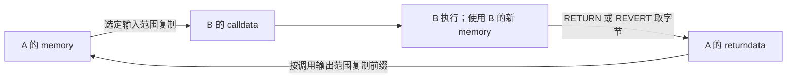

# 14：EVM 内存与抽象字节数组

学习入口：[模块：Memory & Storage](modules/memory-storage.md) · [理论：内存与别名](routes/theory.md#memory-storage) · [实现：ByteArray 与读写](routes/implementation.md#memory-storage) · [选择路线](learning-routes.md)。

`MSTORE` 把栈上的数写进 memory，`MLOAD` 再读出来。写入的是确定的数时，这很直观；如果数或地址都有多种可能，分析器应该保存什么？这就是本课要解释的内存模型。

本课按三步展开：先画出一次真实执行中的字节；再把多次可能执行的结果合在一张表里；最后解释这张合并表保存了什么、忘掉了什么。每个实验都先限定输入，再读抽象结果。不要从一个 `⊤` 或 `Converged` 标签直接跳到结论。

读过[第 00 课](00-start.md)的栈表即可开始。所有命令在仓库根目录执行，都是离线例子，不需要 RPC、钱包或资金。`nix run . --` 后面是本项目的参数；首次构建可能需要下载依赖。本课使用默认 Osaka。不了解集合或 `⊤` 时，遇到它们再回看[第 02 课](02-domain.md)。

## 1. 先把字节、word 和偏移分开

一个 **bit** 是一位，只能是 0 或 1。一个**字节**（byte）有 8 位，数值范围为 0～255，写成十六进制就是 `00`～`ff`。两个十六进制数字表示一个字节；`0x` 是进制前缀，不占字节。

EVM 栈上的一个 **word** 有 256 位，也就是 **32 字节**。memory 按字节寻址：偏移 0、1、2 是三个相邻字节的位置，偏移不是 word 的编号。

| 写法 | 含义 |
| --- | --- |
| `MLOAD(1)` | 从字节偏移 1 开始读取 32 字节，即偏移 1～32 |
| `MSTORE(1, x)` | 从字节偏移 1 开始写入 x 的 32 字节编码 |
| `MSTORE8(1, x)` | 只向偏移 1 写入 x 的最低 8 位 |
| `[1,33)` | 包含偏移 1，不包含偏移 33，共 32 字节 |

上面的函数形式是为了讲解指令参数，不是 EVM 源码语法。实际指令从栈取参数。本文的栈按**栈底 → 栈顶**排列，最右边是栈顶；例如执行 MSTORE 前的 `[x, 1]`，先弹出偏移 1，再弹出要写的 x。`MLOAD(1)` 不要求地址按 32 字节对齐。

把 memory 看成一排带编号的格子，每个格子只放一个字节：

```text
字节偏移：  0   1   2   3  ……  30  31  32  ……
字节内容： 00  00  00  00  ……  00  00  00  ……
```

一次真实执行中，每个已访问位置都有一个确定字节。分析器遇到未知输入时，需要用一份状态表示多次可能执行，因此一个格子才可能显示 `{0x0,0xaa}`。集合属于分析器的知识；EVM 并不会在一个格子里同时放两个字节。

## 2. 第一个实验：写入 42，再读出来

运行：

```bash
nix run . -- explain --file examples/memory-word.hex
```

它的字节码是 `60 2a 5f 52 5f 51 59 00`，先手算：

| pc（十六进制） | 指令 | 执行后的栈（底 → 顶） | memory 的变化 |
| --- | --- | --- | --- |
| `0x00` | `PUSH1 0x2a` | `[42]` | 无变化；`0x2a` 就是十进制 42 |
| `0x02` | `PUSH0` | `[42,0]` | 准备写入偏移 0 |
| `0x03` | `MSTORE` | `[]` | 写入 `[0,32)`，当前长度变为 32 |
| `0x04` | `PUSH0` | `[0]` | 准备读取偏移 0 |
| `0x05` | `MLOAD` | `[42]` | 读取 `[0,32)`；长度仍为 32 |
| `0x06` | `MSIZE` | `[42,32]` | 把当前内存长度压栈 |
| `0x07` | `STOP` | `[42,32]` | 结束 |

在 CFG 部分找到：

```text
  stack in  []
  stack out [{0x2a}, {0x20}]
```

外层方括号表示栈的两个槽位。`{0x2a}` 是第一个槽唯一可能的值 42；`{0x20}` 是第二个槽唯一可能的值 32。它们分别来自 MLOAD 和 MSIZE，不能把 `0x20` 读成十进制 20。

这里观察的是块入口和出口的摘要。中间每一步发生什么，由上面的指令表解释；`explain` 的短输出没有直接列出整份 memory。

### 42 在 memory 里长什么样

MSTORE 使用**大端**编码：高位字节放在较小的地址，低位字节放在较大的地址。42 的 32 字节编码如下：

| 字节偏移 | `0`～`30`，共 31 字节 | `31` |
| --- | --- | --- |
| 内容 | 每个字节都是 `00` | `2a` |

读这 32 字节时，MLOAD 按同一顺序拼回数值 42。下面的图描述本仓库的实现步骤：


### 为什么小数会写成 32 字节

MSTORE 的写入宽度由指令决定，不由数值有几个非零字节决定。42 可以用一个字节表示，但 MSTORE 仍然写满 32 字节。可以把它看作在左边补 31 个零：

```text
word 42 的编码：00 … 00 2a      共 32 字节
MSTORE(0,42)：  写到偏移 0 … 31
MSTORE(1,42)：  写到偏移 1 … 32
```

大端决定的是**这 32 字节内部的顺序**；偏移决定的是**整段编码从哪儿开始**。例如 MSTORE(1,0x1234)：

| 编码中的字节编号 | memory 偏移 | 内容 |
| --- | --- | --- |
| 0～29 | 1～30 | `00` |
| 30 | 31 | `12` |
| 31 | 32 | `34` |

MLOAD(1) 读取 1～32，因此得到 `0x1234`。MLOAD(0) 读取的窗口是 0～31，包含 `12`、不包含 `34`，因而得到 `0x12`。同一排字节，用不同读取窗口可以得到不同 word；memory 里没有额外保存一个名叫“0x1234”的整数对象。

## 3. Rust 里怎样保存这份 memory

核心结构是 [`ByteArray`](../crates/evm-abstract/src/world/bytes.rs)：

```rust
pub struct ByteArray {
    length: AbstractValue,
    bytes: BTreeMap<usize, AbstractValue>,
    default: AbstractValue,
    memory: bool,
}
```

先用一句话理解：**保存一份长度摘要、一张显式字节表，以及表中没有列出的位置所使用的默认值。**

| 字段 | 保存什么 | [第一个实验里的例子](#2-第一个实验写入-42再读出来) |
| --- | --- | --- |
| `length` | 可能的字节长度，也是 memory 的 MSIZE 摘要 | 写入后是 `{0x20}` |
| `bytes` | 某个字节偏移上保存的 `AbstractValue` | 偏移 31 的值为 `{0x2a}` |
| `default` | 没有单独记录的位置的字节值 | 新 memory 中为 `{0x0}` |
| `memory` | 是否启用 memory 的 32 字节扩容规则 | memory 为 true；calldata（本次调用的输入字节）、returndata（最近一次子调用的返回字节）为 false |

**稀疏**表示按已记录的偏移保存事实，不需要为所有可能地址分配一整个数组。例如单独记录偏移 100 的值，不要求 `bytes` 中同时存在 0～99。`length` 描述的是 EVM 字节区的长度，不是 `bytes.len()`；字节表中记录了几个位置，与当前 memory 有多大是两件事。

把[第一个实验的执行前后](#2-第一个实验写入-42再读出来)直接放在一起：

| 观察项 | 执行前 | MSTORE(0,42) 执行后 |
| --- | --- | --- |
| EVM 的当前 memory 长度 | 0 | 32 |
| 偏移 0～30 的实际内容 | 新 memory 读出零 | 全部为零 |
| 偏移 31 的实际内容 | 新 memory 读出零 | `2a` |
| Rust 的 `length` | `{0x0}` | `{0x20}` |
| Rust 的 `bytes` | 空表 | 0～30 显式记录零，31 记录 `{0x2a}` |
| Rust 的 `default` | `{0x0}` | `{0x0}`，没有改变 |

这里的表项是事实记录，不是 EVM 的物理分配。后续读一个没列出来的位置，分析器会用默认值；它不会因为 map 没有键就报“未初始化”。

`BTreeMap` 让键按偏移排序。这里的键是具体的 `usize`，也就是 Rust 平台能表示的非负索引；它不是符号表达式。关于未知地址怎样进入这张表，[第 6 节](#6-地址确定时覆盖地址有几个候选时合并)、[第 7 节](#7-无法列出地址与无法列出长度是两个问题)再解释。

### 没有表项，不等于字节未知

先看 `default`：新 memory 的默认字节为零，所以一个未单独记录的位置仍可确定为 0。其他数组的默认值也可以是有限候选或部分约束；变为 `⊤` 时，默认值本身不能缩小数值候选。读取仍要继续检查长度，确定越界时返回零。

表中也可以显式保存零。`ByteArray::exact` 构造已知数据时会省略零字节；写入操作则可能把零也放进表。因此，不能把这个结构理解成“只存非零字节”。

例如，构造确定的 calldata `aa 00` 时可以只保存：

```text
length  = 2
bytes   = {0 ↦ aa}
default = 00
memory  = false
```

读取偏移 1 得到默认零，它属于这份输入；读取偏移 2 也得到零，但这次来自越界补零。两个结果相同，依据不同。calldata 的长度仍然是 2，不会因为共用 ByteArray 就变成 32。

ByteArray 的读取摘要还要结合 `length`，保留序列长度之外补零的可能；RETURNDATACOPY 另有指令级范围检查，[第 10 节](#10-copy复制字节与读取-word-有什么区别)再比较。如果长度可能为 0 或 1，那么偏移 0 的内容可能存在，也可能属于越界补零。

长度没有完整有限候选时，`byte_at` 也会把字节值与零合并。例如表中明确保存偏移 7 的 `{0xaa}`、但长度为 `⊤`，读取摘要会包含 `{0x0,0xaa}`；显式表项没有被删除，只是长度与字节分别保存，尚不能排除该位置在某条路径上越界。只有同时查看长度、显式字节和默认字节，才能理解数组。

### 每个字节为什么也用 AbstractValue

`AbstractValue` 描述**一个位置可能出现的数值**。例如 `{0x1,0x2}` 表示这个字节可能是 1 或 2；不是两个字节，也不是同时保存了两个具体值。

默认 `product` 可以在候选太多时继续保存固定位、区间或同余等约束。例如一个字节只可能是 1～255 中的奇数，完整候选需要 128 个常量；显式设置 `--max-constants 8` 时列不完，其他组件仍可记录“值不超过 255”“最低位为 1”。MSTORE 拆字节和 MLOAD 拼 word 都调用同一个数值域进行运算。

`AbstractValue` 同时容纳数值摘要和可选符号表达式，但两者回答不同问题：

| 信息 | 例子 | 回答什么 |
| --- | --- | --- |
| 数值摘要 `NumericValue` | `{0,42}` 或“最低位为 1” | 这个位置可能出现哪些数值？ |
| 符号表达式 | `BYTE(31,x)` | 这个值与哪个输入、哪项运算有关？ |

因此，字节的数值候选全都未知，也不一定丢失了来源表达式。[第 8 节](#8-为什么刚存进去再读出来会多出候选)逐步观察完整 word 怎样靠表达式恢复；未知偏移、混合来源或逐字节合并仍可能丢失这种联系。持久关系约束属于整机状态，详见[第 15 课](15-symbolic-relations.md)，它没有把 ByteArray 的具体键变成一般符号数组。

这是字节表与[第 12 课的组合域](12-product-domains-facts.md)的连接点。整个数值没有限制时显示 `⊤`；单独的 `bits=` 全星号只表示位组件没有确定的位，不能忽略同一个值的其他约束。

`AbstractValue` 是通用的 U256 摘要，并非 Rust 的 `u8` 类型。正常拆字节、MSTORE8 等运算会产生 8 位约束，但未知数组或未知地址写入直接使用 Top 时也可能失去这个约束；真实 EVM 字节的范围仍然是 0～255。

## 4. 初始零、扩容和 MSIZE

每个新帧的 memory 初始状态是：

```text
length  = {0x0}
bytes   = 空表
default = {0x0}
memory  = true
```

访问结束位置是 `offset + size`，memory 长度按 32 字节向上取整，并与已有长度取较大值：

```text
访问后的长度 = max(原长度, ceil((offset + size) / 32) × 32)
```

上式描述确定地址和非零长度的成功访问；大小为零的访问不扩容，也不因为偏移很大而分配空间。

| 原长度 | 访问 | 覆盖的字节 | 新长度 |
| --- | --- | --- | --- |
| 0 | `MLOAD(0)` | 0～31 | 32 |
| 0 | `MSTORE(1, x)` | 1～32 | 64 |
| 0 | `MSTORE8(31, x)` | 31 | 32 |
| 0 | `MSTORE8(32, x)` | 32 | 64 |
| 64 | `MLOAD(0)` | 0～31 | 64 |

**读取也会扩容。** 验证这个容易混淆的地方：

```bash
nix run . -- explain --hex 595f515900
```

指令是 `MSIZE; PUSH0; MLOAD; MSIZE; STOP`。出口应为：

```text
  stack out [{0x0}, {0x0}, {0x20}]
```

三个槽依次是：访问前的长度 0、从新 memory 读出的数值 0、访问后的长度 32。内存的当前长度与读取到的内容分别变化。

源码分成两层：`ByteArray::read_word` 只读取已有摘要，本身不扩容；执行 EVM 的 MLOAD 时，[指令转换](../crates/evm-abstract/src/analysis/transfer.rs)先调用 `touch_memory` / `expand`，再调用 `read_word`。直接阅读这些 Rust 辅助函数时要保留这个顺序。

## 5. MSTORE8：只取最低一个字节

```bash
nix run . -- explain --hex 6112ff5f535f515900
```

它把 `0x12ff` 压栈，向偏移 0 执行 MSTORE8，再从偏移 0 MLOAD，最后读 MSIZE。

MSTORE8 只写入 `ff`，丢弃更高的 `12`。因此第一个 byte 是 `ff`，后面 31 个 byte 仍为零。MLOAD 使用大端拼接，得到完整 word：

```text
0xff00000000000000000000000000000000000000000000000000000000000000
```

MSIZE 是 `0x20`。MSTORE8 写出的一个字节放在 word 的哪个位置，取决于它的地址；在偏移 0 写 `ff` 后从偏移 0 读 word，`ff` 位于最高字节，而不是最低字节。

把命令里的第一个 `5f` 改成 `601f`，就改为在偏移 31 写 `ff`；后面的 `5f51` 仍从偏移 0 读取。此时 MLOAD 的结果应为 `0xff`，长度仍为 32。尝试在运行前手算这个变化。

### 在一个已写入的 word 中覆盖一个字节

前面都从全零 memory 开始。现在先写入 `0x1234`，再修改它的两个低位字节：

```bash
nix run . -- explain --file examples/memory-word-overwrite.hex
```

所有偏移和写入值都确定，没有未知输入参与这些操作。先只画偏移 30、31，前面 30 个字节始终为零：

| 步骤 | 伪语法 | 偏移 30 | 偏移 31 | 此时 MLOAD(0) 的值 |
| --- | --- | --- | --- | --- |
| 1 | `MSTORE(0,0x1234)` | `12` | `34` | `0x1234` |
| 2 | `MSTORE8(30,0xaa)` | `aa` | `34` | `0xaa34` |
| 3 | `MSTORE8(31,0xbb)` | `aa` | `bb` | `0xaabb` |

步骤 2 只替换 `12`，不会重新把整个 word 写成 `0xaa`；步骤 3 不会追溯修改步骤 2 已经读出的值。程序分别保留两次 MLOAD 的结果，再压入 MSIZE，因此应看到：

```text
  stack out [{0xaa34}, {0xaabb}, {0x20}]
```

第一槽是较早读到的 `0xaa34`，第二槽是较晚读到的 `0xaabb`。栈中已有的 word 是当时的读取结果，不是持续指向 memory 的引用。这个时间差别同样适用于 storage 的读取。

## 6. 地址确定时覆盖，地址有几个候选时合并

先看唯一地址：`MSTORE8(0, 0xaa)` 确定写偏移 0，所以这个位置原来的字节被替换为 `aa`。分析领域把这种替换叫**强更新**：旧值被新值覆盖。其他位置保留。

再从一份全新的 memory 开始。如果偏移 p 可能为 0 或 1，执行同一条 `MSTORE8(p, 0xaa)` 时，真实执行有两种选择：

| 具体选择 | 偏移 0 | 偏移 1 | 其他字节 |
| --- | --- | --- | --- |
| p=0 | `aa` | `00` | `00` |
| p=1 | `00` | `aa` | `00` |

本仓库先在两份临时副本中分别写入，再按地址合并。结果是：

| 位置 | 合并后的字节 AbstractValue | 读法 |
| --- | --- | --- |
| 0 | `{0x0,0xaa}` | 这次可能写它，也可能没有写它 |
| 1 | `{0x0,0xaa}` | 同上 |
| 2 及之后 | `{0x0}` | 两种选择都没有写它 |

旧值与新值都保留下来，叫**弱更新**。这里的“弱”指保存的保证较少，不表示执行失败。地址的多个候选不会被当成一次真实执行里全部都写入。

### 合并到底丢失了什么

先把两份具体结果写成二元组，其他字节暂时省略：

```text
真实允许的结果：{(aa,00), (00,aa)}
```

逐位置合并先问“位置 0 在任意路径上能出现什么”，再问位置 1。两次得到的都是 `{00,aa}`。但这张表没有再记录两次选择必须来自同一行，所以它所表示的二元组变成：

```text
{00,aa} × {00,aa}
  = {(00,00), (00,aa), (aa,00), (aa,aa)}
```

`×` 是笛卡尔积：左边选一个值，右边也独立选一个值。`(00,00)`、`(aa,aa)` 是模型额外允许的组合，不是找到了产生它们的真实执行。

| 字节组合 | 对应的 MLOAD(0) | 本例真实可达？ |
| --- | --- | --- |
| `00 00`，后面补 30 个零 | `0` | 否 |
| `00 aa`，后面补 30 个零 | `0xaa × 2^240` | 是，p=1 |
| `aa 00`，后面补 30 个零 | `0xaa × 2^248` | 是，p=0 |
| `aa aa`，后面补 30 个零 | 两项相加 | 否 |

大端顺序决定前两个字节分别位于 word 的高 8 位和次高 8 位。这样可以解释输出中的长十六进制数，而不必数每一个零。

合并后的状态仍包含两个真实结果，因此覆盖没有丢失。丢失的是“哪个位置的值应与哪个位置的值配对”这一关系。如果随后检查“读出的 word 一定非零”，真实执行总成立，但这份摘要包含零，因此当前模型不能仅凭它证明该性质。

运行一个从未知 calldata 选择 p=0 或 p=1 的例子：

`--context-depth 0` 关闭按最近跳转历史分组，使两条路径的地址候选在同一个状态汇合。没有这个参数，默认保留的历史可能让两路分别分析，暂时看不到弱更新。

```bash
nix run . -- explain --file examples/memory-write-alias.hex --context-depth 0
```

在 `B₃ @ 0x000e` 的汇合状态找到 `stack in [{0xaa}, {0x0, 0x1}]`：左边是待写字节值，右边的地址位于栈顶。MSTORE8 消耗两个槽位，后续 MLOAD(0) 与 MSIZE 留下两个结果。

第一槽会包含四种 word，其中甚至有 0；第二槽为 `{0x20}`。这不是说真实执行可以一次不写任何位置：两个位置的候选已被独立保存，重新组合时允许 `00 00`，也允许 `aa aa`。真正的一次写入只有前一张表中的两行。[第 8 节](#8-为什么刚存进去再读出来会多出候选)用更短的数值解释同一种关联损失。

源码的有限地址写入在 [`write_values`](../crates/evm-abstract/src/world/bytes.rs) 中。它先验证并计算覆盖所有候选的长度摘要，再分别覆盖候选地址、合并副本。地址选择、长度与各字节之间的关系并未作为完整路径条件一起保存。

## 7. 无法列出地址，与无法列出长度，是两个问题

有限常量集合能枚举时，内存操作遍历它。**没有完整地址候选集合**时，即使偏移 `AbstractValue` 还有区间或固定位约束，当前实现也没有一般的区间寻址或符号地址求解。

### 7.1 不知道读哪儿

```bash
nix run . -- explain --hex 5f35515900
```

它执行 `PUSH0; CALLDATALOAD; MLOAD; MSIZE; STOP`。没有指定 `--evm.calldata`，所以第一个 calldata word 未知，并被当作读取地址。

新 memory 的所有字节都为零，分析器仍能确定读出的数值为 0；但访问的结束位置无法确定，长度变为 Top。应看到：

```text
  stack out [{0x0}, ⊤]
```

如果 memory 已保存字节事实，或者默认字节不再为零，无法枚举地址的 `read_word` 通常返回 `⊤`。当前的“纯零可读出零”快速判断要求显式字节表为空且默认字节为零；它不是一般的数组内容证明。

### 7.2 不知道写哪儿

```bash
nix run . -- explain --hex 60aa5f35535f515900
```

先压入 `0xaa`，从未知 calldata 读出 p，执行 `MSTORE8(p, 0xaa)`；然后读取 MLOAD(0) 和 MSIZE。非空写入地址无法枚举时，当前实现：

1. 将长度变为 `⊤`。
2. 清空**全部**显式字节事实。
3. 将默认字节设为 `⊤`，保留 memory 标记。

出口应为：

```text
  stack out [⊤, ⊤]
```

这次分析可以 `Converged`：它已经用更粗的摘要继续计算。清空事实不是把真实内存清零，也不是执行 REVERT；它表示分析器不再承诺旧字节信息仍然成立。当前做法较粗，不能证明某个已知位置与这次写入无关时，那里原有的事实也会丢失。

### 同一个未知偏移，写后再读也未必恢复原值

“无法列出地址”不等于“每次读取地址都会得到不同数”。下面的程序只读取一次 calldata word，然后用 DUP 保存同一个偏移 p：

```bash
nix run . -- explain --file examples/memory-symbolic-offset.hex
```

没有设置 calldata，因此 p 是未知输入。手算栈时，把它一直写成同一个字母：

| 指令 | 执行后的栈（底 → 顶） | 用意 |
| --- | --- | --- |
| `PUSH0; CALLDATALOAD` | `[p]` | 从本次输入读取偏移 |
| `DUP1` | `[p,p]` | 两份是同一个值的副本 |
| `PUSH1 7` | `[p,p,7]` | 准备写入数值 7 |
| `SWAP1` | `[p,7,p]` | 把写入偏移移到栈顶 |
| `MSTORE` | `[p]` | 执行 MSTORE(p,7)，留一份 p |
| `MLOAD` | `[读出的word]` | 从刚才那个 p 开始读取 |

真实执行只要成功到达 MLOAD 后，就应读到 7：写和读覆盖完全相同的 32 字节。过大偏移可能因 gas 等原因无法成功执行；这里的“应读到 7”针对已经完成这次读写的执行。

当前摘要却得到：

```text
  stack out [⊤]
```

原因可以沿数据流逐步找到：

1. 栈上的表达式层保留了 p 的身份，DUP 没有把它变成另一个输入。
2. ByteArray 的键需要具体偏移。p 没有完整有限常量候选，无法按 p 建立表项。
3. 写入采用[上一节的粗化](#72-不知道写哪儿)，清空字节事实、默认字节设为 Top；没有保存“在符号位置 p 存了 7”。
4. MLOAD 读到的是这份已粗化的数组。即使偏移表达式仍相同，也没有可供恢复的写入关系。

关系求解器知道 `p=p`，不等于它能找回已经没有存入数组摘要的信息。若采用通用符号数组，可以保存 `store(memory,p,7)` 与随后 `select(memory,p)` 的关系；当前实现没有这一层。这里的 `store/select` 是理论描述，不是本仓库的 API。

用同一个字节码固定输入，再比较：

```bash
nix run . -- explain --file examples/memory-symbolic-offset.hex --evm.calldata 0x
```

空 calldata 的 CALLDATALOAD(0) 补零，因此 p=0。写入变成确定地址的强更新，应得到 `stack out [{0x7}]`。变化来自寻址事实变得具体，而不是给未知数组随意猜一个值。

### 7.3 不知道复制多少字节

下面把未知 calldata word 当作 MCOPY 的长度，源和目标偏移都是 0：

```bash
nix run . -- explain --hex 5f355f5f5e00
memory_status=$?
printf 'exit=%s\n' "$memory_status"
```

应得到 `status=Incomplete`、`Memory` 前沿、`SSA unavailable`，退出码为 2。`Memory` 前沿记录分析在哪条指令遇到了不能展开的字节范围；已有输出是部分结果。

这个例子要复制的数量无法完整枚举。当前字节范围操作要求长度有完整有限候选，并逐个验证能否放入追踪范围；不会创建一个无限长的字节向量。长度只有区间信息也不能自动替代这个要求。

反过来，源偏移未知、长度确定为 2，可以完成有限的复制摘要：

```bash
nix run . -- explain --hex 5f356002905f375900
```

它从 calldata 取得未知 p，执行 `CALLDATACOPY(target=0, source=p, size=2)`，最后读 MSIZE。具体一次执行复制的是两个确定的字节；分析器不知道是哪两个，但知道只需要描述目标偏移 0、1。目标范围 `[0,2)` 扩到 32，结果是 `Converged`、`stack out [{0x20}]`。这只证明长度摘要确定，不表示复制的内容确定。

这里的 SWAP1 是为了安排实际弹栈顺序：

| 指令 | 执行后的栈（底 → 顶） |
| --- | --- |
| `PUSH0; CALLDATALOAD` | `[p]` |
| `PUSH1 2` | `[p,2]` |
| `SWAP1` | `[2,p]` |
| `PUSH0` | `[2,p,0]`，依次是 size、source、target |
| `CALLDATACOPY` | `[]` |
| `MSIZE` | `[32]` |

把当前规则放到同一张表比较。表中长度都非零，具体范围须满足追踪上限：

| 不知道什么 | 当前怎样处理 | 能否继续？ |
| --- | --- | --- |
| MSTORE8 的目标偏移，写入宽度已知为 1 | memory 字节事实和长度粗化 | 可以，精度很低 |
| COPY 的源偏移，目标与长度已知 | 只生成确定数量的字节摘要，内容可能未知 | 可以 |
| COPY 的目标偏移，长度已知 | 无法定位写入，memory 粗化 | 可以，精度很低 |
| COPY 的长度，没有完整有限候选 | 无法展开所需字节范围 | 留下 `Memory` 前沿 |

这是当前算法选择的边界，不是“未知长度在抽象解释理论中必然无法处理”。别的数组模型可以用区段或复制关系保存效果；本实现按有限范围逐字节处理，尚未提供那种替代规则。

还要叠加具体指令的规则：MCOPY 会扩张源、目标两处访问所需的 memory，所以上例的 MSIZE=32 不能直接套给源偏移未知的 MCOPY；RETURNDATACOPY 还须检查源范围，越界会使当前帧异常结束。[第 10 节](#10-copy复制字节与读取-word-有什么区别)分别解释这些差别。

这里要同时读两个信号：`⊤` 说明数值约束丢失，`Incomplete` 说明仍有执行区域没有展开。地址未知导致的粗化和长度未知导致的前沿，不能互相替代。[第 06 课](06-boundaries.md)解释完成状态与精度的区别。

## 8. 为什么刚存进去，再读出来会多出候选

逐字节的数值候选可以保存每个位置的可能内容，却不自动保存这些位置必须**一起选择同一条路径**的关系。共享表达式有时能保留联系；本节先看路径汇合后失去这种联系的例子。

运行：

```bash
nix run . -- explain --file examples/memory-byte-correlation.hex --context-depth 0
```

这个程序的两条分支分别压入 `0x0101`、`0x0202`，汇合后执行 `MSTORE(0, x); MLOAD(0)`。在 `B₃ @ 0x000f` 应看到：

```text
  stack in  [{0x101, 0x202}]
  stack out [{0x101, 0x102, 0x201, 0x202}]
```

为什么多出 `0x102` 和 `0x201`？先把前 30 个始终为零的字节放到一边，只看最后两个：

| 原 word | 偏移 30 | 偏移 31 |
| --- | --- | --- |
| `0x0101` | `01` | `01` |
| `0x0202` | `02` | `02` |

拆字节后，偏移 30 和 31 各自保存 `{01,02}`。原来“选了第一行，两字节就都必须为 01”的关系没有保留下来。

| 重新组合偏移 30、31 | 结果 | 是否属于原来的集合 |
| --- | --- | --- |
| `01`、`01` | `0x0101` | 是 |
| `01`、`02` | `0x0102` | 否，分析额外允许 |
| `02`、`01` | `0x0201` | 否，分析额外允许 |
| `02`、`02` | `0x0202` | 是 |

所有真实候选仍被包含，额外候选使结果更保守。这次 `Converged` 与信息丢失可以同时发生。MSTORE 的 [`write_word`](../crates/evm-abstract/src/world/bytes.rs) 对每个位置计算 BYTE（取 word 的指定字节）；MLOAD 的 `read_word` 使用 SHL（左移）与 OR（按位或）拼回。本样例在路径汇合时已丢失不同常量各自的表达式关系；数值候选按字节保存，不能据此恢复完整 word 配对。默认符号层另能识别带表达式的完整 word 往返，条件见[完整 word 往返实验](#有表达式的完整-word-往返可以恢复身份)；它不把任意逐字节 join都变成有关联的数组。

### 有表达式的完整 word 往返可以恢复身份

[上一例](#8-为什么刚存进去再读出来会多出候选)的 x 来自两条路径的不同常量，join 后只剩候选集合。现在换一种前提：x 是**同一个固定输入 word**，没有中途覆盖字节，也没有未知偏移。

希望证明的是：

```text
x = CALLDATALOAD(0)
MSTORE(0,x)
y = MLOAD(0)
x XOR y = 0
```

具体输入 x 可以是任意 U256。这项等式不要求先知道它究竟是多少。

```bash
nix run . -- cfg --hex 5f35805f525f511800 --format json > /tmp/memory-expression-on.json
nix run . -- cfg --hex 5f35805f525f511800 --no-relations --format json > /tmp/memory-expression-off.json
jq '.states[0].exit_stack[0]' /tmp/memory-expression-on.json /tmp/memory-expression-off.json
```

程序的栈变化如下，继续按栈底 → 栈顶排列：

| 步骤 | 指令 | 执行后的栈 | memory 摘要 |
| --- | --- | --- | --- |
| 1 | `PUSH0; CALLDATALOAD` | `[x]` | 新 memory，全零 |
| 2 | `DUP1` | `[x,x]` | 未改变 |
| 3 | `PUSH0; MSTORE` | `[x]` | 写入 `[0,32)` |
| 4 | `PUSH0; MLOAD` | `[x,y]` | 读取 `[0,32)` |
| 5 | `XOR` | `[x XOR y]` | 未改变 |

步骤 3 并不是给 memory 增加一个 `word[0]=x` 字段。它仍拆成 32 个字节，只是每个字节可以同时带着来源表达式：

| 偏移 | 数值摘要 | 可保留的表达式 |
| --- | --- | --- |
| 0 | 一个可能未知的字节 | `BYTE(0,x)` |
| 1 | 一个可能未知的字节 | `BYTE(1,x)` |
| … | … | … |
| 31 | 一个可能未知的字节 | `BYTE(31,x)` |

BYTE 的编号从 word 的最高字节 0 开始，最低字节是 31。这些表达式共同提供的信息比“每个字节可能为 0～255”更强：它们必须来自**同一个 x**。

步骤 4 检查是否完整读取这组有序 BYTE。若能识别，重新组装的 y 恢复为原表达式 x；于是步骤 5 是 `x XOR x=0`。默认模式的 JSON 应包含 `Constants: ["0x0"]`。这说明结果确定，不表示原来的 x 也确定为零。

关闭关系/表达式传播时，32 个字节的数值摘要仍覆盖真实内容，但没有保留同源表达式。重新组装的 y 仍是未知数值，无法证明 y=x；第二份 JSON 没有完整 Constants 集合，数值约束没有排除任何 U256。`--no-relations` 改变的是分析能力，不改变真实程序的恒等关系。

这条规则需要连续 32 字节来自同一个表达式及对应的 BYTE 索引。部分覆盖、未知地址、不同路径的逐字节 join、缺失表达式或表达式预算不足，都不能凭字段名字猜测恢复。它修复完整 word 拆分/重组的特定关系，没有提供一般符号数组、全部内存别名或完整析取。可保留的表达式和节点/深度预算见[第 15 课](15-symbolic-relations.md)。

例如在 MLOAD 前执行 MSTORE8(31,0xff)，最后一个字节变成常量 `ff`，已不再是原来的 BYTE(31,x)。除非有另外的证明，这时读出的 word 不能认定等于 x。恢复身份需要完整证据，不能因为前 31 个字节匹配就忽略最后一个。

读取过程还会用平衡的 SHL/OR 拼接构造数值和必要的表达式，避免左折叠把深度增长到 32 次拼接；这是表达式大小的控制，不是新的字节含义。

### 延后合并能帮助这个例子

```bash
nix run . -- explain --file examples/memory-byte-correlation.hex --context-depth 8
```

跳转历史让到达 B₃ 的两条路径保持为不同状态。一个状态的输入、输出都只有 `{0x202}`，另一个都只有 `{0x101}`。因为存入 memory 时还没有把两条路径合并，字节各自都确定，没有机会产生交叉组合。

这次改善来自[第 05 课的状态划分](05-sensitivity.md)。它没有给 ByteArray 增加一般的字节关联：更复杂的汇合、部分写入或已经丢失的表达式关系仍可能出现类似精度损失；完整 word 表达式恢复和状态划分是另外两种机制。

## 9. 组合域能保留字节性质，但寻址与关联仍是另一层

本节用 `--no-relations` 比较数值组件。下面只保留输入的最低字节，再把最低位设为 1，将结果写入偏移 31，随后从偏移 0 读取整个 word：

```bash
nix run . -- explain --hex 5f3560ff16600117601f535f515900 \
  --max-constants 1 --domain product --no-relations
```

表达式是 `(x AND 255) OR 1`，结果为 1～255 中的奇数。偏移 0～30 仍为零，所以 MLOAD 的结果也是这些奇数。`--max-constants 1` 只能保存一个常量，装不下全部 128 个候选；product 的其他组件应继续保留：

- 无符号范围 `u[0x1,0xff]`。
- 高 248 位为零，最低位为一：`bits=0x` 后是 62 个 `0`、一个 `*`、一个 `[***1]`，共 64 个十六进制位置。
- `mod(0x2)=0x1` 和非零保证 `≠0`。
- MSIZE 为 `{0x20}`。

完整出口模式如下；`*` 和方括号中的每一位都保留，可以逐项对照：

```text
  stack out [u[0x1,0xff] bits=0x00000000000000000000000000000000000000000000000000000000000000*[***1] mod(0x2)=0x1 ≠0, {0x20}]
```

换成只保存有限常量集合的模式比较：

```bash
nix run . -- explain --hex 5f3560ff16600117601f535f515900 \
  --max-constants 1 --domain constants-only --no-relations
```

本例出口为 `[⊤, {0x20}]`。这里损失的是字节内容的数值性质，地址 31 仍确定，所以内存长度仍能保留。

这解释了三个不同问题：NumericValue 决定一个位置上的数值精度；寻址规则决定可能读写哪些位置；字节之间的关联决定哪些组合可同时发生。改善其中一层，不会自动解决另外两层。

## 10. COPY：复制字节与读取 word 有什么区别

| 指令 | 从哪里取字节 | 写到哪里 |
| --- | --- | --- |
| `CALLDATACOPY` | 当前帧 calldata | 当前帧 memory |
| `CODECOPY` | 当前执行的代码字节 | 当前帧 memory |
| `RETURNDATACOPY` | 最近一次子调用的返回数据 | 当前帧 memory |
| `MCOPY` | 当前帧 memory | 同一帧 memory |

copy 的栈在取参数前按 `[size, source_offset, target_offset]` 排列，右边的目标偏移先弹出。它复制任意长度的字节序列，不需要把序列解释成整数。

MLOAD、CALLDATALOAD、CALLDATACOPY、CODECOPY 的读取按相应规则补零；RETURNDATACOPY 另有返回数据范围检查，超出返回数据会失败，不能笼统把所有越界复制都当作补零。即使 size=0，也仍须检查 RETURNDATACOPY 的源偏移规则；零大小不扩张 memory，不代表整条指令总是合法。

### MCOPY 的重叠区域

如果源和目标重叠，必须按复制前的源内容取值。运行：

```bash
nix run . -- explain --file examples/memory-overlap-copy.hex
```

程序先把 `0x01020304` 用 MSTORE 写入偏移 0，所以偏移 28～31 是 `01 02 03 04`。随后执行：

```text
MCOPY(target=29, source=28, size=3)
```

| 位置 | 28 | 29 | 30 | 31 |
| --- | --- | --- | --- | --- |
| 复制前 | `01` | `02` | `03` | `04` |
| 复制后 | `01` | `01` | `02` | `03` |

MLOAD(0) 得到 `0x01010203`，MSIZE 仍为 32，出口显示 `[{0x1010203}, {0x20}]`。如果错误地边写边读已经被覆盖的源字节，就会得到连续多个 `01`；本实现先保存源 memory 的快照，再执行复制。这是 **memmove** 式的重叠复制语义。[指令取快照与复制](../crates/evm-abstract/src/analysis/transfer.rs)和 [`copy_from`](../crates/evm-abstract/src/world/bytes.rs)分别承担这两步。

## 11. 每个帧的 memory 独立，调用通过字节传递数据

**帧**（frame）是一次合约执行所用的栈、memory、calldata 等上下文。A 调用 B 时，A 暂停，B 使用自己的新栈和新 memory；B 返回后，A 继续使用原来的 memory。[FrameState](../crates/evm-abstract/src/analysis/machine/frame.rs) 中的 `memory` 属于该帧。



DELEGATECALL 也创建独立的 memory。它复用调用方的 storage 状态账户，并不因此共用 memory；重入后的另一份 A 帧也有新 memory。帧间共享的账户状态与帧内临时字节区分别处理，详见[第 09 课](09-cross-contract.md)。

### 顺着一次成功调用观察三份字节区

先限定一个用于手算的调用：A 的 memory 偏移 0～3 已经是 `11 22 33 44`；A 选择输入 `[0,2)`，请求把输出写回 `[0,4)`。B 能成功执行，并最终返回 `bb cc` 两字节。这里先不合并 gas 失败等其他路径。

| 时刻 | A 的 memory：偏移 0～3 | B 的 calldata | B 的 memory |
| --- | --- | --- | --- |
| CALL 前 | `11 22 33 44` | B 帧尚未创建 | B 帧尚未创建 |
| B 刚进入 | `11 22 33 44`，A 暂停 | `11 22`，长度 2 | 全零，长度 0 |
| B 在自己的 memory 写入返回内容 | 仍是 `11 22 33 44` | 仍是 `11 22` | 偏移 0、1 为 `bb cc`，长度扩到 32 |
| B 执行 RETURN(0,2) 后 | `bb cc 33 44` | B 已返回 | B 帧已结束 |

这里每一步有不同的复制关系：

1. 创建 B 时，从 A memory 取输入切片，形成 B calldata。不是把 A memory 整体交给 B，也不是把输入自动写进 B memory。
2. B 写自己的 memory，不会改变已经复制的 calldata，也不会直接覆盖 A memory。
3. B 的 RETURN 从 B memory 取切片 `bb cc`，形成返回数据。父帧保存完整 returndata，再按 CALL 的输出参数复制回 A memory。

B 用 CALLDATALOAD 把一个输入 word 读到自己的栈上；需要可修改的 memory 工作区时，则用 CALLDATACOPY 把输入字节复制进去。只因 calldata 与 memory 底层都用 ByteArray，不意味着它们是同一份可修改数组。

这里有两组长度：B 实际返回的数据长度，以及 A 在 CALL 中请求的输出区长度。返回数据完整保存为 A 的 `returndata`；向 A memory 复制的只是 `min(请求长度, 实际返回长度)` 个字节。输出区按整个请求范围扩张，未被返回字节覆盖的后缀保留原内容。

例如 A 请求复制 4 字节，B 实际只返回 2 字节，那么前两字节被替换，后两字节保留；不能把后两字节自动清零。`copy_return_data` 的[回归测试](../crates/evm-abstract/tests/world.rs)核对了这个行为。返回长度未知时，当前模型逐字节合并“被复制”和“未被复制”两种可能，同样可能损失位置之间的关联。

改变刚才例子的输出大小，其他前提保持不变：

| A 在 CALL 中请求的输出大小 | 返回后的 A memory：偏移 0～3 | A 的完整 returndata |
| --- | --- | --- |
| 0 | `11 22 33 44`，没有自动复制 | `bb cc`，长度仍为 2 |
| 1 | `bb 22 33 44` | `bb cc`，长度仍为 2 |
| 4 | `bb cc 33 44` | `bb cc`，长度仍为 2 |

输出大小限制的是这一次自动复制，不会截断 returndata 的保存。第一行中，A 仍可稍后用 RETURNDATACOPY 取回 `bb cc`。下一次 CALL 完成后，“最近一次调用”的 returndata 会被新结果替换；它不是所有历史返回数据的追加日志。

CALL 的成功位是另一个压栈结果。成功位、完整 returndata、已复制到 memory 的前缀是三件事。子帧 REVERT 会回滚账户状态，但可以带回 revert data；具体哪些字节会复制要按调用结果和输出范围阅读，不能仅凭成功位为零断定所有 returndata 都为空。

现成实验可观察 CALL 没有自动复制输出时，A 如何稍后取回 returndata：

```bash
nix run . -- explain --world examples/worlds/returndata-copy.json \
  --evm.to 0x0000000000000000000000000000000000000101 \
  --evm.caller 0x0000000000000000000000000000000000001000 \
  --evm.value 0 --evm.calldata 0x
```

在具体成功路径上，A 的 CALL 请求输出大小为 0，B 返回 32 字节数值 1；A 随后通过 RETURNDATACOPY 复制并返回它们。模型还保留 gas 等失败可能，阅读各个 outcome，不要把成功路径说明当作唯一结果。

可以在这个实际例子中逐项对照上面的三份字节区：

| 步骤 | 谁执行 | 发生什么 |
| --- | --- | --- |
| 1 | A | CALL 的输入和输出大小都为 0，调用 B |
| 2 | B | 在自己的新 memory 中执行 MSTORE(0,1) |
| 3 | B | RETURN(0,32)，返回 31 个零和最后一个 `01` |
| 4 | A | 恢复执行；memory 尚未自动复制返回字节，但 RETURNDATASIZE 为 32 |
| 5 | A | 将返回长度写入 storage slot 0，再 RETURNDATACOPY(0,0,32) |
| 6 | A | RETURN(0,32)，从 A 的 memory 返回同一字节序列 |

这不是 A 直接读到了 B 的 memory。数据经过了 B memory → returndata → A memory 两次取片或复制。失败路径的返回长度和结果不同，应单独查看。

## 12. 怎样看完整 memory，而不只看 stack out

`stack out` 只显示栈。当前世界入口的完整文本在 State details 中显示的是状态**入口**的 memory 长度，没有展开执行后的 memory 字节表。要核对写入后的内容，先保存一个单账户世界的 JSON：

```bash
nix run . -- analyze --world examples/memory-word-bound.json \
  --evm.to 0x0000000000000000000000000000000000000101 \
  --evm.value 0 --evm.calldata 0x --format json > /tmp/evm-memory.json
```

它向偏移 1 写入 `0x1234`，从偏移 1 读取，再压入 MSIZE。这个例子只有一个块、没有子帧，所以直接查看 `.states[0]` 的 root frame。`entry` 表示块执行前，`exit` 表示块执行后；调用嵌套时还须辨认 root 与 children，不能把本例路径机械套到每个状态。

先预测再查询：这个程序的 MSTORE 从偏移 1 开始，写入 32 字节，因此末尾字节在偏移 32，当前长度须扩到 64。读回从偏移 1 开始，窗口完全匹配写入窗口，应得到 `0x1234`。这两个结果分别检查内容与长度，不是同一项事实。

`nix develop -c jq` 使用开发环境提供的 JSON 查询工具，不要求另外安装 jq。先查入口长度：

```bash
nix develop -c jq '.states[0].entry.call_stack.root.state.memory.length.Constants' /tmp/evm-memory.json
```

结果是 `["0x0"]`。再取执行后的 memory，并只显示本例要看的字段：

```bash
nix develop -c jq '
  .states[0].exit.call_stack.root.state.memory |
  {
    length: .length.Constants,
    stored_offsets: (.bytes | length),
    byte31: .bytes["31"].Constants,
    byte32: .bytes["32"].Constants,
    default: .default.Constants,
    memory
  }
' /tmp/evm-memory.json
```

应得到：

```json
{
  "length": ["0x40"],
  "stored_offsets": 32,
  "byte31": ["0x12"],
  "byte32": ["0x34"],
  "default": ["0x0"],
  "memory": true
}
```

长度为 64，但字节表只显式保存了 32 个偏移，即 1～32。JSON 的 map 键 `"31"` 是十进制字节偏移；它对应十六进制的 `0x1f`。偏移 31、32 分别保存 `12`、`34`，其他显式写入的字节为零，未记录的位置也使用默认零。这正好把 `length`、`bytes` 和 `default` 三者区分开。

从 JSON 还原一小段内容时，不能只顺序拼接 `bytes` 的值：

| 偏移 | 有无显式键 | 使用的事实 | 内容 |
| --- | --- | --- | --- |
| 0 | 没有 | `default` | `00` |
| 1～30 | 有 | 对应 `.bytes` 表项 | `00` |
| 31 | 有 | `.bytes["31"]` | `12` |
| 32 | 有 | `.bytes["32"]` | `34` |
| 33～63 | 没有 | `default` | `00` |

默认值负责补上未记录的位置，length 决定序列边界。map 有 32 个键，不等于“这份 memory 的内容恰好只有 32 字节”。

本例的值都有完整常量候选，所以查询 `.Constants`。其他程序的值可能是缺少 Constants 的约束对象，查询得到 null；也可能是纯 Top 字符串 `"Top"`，直接索引 `.Constants` 会报类型错误。先查看完整 AbstractValue 和它的 JSON 类型，再读位、区间、同余等组件；缺字段和 Top 都不能当作数值 0。遇到前沿时，`exit` 也可能没有完成结果；先查报告状态。

### 返回数据的文本字节表

[前一节 returndata 示例](#11-每个帧的-memory-独立调用通过字节传递数据)的完整文本报告可以展示返回数据的长度、默认字节和显式字节。使用：

```bash
nix run . -- analyze --world examples/worlds/returndata-copy.json \
  --evm.to 0x0000000000000000000000000000000000000101 \
  --evm.caller 0x0000000000000000000000000000000000001000 \
  --evm.value 0 --evm.calldata 0x
```

成功返回数值 1 的 outcome 中，同一个 ByteArray 结构以普通数据形式显示。这些字段这样读：

| 字段 | 怎样理解 |
| --- | --- |
| `length={0x20} (32 bytes)` | 这份返回数据的长度确定为 32 字节 |
| `kind=data` | 普通字节序列，不按 memory 规则取整 |
| `default={0x0}` | 没有显式表项的位置默认零 |
| `Offset(s)` | 显式字节事实的偏移或连续偏移范围 |
| `Stored value / hex bytes` | 单字节抽象值，或连续且精确字节的 hex |
| `exact hex:` | 长度和内容都足够确定、且满足显示提取上限时提供的完整字节串 |

`stored byte facts: (none)` 只表示没有显式表项；还要检查长度和默认值。没有 `exact hex:` 也不能推出数组为空或没有任何已知字节。完整文本把连续、精确的字节压成 hex 行，保留抽象字节的 AbstractValue；它只整理显示，不把未知位置补成具体数据。

这张文本表在这里展示的是 returndata，不是执行后 memory 的完整 dump；二者共享数据结构，但所属字段与读取入口不同。[字节渲染实现](../crates/evm-abstract/src/render/world/text/bytes.rs)可以对应上表逐项阅读。

## 13. 范围上限、错误与分析完成状态

CLI/Web 的 `max_memory_bytes` 默认 67,108,864，即 **64 MiB**。它限制能具体追踪的内存结束位置和提取的字节范围；32 字节取整后也必须满足上限。`cfg`、`ssa`、`analyze`、`explain` 都可以用 `--max-memory-bytes` 调整，包括单段 `--hex` / `--file`。直接使用库的 [`ExecutionConfig::default()`](../crates/evm-abstract/src/analysis/machine.rs) 时，仍为 65,536 字节（64 KiB）。

把[上一节世界](#12-怎样看完整-memory而不只看-stack-out)的上限缩到 32：

```bash
nix run . -- analyze --world examples/memory-word-bound.json \
  --evm.to 0x0000000000000000000000000000000000000101 \
  --evm.value 0 --evm.calldata 0x --max-memory-bytes 32
memory_status=$?
printf 'exit=%s\n' "$memory_status"
```

MSTORE(1, x) 需要长度 64，因此会留下 `Memory` 前沿、`Incomplete`，退出码为 2。这是分析器的追踪上限，不是对真实 EVM out-of-gas 的精确模拟。当前没有精确计算内存扩容 gas；工作预算 `max_work` 也不是 gas。

要看清指令内部停在哪一步，接着做 [04 的 MLOAD 中断实验](04-ssa.md#从块中途停下的实际输出开始)。同一份 [partial-ssa-memory.json](../examples/partial-ssa-memory.json) 在上限为 1 时，MLOAD 已弹出偏移参数但尚无结果，后面的 ADD、STOP 没有记录；上限为 32 时则能分析完整个块。该实验逐项解释 `OperandsConsumed`、`recorded prefix stack` 和 `Memory` 前沿，并区分分析器的中间记录与真实 EVM 完成一条指令后的状态。

库层的 [`RangeError`](../crates/evm-abstract/src/world/bytes.rs) 区分未知大小、偏移超出主机索引、加法溢出和范围超过上限。执行层遇到不能处理的字节范围时记录 `Memory` 前沿；耗尽共享逻辑工作预算则记录 `Work` 前沿。已有精度下降与真正未展开的工作分别报告。

两个限制尤其要理解：

- 偏移无法枚举时，长度可以直接粗化为 `⊤`，无需实际分配那些字节；这不证明真实访问一定在配置的范围内。
- `max_memory_bytes` 不是整个分析进程的峰值 RAM 配额。多个状态、帧、AbstractValue、字节表及临时副本都会占用主机内存。

`write_values` 等库写入先验证候选范围，再提交更新，避免在一个范围错误后留下写了一半的字节。但不能把这扩大成“任何 Incomplete 都完全没有修改状态”：指令转换可能已完成前面的步骤，报告仍保留到前沿为止的部分执行信息。

## 14. 从源码找到每条规则

先读本文例子，再按下表找实现。无需一次读完整分析器。

| 想核对的规则 | 源码入口 |
| --- | --- |
| 四字段表示、初始零、缺失位置与长度补零 | [`world/bytes.rs`](../crates/evm-abstract/src/world/bytes.rs)：`ByteArray`、`memory`、`byte_at` |
| MSTORE/MSTORE8 拆字节、确定与不确定地址写入 | 同文件的 `write_word`、`write_byte`、`write_values` |
| 32 字节取整、范围上限 | 同文件的 `expand`、`bounded_sizes`、`bounded_end` |
| MLOAD 拼 word、路径逐字节合并、重叠复制 | 同文件的 `read_word`、`join`、`copy_from` |
| EVM 指令何时触碰 memory、错误怎样成为前沿 | [`analysis/transfer.rs`](../crates/evm-abstract/src/analysis/transfer.rs)：`touch_memory`、MLOAD、MSTORE、COPY 分支 |
| 帧的 memory 与子调用输入/输出 | [`machine/frame.rs`](../crates/evm-abstract/src/analysis/machine/frame.rs)、[`transfer/calls.rs`](../crates/evm-abstract/src/analysis/transfer/calls.rs) |
| 零填充、有限地址写入、范围、复制的现有回归 | [`tests/world.rs`](../crates/evm-abstract/tests/world.rs) |
| 非有限字节值仍保留范围与奇偶性质 | [`tests/product_domains.rs`](../crates/evm-abstract/tests/product_domains.rs) |

普通单程序 SSA 主要给栈值起名字；跨合约 SSA 还通过效果链记录包括 memory、账户状态和回滚点的整机变化。当前效果没有按具体内存地址分区，结构验证也不会补回已经丢失的字节关联；详见[第 09 课的完整 SSA](09-cross-contract.md#默认文本怎样读)。

## 15. 六个自检问题

先回答，再看提示；这些问题分别检查字节顺序、地址、关联和完成状态。

1. 在新 memory 中执行 MSTORE(1, 0x1234)，MSIZE 是 32 还是 64？`12`、`34` 分别在什么偏移？
2. 对新 memory 执行一次 MSTORE8(p, 0xaa)，其中 p∈{0,1}。合并后两个字节各自有 `{0,0xaa}`，是否证明一次真实执行能同时把两个位置写成 `aa`？
3. `{0x0101,0x0202}` 写入后读出四个候选，分析器是否漏掉了原先允许的值？为什么仍会显示 Converged？
4. 未知地址写入后返回 `⊤`，与未知 MCOPY 大小留下 `Incomplete / Memory`，分别丢失了什么？
5. 同一个未知 p 被 DUP 保留，MSTORE(p,7) 后 MLOAD(p) 仍为 Top，是否说明 DUP 没有保存 p 的身份？
6. A 的 CALL 请求输出大小为 0，B 成功返回 32 字节，A 的 returndata 是否也为空？A 能直接读取 B 的 memory 吗？

<details>
<summary>提示与答案</summary>

1. 访问 `[1,33)`，向上取整到 64；高 30 个字节为零，`12` 在偏移 31，`34` 在偏移 32。地址无需按 word 对齐。
2. 不能。一次真实执行只写一个位置；独立保存的逐字节候选丢失了“两个位置不能同时被写”的关系。
3. 没有漏掉 `0x0101`、`0x0202`，但额外允许交叉组合。传播已经在当前抽象模型中完成，收敛不要求每个值都精确。
4. 前者通过更粗的数值/字节摘要继续传播；后者不能展开所需范围，留下未完成的执行区域和原因。零、Top、空数组、没有表项、没有到达的状态也分别有不同含义。
5. 不是。p 的身份保留了，但当前 ByteArray 没有保存一般的符号索引写入关系。字节事实在未知地址写入时已经粗化，不能仅靠 p=p 找回。
6. returndata 仍有完整 32 字节。大小为 0 只关闭这次自动输出复制；A 可以随后 RETURNDATACOPY 到自己的 memory。A 不能直接读取 B 的私有 memory。

</details>

接着读[第 16 课](16-storage-model.md)，用同样的前后状态表比较 storage 的默认值、读写与回滚；[第 15 课](15-symbolic-relations.md)进一步解释表达式和路径条件怎样保留关系。也可以回到[第 09 课](09-cross-contract.md)观察实际调用图，或读[第 12 课](12-product-domains-facts.md)研究单个 AbstractValue 的数值性质。[例子索引](../examples/README.md)列出本课的可运行输入。
