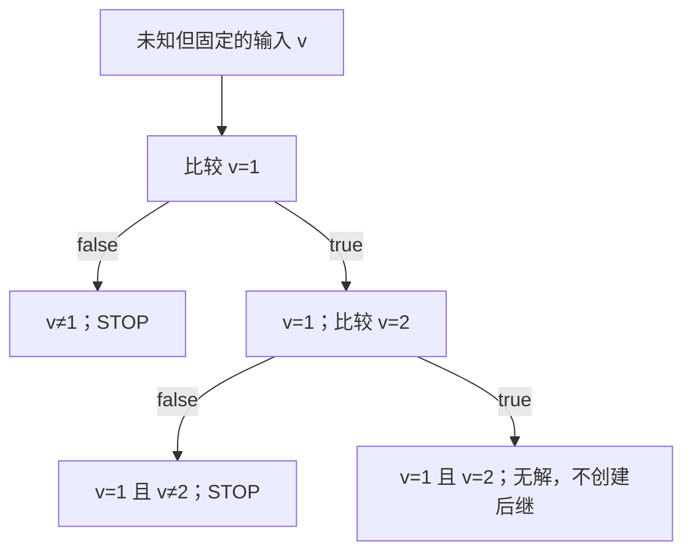

# 15：用表达式与关系约束筛掉矛盾分支

阅读路线：[理论：身份、路径与关系](routes/theory.md#relations) · [实现：表达式与求解接口](routes/implementation.md#relations) · [选择路线](learning-routes.md)。

[第 12 课](12-product-domains-facts.md)解释一个值保存哪些数值性质，[第 13 课](13-evm-environment.md)说明这些值对应哪些固定输入。本课再看多个值之间的关系，以及分支条件怎样限制后续执行。先只追踪一个输入和两个比较，再把这些信息放回 memory、storage 和调用中。具体字节位置与 slot 还不熟时，可以先读[第 14 课](14-memory-model.md)和[第 16 课](16-storage-model.md)的单单元实验。

## 1. 先看同一个输入不能同时等于 1 和 2

下面的程序保留同一次调用的 CALLVALUE，先判断它是否等于 1；进入 true 分支后，再判断它是否等于 2：

```bash
nix run . -- cfg --hex 3480600114600957005b80600214601257005b00 \
  --context-depth 0 --format json > /tmp/relations.json
```

### 先把这段程序读成三个小步骤

CALLVALUE 是本次调用附带的 wei 数量。省略 `--evm.value` 时，它没有被设置为零；我们用 v 表示同一帧中固定但未知的输入。先用伪语法理解控制流：

```text
v = CALLVALUE
if v == 1:
    if v == 2:
        到达末尾的块
```

函数形式和 if 只是教学记号。实际程序用 DUP 保留 v，再用 EQ 产生 0/1，最后让 JUMPI 弹出条件。关键片段如下；栈的最右边是栈顶。

| pc | 指令 | 执行后保留下来的栈 | 新发生的事 |
| --- | --- | --- | --- |
| `0x00` | CALLVALUE | `[v]` | 读入一个未知输入 |
| `0x01` | DUP1 | `[v,v]` | 两份位置保存同一个值 |
| `0x02` | PUSH1 1 | `[v,v,1]` | 准备第一次比较 |
| `0x04` | EQ | `[v,c1]` | c1 是 v 与 1 是否相等的 0/1 结果 |
| `0x05` | PUSH1 9 | `[v,c1,9]` | 9 是跳转目标的字节 pc |
| `0x07` | JUMPI | `[v]` | 弹出目标与 c1；为两个后继分别增加条件 |
| `0x09` | JUMPDEST | `[v]` | 只有第一次比较成立才进入这里 |
| `0x0a` | DUP1 | `[v,v]` | 保留 v，再比较一次 |
| `0x0b` | PUSH1 2 | `[v,v,2]` | 准备第二次比较 |
| `0x0d` | EQ | `[v,c2]` | c2 是 v 与 2 是否相等的结果 |
| `0x0e` | PUSH1 18 | `[v,c2,18]` | 18 即 `0x12`，不是状态编号 |
| `0x10` | JUMPI | `[v]` | 第二条 true 边还要求 v=2 |

第一次 JUMPI 的 false 后继在 `0x08` STOP；第二次的 false 后继在 `0x11` STOP。末尾 `0x12` 的 JUMPDEST 不是因为字节码无效而消失，而是没有输入能满足到达它的两项条件。

### 符号身份与路径条件各提供一半知识

“这是同一个 v”只说明两次使用有关联，没有说明 v 等于几。进入第一次 true 分支，才增加“当前路径上 v=1”。用 Φ 表示到达当前位置必须满足的条件，避免与字节码程序计数器 pc 混淆：

| 位置 | 当前路径条件 Φ | 能得到的知识 |
| --- | --- | --- |
| 第一次比较前 | true | v 可以是任意 U256 |
| 第一次 true 后继 | v=1 | 这里的输入只能取 1 |
| 第一次 false 后继 | v≠1 | 仍可取很多值，不能擅自选一个 |
| 第一次 true，再第二次 false | v=1 AND v≠2 | 可以发生；v=1 |
| 连续两次 true | v=1 AND v=2 | 矛盾；没有具体执行 |



关系层首先知道 EQ 的操作数和运算含义，才能把“c1 非零”解释成“v=1”。如果只保留 c1 的数值 `{0,1}`、丢掉它来自 `EQ(v,1)` 的关系，走过 true 边也不能自动收窄 v。

### 从 JSON 中确认边确实被排除了

状态 S 与原始块 B 不是同一编号。下面按 `basic_block_index=2` 找到第一次 true 后继所在的状态，再查看它的出边；这里的 B2 从 pc `0x09` 开始。

```bash
jq '(.states[] | select(.key.basic_block_index == 2) | .id) as $source
    | [.edges[] | select(.from == $source) | .kind]' /tmp/relations.json
```

默认关系分析只输出：

```json
["BranchFalse"]
```

原始字节码中仍有第二次比较和它的跳转目标；被排除的是这组输入和条件下的 true 后继。分析结果不创建那个后继，不等于删除了输入字节码。


可用以下命令关闭关系分析，比较保守 CFG：

```bash
nix run . -- cfg --hex 3480600114600957005b80600214601257005b00 \
  --context-depth 0 --no-relations --format json > /tmp/without-relations.json
```

再用同一个查询检查关闭关系后的结果：

```bash
jq '(.states[] | select(.key.basic_block_index == 2) | .id) as $source
    | [.edges[] | select(.from == $source) | .kind]' /tmp/without-relations.json
```

它输出 `BranchTrue` 与 `BranchFalse`。关闭关系分析仍保留数值转换与有限的输入/复制身份，但不持续保存这条分支的 v=1 条件。于是分析器没有足够信息排除连续 true/true，保守保留多余路径。

两次结果都可以是 Converged：一个模型已排除矛盾路径，另一个模型覆盖了更多路径。这是精度的差别，不能把保留假路径直接解释成分析没有完成。

要看条件怎样存入当前状态，可以查询 B2 的入口：

```bash
jq '.states[] | select(.key.basic_block_index == 2)
    | {entry_constants: .entry_stack[0].Constants,
       constraints: .entry_relations.constraints}' /tmp/relations.json
```

`entry_constants` 为 `["0x1"]`。constraints 中的 `Truth` 记录 EQ 的表达式及 `nonzero:true`：opcode 20 即十六进制 `0x14` 的 EQ，两个参数分别是常量 1 与 Input(CallValue)。输入表达式仍表示原来的 v，数值层则已经证明它在这个状态里只能为 1；不会为每条分支伪造一笔新的具体交易。

结果 JSON 的 `schema_version` 为 3；`domain_spec.schema_version` 与 `cost_version` 都为 2。原始字节码的输入记录在 `.environment`，world 分析的输入记录在 `.entry.environment`。输入和预算必须一起保留，才能解释某条边为何被排除或尚未完成。

## 2. 五层信息分别保存什么

| 层 | 当前表示 | 负责什么 |
| --- | --- | --- |
| 单值数值摘要 | `NumericValue` | 常量集合、已知位、区间、同余和非零性质 |
| 来源与角色 | `Provenance` | 可能来源类别、代码地址角色；同来源不证明相等 |
| 有限值身份 | `ValueIdentity` | 可信运行时复制、受环境作用域限定的输入身份 |
| 符号表达式 | `ExprId` | 常量、固定输入、fresh 运行时值和纯 EVM 运算的不可变 DAG |
| 跨值约束 | `RelationState` | 当前执行状态中必须成立的条件合取 |

`AbstractValue` 把数值、来源、身份和可选表达式放在一起。完整关系约束属于 `MachinePayload`，因为一个条件可以同时涉及栈、内存、账户状态与调用输入中的多个值。

先分别回答几个问题，就能理解上表为什么需要多层：

| 问题 | 只有这一项信息时，能回答到哪里 |
| --- | --- |
| v 的可能数值是什么？ | 不知道具体输入时可以保存完整范围；不能据此认为 v=1 |
| 两次 CALLVALUE 是否读同一个输入？ | 同一环境与帧中可以；不需要先知道数值 |
| y 怎样由 v 算出来？ | 表达式可以记住 `y=v+1`，而不把它只当成另一个无关未知数 |
| 哪些条件在当前状态必须成立？ | RelationState 可保存第一次 true 边给出的 v=1 |
| memory 中某个 byte 对应哪个值？ | 还需要字节数组的读写模型；表达式名字不会自动回答写入位置 |

例如纯运算 `v+1` 的结果，数值摘要可能仍很宽，但它的表达式保存了加法与同一个 v 的关系。源代码来源标签 Arithmetic 只说明“经历过算术”，不能替代这棵表达式。

当前实现可以识别两次分别计算的相同表达式。运行：

```bash
nix run . -- cfg --hex 5f356001015f356001011400 \
  --format json > /tmp/expression-repeat-on.json
nix run . -- cfg --hex 5f356001015f356001011400 \
  --no-relations --format json > /tmp/expression-repeat-off.json
jq '.states[0].exit_stack[0].Constants' \
  /tmp/expression-repeat-on.json /tmp/expression-repeat-off.json
```

手算顺序是：两次读取同一偏移的 root calldata word x，分别计算 x+1，最后 EQ。默认模式输出 `["0x1"]`；关闭表达式/关系模式输出 `["0x0","0x1"]`。两次加法不是靠“数值摘要长得一样”证明相等，而是表达式都引用同一个输入，并具有相同运算结构。ADD 在这里按 U256 回绕；两份相同输入仍产生相同结果。


数值与关系是两个维度。一个关系域也可以是数值关系域，例如保留 `x+y=3`；表达式 DAG 则提供关系使用的值身份和运算解释。仅给一个值起名字，不会自动得到完整路径约束。

例如，两条路径分别得到 `(x,y)=(1,2)`、`(2,1)`。逐值 join 得到 `{1,2}×{1,2}`，允许额外组合 `(1,1)`、`(2,2)`。若约束还保留模 `2^256` 的 `x+y=3`，就能排除这些组合。

## 3. 指令转换、assume 和数值精化

普通纯指令先计算数值摘要，再为已有操作数表达式建立结果表达式。常量折叠与安全规范化会减少节点，例如 `x+0=x`、`x XOR x=0`、零位移保持原值。没有可靠表达式的未知运行时结果使用 fresh 叶，不能把同一个 pc 的不同执行当作同一个未知值。

JUMPI 为两个后继分别复制状态，再应用：

```text
true 后继： assume(condition != 0)
false 后继：assume(condition == 0)
```

`assume` 是状态转换操作，不是必须单独新建的域。它将一条条件加入关系状态，并查询合取是否矛盾。已知位、数值界或完整有限候选可以作为同一表达式的保证导入；数值已经精确为常量时，直接保留该等式。

SMT 只把已证明的后果反馈给数值层。例如，所有满足约束的赋值都令 x=1，才将对应表达式的数值收窄为 1。完整有限候选也可以逐个检查：UNSAT 的候选可排除，Unknown 的候选不能被当作不可能。

| 查询结果 | 可以据此做什么 |
| --- | --- |
| SAT | 当前编码的合取可满足；继续分析 |
| UNSAT | 当前合取没有解；可排除该后继 |
| Unknown | 保留路径，记录限制或未知原因 |

SAT 不等于一条完整 EVM 轨迹的具体执行见证。内存、storage、调用效果等仍可能是抽象摘要；未被精确建模的部分不会因为一次 SMT 查询成功就变得精确。

## 4. join 和 widening 不能漏掉路径

每条路径内部的条件是合取；两条路径汇合时，所需覆盖的是它们的状态并集。

当前 `RelationState::join` 保留两边结构上共同的保证。例如左边保留 `x=1`、右边保留 `x=2`，join 不能把它们拼成 `x=1 AND x=2`，否则会错误删除两条合法路径。当前实现也不会自动将它们转换成一个精确析取；共同项之外的信息可能丢失。

### 一个合并会丢掉的条件关系

假设某个已给定的调用效果模型有两类出口，x 是调用后读取的 slot 值：

```text
成功：ok=1，x 可以是任意 U256
失败：ok=0，x=1
```

分开表示时，失败类保留 `ok=0 ⇒ x=1`。如果把两个字段各自 join，只剩：

```text
ok ∈ {0,1}
x  ∈ 所有 U256
```

| 组合 | 两类出口原本是否允许 | 逐字段合并是否允许 |
| --- | --- | --- |
| `(0,1)` | 允许 | 允许 |
| `(1,9)` | 成功类允许 | 允许 |
| `(0,9)` | 失败类不允许 | 额外允许 |

随后只把 ok 收窄到 0，不能从已经丢掉的关系中自动找回 x=1。保留状态分区，或使用能表达该条件的关系表示，才可能维持这项信息。当前共同项 join 不保证保留任意条件析取；启用 SMT 也不能把没有保存的规则凭空找回来。

这里首先假设调用效果模型已经给出了这两类出口。它不是当前解释器自动为 UnknownTarget 生成的通用摘要。怎样描述未知调用的副作用，与怎样保留已知出口的关联，是两项不同工作。


数值层独立 join 同一槽位的摘要；表达式只有两边相同才保留。widening 对数值使用既有扩大规则，关系侧保守忘记变化的保证。已经证明矛盾的 bottom 不贡献新的可达状态；预算不足、Unknown 或来源类别冲突都不能伪装成 bottom。

循环中的值会改变。既不能一直按 pc 复用一个运行时未知值，也不能无限展开新的表达式树而忽略成本。节点、深度、状态和工作预算共同约束增长，达到边界留下 typed frontier。

## 5. 作用域与摘要重放

固定输入叶的身份包括私有环境作用域和输入名称。默认 caller 与 origin 关联同一个输入；不同作用域的同名 Caller 不能据此证明相等。不同身份也不证明不等，它们仍可能碰巧取到同一个具体值。

fresh 叶表示新产生的未知运行时值，不按字节码 pc 命名。DUP 复制一个已经存在的表达式；下一次独立执行则不能复用前一次未绑定的 fresh 值。

JSON 省略输入作用域和 fresh 的私有编号。它可以显示表达式结构与保存的条件，但两个叶都显示 `Fresh`，或两个输入显示相同名称，不足以在报告中证明它们是同一个变量；真实相等判断使用内部的作用域与身份。导出的结构不能直接当成无损的求解器状态重新加载。

调用摘要还需要两项约定：

1. 复用资格保留输入帧、完整 Store、环境、关系约束、快照与分析策略。
2. 重放时，绑定真实输入，给被保存子调用的内部 fresh 叶重命名；悬停 caller 中的旧值、已经存在的 Store 值和外部输入不能被误改。

重命名覆盖值表达式及其关系约束，包括帧数据、返回字节和状态效果。仅重命名出栈、保留旧约束中的变量，或按字符串名称绑定不同调用，都可能造成错误关联。

表达式 JSON 隐藏私有输入作用域及 fresh 编号，只用于解释当前报告中的表达式结构。它不是可反序列化、可跨报告直接复用的证明证书；同名的打印叶不能证明不同分析的输入相同。

## 6. Word256 编码与字节往返

三个后端共用 EVM 运算到定宽位向量的编码规则，再分别交给 Z3、Bitwuzla 或 cvc5。位向量显式保留宽度，不把 EVM word 默认为无界整数。

- ADD、SUB、MUL 等运算按模 `2^256` 回绕。
- DIV、SDIV、MOD、SMOD 显式处理除数零；有符号运算保留 EVM 的符号和溢出规则。
- ADDMOD、MULMOD 保留足够宽的中间结果后取模，不能先截成 256 位再取模。
- BYTE、SIGNEXTEND、逻辑位移、算术位移与 CLZ 使用相应 Word256 规则。
- EXP 使用精确平方乘编码；字面量指数只处理有效位。中间乘积由局部 BV 变量及定义等式连接，避免向模型求值传入指数级展开的乘积树。

完整符号指数需要较多编码节点，可能在默认节点预算下成为 `ExpressionLimit`；扩大节点预算也不保证 native solver 能在给定 rlimit 内完成。资源限制保留 Unknown，不能据此猜测 EXP 结果。

MSTORE 拆出的 32 个有序 `BYTE(i,word)`，若都引用同一表达式和作用域，可在 MLOAD 时恢复这个 word 表达式。部分字节、顺序变化、混合来源或无法证明的重组不能强行恢复同一身份。这个规则减少表达式重复增长，不是通用的符号数组或内存别名求解器。

### 有值的表达式，不等于有符号索引数组

这两个场景要分开手算：

| 场景 | 当前能保存的联系 | 仍需怎样的存储知识 |
| --- | --- | --- |
| `MSTORE(0,x); MLOAD(0)` | 具体位置上的 BYTE 表达式有机会组装回 x | 已知读取的是刚写过的那 32 个字节 |
| `MSTORE(p,7); MLOAD(p)`，p 未能具体化 | 知道两次 p 是同一输入 | 未知位置写入当前会粗化字节表，没有一般的符号索引写后读规则 |
| `SSTORE(0,x+1); SLOAD(0)` | 具体 slot 的单元可保存并读回表达式 | 读写必须仍指向同一账户和具体 slot |
| `SSTORE(k,7); SLOAD(k)`，k 未能具体化 | 知道两次 k 是同一输入 | 弱更新合并“命中/未命中”的值后，未普遍保存位置与值的关联 |

如果路径条件先证明 p=0 或 k=0，操作数精化可以将相应读写变成具体位置的操作。这是“关系帮助寻址”，与直接实现 `select(store(array,k,v),k)=v` 的符号数组模型不同。前者现在已有；后者不能从两个值拥有相同符号身份直接推出。

[第 14 课](14-memory-model.md)逐字节观察第一、二行，[第 16 课](16-storage-model.md)观察第三、四行，以及强更新、弱更新和 RPC 初始值依赖。旧读取产生的 x 是当时的值；后续改写单元不会把 x 重新绑定为新值。


## 7. 原生后端与确定性资源预算

默认求解器是 Z3。下面用同一段字节码分别选择三个后端：

```bash
for provider in z3 bitwuzla cvc5; do
  nix run . -- cfg --hex 3480600114600957005b80600214601257005b00 \
    --context-depth 0 --smt.provider "$provider" --smt.rlimit 100000
done
```

三个求解器都通过原生库的接口在当前进程内运行。查询之间不共用可变求解状态，原生表达式和求解器句柄不存入执行状态或摘要。关系分析只依赖统一的查询结果：可满足、不可满足、无法判定，以及被证明的唯一值或候选值集合；选择后端不改变 EVM 指令的编码规则。

cvc5 使用固定的原生策略：关闭会将中间变量代回表达式的非子句简化，并启用位向量算术抽象。后者先处理较小的问题，再检查、补充被暂时省略的算术关系；原生求解器完成一致性检查后才报告 SAT。这样避免连续平方在预算检查前就被展开成巨大的乘法表达式或布尔条件。所有原始等式仍被保留；资源不够时仍返回 Unknown。对应选项是 [`simplification=none`](https://cvc5.github.io/docs/cvc5-1.4.0/options.html#lbl-option-simplification) 和 [`bv-abstraction=true`](https://github.com/cvc5/cvc5/blob/cvc5-1.4.0/src/theory/bv/bv_solver_bitblast.cpp)。

CFG 和 world 分析的文本报告会显示 `SMT=in-process z3`、`bitwuzla` 或 `cvc5`，并用 `resource unit` 标明额度的计数单位。JSON 中，单段字节码记录在 `.config.relations.provider` 和 `.config.relations.rlimit`，world/RPC 分析记录在 `.config.analysis.relations` 下；带 SSA 的 JSON 外层再包一层 `.analysis`。比较两份分析结果时，应同时保留求解器名称和资源额度。

`--smt.rlimit` 为每次检查分配求解额度，没有墙钟 timeout 或 deadline。默认值从 10000 提高到 100000；这给一次查询更多求解机会，也可能增加运行时间。达到资源限制、表达式边界或约束容量时，会留下相应原因；分析的共享 `max-work` 账本另行计入查询及数据处理工作。这些单位不是 EVM gas，也不是秒数。不同求解器的计数方式不同，`z3` 的 100000 与 `cvc5` 的 100000 不能视为同样的计算量，跨后端比较应观察实际结果、耗时及未完成原因。

| 后端 | `--smt.rlimit` 实际控制什么 | 文本报告中的单位 |
| --- | --- | --- |
| `z3` | Z3 自己的资源计数，每次检查设置原生 `rlimit` | `z3 resource units` |
| `cvc5` | cvc5 自己的资源计数，每次检查设置原生 `rlimit-per` | `cvc5 resource units` |
| `bitwuzla` | 允许求解器询问“是否应该停止”的次数；次数用尽后要求它停止 | `termination checks (cooperative)` |

Bitwuzla 的限制是协作式的：它在预处理的循环边界和单线程 CaDiCaL 求解过程中调用停止检查；CaDiCaL 是它用于判断布尔条件的内部引擎。检查次数用尽不代表已经完成的基本运算恰好等于该次数。一次预处理、把位向量转换为布尔条件的过程，以及提取满足条件的赋值，都不受这个次数逐步约束。因此，`--smt.rlimit 100000` 不能当作整个 Bitwuzla 调用的严格工作量上限。所有后端在构造原生表达式和读取结果时也会做额外工作，表达式节点、深度和分析总工作预算仍需同时保留。

| 参数 | 当前默认值 | 限制什么 |
| --- | --- | --- |
| `--no-relations` | 默认启用关系分析 | 关闭表达式传播和关系查询，保留数值及可信复制/输入身份 |
| `--max-symbolic-nodes` | 1024 | 保留表达式及单次编码遍历的节点工作量 |
| `--max-symbolic-depth` | 64 | 表达式嵌套深度 |
| `--max-relations` | 128 | 当前关系合取的原子数 |
| `--smt.provider` | `z3` | 进程内后端，可选 `z3`、`bitwuzla`、`cvc5` |
| `--smt.rlimit` | 100000 | 单次求解检查的资源额度，单位由所选后端决定 |

节点数按展开树计，是共享 DAG 工作量的保守上界；不能因为子节点共享就把深度或数值溢出当作已经完成。构造超过限制或计数溢出时显式拒绝，不保留被低估的大小。

`--max-facts` 仍控制数值域内一次临时事实交换的容量；它不是持久关系状态的容量。`--context-depth` 仍保留跳转来源历史，也不是路径条件表。增大这些参数不能代替缺少的语义，或让预算中断的图变成完整证明。

## 源码与验证入口

- [`symbolic.rs`](../crates/evm-abstract/src/domain/symbolic.rs)：作用域、结构表达式、fresh 叶、规范化和节点边界。
- [`relational.rs`](../crates/evm-abstract/src/domain/relational.rs)：保证导入、assume、join/widening、相关性与查询结果。
- [`relational/solver.rs`](../crates/evm-abstract/src/domain/relational/solver.rs)：共享的 EVM 定宽位向量编码、关系查询和结果解释。
- [`embedded-smt`](../crates/embedded-smt/src/lib.rs)：与 EVM 无关的求解接口、三个进程内后端及各自的资源计数。
- [`transfer/relations.rs`](../crates/evm-abstract/src/analysis/transfer/relations.rs)：分支假设与回写数值。
- [`summary/replay.rs`](../crates/evm-abstract/src/analysis/summary/replay.rs)：资格检查后的 fresh 重命名和 caller 前缀恢复。
- [`relational/tests.rs`](../crates/evm-abstract/src/domain/relational/tests.rs)、[`symbolic/tests.rs`](../crates/evm-abstract/src/domain/symbolic/tests.rs)、[`tests/relations.rs`](../crates/evm-abstract/tests/relations.rs)：Word256 编码、作用域、预算、矛盾分支、内存和摘要回归。

这些测试覆盖当前实现，不代表任意 EVM 程序都能精确恢复路径。判断一次结果时仍需同时读取输入、数值策略、关系预算、status 和 frontiers。
