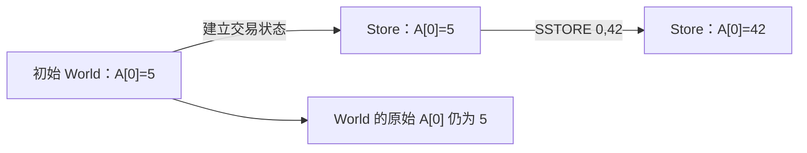
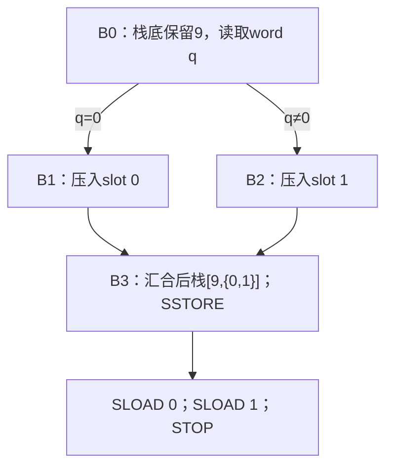

# 16：从一个 slot 到调用回滚，逐步读懂 storage 模型

阅读路线：[理论：槽位、别名与更新](routes/theory.md#memory-storage) · [实现：Store 与读写策略](routes/implementation.md#memory-storage) · [选择路线](learning-routes.md)。

本课从两条指令开始：SSTORE 保存一个 word，SLOAD 读取一个 word。每个实验先列真实执行中的栈与状态，再观察当前分析器怎样表示它们。读完后，你应该能解释三个看起来矛盾的结果：不知道初始值却能精确读出 7、刚写入 7 却读出 `{0,7}`、更深回调写过 9 而父调用最后读出 1。

只需要[第 00 课的栈读法](00-start.md#第二步先手算这个程序)。没有读过 memory 课也能开始；遇到比较时，可以打开[第 14 课](14-memory-model.md)。所有命令在仓库根目录执行，使用默认 Osaka、默认组合数值域与关系分析，都是离线合成例子，不需要 RPC、钱包或资金。JSON 查询需要 `jq`。

本课的新文件位于 [`examples/storage-*.json`](../examples/README.md#storage先读懂一个账户的单元再增加调用层级)，它们仍然是 **world 输入**，所以使用 `--world`；文件不必放在 [`examples/worlds/`](../examples/worlds) 才能这样使用。这里没有为简单读写实验添加额外调用，避免把调用规则混进第一步。

## 1. storage 的位置由两个数确定

memory 的位置是当前帧中的字节偏移。storage 的位置是：

```text
（状态所属账户地址，slot 编号）
```

账户地址有 160 位；slot 编号和每个 slot 的值都是 256 位。slot 编号不是 memory 的字节偏移：

| 操作 | 定位的范围 | 内容 |
| --- | --- | --- |
| `MSTORE(0,42)` | 当前帧的 memory 字节 0～31 | 把 42 拆成 32 字节 |
| `SSTORE(0,42)` | 当前状态账户的 slot 0 | 一个完整的 word 42 |
| `SSTORE(1,7)` | 同一账户的 slot 1 | 另一个完整的 word 7 |

SSTORE 的 slot 1 不会与 slot 0 重叠，也不需要扩容或 MSIZE。memory 在偏移 1 执行 MSTORE 则会写字节 1～32，与偏移 0 的写入重叠。不能把这两种地址加一理解成同一种操作。

用 A 表示 `0x0000000000000000000000000000000000000101`：

```text
(A,0) = 5
(A,1) = 7
(B,0) = 9
```

这三个是不同单元。A 和 B 的 slot 编号都为 0，并不意味着它们共享值。SLOAD 的栈参数只有 slot；账户由当前帧的 **state owner（状态所属账户）** 决定。[第 8 节](#8-调用时谁拥有-storage谁拥有-memory)再解释为什么执行代码的账户与 state owner 可能不同。

本文的 `SSTORE(k,v)` 是便于讲解的函数形式，实际指令从栈弹参数。栈按 **底 → 顶** 排列，最右边是栈顶：

```text
执行前 [v,k] → SSTORE 先弹 k，再弹 v → 执行后 []
执行前 [k]   → SLOAD 弹 k，压入读取结果 → 执行后 [结果]
```

## 2. 第一个实验：替换 slot 0，读取 slot 0 和 slot 1

打开 [`storage-basic.json`](../examples/storage-basic.json)。与本步有关的初始事实是：

```json
"storage": { "0x0": "0x5", "0x1": "0x7" },
"storage_unknown": false
```

`"0x0"` 是 slot 编号，右边的 `"0x5"` 是这个 slot 的初始 word 值。两者都是十六进制字符串。`storage_unknown:false` 的意义在[下一节](#3-初始快照与当前状态是两份不同的东西)展开，现在先看已明确列出的两个 slot。

```bash
nix run . -- explain --world examples/storage-basic.json \
  --evm.to 0x0000000000000000000000000000000000000101 \
  --evm.caller 0x0000000000000000000000000000000000001000 \
  --evm.value 0 --evm.calldata 0x
```

程序字节码是 `60 2a 5f 55 5f 54 60 01 54 00`。在真实、成功到达 STOP 的执行中：

| pc（十六进制） | 指令 | 执行后的栈（底 → 顶） | A 的 slot 0 | A 的 slot 1 |
| --- | --- | --- | --- | --- |
| 开始 | 尚未执行 | `[]` | 5 | 7 |
| `0x00` | PUSH1 `0x2a` | `[42]` | 5 | 7 |
| `0x02` | PUSH0 | `[42,0]` | 5 | 7 |
| `0x03` | SSTORE | `[]` | **42** | 7 |
| `0x04` | PUSH0 | `[0]` | 42 | 7 |
| `0x05` | SLOAD | `[42]` | 42 | 7 |
| `0x06` | PUSH1 `0x01` | `[42,1]` | 42 | 7 |
| `0x08` | SLOAD | `[42,7]` | 42 | 7 |
| `0x09` | STOP | `[42,7]` | 42 | 7 |

SLOAD 不会删除存储值；它把读取结果复制到栈上。第二次 SLOAD 也不会弹走先前的 42，它只消费栈顶的 slot 编号 1。

在报告 CFG 分区找到：

```text
stack in  []
stack out [{0x2a}, {0x7}]
```

外层 `[]` 是两个栈位置，内层 `{}` 是每个位置的数值候选。`0x2a` 是十进制 42，`0x7` 是 7。两个候选集合都只有一个数，说明这里数值已确定。

报告的成功 `Return` outcome 会列出 `A0[0x0]={0x2a}`。这里 `A0` 是报告的地址目录编号，不是 slot 0；slot 编号在方括号里面。STOP 在本项目的结束分类中属于成功 `Return`，其返回字节为空，不表示程序执行了 RETURN 指令。

### 报告为什么还会有 Failure

这些例子提供了具体 caller、零 value、空 calldata，但没有完全具体化 gas 环境。当前保守 gas 模型还可以保留失败 outcome。根调用失败时，Store 恢复根入口的状态，所以其中 slot 0 仍为 5。

这不妨碍报告为 `Converged`：完成分析可以同时包含成功与失败。下面分析写入结果时，会明确查看 `.kind == "Return"` 的 outcome；不能把任意第一个 outcome 当作成功后的状态。CFG 的 `stack out` 是抽象块执行的出口摘要，也不是每个失败位置的逐指令栈轨迹。

## 3. 初始快照与当前状态，是两份不同的东西

初始 world 表示分析开始时掌握的事实。Store 表示沿某条抽象执行路径变化的交易中状态。



这个图描述分析器内部对象的关系，不是向真实链提交交易。离线例子也不会改写输入 JSON。

把同一次分析保存成 JSON：

```bash
nix run . -- analyze --world examples/storage-basic.json \
  --evm.to 0x0000000000000000000000000000000000000101 \
  --evm.caller 0x0000000000000000000000000000000000001000 \
  --evm.value 0 --evm.calldata 0x --format json > /tmp/storage-basic.json

jq '{initial: .world.accounts["0x0000000000000000000000000000000000000101"].storage["0x0"].Constants,
     successful: [.outcomes[] | select(.kind == "Return")
                  | .store.persistent.slots[]
                  | {address, slot, constants: .value.Constants}]}' \
  /tmp/storage-basic.json
```

`initial` 为 `["0x5"]`；`successful` 列出的两个 slot 分别为 0→`["0x2a"]`、1→`["0x7"]`。同一份报告中，初始值 5 和交易后的值 42 同时出现是有意义的：它们属于不同时间的状态。

### 当前 Store 的三层查找

[`Plane`](../crates/evm-abstract/src/world/store.rs) 可以先理解成三张事实：

```text
slots[(账户,slot)]  这个具体单元的值
defaults[账户]     这个账户未单独列出单元的默认值
global_default     未单独设置账户默认值时的默认值
```

对具体 `(A,k)` 的读取顺序是：

1. 有显式 `(A,k)` 表项，就用它。
2. 没有这个表项，有 A 的默认值，就用 A 的默认值。
3. A 的默认值也没有，就用全局默认值。

这是**稀疏映射**：不必真的列出所有 `2^256` 个 slot。默认值概括未列出的部分。显式表中可以保存零、非零常量、有限集合或符号值，不是“非零 slot 清单”。

JSON 中 `.store.persistent.slots` 是数组，每项同时有 `address`、`slot`、`value`。不能只根据 slot 编号关联不同账户的条目。`.defaults` 是账户地址到值的对象；`.global_default` 是最终回退值。

### 没列出的 slot 是零，还是未知？

两个输入文件代码完全相同，都读取 slot 0、1、2；都只列出 slot 0=5，区别是 `storage_unknown`：

```bash
nix run . -- explain --world examples/storage-zero-default.json \
  --evm.to 0x0000000000000000000000000000000000000101 \
  --evm.caller 0x0000000000000000000000000000000000001000 \
  --evm.value 0 --evm.calldata 0x

nix run . -- explain --world examples/storage-unknown-default.json \
  --evm.to 0x0000000000000000000000000000000000000101 \
  --evm.caller 0x0000000000000000000000000000000000001000 \
  --evm.value 0 --evm.calldata 0x
```

| 初始声明 | 已列出的 slot 0 | 未列出的 slot 1、2 | `stack out` |
| --- | --- | --- | --- |
| `storage_unknown:false` | 5 | 已知为零 | `[{0x5}, {0x0}, {0x0}]` |
| `storage_unknown:true` | 5 | 可能是任意 U256 | `[{0x5}, ⊤, ⊤]` |

`false` 是输入提供的**完整性声明**，不是分析器根据“JSON 写得很短”猜其他位置为零。手工提供这个声明时，就限定了分析所代表的初始状态集合。

两个实验都为 `Converged`。第二个只是数值知识少：离线模式可以用未知初始值继续运算。不能把“初始值未知”直接等同于“有未展开的执行”。

未加载账户的 persistent storage 全局默认值为 Top，不因其他账户完整已知而变成零；没加载的账户也不能被据此当成不存在。

## 4. 能确定写哪个 slot，就替换旧值

[第 2 节](#2-第一个实验替换-slot-0读取-slot-0-和-slot-1)执行 `SSTORE(0,42)` 时，所有表示的执行都写同一个单元 `(A,0)`。所以：

```text
旧值 {5} → 写入 {42} → 新值 {42}
```

不用保留旧的 5。分析术语把这种替换称为**强更新**。“强”指能作出的保证较强，不表示 EVM 执行了特别强的写指令。

即使不知道初始值，也可以替换。运行：

```bash
nix run . -- explain --world examples/storage-write-unknown-initial.json \
  --evm.to 0x0000000000000000000000000000000000000101 \
  --evm.caller 0x0000000000000000000000000000000000001000 \
  --evm.value 0 --evm.calldata 0x
```

程序依次执行 `SLOAD(0); SSTORE(0,7); SLOAD(0)`，初始没有显式 slot，且 `storage_unknown:true`。

| 时刻 | 当前 A[0] | 栈上已读出的第一个值 |
| --- | --- | --- |
| 开始 | `⊤` | 尚未读取 |
| 第一次 SLOAD 后 | `⊤` | `⊤`，它是写入前读到的值 |
| SSTORE 后 | `{7}` | 仍然为 `⊤` |
| 第二次 SLOAD 后 | `{7}` | 第一个值仍不变；另压入 `{7}` |

出口是：

```text
stack out [⊤, {0x7}]
```

写入改变当前位置的值，不会追溯改变栈上先前读出的值。这里无需知道原来是 5、9 还是其他数，就能知道第二次读取为 7。[后面解释 RPC](#11-rpc-补查的是初始事实不是当前交易值) 时，会再次利用“当前值是否仍依赖初始值”这项区别。

## 5. 有两个可能的 slot，为什么要保留旧值

假设：

```text
A[0]=4
A[1]=7
k∈{0,1}
SSTORE(k,9)
```

一次真实执行中的 k 只有一个值，只写一个 slot：

| k 的具体选择 | 执行后的 A[0] | 执行后的 A[1] |
| --- | --- | --- |
| k=0 | 9 | 7 |
| k=1 | 4 | 9 |

如果不知道选择哪一行，分析器分别看每个位置：

```text
A[0]：有的执行写成9，有的执行没写 → {4,9}
A[1]：有的执行写成9，有的执行没写 → {7,9}
```

旧值和新值一起保留，叫**弱更新**。不能直接把两个位置都替换为 9，那样会漏掉真实的 `(9,7)` 和 `(4,9)`。

### 亲手制造两个候选

[`storage-finite-alias.json`](../examples/storage-finite-alias.json) 先读未知 calldata 的第一个 word。为零时选 slot 0，非零时选 slot 1，然后汇合写入 9：

```bash
nix run . -- explain --world examples/storage-finite-alias.json \
  --evm.to 0x0000000000000000000000000000000000000101 \
  --evm.caller 0x0000000000000000000000000000000000001000 \
  --evm.value 0 --context-depth 0
```

这里**故意没有** `--evm.calldata 0x`：省略意味着内容未知；给空 calldata 则 CALLDATALOAD 补零，只会选择 slot 0。

`--context-depth 0` 不按跳转来源历史区分状态，使两个候选在同一个状态汇合。它不是关闭关系分析，也不是设置调用深度为零。

程序先把 9 留在栈底，控制流如下：



跟踪两条具体路径：

| pc | 指令 | q=0 路径的栈 | q≠0 路径的栈 |
| --- | --- | --- | --- |
| `0x00` | PUSH1 9 | `[9]` | `[9]` |
| `0x02` | PUSH0 | `[9,0]` | `[9,0]` |
| `0x03` | CALLDATALOAD | `[9,q]`，q=0 | `[9,q]`，q≠0 |
| `0x04` | PUSH1 `0x0b` | `[9,q,11]` | `[9,q,11]` |
| `0x06` | JUMPI | `[9]`，不跳 | `[9]`，跳到 `0x0b` |
| `0x07` | PUSH0 | `[9,0]` | 不经过 |
| `0x08` | PUSH1 `0x0e` | `[9,0,14]` | 不经过 |
| `0x0a` | JUMP | `[9,0]`，跳到 `0x0e` | 不经过 |
| `0x0b` | JUMPDEST | 不经过 | `[9]` |
| `0x0c` | PUSH1 1 | 不经过 | `[9,1]` |
| `0x0e` | JUMPDEST | `[9,0]` | `[9,1]` |
| `0x0f` | SSTORE | `[]`，A[0]=9 | `[]`，A[1]=9 |
| `0x10` | PUSH0 | `[0]` | `[0]` |
| `0x11` | SLOAD | `[9]` | `[4]` |
| `0x12` | PUSH1 1 | `[9,1]` | `[4,1]` |
| `0x14` | SLOAD | `[9,7]` | `[4,9]` |
| `0x15` | STOP | `[9,7]` | `[4,9]` |

报告中的 B3 汇合状态则是：

```text
stack in  [{0x9}, {0x0, 0x1}]
stack out [{0x4, 0x9}, {0x7, 0x9}]
```

### 多出的组合在哪里

每个单元独立保存候选后，允许从两组中分别选一个值：

| `(A[0],A[1])` | 是否为上面某次成功写入的真实结果 | 独立候选是否允许 |
| --- | --- | --- |
| `(9,7)` | 是，k=0 | 是 |
| `(4,9)` | 是，k=1 | 是 |
| `(4,7)` | 否，这等于两个 slot 都没写 | 是，多出的组合 |
| `(9,9)` | 否，这等于两个 slot 都写 | 是，多出的组合 |

这不是 EVM 一次执行写了两个位置。它是**摘要丢失了“恰好命中一个”的关系**。两个真实结果都保留下来了，多出的组合使精度下降。当前关系 join 保留共同保证，不自动保存这个完整的条件析取；单元映射也不是通用的关系数组。

去掉 `--context-depth 0` 时，跳转历史可能使两条路保持为不同状态，暂时保留更多精度。若需要比较，应看每个状态或 outcome 的关系，不能把不同状态的数值再次随意组合。

## 6. 无法列出 slot 候选：刚写入再读为什么是 `{0,7}`

现在把 k 放宽为未知 calldata word，可以取任意 U256：

```text
初始：A 的所有 slot 都已知为零
k = CALLDATALOAD(0)
SSTORE(k,7)
x = SLOAD(k)
```

在真实执行中，写和读使用同一个 k。只要成功到达读取，x 必然是 7。

运行 [`storage-symbolic-key.json`](../examples/storage-symbolic-key.json)：

```bash
nix run . -- explain --world examples/storage-symbolic-key.json \
  --evm.to 0x0000000000000000000000000000000000000101 \
  --evm.caller 0x0000000000000000000000000000000000001000 \
  --evm.value 0
```

同样没有给 calldata。字节码是 `5f 35 80 60 07 90 55 54 00`，k 的相同身份没有靠“重复读取也许相等”来猜，而是直接 DUP：

| pc | 指令 | 执行后的栈 | 本步作用 |
| --- | --- | --- | --- |
| `0x00` | PUSH0 | `[0]` | calldata 偏移 0 |
| `0x01` | CALLDATALOAD | `[k]` | 得到未知 word k |
| `0x02` | DUP1 | `[k,k]` | 复制同一个值，留一个给以后读取 |
| `0x03` | PUSH1 7 | `[k,k,7]` | 压入写入值 |
| `0x05` | SWAP1 | `[k,7,k]` | 把写入位置放到栈顶 |
| `0x06` | SSTORE | `[k]` | 消耗最右边的 k 和 7 |
| `0x07` | SLOAD | `[x]` | 使用保留下来的同一个 k |
| `0x08` | STOP | `[x]` | 结束 |

当前输出为：

```text
status=Converged
stack out [{0x0, 0x7}]
```

一步一步看模型怎样得到它：

1. 开始时，A 的显式 slot 表为空，A 的默认值为 `{0}`。
2. k 无法完整枚举，不能为所有可能 k 分配表项。
3. 对任意一个具体 slot j，k 可能等于 j，也可能不等于 j。因此该单元要覆盖“被写为 7”和“保持 0”。
4. 当前实现把 A 的默认值更新为 `{0,7}`；已有显式 slot 也分别与 7 合并。本例没有显式 slot。
5. 随后的未知位置读取，合并该账户默认值与全部显式值，因此得到 `{0,7}`。

这几个步骤逐单元是保守的，但第 3 步没有保留“写入命中的位置正是后续读取的 k”。在读取时，这项关联已经丢失，所以额外出现了零。

用同一个代码固定输入为零，再观察：

```bash
nix run . -- explain --world examples/storage-symbolic-key.json \
  --evm.to 0x0000000000000000000000000000000000000101 \
  --evm.caller 0x0000000000000000000000000000000000001000 \
  --evm.value 0 --evm.calldata 0x
```

空 calldata 的 CALLDATALOAD(0) 补零，所以 k=0。变成具体位置强写，再从具体位置读，`stack out [{0x7}]`。变化的不是 EVM 的写后读规则，而是分析器能否确定映射键。

### 符号表达式为什么没有自动解决它

[第 15 课](15-symbolic-relations.md)中的表达式和关系状态已经能保存 k 的身份，DUP 也确实复制同一个 k。当前 storage 映射的键仍是具体 `(Address,U256)`，没有通用的符号数组更新链。

一般数组理论会保存类似关系：

```text
S1 = store(S0,k,7)
select(S1,k) = 7
```

这个 `store/select` 是逻辑数组操作的记号，不是当前 Store 的 Rust 方法签名。当前实现把 S1 概括成各单元和默认值，尚未保存这条符号索引更新关系。

“有表达式域”“有路径关系”“有具体位置映射”与“有完整符号数组模型”是不同能力。关系精化如果能证明 k=0，现有映射可以受益；不能证明具体键时，现有映射仍会弱更新。提高常量容量也不能列完任意 U256 的所有候选。

## 7. 未知写入值与未知写入位置，是不同问题

[上一节](#6-无法列出-slot-候选刚写入再读为什么是-07)的问题是位置未知。现在固定 slot 0，把未知值 y 写进去：

```text
x = CALLDATALOAD(0)
y = x + 1
SSTORE(0,y)
z = SLOAD(0)
EQ(y,z)
```

虽然无法知道 y 的数值，但所有执行都替换同一个 slot 0，映射可以保存 y 的表达式。运行：

```bash
nix run . -- explain --world examples/storage-symbolic-value.json \
  --evm.to 0x0000000000000000000000000000000000000101 \
  --evm.caller 0x0000000000000000000000000000000000001000 \
  --evm.value 0
```

关键栈变化是：

```text
得到 y          [y]
DUP1            [y,y]
PUSH0           [y,y,0]
SSTORE          [y]
PUSH0；SLOAD    [y,z]
EQ              [1]
```

当前 `stack out [{0x1}]`。数值仍可未知，关系 `y=z` 却足以证明相等。具体单元里的 AbstractValue 可以保存表达式；这没有要求 slot 本身也是符号键。

`x+1` 按 EVM 的模 `2^256` 算术执行，x 为最大 U256 时 y 回绕为零；相等性仍成立。推导并没有假设数学上的无界整数。

## 8. 调用时谁拥有 storage，谁拥有 memory

每个执行状态保存一份 Store，由这条执行路径上的各调用帧共享。这里“共享”是父子帧访问同一交易中状态，不是所有分析路径共享一个可变全局对象；分支之间仍然有各自的状态和汇合。

每个帧则有自己的栈、memory、calldata、returndata。创建子帧时，输入数据从父 memory 的切片复制为子 calldata；子 memory 初始全零。

普通 CALL 与 DELEGATECALL 要分开看：

| 操作 | 执行哪份代码 | SLOAD/SSTORE 属于哪个账户 | memory |
| --- | --- | --- | --- |
| A 普通 CALL B | B 的代码 | B | 新子帧的私有 memory |
| A DELEGATECALL B | B 的代码 | A | 仍是新子帧的私有 memory |

DELEGATECALL 沿用 state owner、caller 与 call value 等上下文，不是直接拿父帧 memory 继续执行。B 的代码访问 slot 0 时，指向 A[0]。

现有 [`proxy-storage.json`](../examples/worlds/proxy-storage.json) 中，有两个代理 P=`0x...0201`、Q=`0x...0202`，它们委托同一个实现 I=`0x...0300`。初始值：

```text
P[0]=5
Q[0]=9
I[0]=99
```

实现代码读 slot 0、加一、写回。两次委托都成功时，具体轨迹为 P[0]=6、Q[0]=10，I[0] 仍为 99。代码相同不意味着状态账户相同。

```bash
nix run . -- analyze --world examples/worlds/proxy-storage.json \
  --evm.to 0x0000000000000000000000000000000000000101 \
  --evm.caller 0x0000000000000000000000000000000000001000 \
  --evm.value 0 --evm.calldata 0x --format json > /tmp/storage-proxy.json

jq '[.states[] | .key.frames[]
     | select(.code_address == "0x0000000000000000000000000000000000000300")
     | {state_owner: .address, code_address}] | unique' /tmp/storage-proxy.json
```

会找到 state owner 分别为 `0x...0201` 和 `0x...0202` 的帧，code address 都是 `0x...0300`。报告的成功 outcomes 还保留模型允许的调用失败组合及 join，例如 `{5,6}`、`{9,10}`；不能把“具体两次成功轨迹”当成所有抽象 outcomes 的唯一值。

## 9. REVERT 恢复的是调用入口检查点，不是固定初始快照

先只想象普通 A→B：A 在调用前已经把自己的 slot 0 从 5 写成 1，B 再写自己的 slot 0。保存点应位于 **A 已写入 1、B 尚未开始** 的时刻。

如果 B REVERT：B 及更深调用所产生的 Store 修改撤销；A 在进入 B 之前的写入仍在。只有 A 也回滚，才进一步回到 A 的入口状态。

更深调用还可以重新进入 A。用 [`storage-callback-revert.json`](../examples/storage-callback-revert.json) 实际观察：

```text
A：初始 A[0]=5
   根路径先 A[0]=1，然后 CALL B
   若被 B 回调，则 A[0]=9，然后成功 STOP

B：初始 B[0]=4
   写 B[0]=7，CALL A，随后 REVERT
```

A 用 `CALLER == B` 区分回调路径和根路径。根 caller 在命令中固定为 `0x...1000`，所以根帧不会被误认为回调。

```bash
nix run . -- analyze --world examples/storage-callback-revert.json \
  --evm.to 0x0000000000000000000000000000000000000101 \
  --evm.caller 0x0000000000000000000000000000000000001000 \
  --evm.value 0 --evm.calldata 0x --format json > /tmp/storage-callback.json
```

在调用都成功进入子代码的具体轨迹中：

| 步骤 | 当前执行帧 | A[0] | B[0] | 保存与恢复 |
| --- | --- | --- | --- | --- |
| 1 | A 根帧入口 | 5 | 4 | 根保存点：`(5,4)` |
| 2 | A 写入 1 | 1 | 4 | 根保存点不变 |
| 3 | 进入 B | 1 | 4 | B 保存点：`(1,4)` |
| 4 | B 写入 7 | 1 | 7 | B 保存点不变 |
| 5 | B 回调进入 A | 1 | 7 | 回调保存点：`(1,7)` |
| 6 | 回调 A 写入 9，成功返回 | 9 | 7 | 成功修改暂时保留 |
| 7 | B REVERT | **1** | **4** | 恢复 B 保存点，包含更深回调的修改 |
| 8 | A 根帧继续读取 | 1 | 4 | A 的 CALL 返回 0，但 A 可以继续 |
| 9 | A 根帧 STOP | 1 | 4 | 根执行成功结束 |

回调 A 的修改能在 B 回滚时被撤销，说明保存的是 **整份 Store**，不是“B 自己账户的 storage 副本”。否则 A[0]=9 会错误残留。

### 先看到临时的 9，再看到恢复的 1

查询最深层 A 回调的块出口：

```bash
jq '[.states[]
     | select((.key.frames | length) == 3)
     | .exit.store.persistent.slots
     | map({address, slot, constants: .value.Constants})] | unique' \
  /tmp/storage-callback.json
```

结果中能看到 `(A[0],B[0])=(9,7)`。另一个更早的深层块出口仍是 `(1,7)`；这些是不同程序位置，不是最终交易状态。

再查询根成功结果：

```bash
jq '[.outcomes[] | select(.kind == "Return")
     | .store.persistent.slots
     | map({address, slot, constants: .value.Constants})] | unique' \
  /tmp/storage-callback.json
```

此时只有 A[0]=`["0x1"]`、B[0]=`["0x4"]`。它们与[调用过程表](#9-revert-恢复的是调用入口检查点不是固定初始快照)中的第 7 行一致。若看根 `Failure` outcome，A[0] 则为初始 5，因为根调用自身也回滚了；这又是另一个结束条件。

检查点同时覆盖 persistent/transient storage、余额、代码覆盖、账户生命周期和日志等 Store 内容。栈、memory 的归属不同：子帧被结束，父帧原来的私有状态仍在；调用返回的成功标志、returndata 及输出复制按调用规则更新父帧。

## 10. transient storage：同样按账户和 slot 寻址，但只属于本次交易

transient storage 的读写指令是 TLOAD/TSTORE。它不是 memory：仍然按账户和 256 位 slot 索引，调用之间按 state owner 规则共享；也不是 persistent storage：新交易开始时全零，不读取链上的持久 slot。

[`storage-transient.json`](../examples/storage-transient.json) 初始 persistent A[0]=5。程序先 SLOAD(0)，再 TLOAD(0)，然后 TSTORE(0,7)、TLOAD(0)：

```bash
nix run . -- explain --world examples/storage-transient.json \
  --evm.to 0x0000000000000000000000000000000000000101 \
  --evm.caller 0x0000000000000000000000000000000000001000 \
  --evm.value 0 --evm.calldata 0x
```

| 步骤 | persistent A[0] | transient A[0] | 栈 |
| --- | --- | --- | --- |
| 初始 | 5 | 0 | `[]` |
| SLOAD(0) | 5 | 0 | `[5]` |
| 第一次 TLOAD(0) | 5 | 0 | `[5,0]` |
| TSTORE(0,7) | 5 | 7 | `[5,0]` |
| 第二次 TLOAD(0) | 5 | 7 | `[5,0,7]` |

出口为 `[{0x5}, {0x0}, {0x7}]`。两种 storage 的 slot 编号虽然都是 0，却属于不同 plane（存储平面），TSTORE 没有覆盖 persistent 的 5。

当前 `Store::new` 为每次新分析的交易创建全零 transient。outcome 中可以保留本次结束时的 transient 值，供你查看执行效果；它不表示下一笔交易能继承这些值。transient 也参与子调用检查点与回滚。

## 11. RPC 补查的是初始事实，不是当前交易值

前面的例子都离线完成。本节只解释 RPC 模式的额外步骤，不要求运行联网命令。它与[第 3 节](#3-初始快照与当前状态是两份不同的东西)的 World/Store 区别直接相关。

假设固定区块 H 上 A[0]=5，但输入快照暂时没有这个 slot。RPC 分析遇到具体 SLOAD(0)，当前值又仍需要初始值时，记录：

```text
MissingStorage { address:A, slot:0 }
```

控制器可以向固定 H 请求初始值 5，把事实安装到 World，再从入口重新执行。它不会把 5 直接塞进已经执行到一半的 Store。

为什么？假设此前执行过：

```text
SSTORE(k,7)，k∈{0,1}
SLOAD(0)
```

写入可能命中 slot 0，也可能没命中。知道链上初始 slot 0=5 后，正确当前候选是 `{5,7}`，不是 5。必须将新初始事实带回程序重新执行，才能重新计算这些效果。

### 值未知，与依赖初始值，是两项事实

Store 另存一份 `InitialIndependence`，记录某个单元在**每条表示的路径上是否都已替换旧值，不再需要该 slot 的初始值作为未写中的兜底候选**。它不是“当前值是否确定”的标志，也不是 JSON 中 AbstractValue 的一个数值组件。

这里的“初始依赖”有特定含义：它描述当前单元的旧值兜底，不追踪写入值 y 自身的数据来源。例如 `y=SLOAD(0)+1; SSTORE(0,y)`，y 的数值仍依赖先前读取的初始 slot 0；但强写之后，后续 SLOAD(0) 直接读取已保存的 y，不再额外加入“可能没写中而保留的旧值”。RPC 模式会在前一个 SLOAD 需要初始事实时先补查，再重跑计算 y。不能把这个标志理解成强写消除了所有数据依赖。

| 已执行操作 | 当前 A[0] | 后续读 A[0] 是否仍需旧值兜底 | 理由 |
| --- | --- | --- | --- |
| 尚未写入，初始未知 | `⊤` | 是 | 读取只能来自初始状态 |
| 明确 SSTORE(0,3) | `{3}` | 否 | 每条路径都覆盖了 slot 0 |
| 明确 SSTORE(0,未知值 y) | y，数值可能为 `⊤` | 否 | 该 slot 旧值已被替换；y 的来源由前面的计算处理 |
| 对尚未强写的 slot，SSTORE({0,1},7) | 旧值与 7 的 join | 是 | 可能没命中 slot 0 |
| 先强写 0=3，再 SSTORE({0,1},7) | `{3,7}` | 否 | 两种结果都已与初始值无关 |

最后一行防止另一种误解：弱写不会自动恢复已经切断的初始依赖。slot 0 可能保持 3，也可能变为 7；两者都不需要原来是什么。

假设初始 A[0]、A[1] 都未知，先强写 0=3，再弱写 `{0,1}`=7，随后分别读取两个 slot：

```text
slot 0：{3,7}，不用查初始值
slot 1：可能是初始值或7，需要初始事实
```

若查到 H 上 slot 1=11，从入口重跑后 slot 1 得到 `{7,11}`。这是一项初始事实精化，不能直接把交易中的 slot 1 改成 11。

两条路径汇合时，只要有一条仍需要初始值，合并结果就仍可能需要；所以“独立于初始值”是所有路径都要满足的保证，用 AND 合并。检查点也保存和恢复这个保证，防止已回滚的强写错误地阻止后续补查。

### 什么情况下不能靠补查变精确

当前自动 storage 请求需要真实、具体的 state owner，以及具体或完整有限枚举的 slot 候选。不会随便从未知 k 中挑几个 slot，当成覆盖了所有可能位置；DELEGATECALL 则查询代理的状态地址。

未知 slot 的弱写不同于 `havoc`：弱写合并旧值和写入值；havoc 是明确丢弃相关当前事实、用 Top 概括当前状态效果。havoc 后不能通过读取链上旧值，恢复已被概括掉的交易中修改。

分析、RPC 补查与入口重跑共用累计工作和状态预算。记录了 MissingStorage 之后，也可能在补查前因为预算不足留下 Work；看到需求不表示已经发出请求。查到全部 slot 也不会自动解决 UnknownTarget、符号数组别名或其他模型边界。

## 12. 用一张表检查你理解的层次

| 问题 | 先查看什么 | 当前处理的重点 |
| --- | --- | --- |
| 这个 slot 属于谁？ | frame 的 state owner | code address 不一定是 owner |
| 没有显式表项是什么意思？ | account default，再看 global default | 完整零与未知是不同输入事实 |
| 能证明唯一 slot 吗？ | 数值 singleton、关系精化 | 唯一时强更新 |
| 只有有限候选吗？ | 完整常量集合 | 按候选弱更新，逐单元可能丢关联 |
| 无法枚举 slot 呢？ | 账户默认值与已有显式单元 | 全部弱合并，不建无限表 |
| 两次访问同一符号 k 能保证写后读吗？ | 是否有符号索引更新关系 | 当前映射不一般地保存这个关系 |
| 值未知还能证明相等吗？ | 具体位置保存的表达式 | 未知值与未知键不能混为一谈 |
| 调用失败后恢复到哪里？ | 该调用入口的整个 Store 检查点 | 包含更深调用效果，保留之前的父写入 |
| RPC 查询能替换当前值吗？ | 初始依赖与交易效果 | 补 World，从入口重跑 |
| 有 Top 为什么仍能 Converged？ | 是否已保守覆盖行为、是否还有 frontier | 精度与执行覆盖是两个维度 |

## 自检：先手算，再核对

1. 初始 A[0]=5、A[1]=7，执行 SSTORE(1,42)，再 SLOAD(0)。读取应是 5 还是 42？
2. 初始 A[0]=4、A[1]=7，k∈{0,1}，SSTORE(k,9) 后，真实结果有几对？逐单元候选又允许几对？
3. 为什么把[第 6 节](#6-无法列出-slot-候选刚写入再读为什么是-07)的 calldata 固定为空后，零这个多余候选消失了？
4. [第 9 节](#9-revert-恢复的是调用入口检查点不是固定初始快照) B REVERT 后，为什么 A[0] 是 1，不是 5，也不是 9？
5. 具体 slot 0 被写入未知 y 后，为什么后续读取不再因未写中的旧值兜底而补查初始 slot 0？

答案：1）5，因为账户内不同 slot 不重叠。2）两对 `(9,7)`、`(4,9)`；独立集合允许四对。3）k 变为具体 0，既能强写也能准确读同一位置。4）B 的检查点捕获在 A 写 1 之后、回调写 9 之前。5）所有路径都覆盖该单元，后续读取直接使用 y，不再把该 slot 的旧值作为未写中时的兜底；y 自身的数据来源另行处理。

## 源码入口

- [`world/store.rs`](../crates/evm-abstract/src/world/store.rs)：两个 Plane、默认值查找、读写、初始依赖、Store 保存与恢复。
- [`analysis/transfer.rs`](../crates/evm-abstract/src/analysis/transfer.rs)：SLOAD/SSTORE、TLOAD/TSTORE、操作数关系精化及 RPC storage 需求发现。
- [`analysis/machine/frame.rs`](../crates/evm-abstract/src/analysis/machine/frame.rs)：帧私有 memory 与调用检查点。
- [`analysis/transfer/calls.rs`](../crates/evm-abstract/src/analysis/transfer/calls.rs)：state owner、子调用结束、回滚与父帧恢复。
- [`analysis/rpc.rs`](../crates/evm-abstract/src/analysis/rpc.rs)：MissingStorage 收集、预算检查、补查与重新分析。
- [`world/store/storage_dependencies.rs`](../crates/evm-abstract/src/world/store/storage_dependencies.rs)：强写、弱写、join、回滚等初始依赖回归。

这里的模型描述当前实现。继续学习时，可以把“保存每个值的性质”“保存多个值的关系”“保存数组索引关系”“覆盖调用行为”逐项区分，再读[第 15 课](15-symbolic-relations.md)与[第 09 课](09-cross-contract.md)。
