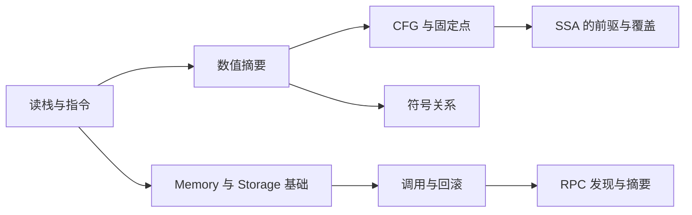

# 按专题模块学习

只想弄懂 memory 与 storage，或正在追踪一个 φ 的来源，可以直接选一个模块。模块把一个问题拆成几个小单元，列出最少前置知识、共用实验、源码入口和完成条件；不要求先读完整条理论或实现路线。

**模块决定学什么，路线决定从哪个角度学，章节保存完整讲解与实验。** 每个模块内部都能从理论或实现进入同一内容。需要系统学习时，回到[两条完整路线](learning-routes.md)；只解决当前问题时，完成模块中的核心单元即可停下，扩展单元按需继续。

第一次运行仓库，先做 [00 的准备与手算](00-start.md#第一步准备运行环境)。如果已经会运行命令、能按栈底到栈顶读栈，就直接根据下表选模块。这里的排列是问题索引，不是必修顺序。

## 选择当前问题

| 模块 | 适合解决的问题 | 里面有哪些小单元 | 共用正文 |
| --- | --- | --- | --- |
| [Memory & Storage](modules/memory-storage.md) | 字节与 slot 有什么区别？写后读为什么多出候选？ | memory 读写、storage 读写、别名与弱更新、归属与回滚 | [14](14-memory-model.md)、[16](16-storage-model.md) |
| [SSA 与部分执行](modules/ssa.md) | `%value`、φ、prefix stack、progress 各在说明什么？ | 值名与位置、入口 φ、执行前缀、覆盖与验证 | [04](04-ssa.md) |
| [CFG、固定点与敏感性](modules/control-flow.md) | 一个 Bᵢ 为什么对应多个 σᵢ？为什么同一状态会重跑？ | 状态与边、工作表、上下文划分、未知跳转 | [03](03-cfg.md)、[05](05-sensitivity.md) |
| [数值摘要与组合域](modules/domains.md) | `{1,2}`、Top、位与范围保留了什么？ | 覆盖与精度、join/transfer、组件交换、限制与身份 | [02](02-domain.md)、[12](12-product-domains-facts.md) |
| [符号关系与 SMT](modules/relations.md) | 同一个未知值如何跨指令关联？什么证据允许排除分支？ | 输入身份、分支假设、关系合并与作用域、表示和资源边界 | [15](15-symbolic-relations.md) |
| [调用、状态归属与回滚](modules/calls-state.md) | 谁的代码在跑？失败恢复哪一份状态？ | 调用与返回、代理/重入、嵌套回滚、状态容器与边界 | [09](09-cross-contract.md)、[11](11-state-backends.md) |
| [RPC、快照与调用摘要](modules/rpc-summaries.md) | 初始事实从哪里来？补查为何重跑？什么结果可以复用？ | 固定快照、按需补查、完整调用摘要、代码生命周期扩展 | [10](10-snapshots-summaries-creation.md) |
| [字节码、协议与输入](modules/execution.md) | 怎样解码？哪些字节能跳转到？默认分析哪些调用？ | 指令边界、基本块、fork、环境输入 | [00](00-start.md)、[01](01-bytecode.md)、[08](08-forks.md)、[13](13-evm-environment.md) |
| [边界、证据与验证](modules/evidence.md) | Converged 能说明什么？怎样验证一次修改？ | 完成状态、样本覆盖、结构验证、交付检查 | [06](06-boundaries.md)、[07](07-exercises.md)、[本地门禁](local-ci.md) |

## 一个模块怎样拆开学

以 [Memory & Storage](modules/memory-storage.md) 为例，先只做确定地址上的读写，再按需要进入别名和跨调用状态。核心读写不需要先理解 RPC、完整 CALL 报告或 SMT 编码。

| 你需要掌握到哪里 | 可以先学的小单元 | 暂时可以留到以后 |
| --- | --- | --- |
| 看懂 MSTORE/MLOAD 的数值、字节和长度 | memory 基础读写 | 未知位置、跨调用输出区 |
| 看懂 SSTORE/SLOAD 的 slot 和默认值 | storage 基础读写 | 代理、重入、RPC 槽位发现 |
| 解释为什么写后读变成多个候选 | 地址分类、别名与弱更新 | SMT 编码、摘要认证 |
| 追踪跨合约状态的提交和撤销 | 状态归属与回滚扩展 | 无关的字节码、域实现细节 |

同一个小单元也有两种方向。例如理解多候选地址写入：

- **理论方向：**先列出每种具体写入，再问合并后为什么必须保留未被写中的旧值，最后读 `ByteArray` 或 `Plane` 的实现。
- **实现方向：**先在写函数中定位单一地址、多候选地址和不可枚举地址的分支，再用具体写入检验强更新、弱更新和精度损失。

两种方向的完成条件相同：能预测输出、解释额外候选，并找到负责这条规则的代码。模块不会把两个方向变成两套互不一致的语义说明。

## 怎样补前置知识

每页只要求当前单元会用到的基础。例如 SSA 从会读栈开始，首单元学习值名，φ 单元再补前驱边；数值摘要需要理解一槽代表一个可能值集合；RPC 的 slot 发现需要先区分初始 world 与当前 Store。

遇到陌生概念时，回到模块给出的具体章节段落即可，不必把相邻模块全部学完。下面是常用的补充关系，箭头表示“需要时补这一块”，不表示运行时流水线：

图只说明常见关联。每个模块里还有能提前完成的基础单元，例如 SSA 的 DUP/SWAP 值名不需要先学完固定点，内存的确定地址读写不需要先学完组合域。

## 学完以后保留什么

每个小单元都要求留下一项可检查的结果：一张栈/字节/slot 表、一条值来源链、一组输入与输出对照，或一条源码规则与测试断言的对应关系。只记下“Converged”“Top”或“测试通过”，还不足以解释当前问题。

完整命令与预期结果仍保存在原章节，[例子索引](../examples/README.md)用于定位文件，[练习](07-exercises.md)用于自检。接着可以选择相邻模块，也可以回到[理论路线](routes/theory.md)或[实现路线](routes/implementation.md)，把已经学过的模块连接起来。回到 [README](../README.md#推荐阅读顺序)。
