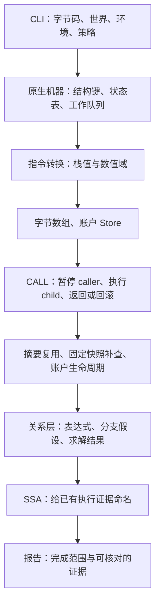

# 从实现出发：跟着一份输入穿过分析器

这条路线适合已经能读一点 Rust、想知道“命令执行后，数据究竟去了哪里”的读者。从一个实际输出开始，沿函数调用和数据结构追踪，再用理论检查这段实现为什么允许合并、剪枝或停止。无需先读完所有源码；每站只追踪一组输入和输出。

它与[从理论出发](theory.md)覆盖相同主题，顺序和提问方向不同。每站的“换个方向”链接落到另一条路线的同一主题；完整入口见[两条学习路线](../learning-routes.md)。课文仍保存详细推导、命令和预期输出，本页负责把它们串成一条可追踪的执行链。

这是阅读顺序。运行时并不是九遍独立处理：数值、内存、关系和调用转换都在同一个机器工作表中相互影响。建议始终在纸上保留三栏：**输入事实、当前机器状态、已记录的分析结果**。后面遇到名称相似的字段，先判断它属于哪一栏。

## 从 CLI 进入：这次究竟分析哪些执行？

先运行[第 00 课的直线程序](../00-start.md#第一步准备运行环境)，对照 [`straight-line.hex`](../../examples/straight-line.hex) 的手算与 `disasm / CFG / SSA` 三种输出。随后打开 [`main.rs`](../../crates/evm-abstract-cli/src/main.rs)，从 `run` 的命令分支往回找 `AnalysisArgs::analyze` 和 `WorldArgs::analyze`。此时只追踪传给库的对象，不必逐个背 CLI 参数。

| 到达库之前的数据 | 它代表什么 | 源码中怎样建立 |
| --- | --- | --- |
| `Program` | 按选定 fork 解码的指令、基本块、合法 JUMPDEST | `Input::load` → [`Program::from_hex_with_fork`](../../crates/evm-abstract/src/bytecode.rs#L134) |
| `World` | 入口执行前已观察到的账户事实 | [`world::load`](../../crates/evm-abstract-cli/src/world.rs#L138) 读取离线 JSON；RPC 路径另由采集器建立 |
| `Entry` / `EvmEnvironment` | 从哪个状态账户开始，以及 caller、value、calldata 等输入的范围与身份 | [`EvmArgs::environment`](../../crates/evm-abstract-cli/src/evm.rs#L143) 与 [`Entry`](../../crates/evm-abstract/src/world.rs#L383) |
| `Config` / `ExecutionConfig` | 值域、关系策略与分析资源上限 | [`Config::validate`](../../crates/evm-abstract/src/analysis/config.rs#L101) 生成 `ValidatedConfig`，`ExecutionConfig::domain` 另检查机器预算 |

沿 [`analysis::analyze_with_environment`](../../crates/evm-abstract/src/analysis.rs#L273) 进入 [`single::analyze`](../../crates/evm-abstract/src/analysis/single.rs)。你会看到单字节码入口也先创建一个 world，调用 `analyze_world`，再把根帧状态投影成学习用的 `Analysis`。继续读 [`engine::run_world` / `run_metered`](../../crates/evm-abstract/src/analysis/engine.rs)：入口校验、域策略建立和输入投影后，才创建机器初始状态。单账户视图与跨账户视图共享这条执行核心。

现在回看输入协议。[第 01 课](../01-bytecode.md#2-push-的立即数缺一半时怎么办)解释为什么 PUSH 后面的字节不能当成独立 opcode；[第 08 课](../08-forks.md#1-协议规则与分析精度是两种输入)解释 fork 为什么会改变具体执行规则；[第 13 课](../13-evm-environment.md#1-默认输入与目标账户)解释省略 calldata 与显式空 calldata 为什么覆盖不同输入。`Config` 的容量校验保证实现参数有效，不能证明输入事实完整；选择更大的预算也不会扩大用户明确限定的 calldata。

**核对问题：**同一份字节码，只把“未指定 calldata”改成 `--evm.calldata 0x`，为什么两次都可以 `Converged`，却覆盖不同的调用？用[第 06 课实验 D](../06-boundaries.md#实验-d同样收敛覆盖的调用输入不同)核对，再在结果中找到环境字段。

换个方向：[理论路线：具体执行与输入范围](theory.md#execution)。下一站追踪刚创建的机器状态怎样传播。

## 跟着工作队列：一个代码块怎样变成多个状态？

用 [`diamond.hex`](../../examples/diamond.hex) 做第一次完整追踪，按照[第 03 课的工作表表格](../03-cfg.md#3-手动走完一次工作表传播)记录“取出谁、执行后得到什么、谁重新排队”。源码从 [`Engine::run`](../../crates/evm-abstract/src/analysis/engine.rs#L282) 看三次交接：`transfer::execute` 执行当前块，`Engine::execution` 保存本次结果，`Engine::successor` 安装后继并决定是否重访。

本轮的输入是一个节点的最新 `entry`；输出不仅是下一块，还包括后继载荷、指令进度、诊断、前沿与终结结果。先分清下面三个结构，才能读懂状态表：

| 结构 | 回答什么 | 要观察的字段 |
| --- | --- | --- |
| [`MachineKey`](../../crates/evm-abstract/src/analysis/machine.rs#L87) | 哪些入口具有可合并的同一结构？ | 全部帧的代码身份、状态账户、位置、栈高、跳转历史，以及 Store 的代码/生命周期身份 |
| `MachinePayload` | 在这个结构下，值和效果可能是什么？ | `call_stack`、共享 `store`、`relations` |
| `MachineState` | 此节点目前保存了哪些分析证据？ | 已 join 的 `entry`、最近出口、`executed_pcs` 与执行凭据 |

在 [`Engine::successor`](../../crates/evm-abstract/src/analysis/engine.rs#L487) 中，找出“同键 join → 输入变化 → 旧执行凭据失效 → 重新排队”的分支。这里最容易漏掉的因果关系是：先前已执行的出口只对应先前的入口；入口扩大以后，不能用旧出口声称新输入也已处理。新输入没有扩大时不必重访，但发现的边仍要保存。

理论上，这一站检查的是[固定点和保守传播](../03-cfg.md#4-循环的固定点长什么样)：join/widening 必须覆盖旧输入和新输入；“这个节点见过了”不等于“后续信息不会再变化”。再用 [`internal-calls.hex`](../../examples/internal-calls.hex) 对照[第 05 课](../05-sensitivity.md)，查看最近 k 个跳转来源怎样进入键；用 [`stack-heights.hex`](../../examples/stack-heights.hex)确认不同入口栈高始终分开。k 描述每帧内部的历史，外部调用栈另有结构。

最后检查 `transfer::execute` 中的 JUMP/JUMPI 分支：目标集合决定候选，合法目标来自 `Program::jumpdest_blocks`。按照[未知跳转实验](../03-cfg.md#6-跳转目标未知时仍须保留后续行为)跟踪 [`dynamic-jump.hex`](../../examples/dynamic-jump.hex) 中的 SSTORE。不能完整枚举目标值时，仍可遍历满足数值约束的真正 JUMPDEST；候选展开被预算截断，则要保留 frontier。

**核对问题：**一个 B 可以对应两个 S，S 又可以执行多次；这三种计数分别在哪里增加？为什么仅看队列为空仍不足以判断完成？答案应包含 `Engine::run` 最终检查 frontiers 的步骤。

换个方向：[理论路线：控制流、固定点与敏感性](theory.md#control-flow)。下一站进入块转换，看一个栈槽究竟装了什么。

## 进入一条算术指令：AbstractValue 怎样变成另一个 AbstractValue？

在 [`transfer::execute`](../../crates/evm-abstract/src/analysis/transfer.rs) 中找普通算术指令的处理：按 EVM 顺序弹出操作数，交给域运算，再把结果压回活动帧。它的输入是 opcode 和若干 `AbstractValue`；输出是数值结果以及本次计算留下的精度、表达式或资源信息。先用[第 02 课的 transfer 手算](../02-domain.md#4-transfer在摘要上执行指令)对齐弹栈顺序，再读 [`Domain::apply_detailed`](../../crates/evm-abstract/src/domain.rs#L294)。

顺着结果往里追，会经过 [`AbstractValue`](../../crates/evm-abstract/src/domain/value.rs#L16) 和 [`NumericValue`](../../crates/evm-abstract/src/domain/numeric.rs)。前者把数值组件、来源、身份与可选表达式放在一起；后者表示同一个 word 的有限常量、位、区间和同余约束。`DomainSpec` 则是整次分析共用的策略，不能把某个值的内容和域策略混成同一对象。

最小实验选[第 12 课的位条件](../12-product-domains-facts.md#1-先手算这个条件可能为零吗)：[`known-bits-branch.hex`](../../examples/known-bits-branch.hex) 中 `(x AND 15) OR 1` 的最低位一定为 1。沿 [`domain/transfer.rs`](../../crates/evm-abstract/src/domain/transfer.rs) 看 opcode 怎样更新组件，再沿 [`reduce::reduce`](../../crates/evm-abstract/src/domain/reduce.rs#L329) 看组件怎样交换已证明的事实，最后回到 `may_be_zero` 的分支判断。这个结果如何少掉 false 边，现在可以从值传递解释出来。

这里要用[第 02 课的 join](../02-domain.md#3-join把两条路径的信息合在一起)和[第 12 课的组件组合](../12-product-domains-facts.md#5-同一值的约束取交不同路径的可能取并)检查两个相反方向：多个组件描述同一值时，其约束取交；多个执行路径汇合时，摘要必须覆盖并集。当前实现保存组件逐项 join，事实交换有轮数和容量上限；不能因此称它已经计算出唯一、完全规约的 reduced product。

再比较 [`copy-identity.hex`](../../examples/copy-identity.hex) 与 [`independent-inputs.hex`](../../examples/independent-inputs.hex)，按[身份实验](../12-product-domains-facts.md#2-再手算两个未知值一定相同吗)寻找 `numeric_apply_detailed` 中的身份规则。两个值都有 Calldata 来源，不足以证明相等；同一受信任输入或复制身份才提供相应依据。这些身份属于共用 `AbstractValue`，不是 product profile 独有的数值能力。

**核对问题：**常量集合容不下候选时，为什么 product 仍可能证明非零？再看[局部交换停止的实验](../06-boundaries.md#实验-c局部交换停下整体传播仍然完成)：事实交换达到上限与根工作预算耗尽，为什么产生不同的完成状态？

换个方向：[理论路线：抽象值与组合域](theory.md#domains)。下一站把一个 word 拆成字节，或写入账户状态。

## 跟着 MSTORE 与 SSTORE：值写到了哪一份状态？

先用 [`memory-word.hex`](../../examples/memory-word.hex) 的 [MSTORE/MLOAD 实验](../14-memory-model.md#2-第一个实验写入-42再读出来)，再用 [`storage-basic.json`](../../examples/storage-basic.json) 的 [SSTORE/SLOAD 实验](../16-storage-model.md#2-第一个实验替换-slot-0读取-slot-0-和-slot-1)。两者都从栈取 word，但寻址单位、初始默认值和所属状态不同。

| 指令路径 | 输入 → 输出 | 实现中的观察位置 |
| --- | --- | --- |
| MSTORE / MLOAD | 字节偏移与 word → 帧内字节更新，或组装出的 word | [`ByteArray::write_word` / `read_word`](../../crates/evm-abstract/src/world/bytes.rs)；[`FrameState::memory`](../../crates/evm-abstract/src/analysis/machine/frame.rs#L13) |
| SSTORE / SLOAD | 状态账户、256 位 slot、word → 交易内状态更新，或 slot 摘要 | [`Store::write` / `read`](../../crates/evm-abstract/src/world/store.rs#L502)，向下追踪 `Plane::write` / `read` |
| TSTORE / TLOAD | 同样的账户与 slot → 本次交易的 transient plane | `Store::write_transient` / `read_transient`，与 persistent plane 分开 |

先读数据结构再读分支：`ByteArray` 保存长度、默认字节与稀疏字节项；`Plane` 保存默认值与显式 slot。因而“映射中没有这一项”并不直接等于未知。memory 初始读零；storage 的未列出 slot 是否为零，取决于输入是否声明完整。用[第 16 课的默认值对照](../16-storage-model.md#没列出的-slot-是零还是未知)检查这点。

接着在两个写函数中追踪地址分类：确定的单一位置可以替换旧值；若位置有多个候选，每个位置都可能没有被写到，因此要保留旧值并合并新值；不可枚举的位置需要更宽的更新。用 [`memory-write-alias.hex`](../../examples/memory-write-alias.hex) 和 [`storage-finite-alias.json`](../../examples/storage-finite-alias.json)，分别核对[内存写入合并](../14-memory-model.md#6-地址确定时覆盖地址有几个候选时合并)与[两个 slot 候选](../16-storage-model.md#5-有两个可能的-slot为什么要保留旧值)。这就是强更新与弱更新在当前容器中的具体落点。

理论约束是：一次可能写入不能抹去“本次其实写了别处”的执行。代价是不同字节、不同 slot 的配对关系可能丢失。继续看[字节相关性实验](../14-memory-model.md#8-为什么刚存进去再读出来会多出候选)以及 [`storage-symbolic-key.json`](../../examples/storage-symbolic-key.json) 的[符号索引实验](../16-storage-model.md#6-无法列出-slot-候选刚写入再读为什么是-07)。当前标量表达式不是通用数组 `select/store` 模型；保留了写入值的表达式，也不自动恢复未知索引的写后读关系。

**核对问题：**对同一未知 slot 写 7 再读，为什么完整零默认的 storage 仍可能得到 `{0,7}`？请分别指出索引无法枚举、默认值弱更新和读取的位置，不要只回答“因为值是 Top”。

换个方向：[理论路线：内存与 storage 抽象](theory.md#memory-storage)。下一站把这些状态放入真实调用链，检查它们归谁所有。

## 穿过 CALL：哪一帧暂停，哪些效果会回滚？

用 [`call-return-branch.json`](../../examples/worlds/call-return-branch.json) 跟踪[第 09 课的调用实验](../09-cross-contract.md#1-第一个实验b-返回-1a-写入-1)。从 [`calls::call`](../../crates/evm-abstract/src/analysis/transfer/calls.rs#L247) 进入：输入是 caller 的机器载荷和 CALL 参数；输出可能是安装了子帧的后继、立即失败的后继，或尚不能展开的 frontier。CALL 不是另开一个完全独立的分析器。

打开 [`CallStack`](../../crates/evm-abstract/src/analysis/machine/stack.rs) 与 [`RootFrame` / `ChildFrame`](../../crates/evm-abstract/src/analysis/machine/frame.rs#L94)。根帧始终存在；子帧还携带 [`Continuation`](../../crates/evm-abstract/src/analysis/machine.rs#L96)，记录 caller 的继续位置和请求的输出范围。callee 有独立的 memory、calldata、returndata，而所有帧共享交易 `Store`。再用[代理实验](../09-cross-contract.md#4-代理实验读谁的代码写谁的-storage)核对 [`proxy-storage.json`](../../examples/worlds/proxy-storage.json)：执行代码账户与 storage owner 必须分别追踪。

返回时沿 [`calls::finish`](../../crates/evm-abstract/src/analysis/transfer/calls.rs#L116) 阅读。成功、REVERT 和异常终止决定是否恢复子帧入口的 Store 检查点；随后恢复 caller，把返回字节放入 caller 的 returndata，按请求范围复制到 memory，并在调用结果位置压入结果。REVERT 的字节可以交回 caller，同时它的状态效果被撤销；这两件事并不矛盾。

现在运行[嵌套回滚实验](../16-storage-model.md#9-revert-恢复的是调用入口检查点不是固定初始快照)，观察 [`storage-callback-revert.json`](../../examples/storage-callback-revert.json)。沿 [`Store::snapshot` / `restore`](../../crates/evm-abstract/src/world/store.rs#L984) 进入 [`Checkpoint`](../../crates/snapshot-state/src/checkpoint.rs)，再按[第 11 课的后端比较](../11-state-backends.md#先核对语义再观察时间)阅读 [`OrderedMap`](../../crates/snapshot-state/src/ordered_map.rs)。std 与 imbl 改变保留旧版本的实现成本；何时回滚、如何 join 仍由执行器与 Store 决定。

这一站的理论检验是“回到正确的调用入口状态”。B 内部成功的 C 会影响当前 Store；若 B 随后失败，恢复 B 的检查点必须连同 C 的效果一起撤销，同时保留 A 在调用 B 前的修改。用[重入实验](../09-cross-contract.md#6-重入新帧读到当前状态)检查新帧读的是当前 Store，而不是固定 world 的旧值。

**核对问题：**暂停的 caller 为什么也必须留在 `MachinePayload` 中？若只缓存一个 callee 返回 word，会漏掉哪几项恢复 caller 所需的信息？再对照[缺失代码实验](../09-cross-contract.md#7-输入缺失和预算停止也要读出来)：`MissingCode` 或 `UnknownTarget` 为什么不能被替换成“CALL 已返回 0”？

换个方向：[理论路线：调用、状态归属与回滚](theory.md#calls-state)。下一站检查调用结果什么时候能复用，以及世界事实从哪里补齐。

## 检查复用与事实来源：输入相同究竟要相同到哪里？

这一站仍追踪同一台机器，但观察三种会改变后续工作的交接：完整子图被复用、初始世界补入事实，以及交易内创建/销毁账户。三者都必须保留“这些结果属于什么身份”的约束。

先运行 [`summary-reuse.json`](../../examples/worlds/summary-reuse.json) 的[摘要开关对照](../10-snapshots-summaries-creation.md#1-调用摘要复用完整结果关系)。从 [`Engine::try_summary`](../../crates/evm-abstract/src/analysis/engine.rs) 进入 [`Cache::input` / `lookup` / `publish_closed`](../../crates/evm-abstract/src/analysis/summary.rs)。输入资格包含 world、策略、callee 环境与 Store；只有已闭合子图才能形成 `Certificate`。随后 [`summary/replay.rs`](../../crates/evm-abstract/src/analysis/summary/replay.rs) 把证据接到当前 caller，并重新处理返回契约。这里复用的是带输入资格的完整结果关系，不是“相同地址必定返回同一个 word”。本例两次请求的输出复制长度不同，正好用于检查重放后 caller 的 memory 是否正确。

再读[固定快照实验](../10-snapshots-summaries-creation.md#5-固定快照同一个名字不代表同一组事实)，沿 [`analyze_rpc`](../../crates/evm-abstract/src/analysis/rpc.rs#L124) 进入 [`Session::load` / `fetch_account` / `fetch_storage`](../../crates/evm-abstract/src/world/rpc/session.rs)。先由可信 RPC 获取链身份，并把区块选择解析成固定 hash；后续普通 RPC 读取复用该身份。它信任 RPC 返回的事实，不使用 `eth_getProof`。发现 `MissingCode` 或需要的有限初始 slot 后，采集器补入 world，再从入口重新分析；累计执行和采集预算不会因此重置。

这时回到[storage 初始依赖](../16-storage-model.md#11-rpc-补查的是初始事实不是当前交易值)，在 [`Store::missing_initial_slots`](../../crates/evm-abstract/src/world/store.rs) 找到查询依据。RPC 返回的是固定快照的初始值，不是当前交易执行到一半的 Store；强写已完全替换的 slot，与仍混有初始值的弱写 slot，补查需求不同。[关闭发现的实验](../10-snapshots-summaries-creation.md#rpc-without-discovery)可以帮助分清“当前离线事实下的抽象执行”和“尝试补齐具体初始事实”。

最后跟踪交易内的代码变化：用 [`create-runtime.json`](../../examples/worlds/create-runtime.json) 对照[创建生命周期](../10-snapshots-summaries-creation.md#2-create先执行构造代码再安装运行时代码)，阅读 [`create::create` / `finish_creation`](../../crates/evm-abstract/src/analysis/transfer/create.rs)；用 [`created-selfdestruct.json`](../../examples/worlds/created-selfdestruct.json) 对照[延迟删除](../10-snapshots-summaries-creation.md#3-selfdestruct转账和删除发生在不同时间)，阅读 [`Store::selfdestruct` / `finalize_transaction`](../../crates/evm-abstract/src/world/store.rs#L726)。initcode、已安装的 runtime、待删除标记和最终删除是不同状态。再以 [`identity-precompile.json`](../../examples/worlds/identity-precompile.json) 的[原生调用实验](../10-snapshots-summaries-creation.md#4-预编译没有普通字节码也有调用帧)追踪 [`precompile::execute`](../../crates/evm-abstract/src/analysis/transfer/precompile.rs#L66)：没有普通指令体，也仍须产生真实调用结果和效果。

理论上，这些路径都在检查复用和状态观察的前提：同名 provenance 不证明事实相同；旧代码身份不能代表部署后的账户；不完整子图不能充当完整摘要；固定 hash 也不意味着交易中的 Store 不再变化。

**核对问题：**补查一个 slot 后，为什么从入口重跑比直接把 RPC 值塞进当前 Store 更符合本实现的模型？同一次执行里创建的账户执行 SELFDESTRUCT 后，又为什么不能立即把它当成初始 world 中不存在的账户？

换个方向：[理论路线：快照、摘要与账户生命周期](theory.md#rpc-summaries)。下一站回到 transfer 内部，解释一条分支为何被排除。

## 回到 JUMPI：什么证据允许删掉一条边？

运行 [`symbolic-conflicting-guards.hex`](../../examples/symbolic-conflicting-guards.hex) 的[矛盾条件实验](../15-symbolic-relations.md#1-先看同一个输入不能同时等于-1-和-2)，对照关闭和开启关系层的 JSON，定位关闭时保留、开启后消失的状态或边。再从 `transfer::execute` 的 JUMPI 分支进入 [`relations::branch`](../../crates/evm-abstract/src/analysis/transfer/relations.rs#L128)：输入是当前机器载荷、条件值和真假方向；正常情况下输出附有分支假设的后继载荷，证明不可行时则不生成后继。工作预算耗尽也可停止该分支并记录 `Work` 前沿，此时没有后继并不表示已证明不可达。

顺着条件值的 `expression` 到 [`ExprId`](../../crates/evm-abstract/src/domain/symbolic.rs)，再读 [`RelationState::assume` / `check` / `unique_value`](../../crates/evm-abstract/src/domain/relational.rs)。表达式回答“这是哪个输入经过什么运算得到的值”，关系状态回答“当前路径保证哪些条件”。[`relational/solver.rs`](../../crates/evm-abstract/src/domain/relational/solver.rs) 将这些表达式编码成 EVM 的 256 位运算，[`embedded-smt`](../../crates/embedded-smt/src/lib.rs) 提供进程内求解接口。求解器不替机器执行 CALL，也不自动增加数组索引模型。

现在用[分支假设与数值精化](../15-symbolic-relations.md#3-指令转换assume-和数值精化)检查数据方向：数值保证可以导入关系层；假设与查询又可能证明某值唯一，回写更窄的数值摘要。删除分支需要矛盾证明，查询未完成不能当作矛盾。表达式或关系资源不足时，保留仍可能的路径并记录相应 frontier。

继续在 [`RelationState::join`](../../crates/evm-abstract/src/domain/relational.rs#L473) 停一下。两条路径分别保证 `x=1` 与 `x=2` 时，汇合不能把它们同时要求为真；当前实现保留共同保证，因而会失去部分条件关联。用[关系合并示例](../15-symbolic-relations.md#4-join-和-widening-不能漏掉路径)解释这个结果。再读[作用域与摘要重放](../15-symbolic-relations.md#5-作用域与摘要重放)，回到上一站的 replay，检查 fresh 身份怎样重命名，避免两次不同调用仅因名字相似就被当成同一个值。

**核对问题：**为什么在两个不同 calldata 偏移读出的值都标记 Calldata，仍不能证明它们相等？为什么 `x=1` 与 `x=2` 的合流不会把整个汇合块判成不可达？回答时要分别使用 provenance、表达式身份和关系 join。

换个方向：[理论路线：表达式与关系约束](theory.md#relations)。下一站把已有分析证据转成能追踪定义与使用的名字。

## 构建 SSA：名字必须由哪些执行证据支持？

先按[第 04 课的 DUP/SWAP 实验](../04-ssa.md#1-先分清值名字和栈位置)追踪栈里的名字，再看 [`diamond.hex`](../../examples/diamond.hex) 的[前驱标记 φ](../04-ssa.md#2-分支汇合时怎样给入口值命名)。这一步输入已经是分析图；输出为定义、使用、入口参数及边上传递的值。SSA 名字不是新的数值分析结果，φ 也不是求并集的运算。

源码先读 [`ssa::build`](../../crates/evm-abstract/src/ssa/build.rs) 的局部视图，再读 [`build_world`](../../crates/evm-abstract/src/ssa/world.rs#L138)。当前构建先为状态入口分配参数式 φ，再连接前驱值，包含不一定最小化的 φ；不要把它直接等同于经典“计算支配边界再插 φ”的算法。世界 SSA 还以 `FramePhi`、`EffectPhi` 和 `Transition` 记录帧值与状态效果的传递。沿 [`WorldSsa::verify`](../../crates/evm-abstract/src/ssa/world.rs#L115) 进入 [`ssa/world/verify.rs`](../../crates/evm-abstract/src/ssa/world/verify.rs)，检查前驱、指令、栈形状、调用/返回与定义使用是否对齐。

接着用 [`partial-ssa-memory.json`](../../examples/partial-ssa-memory.json) 做[块中途停下的实验](../04-ssa.md#从块中途停下的实际输出开始)。内存上限为 1 字节时，MLOAD 已弹出偏移，却不能完成 32 字节访问；`recorded prefix stack` 留下的是先前 PUSH 的 `%0`。把上限改为 32 后，MLOAD 和后面的 ADD 完成，最后留下 ADD 的 `%3`。两次最后数值都可能是 1，但定义来源与完成程度不同。

读取 [`build_partial_world`](../../crates/evm-abstract/src/ssa/partial.rs#L151) 时，把本页工作表一站的“旧出口失效”带回来：[`ExecutionEvidence`](../../crates/evm-abstract/src/analysis/machine/evidence.rs) 只证明最新一次 transfer；历史积累的边不一定属于当前入口的执行凭据。结合[基本块为何只有执行前缀](../04-ssa.md#为什么基本块可以只执行一个前缀)和[进度与效果链](../04-ssa.md#进度和效果链怎样一起读)，再逐项读下面的字段。

| 部分 SSA 数据 | 必须怎样解释 |
| --- | --- |
| `Current / Stale / Unexecuted` | 本次记录是否对应当前入口；过时或未执行状态不能冒充已执行块体 |
| `InstructionProgress` | 到达、消耗参数、局部完成、控制分派或故障；消耗参数后可能已有局部效果，但还没有正常结果 |
| `deferred_edges` / `open_incoming` | 分析中记录了边，但当前 SSA 凭据不足以提供其参数 |
| `incoming_complete` | 入口覆盖是否闭合；部分 φ 只能列出受支持的来源 |

理论检验是“每个名字有定义，每个使用有相应来源”，加上“名字不能填补未执行的语义”。例如 CALL 已进入分派但仍有 `UnknownTarget`，只能为有执行证据的继续转移命名结果，不能为未知部分凭空定义成功位或返回边。[部分 φ 的输入覆盖](../04-ssa.md#部分-φ-的输入覆盖哪些边)同样只包含受支持的来源。部分 verifier 检查的是已记录前缀的结构，不能把整个分析升级为 `Converged`；允许部分输出后退出码仍是 2。

沿[未知 CALL 后追加 ADD 的 φ 实验](../04-ssa.md#部分-φ-的输入覆盖哪些边)中的 `%11 = partial phi(T0: %14)` 继续追踪：T0 的失败结果 `%14` 传给入口名字 `%11`，后面的 ADD 使用 `%11`。只有一个来源也保留 φ，因为它是入口槽位的参数名字。当前实现只要整图为 `Incomplete`，所有块的 `incoming_complete` 都是 false；这不证明每个块各缺一条入边，`open_incoming=[]` 也只说明已经记录的入边没有这一类证据缺口。用[第 07 课的部分 SSA 练习](../07-exercises.md#13-判断部分-ssa-究竟记录到了哪里)检验这三层区别：局部指令完成、已知边有证据、整图覆盖闭合。

**核对问题：**一条边曾经在图中出现过，为什么还可能进入 `deferred_edges`？一个只有部分前驱输入的 φ，为什么不能当作“已经收集了所有进入此块的值”？请把答案连回 `Engine::successor` 的入口扩大与凭据失效。

换个方向：[理论路线：SSA、φ 与部分证据](theory.md#ssa)。最后一站检查如何把这些结果写成可核对的结论。

## 读报告与测试：实现提供的结论到哪里为止？

现在从 [`main.rs::run`](../../crates/evm-abstract-cli/src/main.rs#L369) 的输出分支走到 [`render::world`](../../crates/evm-abstract/src/render/world.rs)。输入是分析结果及可选 SSA；文本、JSON、DOT 只是不同观察方式。先按[第 06 课](../06-boundaries.md#1-先读完成状态再读图)读取环境、策略、`status` 和 `frontiers`，再解释某条边或某个值。

用三份已有实验检查三个信号：[容量不足的 diamond](../06-boundaries.md#实验-a精度下降但分析完成)、[预算不足的 loop](../06-boundaries.md#实验-b预算用尽传播尚未完成)、[`missing-code.json`](../../examples/worlds/missing-code.json)。前者可以完成但值变粗；后两者留下未展开前沿。程序的 Return、Revert、Failure 是模型内终结情况，不能代替分析完成状态。尤其根入口保留的立即 Failure 来自未精确建模剩余 gas 的保守可能，不能读成“发现了一笔实际失败交易”。

最后反向读测试中的断言。[`concrete.rs`](../../crates/evm-abstract/tests/concrete.rs) 与 [`cross_concrete.rs`](../../crates/evm-abstract/tests/cross_concrete.rs) 把独立 revm 执行的具体轨迹与抽象结果对照；[`ssa/partial/tests.rs`](../../crates/evm-abstract/src/ssa/partial/tests.rs) 检查前缀证据与覆盖缺口；[`rpc_discovery.rs`](../../crates/evm-abstract/tests/rpc_discovery.rs) 检查按需采集。它们分别支持样本覆盖或结构不变量，不能仅凭“测试通过”推出任意合约安全。按[第 07 课](../07-exercises.md)任选一个实验，先写预测，再执行和解释差异。

准备修改实现时，使用[开发环境](../development.md)固定依赖与工具链，按[本地完整门禁](../local-ci.md)核对最终提交；[禁止动态派发的检查](../no-dynamic-dispatch.md)约束仓库实现方式，不是 EVM 语义证明。需要追问协议或算法依据时，再从[参考资料](../references.md)进入原文，并保留“资料中的一般算法”与“此处实际采用的构建和近似规则”的区别。

**完成检验：**选一条输出中的调用边或 φ，说明它的输入范围、结构身份、值来源、状态效果，以及是否还有未展开前沿；再指出一条能检验你解释的源码规则或测试断言。能把这些证据连起来，就完成了从命令到结论的一轮源码阅读。

换个方向：[理论路线：保守性、完成状态与证据](theory.md#evidence)。也可以回到[路线入口](../learning-routes.md)，按尚未解释清楚的现象选择下一次阅读。
